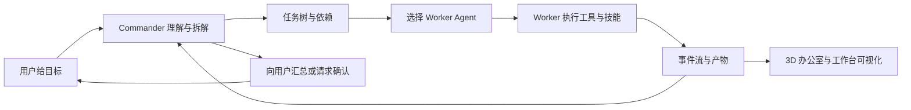
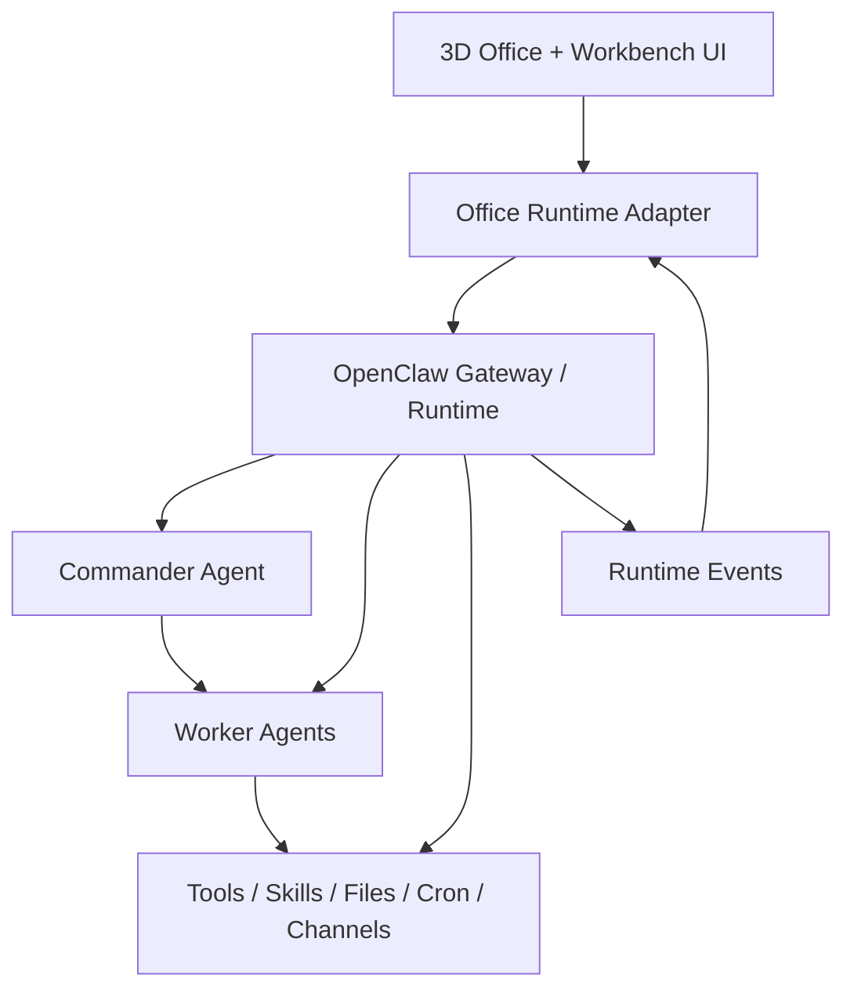

# 3D 赛博办公室复刻与开源基座调研

> 文档日期：2026-05-22  
> 调研对象：参考视频中的“小龙虾 3D 赛博办公室”体验、当前仓库原型、OpenClaw 相关开源项目  
> 当前结论：优先把当前项目升级为“可接真实 OpenClaw 运行态的 3D 指挥室”，同时对 `Claw3D` 做一次技术验证；不建议在未验证前直接整仓替换现有原型。

## 1. 文档目的

本文保留以下决策依据，避免后续只凭视频印象推进：

1. 参考视频展示的整套逻辑到底是什么。
2. “通过小龙虾指挥一群 AI 干活”在系统层面如何成立。
3. 当前 3D 赛博办公室原型已经具备什么，还差什么。
4. 评论区所说的开源项目最可能是哪一个，哪些项目值得搬来用。
5. 在当前设备上，应该复用、借鉴还是继续自研。

## 2. 视频复刻目标的真实含义

参考视频不能只理解成“做一个 3D 场景”。它实际展示的是三层能力叠在一起：

| 层级 | 视频中看到的表现 | 系统含义 |
| --- | --- | --- |
| 空间层 | 3D 办公室、工位、角色、区域、镜头漫游 | 把 Agent 状态空间化，让用户一眼看懂谁在忙、谁空闲、谁卡住 |
| 工作台层 | 日历、学习计划、文件、Cron、Gateway、复盘等页面 | 给 Agent 工作补上计划、资料、自动化、诊断、回顾入口 |
| 指挥层 | “小龙虾”接收指令，多个 AI 分工做事 | 真实运行时负责接收任务、拆分、派发、调用工具、回收结果、记录状态 |

如果只做第一层，成品会像动画演示。  
如果第一层和第二层做了，但第三层没有接上，成品会像一个好看的任务看板。  
真正贴近视频，需要让办公室画面由真实任务事件驱动。

## 3. “小龙虾指挥一群 AI 干活”的整套逻辑

### 3.1 角色拆分

“小龙虾”更适合理解为总入口 Agent 或 Commander，而不是单纯的吉祥物。

| 角色 | 职责 |
| --- | --- |
| 用户 | 给目标、补充约束、审批高风险动作、验收结果 |
| Commander | 理解目标、拆任务、挑选执行 Agent、追踪依赖、汇总结果 |
| Worker Agent | 负责具体工作，例如调研、写代码、审阅、整理文件、跑自动化 |
| Tool / Skill | 给 Agent 真正动手的能力，例如文件系统、浏览器、终端、日历、消息渠道 |
| Runtime / Gateway | 管理会话、路由、工具调用、运行事件、定时任务和连接状态 |
| Office UI | 把运行态事件映射成 3D 场景、详情面板和工作台页面 |

### 3.2 典型闭环



这个闭环里，3D 办公室不是决策核心，而是运行态可视化入口。  
真正决定能不能“让一群 AI 干活”的，是 Commander、Runtime、工具权限、任务状态和产物管理。

### 3.3 关键数据流

建议把真实系统抽象成以下事件：

| 事件 | 说明 | 办公室表现 |
| --- | --- | --- |
| `task.created` | 新任务进入系统 | 待办区出现任务 |
| `task.planned` | Commander 拆分任务 | 任务树、依赖和执行建议出现 |
| `task.assigned` | 分配给 Agent | Agent 走向工位或工位高亮 |
| `agent.working` | Agent 开始执行 | 屏幕亮起，角色进入工作态 |
| `tool.called` | 调用终端、浏览器、文件等工具 | 日志和详情面板出现工具调用 |
| `task.blocked` | 需要审批、缺资料或失败 | 角色/工位显示阻塞态 |
| `artifact.created` | 生成文档、代码、截图、报告 | 文件页和交付区出现产物 |
| `task.completed` | 工作完成 | 完成区、复盘和事件流同步更新 |

## 4. 从视频看出的细节清单

### 4.1 办公室体验

- 画面主体是可巡看的办公室，而不是大屏仪表盘。
- 角色、工位和区域要有明确归属感。
- 办公室有生活化与协作化道具，不只是桌子和状态灯。
- 场景里有不同功能区和团队感，不应只是一排复制桌面。
- 画面要有“此刻有事在发生”的动态反馈。

### 4.2 工作台体验

- 日历与周视图。
- 计划进度和阶段清单。
- Google Tasks 或类似外部任务入口。
- 文件浏览与 Markdown 内容查看。
- Cron Job 列表和调试视图。
- Gateway 运行态与连接状态。
- 每日回顾、自进化、自我改进建议。
- 带一点轻松的小空间，例如休息、静眠、声音或小组件页。

### 4.3 指挥体验

- 用户面对的是一个主要入口 Agent。
- 入口 Agent 背后能调用多个执行者，而不是只在聊天框里回复。
- 工作过程会留下事件、文件、进度、诊断数据。
- 用户可以从空间、列表和文件多个角度追踪同一件事。

## 5. 当前项目现状

### 5.1 已具备能力

当前仓库已经具备一个不错的前端骨架：

| 能力 | 当前状态 |
| --- | --- |
| 3D 场景基础 | 已有 React Three Fiber / Three.js 场景、工位、角色、相机和环境元素 |
| 领域模型 | 已有 Agent、Task、Event 相关类型与状态机 |
| 事件驱动原型 | 已有本地事件总线和 Demo Engine |
| 工作台页面 | 已有 Calendar、Logs、Files、CronJobs、Gateway、Review 等入口 |
| 本地状态 | 已有 Zustand 和部分 localStorage 持久化 |
| 演示流程 | 已能跑模拟任务生命周期 |

### 5.2 主要缺口

| 缺口 | 当前表现 | 影响 |
| --- | --- | --- |
| 真实 Commander | 当前主要是模拟事件 | 不能真正拆任务和派发工作 |
| 真实 Runtime | 前端没有连接 OpenClaw Gateway | Office 不是实时运行态 |
| Worker 接入 | 没有真实 Agent Registry / Worker 能力表 | 不能按职责调度 |
| 工具与权限 | 终端、文件、浏览器、日历等能力未形成统一边界 | AI 不能稳定做事，也难审计 |
| 产物系统 | 文件页仍偏演示数据 | 结果无法沉淀为真实交付 |
| 运行诊断 | Cron / Gateway 页面偏静态 | 难排查真实任务为何卡住 |
| 跨机迁移 | 当前主要依赖前端本地状态 | 难迁移运行态配置、Agent 文件和会话 |

### 5.3 粗略成熟度判断

| 方向 | 当前成熟度 | 说明 |
| --- | --- | --- |
| 视频相似的视觉原型 | 约 45% | 场景和模块骨架已有，但空间丰富度和视觉叙事仍不够 |
| 轻量 Mission Control | 约 30% | 有页面形态，缺真实数据和统一工作流 |
| 真实多 Agent 指挥系统 | 约 15% | 缺 Runtime、Commander、Worker 调度和工具边界 |

## 6. 开源项目调研

### 6.1 最可能的 3D 基座：Claw3D

#### 判断

`Claw3D` 是当前最像视频所说“基于开源项目改”的候选：

- 项目定位就是 OpenClaw 相关的 3D 虚拟办公室。
- 它不是单一静态 Demo，而是带 Studio、Gateway 连接、办公室视图、Agent 工作区、布局编辑和运行态代理边界。
- 它支持 OpenClaw Gateway，也支持 Demo Gateway 和自定义运行时接入。
- README 明确把产品定义为“3D Workspace for AI Agents”，并强调 Gateway 是控制面、办公室是体验主体。

#### 与视频的接近点

| 维度 | Claw3D | 视频 |
| --- | --- | --- |
| 3D 办公室 | 强 | 强 |
| Agent 运行态 | 强，依赖 Gateway / runtime | 强 |
| 布局编辑 | 有 Builder | 视频中出现过编辑/成品切换感 |
| 自定义后端 | 支持 custom runtime | 视频明显是作者加了定制模块 |
| 文件 / Cron / 自进化页 | 不是当前主卖点 | 视频中很突出 |

#### 复用价值

- 可作为 3D 办公室和 Gateway 接入的主参考。
- 可验证真实 OpenClaw 事件如何驱动办公室状态。
- 可参考它对 token、WebSocket proxy、服务器边界和 Gateway-owned state 的处理方式。

#### 风险

- 技术栈更重，已经不是当前仓库的轻量 Vite 前端原型。
- 直接搬整仓会改变当前项目结构和开发重心。
- 视频中的 Calendar、Google Tasks、Files、Cron、Gateway、Review 等作者定制页面未必都在 Claw3D 原仓中。

### 6.2 更像成熟控制台参考：OpenClaw Office

#### 判断

`OpenClaw Office` 值得作为第二个重点参考项目，但它更像运行态控制台，而不是目标视频里的主 3D 基座：

- 它把 Agent、Session、Tool Call、SubAgent、Cron、Files、Skills、Settings 做得更像系统控制台。
- 它通过 OpenClaw Gateway WebSocket 驱动实时状态。
- 它的办公室主体是 SVG/isometric 2D 风格，不是 Three.js 3D 房间。

#### 复用价值

- 参考控制台信息架构。
- 参考 Agent / Session / Cron / Files / Skills / Settings 的页面组织。
- 参考实时事件策略，尤其是高频事件与低频同步如何分层。

#### 风险

- 如果直接换成它，会偏离“3D 办公室”目标。
- 它适合作为数据与控制台能力参考，不适合作为最终视觉骨架直接替代。

### 6.3 轻量实验候选：MyClaw3D

#### 判断

`MyClaw3D` 也是一个 React + Three.js 的 3D agent office 候选，但从公开说明看，它更像 alpha 原型：

- 有 3D 工位、Agent 移动、聊天面板、摄像机控制。
- Roadmap 仍把“接真实 OpenClaw / WebSocket backend”列为待办。

#### 复用价值

- 可参考低成本 3D 布局、角色运动和交互方式。
- 若只做视觉接近度试验，它可能比大型仓库更容易拆解。

#### 风险

- 真实运行态能力弱于 Claw3D 与 OpenClaw Office。
- 不适合作为“多 Agent 真干活”的主运行基座。

## 7. 能不能搬来用

### 7.1 许可证与复用判断

目前已核到：

| 项目 | 许可证线索 | 复用判断 |
| --- | --- | --- |
| OpenClaw | 官方文档称 MIT | 可研究和二次集成，仍需在落地前核对目标版本许可证文件 |
| Claw3D | GitHub 仓库显示 MIT License | 可做 fork、验证和局部借鉴 |
| OpenClaw Office | README 显示 MIT | 可做控制台能力参考或局部复用 |
| MyClaw3D | 公开 README 标示 MIT | 可做轻量视觉实验参考 |

许可证允许，不代表“直接复制就合适”。还要看技术栈、可维护性、功能重合度和我们已有代码的保留价值。

### 7.2 推荐路线

推荐按下面顺序推进：

1. 先验证 `Claw3D + OpenClaw Gateway` 能否在当前设备上跑通。
2. 验证它的实时事件、Agent 工作区、3D 办公室、Gateway 配置边界。
3. 再决定是否：
   - 以 `Claw3D` 为主仓做定制；
   - 继续保留当前仓库，把 Claw3D 的接入架构和 3D 交互模式迁入；
   - 采用混合路线：当前仓库保留视频化工作台，外接 OpenClaw Gateway。

### 7.3 当前最稳的决策

当前阶段最稳的是“先 POC，后迁移”：

- 不马上废掉当前原型。
- 不马上把 Claw3D 整仓搬进来。
- 先用一个验证分支或隔离目录跑通真实 Gateway 事件。
- POC 通过后再做架构选择。

## 8. 设备适配判断

### 8.1 当前设备

当前机器读取到的关键配置：

| 项目 | 配置 |
| --- | --- |
| CPU | Intel Core i7-12700F，12 核 20 线程 |
| 内存 | 约 32 GB |
| GPU | NVIDIA GeForce RTX 3060 |

### 8.2 能力判断

这台机器对以下工作没有明显硬件阻碍：

- 跑前端 3D 场景和本地开发服务器。
- 跑 OpenClaw Gateway 加少量 Agent 工作流。
- 跑 Claw3D 或当前项目的 3D 办公室验证。
- 做本地多页面工作台和 WebSocket 运行态展示。

真正容易先碰到瓶颈的不是 3D 渲染，而是：

- 同时跑多少 AI Worker。
- Worker 用本地模型还是云端模型。
- 浏览器、终端、文件索引、定时任务同时运行时的资源开销。
- 任务日志和会话持久化是否过重。

### 8.3 针对本设备的优化建议

| 方向 | 建议 |
| --- | --- |
| 3D 场景 | 初期维持低多边形、实例化重复道具、限制阴影数量、避免超高面数角色 |
| Agent 并发 | 初期控制在 2 到 4 个真实 Worker，同屏可以显示更多“虚拟工位” |
| 模型策略 | Commander 可用更强模型；Worker 按任务选轻量模型或外部 CLI |
| 存储 | UI 偏好放本地；真实 Agent、Session、Files、Cron 交给 Runtime / Gateway |
| 网络 | 若后续跨电脑使用，优先把 Gateway 和数据目录迁移策略写清，不把秘密写进前端 localStorage |
| 诊断 | 保留事件日志、失败状态、审批状态和产物路径，避免只看 3D 动画猜原因 |

## 9. 推荐目标架构

### 9.1 目标边界



### 9.2 哪些状态应该放哪里

| 状态 | 建议归属 |
| --- | --- |
| Gateway token、运行时连接机密 | 服务端 / Runtime 配置 |
| Agent 记录、Session、Cron、真实文件 | OpenClaw 或后端运行时 |
| Office 布局、镜头偏好、主题偏好 | UI 本地状态或可导出配置 |
| Demo 数据 | 前端保留，用于离线展示 |
| 真实任务事件 | Gateway / Adapter 统一转成 Office 事件协议 |

## 10. 与当前仓库的融合方案

### 10.1 保留

- 现有 3D 场景雏形。
- 已定义的 Agent / Task / Event 领域类型。
- 已有视频化工作台模块。
- Demo Engine，作为离线演示模式。

### 10.2 增加

- `runtime-adapter` 层。
- OpenClaw Gateway 连接配置。
- 实时事件订阅和事件映射。
- Commander / Worker 元数据展示。
- 真实 Files、Cron、Gateway、Session 数据源。
- 任务产物、审批、失败诊断入口。

### 10.3 暂不做

- 一开始就做完整 OpenClaw 平替。
- 一开始就实现复杂多租户或远程协作。
- 一开始就追求无限 Agent 并发。
- 一开始就把全部第三方开源 UI 合并到当前仓库。

## 11. 下一阶段建议

### 11.1 POC 目标

下一阶段建议用一个小验证回答四个问题：

1. `Claw3D` 能否在本机跑通 Demo Gateway。
2. `Claw3D` 能否连接真实 OpenClaw Gateway。
3. 它的事件和页面边界是否比当前仓库更适合长期扩展。
4. 视频作者定制的工作台能力，迁到 Claw3D 更省，还是接到当前仓库更省。

### 11.2 POC 验收

| 验收项 | 成功标准 |
| --- | --- |
| 基础运行 | 能启动页面并看到 3D 办公室 |
| 运行态 | 能看到至少一个 Agent 的实时状态 |
| 事件 | 能看到任务/会话/工具调用中的至少一种真实事件 |
| 适配 | 能明确出当前仓库需要新增的 Adapter 字段 |
| 迁移决策 | 能给出“继续当前仓库”或“切到 Claw3D fork”的结论 |

## 12. 初步决策结论

### 12.1 对开源基座的判断

最可能的基座是 `Claw3D`。  
它最贴近“基于 OpenClaw 的 3D 办公室”这个描述，也最贴近视频前半段的视觉和指挥室心智。

`OpenClaw Office` 不是主要 3D 基座，但对真实控制台页面非常有价值。  
视频后半段那些 Cron、Files、Gateway、Agent 管理、运行诊断能力，应该重点参考它和 OpenClaw 官方运行时边界。

### 12.2 对当前项目的判断

当前项目不是白做了。  
它已经把“视频定制工作台”和“轻量 3D 原型”打下来了，适合继续保留为视频贴合层。

但如果目标升级为“让小龙虾真能指挥一群 AI 干活”，下一步不能继续只补页面，必须开始接真实 Runtime。

### 12.3 推荐行动

1. 先做 `Claw3D` 技术验证。
2. 再定义 OpenClaw Runtime Adapter。
3. 根据 POC 结果二选一：
   - 当前仓库继续演进，吸收 Claw3D / OpenClaw Office 的架构模式；
   - 以 Claw3D fork 为底座，把当前视频工作台模块迁过去。

## 13. 调研来源

### 13.1 主要来源

- OpenClaw 官方文档首页：`https://github.com/openclaw/openclaw/blob/main/docs/index.md`
- OpenClaw Cron 文档：`https://docs.openclaw.ai/cli/cron`
- OpenClaw Session 文档：`https://docs.openclaw.ai/sessions`
- Claw3D 仓库首页：`https://github.com/iamlukethedev/Claw3D`
- Claw3D 架构文档：`https://github.com/iamlukethedev/Claw3D/blob/main/ARCHITECTURE.md`
- OpenClaw Office README：`https://github.com/WW-AI-Lab/openclaw-office/blob/main/README.en.md`

### 13.2 辅助来源

- MyClaw3D 公开项目说明：`https://github.com/0xMerl99/MyClaw3D`
- Claw3D 官网：`https://www.claw3d.ai/`

## 14. 2026-05-22 Claw3D 本机 POC 记录

### 14.1 验证目标

本轮先验证五件事：

1. `Claw3D` 能否在当前机器拉取、安装和编译。
2. 3D 办公室页面能否实际启动。
3. 仓库是否真的带有 Gateway / Runtime / Agent 工作区边界，而不只是演示截图。
4. Demo Gateway 能否提供可消费的协议握手和 Agent 数据。
5. 当前机器上的真实 OpenClaw Gateway 是否已经具备继续联调条件。

### 14.2 验证环境

| 项目 | 结果 |
| --- | --- |
| Claw3D POC 目录 | `C:\Users\A413\Documents\Claw3D-poc` |
| Claw3D 版本 | 仓库 `package.json` 显示 `0.1.4` |
| Node.js | `v24.15.0` |
| OpenClaw | 本机全局安装可读取到 `OpenClaw 2026.5.18 (50a2481)` |
| OpenClaw Gateway | 本机已有 `node ... openclaw.mjs gateway` 进程 |
| 真实 Gateway 地址 | `ws://localhost:18789` |
| Demo Gateway 地址 | POC 期间使用备用端口 `ws://localhost:18790` |

### 14.3 已完成验证

| 验证项 | 结果 | 证据 |
| --- | --- | --- |
| 拉取仓库 | 通过 | `git clone --depth 1` 成功 |
| 安装依赖 | 通过 | 第二次 `npm install` 成功，安装 634 个 package |
| 类型检查 | 通过 | `npm run typecheck` 零错误 |
| 环境检查 | 通过但有告警 | `npm run doctor` 显示 Gateway 握手成功；CLI 未在 PATH |
| 3D 页面启动 | 通过 | `npm run dev` 后 `/office` 可打开 |
| 3D 办公室渲染 | 通过 | 页面出现楼层目录、3D 场景、角色、Agent Event Console、聊天入口 |
| Demo Gateway 启动 | 通过 | 备用端口 `18790` 监听成功 |
| Demo Gateway 协议握手 | 通过 | 直接 WebSocket `connect` 返回 `adapterType: demo`、`protocol: 3` |
| Demo Agent 列表 | 通过 | Demo Gateway 返回 `demo-orchestrator`、`demo-researcher`、`demo-builder` |

### 14.4 真实 OpenClaw 验证现状

`Claw3D` 的 doctor 输出已经确认：

- `~/.openclaw` 状态目录存在。
- `C:\Users\A413\.openclaw\openclaw.json` 存在。
- 当前选中的 OpenClaw profile 指向 `ws://localhost:18789`。
- Gateway token 已配置。
- 对该 Gateway 的 WebSocket handshake 成功。

浏览器打开 `Claw3D` 后，真实 OpenClaw 连接仍未完成：

- 页面能识别 OpenClaw backend。
- 点击连接后，上游关闭连接，页面提示 `Gateway closed (1012): upstream closed`。
- 页面给出的下一步是批准浏览器设备：`openclaw devices approve --latest`。

这说明当前阻塞点已经从“是否有 Gateway”收敛为“是否批准这个浏览器设备接入真实 Gateway”。

### 14.5 POC 中观察到的 Claw3D 能力

实际页面已经出现以下能力信号：

- 3D 楼层和办公室主体。
- Building Directory、楼层切换和当前楼层摘要。
- Agent 数量与工作态摘要。
- Agent Event Console。
- Chat 面板、Agent 列表、模型和思考强度入口。
- Office 编辑入口。
- Headquarters、Marketplace、Analytics 侧边入口。
- Gateway / Runtime backend 选择，包括 OpenClaw、Demo、Hermes、Local、Claw3D、Custom。

这些能力说明 `Claw3D` 不是一个只有 3D 壳子的场景项目，而是已经把“办公室体验”和“运行时边界”接在一起。

### 14.6 POC 中观察到的问题

| 问题 | 影响 | 当前判断 |
| --- | --- | --- |
| 首次 `npm install` 网络中断 | 安装需要重试 | 环境偶发，不是仓库结构阻塞 |
| Next 开发时拉取 Google Fonts 出现证书告警 | 使用 fallback font | 不阻塞本地 POC，后续可改本地字体或系统 CA |
| OpenClaw CLI 不在 PATH | `doctor` 有 WARN | 全局安装存在，后续需补 PATH 或固定命令路径 |
| 真实 Gateway 需要设备审批 | 不能立即读真实 Agent 运行态 | 属于安全边界，不应绕过 |
| Demo Studio 与现有 OpenClaw 默认端口冲突 | Demo Gateway 不能直接占 `18789` | 使用备用端口可绕开 |

### 14.7 POC 后更新判断

#### 对 `Claw3D` 的判断

POC 后可以把 `Claw3D` 从“高置信候选”提升为“已验证的主候选”：

- 它在当前设备上能运行。
- 它确实有 3D Office、Gateway、Agent、Chat、事件控制台和多 Runtime 边界。
- 它已经覆盖我们最缺的“真实 Runtime 接入方向”。

#### 对当前仓库的判断

当前仓库仍然有保留价值：

- 现有原型已经更靠近视频后半段的自定义工作台模块。
- `Claw3D` 当前验证到的是 3D Office 与 Runtime 方向更成熟。
- 视频目标很可能需要二者融合，而不是简单二选一。

### 14.8 下一轮验证建议

下一轮应进入真实 OpenClaw 联调：

1. 用户确认是否批准当前浏览器设备接入 OpenClaw Gateway。
2. 批准后重新连接真实 OpenClaw backend。
3. 检查真实 Agent roster、Session、Chat、Tool / Approval 事件。
4. 对比 `Claw3D` 事件结构与当前仓库的 `Agent / Task / Event` 协议。
5. 产出迁移决策：
   - `Claw3D fork` 为主；
   - 当前仓库继续演进；
   - 当前仓库接 OpenClaw Adapter，局部借鉴 Claw3D。

## 15. 2026-05-22 真实 OpenClaw 联调补充

### 15.1 用户确认后的动作

用户确认可以继续真实 OpenClaw 联调后，执行了以下验证：

1. 尝试批准最新设备请求。
2. 从 `Claw3D` 页面重新发起 OpenClaw backend 连接。
3. 再次尝试批准最新设备请求。
4. 查看 OpenClaw 设备列表、`Claw3D` Studio 设置和 Studio 代理日志。

### 15.2 设备审批结果

设备审批不是当前真实联调阻塞点：

- `openclaw devices approve --latest` 两次都返回 `No pending device pairing requests to approve`。
- `openclaw devices list` 已能看到两条 paired device 记录。
- 因此不能继续把连接失败归因为“还有待批设备没批准”。

### 15.3 实际阻塞点

`Claw3D` Studio 代理日志给出了更准确的失败原因：

```text
[gateway-proxy] connect frame client.id=openclaw-control-ui client.mode=webchat hasToken=false hasDevice=true
[gateway-proxy] upstream closed code=1002 reason=protocol mismatch hadConnect=true responseSent=true
```

当前 POC 拉到的 `Claw3D` `main` 分支仍固定使用 Gateway 协议 v3：

- `src/lib/gateway/openclaw/GatewayBrowserClient.ts` 发送 `minProtocol: 3`、`maxProtocol: 3`。
- `src/lib/gateway/nodeGatewayClient.ts` 也固定为协议 v3。
- `README.md` 的故障说明仍以协议 v3 为基线。

而当前 OpenClaw 官方 Gateway 协议文档描述的是协议 v4。  
结合本机 OpenClaw 运行时返回的 `protocol mismatch`，当前最合理判断是：**本机 OpenClaw 与当前 `Claw3D` 主分支存在 Gateway 协议版本不兼容**。

### 15.4 对复用决策的影响

这个结果改变了后续优先级：

| 方向 | POC 后判断 |
| --- | --- |
| 直接把 `Claw3D` 当即插即用真实 OpenClaw 前端 | 暂不成立，先解决协议兼容 |
| 把 `Claw3D` 当作 3D Office 和 Runtime 边界参考 | 仍然成立 |
| 继续验证当前仓库接 OpenClaw | 价值上升，因为可按当前 Gateway 协议设计 Adapter |
| Fork `Claw3D` 后做协议适配 | 可行，但需要评估 v3 -> v4 差异和维护成本 |

### 15.5 下一步修正建议

后续不要直接大规模迁移 UI，先做一个“协议兼容决策”：

1. 调研 OpenClaw v4 与 `Claw3D` v3 的连接握手和事件差异。
2. 查 `Claw3D` 是否已有未合并分支、issue 或 roadmap 处理 v4。
3. 评估三条路线：
   - 把 `Claw3D` fork 到 v4；
   - 使用兼容当前 `Claw3D` 的 OpenClaw 版本单独做验证；
   - 当前仓库直接按 OpenClaw v4 写 Adapter，局部借鉴 `Claw3D`。
4. 在协议方案定下来前，视频定制工作台和 3D 美术扩展可以继续设计，但不要把真实运行态实现绑死在旧协议上。
