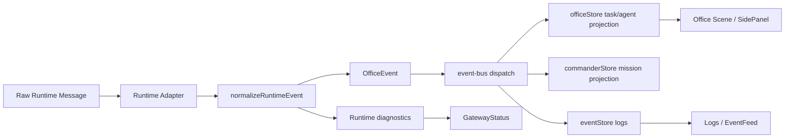

# Runtime Adapter Implementation Plan

> **For agentic workers:** REQUIRED SUB-SKILL: Use superpowers:subagent-driven-development (recommended) or superpowers:executing-plans to implement this plan task-by-task. Steps use checkbox (`- [ ]`) syntax for tracking.

**Goal:** Add a runtime adapter boundary so Demo events, mock runtime events, and a future real OpenClaw/local-agent runtime can drive the same 3D office, workbench, Commander flow, logs, tasks, gateway diagnostics, and artifacts without coupling UI components to protocol details.

**Architecture:** Keep `src/core/event-bus.ts` as the single Office event ingress, and add a `src/runtime/` layer that normalizes external runtime messages into `OfficeEvent`. The app should support explicit runtime modes (`demo`, `mock`, `connected`, `offline`, `error`), protocol diagnostics, replayable event fixtures, and one narrow "first connected slice" before attempting full tool/file execution.

**Tech Stack:** React 18, TypeScript, Vite, Zustand, Vitest, existing Office event bus, existing dashboard Gateway UI, Browser/Playwright QA, future OpenClaw Runtime Adapter.

---

## Prerequisites

Execute this plan after:

1. `docs/superpowers/plans/01-office-visual-fidelity.md`
2. `docs/superpowers/plans/02-workbench-fidelity.md`
3. `docs/superpowers/plans/03-commander-workflow.md`

Those plans provide the named office, workbench modules, Commander mission surface, task/artifact/approval concepts, and UI links that runtime events will update.

## File Structure

### Files to create

| File | Responsibility |
| --- | --- |
| `src/runtime/runtimeTypes.ts` | Runtime adapter modes, raw message shapes, normalized event envelope, diagnostics, connection status. |
| `src/runtime/runtimeAdapter.ts` | Adapter interface, adapter lifecycle helpers, event validation, start/stop contract. |
| `src/runtime/normalizeRuntimeEvent.ts` | Pure translation from raw runtime messages to `OfficeEvent` plus diagnostics. |
| `src/runtime/mockRuntimeAdapter.ts` | In-browser mock adapter that emits realistic runtime events without network or secrets. |
| `src/runtime/openClawAdapter.ts` | Real-adapter placeholder and narrow connection seam for future OpenClaw/local runtime. |
| `src/runtime/runtimeTesting.ts` | Pure helpers for diagnostics, protocol compatibility, event ordering, and dedupe. |
| `src/runtime/runtimeTesting.test.ts` | Focused tests for normalization, diagnostics, dedupe, and safe payload handling. |
| `src/store/runtimeStore.ts` | Runtime mode/status/diagnostics store; no secrets persisted. |
| `src/data/mockRuntimeEvents.ts` | Mock connected-runtime event fixture covering task, worker, approval, artifact, and heartbeat messages. |
| `src/ui/runtime/RuntimeModeSwitch.tsx` | Compact UI to switch Demo/Mock/Connected modes and show safe connection state. |
| `src/ui/runtime/RuntimeEventInspector.tsx` | Developer-facing normalized/raw event inspection panel for Gateway diagnostics. |
| `docs/runtime/adapter-contract.md` | Human-readable adapter contract, payload examples, safety boundaries, and migration notes. |

### Files to modify

| File | Responsibility of change |
| --- | --- |
| `src/core/types.ts` | Add runtime source metadata, runtime event IDs, protocol refs, approval/artifact IDs if Commander plan has not already done it. |
| `src/core/event-bus.ts` | Accept source metadata, validate runtime-originated events, dedupe repeated runtime event IDs. |
| `src/core/state-machine.ts` | Ensure runtime `task.planned`, approval, artifact, and heartbeat-adjacent events do not break current transitions. |
| `src/store/eventStore.ts` | Keep raw runtime provenance and normalized event history separate enough for diagnostics. |
| `src/store/officeStore.ts` | Apply runtime-created tasks and runtime Agent status updates through the same event path as Demo. |
| `src/store/dashboardStore.ts` | Surface runtime workbench tasks/files only as metadata, not raw filesystem contents or tokens. |
| `src/ui/AppShell.tsx` | Mount runtime controller, subscribe adapter output to the event bus, and keep Demo mode intact. |
| `src/ui/dashboard/GatewayStatus.tsx` | Replace static diagnostics with runtime store diagnostics while retaining demo diagnostics. |
| `src/ui/dashboard/GatewayDiagnostics.tsx` | Show protocol mismatch, heartbeat, token-missing, device-approval, and adapter error details. |
| `src/ui/dashboard/LogsView.tsx` | Make runtime-originated event source and raw-event reference searchable. |
| `src/ui/dashboard/TasksView.tsx` | Show runtime-created/updated tasks with source labels and linked Office task details. |
| `src/ui/EventFeed.tsx` | Render runtime heartbeat, tool, approval, artifact, and adapter error events clearly. |
| `src/ui/StatusBar.tsx` | Add runtime connection/mode indicator and latest heartbeat age. |
| `src/index.css` | Add compact runtime controls and inspector styles without changing workbench layout semantics. |

## Scope Guard

This plan owns the runtime boundary, not full autonomous execution.

In scope:

- Adapter interface and runtime mode store.
- Mock runtime adapter with deterministic event fixtures.
- Normalization from raw runtime messages into `OfficeEvent`.
- Runtime diagnostics in Gateway, StatusBar, Logs, and EventFeed.
- Safe event dedupe and provenance tracking.
- First real-adapter seam that can connect later without rewriting UI.
- Documentation for the adapter contract and secrets boundary.

Out of scope:

- Real file writes from runtime tools.
- Real terminal execution.
- Secret export/import.
- Full OpenClaw protocol implementation if the protocol is not locally available.
- Background services outside the Vite app.
- Multi-user sync or remote cloud persistence.

## Runtime Data Flow Target



## Runtime Message Contract

The adapter should normalize a small stable contract first:

```ts
export type RuntimeMessageType =
  | 'runtime.heartbeat'
  | 'runtime.worker_status'
  | 'runtime.task_created'
  | 'runtime.task_planned'
  | 'runtime.task_assigned'
  | 'runtime.task_started'
  | 'runtime.task_progress'
  | 'runtime.task_waiting_input'
  | 'runtime.approval_requested'
  | 'runtime.approval_resolved'
  | 'runtime.tool_called'
  | 'runtime.artifact_created'
  | 'runtime.task_completed'
  | 'runtime.task_failed'
  | 'runtime.adapter_error';
```

Minimum raw envelope:

```ts
export interface RuntimeRawMessage {
  runtimeEventId: string;
  protocol: string;
  version: string;
  type: RuntimeMessageType;
  occurredAt: string;
  workerId: string | null;
  taskId: string | null;
  missionId?: string | null;
  payload: Record<string, unknown>;
}
```

Normalized event rule:

- Runtime messages become `OfficeEvent`.
- Runtime IDs are preserved as `runtimeEventId`.
- Unknown payload fields stay in `payload` but secrets are redacted before UI display.
- Unknown message types produce diagnostics and logs, not crashes.

## Task 1: Define Runtime Types and Normalization Tests

**Files:**
- Create: `src/runtime/runtimeTypes.ts`
- Create: `src/runtime/normalizeRuntimeEvent.ts`
- Create: `src/runtime/runtimeTesting.ts`
- Create: `src/runtime/runtimeTesting.test.ts`
- Modify: `src/core/types.ts`

- [ ] **Step 1: Write failing normalization tests**

Create `src/runtime/runtimeTesting.test.ts`:

```ts
import { describe, expect, it } from 'vitest';
import type { RuntimeRawMessage } from './runtimeTypes';
import { normalizeRuntimeEvent } from './normalizeRuntimeEvent';
import { detectProtocolCompatibility, redactRuntimePayload } from './runtimeTesting';

const baseMessage: RuntimeRawMessage = {
  runtimeEventId: 'rt-001',
  protocol: 'openclaw',
  version: '0.4.0',
  type: 'runtime.task_started',
  occurredAt: '2026-05-23T01:00:00.000Z',
  workerId: 'agent-coder',
  taskId: 'runtime-task-1',
  missionId: 'mission-runtime-demo',
  payload: {
    title: 'Build runtime adapter',
    token: 'secret-token-value',
  },
};

describe('runtime normalization', () => {
  it('maps runtime task messages to OfficeEvent without losing provenance', () => {
    expect(normalizeRuntimeEvent(baseMessage).event).toMatchObject({
      type: 'task.started',
      taskId: 'runtime-task-1',
      agentId: 'agent-coder',
      source: 'runtime',
      runtimeEventId: 'rt-001',
      missionId: 'mission-runtime-demo',
    });
  });

  it('redacts secret-looking payload keys before diagnostics display', () => {
    expect(redactRuntimePayload(baseMessage.payload)).toEqual({
      title: 'Build runtime adapter',
      token: '[redacted]',
    });
  });

  it('flags protocol mismatch instead of pretending to connect', () => {
    expect(detectProtocolCompatibility('openclaw', '0.3.0')).toMatchObject({
      ok: false,
      diagnosticKind: 'protocol_mismatch',
    });
  });
});
```

- [ ] **Step 2: Run the focused test to prove the runtime seam is missing**

Run:

```powershell
npm run test -- src/runtime/runtimeTesting.test.ts
```

Expected: FAIL because runtime types and normalization helpers do not exist yet.

- [ ] **Step 3: Add runtime type definitions**

Create `src/runtime/runtimeTypes.ts`:

```ts
import type { GatewayDiagnostic, OfficeEvent } from '@/core/types';

export type RuntimeMode = 'demo' | 'mock' | 'connected' | 'offline' | 'error';

export type RuntimeConnectionStatus =
  | 'idle'
  | 'connecting'
  | 'connected'
  | 'degraded'
  | 'disconnected'
  | 'error'
  | 'protocol_mismatch';

export type RuntimeMessageType =
  | 'runtime.heartbeat'
  | 'runtime.worker_status'
  | 'runtime.task_created'
  | 'runtime.task_planned'
  | 'runtime.task_assigned'
  | 'runtime.task_started'
  | 'runtime.task_progress'
  | 'runtime.task_waiting_input'
  | 'runtime.approval_requested'
  | 'runtime.approval_resolved'
  | 'runtime.tool_called'
  | 'runtime.artifact_created'
  | 'runtime.task_completed'
  | 'runtime.task_failed'
  | 'runtime.adapter_error';

export interface RuntimeRawMessage {
  runtimeEventId: string;
  protocol: string;
  version: string;
  type: RuntimeMessageType;
  occurredAt: string;
  workerId: string | null;
  taskId: string | null;
  missionId?: string | null;
  payload: Record<string, unknown>;
}

export interface NormalizedRuntimeEvent {
  event: OfficeEvent | null;
  diagnostics: GatewayDiagnostic[];
  raw: RuntimeRawMessage;
}

export interface RuntimeCompatibility {
  ok: boolean;
  diagnosticKind: GatewayDiagnostic['kind'];
  message: string;
}
```

- [ ] **Step 4: Extend OfficeEvent metadata conservatively**

Modify `src/core/types.ts` so `OfficeEvent` includes optional runtime/mission provenance:

```ts
export interface OfficeEvent {
  id: string;
  type: EventType;
  occurredAt: string;
  source?: WorkbenchSource;
  runtimeEventId?: string | null;
  missionId?: string | null;
  approvalId?: string | null;
  artifactId?: string | null;
  taskId: string | null;
  agentId: string | null;
  payload: Record<string, unknown>;
}
```

Extend `EventType` if missing:

```ts
| 'task.planned'
| 'tool.called'
| 'artifact.created'
| 'runtime.heartbeat'
| 'runtime.adapter_error'
```

- [ ] **Step 5: Implement payload redaction and protocol compatibility helpers**

Create `src/runtime/runtimeTesting.ts`:

```ts
import type { RuntimeCompatibility } from './runtimeTypes';

const SECRET_KEY_PATTERN = /token|secret|password|api[_-]?key|authorization/i;

export function redactRuntimePayload(payload: Record<string, unknown>): Record<string, unknown> {
  return Object.fromEntries(
    Object.entries(payload).map(([key, value]) => [key, SECRET_KEY_PATTERN.test(key) ? '[redacted]' : value]),
  );
}

export function detectProtocolCompatibility(protocol: string, version: string): RuntimeCompatibility {
  if (protocol !== 'openclaw') {
    return {
      ok: false,
      diagnosticKind: 'protocol_mismatch',
      message: `Unsupported protocol: ${protocol}`,
    };
  }

  if (!version.startsWith('0.4.')) {
    return {
      ok: false,
      diagnosticKind: 'protocol_mismatch',
      message: `Expected OpenClaw 0.4.x, received ${version}`,
    };
  }

  return {
    ok: true,
    diagnosticKind: 'healthy',
    message: 'Runtime protocol is compatible.',
  };
}
```

- [ ] **Step 6: Implement runtime-to-office event normalization**

Create `src/runtime/normalizeRuntimeEvent.ts`:

```ts
import type { EventType, OfficeEvent } from '@/core/types';
import { createEvent } from '@/core/event-bus';
import { detectProtocolCompatibility, redactRuntimePayload } from './runtimeTesting';
import type { NormalizedRuntimeEvent, RuntimeMessageType, RuntimeRawMessage } from './runtimeTypes';

const MESSAGE_TO_EVENT: Partial<Record<RuntimeMessageType, EventType>> = {
  'runtime.heartbeat': 'runtime.heartbeat',
  'runtime.task_created': 'task.created',
  'runtime.task_planned': 'task.planned',
  'runtime.task_assigned': 'task.assigned',
  'runtime.task_started': 'task.started',
  'runtime.task_progress': 'task.progress',
  'runtime.task_waiting_input': 'task.waiting_input',
  'runtime.approval_requested': 'approval.requested',
  'runtime.approval_resolved': 'approval.resolved',
  'runtime.tool_called': 'tool.called',
  'runtime.artifact_created': 'artifact.created',
  'runtime.task_completed': 'task.completed',
  'runtime.task_failed': 'task.failed',
  'runtime.adapter_error': 'runtime.adapter_error',
};

export function normalizeRuntimeEvent(raw: RuntimeRawMessage): NormalizedRuntimeEvent {
  const compatibility = detectProtocolCompatibility(raw.protocol, raw.version);
  const diagnostics = compatibility.ok
    ? []
    : [{
        id: `runtime-${raw.runtimeEventId}-protocol`,
        kind: compatibility.diagnosticKind,
        severity: 'error' as const,
        title: 'Runtime protocol mismatch',
        detail: compatibility.message,
      }];

  const eventType = MESSAGE_TO_EVENT[raw.type];
  if (!eventType) {
    return {
      raw,
      event: null,
      diagnostics: [
        ...diagnostics,
        {
          id: `runtime-${raw.runtimeEventId}-unknown`,
          kind: 'protocol_mismatch',
          severity: 'warn',
          title: 'Unknown runtime message',
          detail: `No OfficeEvent mapping exists for ${raw.type}.`,
        },
      ],
    };
  }

  const event: OfficeEvent = {
    ...createEvent(eventType, raw.taskId, raw.workerId, redactRuntimePayload(raw.payload)),
    occurredAt: raw.occurredAt,
    source: 'runtime',
    runtimeEventId: raw.runtimeEventId,
    missionId: raw.missionId ?? null,
    approvalId: typeof raw.payload.approvalId === 'string' ? raw.payload.approvalId : null,
    artifactId: typeof raw.payload.artifactId === 'string' ? raw.payload.artifactId : null,
  };

  return { raw, event, diagnostics };
}
```

- [ ] **Step 7: Run focused tests and build**

Run:

```powershell
npm run test -- src/runtime/runtimeTesting.test.ts
npm run build
```

Expected: normalization tests PASS and TypeScript build PASS.

- [ ] **Step 8: Commit**

```powershell
git add src/core/types.ts src/runtime/runtimeTypes.ts src/runtime/runtimeTesting.ts src/runtime/runtimeTesting.test.ts src/runtime/normalizeRuntimeEvent.ts
git commit -m "feat: define runtime event normalization"
```

## Task 2: Add Runtime Adapter Interface, Mock Adapter, and Runtime Store

**Files:**
- Create: `src/runtime/runtimeAdapter.ts`
- Create: `src/runtime/mockRuntimeAdapter.ts`
- Create: `src/data/mockRuntimeEvents.ts`
- Create: `src/store/runtimeStore.ts`
- Modify: `src/runtime/runtimeTesting.ts`
- Modify: `src/runtime/runtimeTesting.test.ts`

- [ ] **Step 1: Add failing tests for dedupe and ordered runtime replay**

Extend `src/runtime/runtimeTesting.test.ts`:

```ts
import { dedupeRuntimeMessages, sortRuntimeMessages } from './runtimeTesting';

it('dedupes repeated runtime event ids', () => {
  const duplicate = { ...baseMessage, occurredAt: '2026-05-23T01:00:01.000Z' };
  expect(dedupeRuntimeMessages([baseMessage, duplicate]).map((message) => message.runtimeEventId)).toEqual(['rt-001']);
});

it('sorts runtime messages by occurredAt before replay', () => {
  const later = { ...baseMessage, runtimeEventId: 'rt-002', occurredAt: '2026-05-23T01:00:02.000Z' };
  const earlier = { ...baseMessage, runtimeEventId: 'rt-000', occurredAt: '2026-05-23T00:59:59.000Z' };
  expect(sortRuntimeMessages([later, earlier]).map((message) => message.runtimeEventId)).toEqual(['rt-000', 'rt-002']);
});
```

- [ ] **Step 2: Run the focused test to verify missing helpers**

Run:

```powershell
npm run test -- src/runtime/runtimeTesting.test.ts
```

Expected: FAIL because `dedupeRuntimeMessages` and `sortRuntimeMessages` do not exist.

- [ ] **Step 3: Implement runtime message ordering helpers**

Append to `src/runtime/runtimeTesting.ts`:

```ts
import type { RuntimeRawMessage } from './runtimeTypes';

export function dedupeRuntimeMessages(messages: RuntimeRawMessage[]): RuntimeRawMessage[] {
  const seen = new Set<string>();
  return messages.filter((message) => {
    if (seen.has(message.runtimeEventId)) return false;
    seen.add(message.runtimeEventId);
    return true;
  });
}

export function sortRuntimeMessages(messages: RuntimeRawMessage[]): RuntimeRawMessage[] {
  return [...messages].sort((a, b) => a.occurredAt.localeCompare(b.occurredAt));
}
```

- [ ] **Step 4: Define adapter interface**

Create `src/runtime/runtimeAdapter.ts`:

```ts
import type { NormalizedRuntimeEvent, RuntimeConnectionStatus } from './runtimeTypes';

export interface RuntimeAdapter {
  id: string;
  label: string;
  start: (emit: (event: NormalizedRuntimeEvent) => void) => Promise<void> | void;
  stop: () => Promise<void> | void;
  getStatus: () => RuntimeConnectionStatus;
}
```

- [ ] **Step 5: Add mock runtime fixture**

Create `src/data/mockRuntimeEvents.ts`:

```ts
import type { RuntimeRawMessage } from '@/runtime/runtimeTypes';

const base = '2026-05-23T01:00:00.000Z';

export const mockRuntimeEvents: RuntimeRawMessage[] = [
  {
    runtimeEventId: 'rt-heartbeat-1',
    protocol: 'openclaw',
    version: '0.4.0',
    type: 'runtime.heartbeat',
    occurredAt: base,
    workerId: null,
    taskId: null,
    payload: { status: 'connected', latencyMs: 28 },
  },
  {
    runtimeEventId: 'rt-task-1-created',
    protocol: 'openclaw',
    version: '0.4.0',
    type: 'runtime.task_created',
    occurredAt: '2026-05-23T01:00:01.000Z',
    workerId: 'agent-coordinator',
    taskId: 'runtime-task-1',
    missionId: 'mission-runtime-demo',
    payload: { title: 'Runtime-driven office check', summary: 'Mock runtime created this task.' },
  },
  {
    runtimeEventId: 'rt-task-1-started',
    protocol: 'openclaw',
    version: '0.4.0',
    type: 'runtime.task_started',
    occurredAt: '2026-05-23T01:00:02.000Z',
    workerId: 'agent-coder',
    taskId: 'runtime-task-1',
    missionId: 'mission-runtime-demo',
    payload: { message: 'Worker started from runtime adapter.' },
  },
  {
    runtimeEventId: 'rt-tool-1',
    protocol: 'openclaw',
    version: '0.4.0',
    type: 'runtime.tool_called',
    occurredAt: '2026-05-23T01:00:03.000Z',
    workerId: 'agent-coder',
    taskId: 'runtime-task-1',
    missionId: 'mission-runtime-demo',
    payload: { tool: 'workspace.inspect', target: 'src/runtime' },
  },
  {
    runtimeEventId: 'rt-artifact-1',
    protocol: 'openclaw',
    version: '0.4.0',
    type: 'runtime.artifact_created',
    occurredAt: '2026-05-23T01:00:04.000Z',
    workerId: 'agent-coder',
    taskId: 'runtime-task-1',
    missionId: 'mission-runtime-demo',
    payload: {
      artifactId: 'runtime-artifact-1',
      title: 'Runtime adapter notes',
      path: 'docs/runtime/adapter-contract.md',
    },
  },
  {
    runtimeEventId: 'rt-task-1-completed',
    protocol: 'openclaw',
    version: '0.4.0',
    type: 'runtime.task_completed',
    occurredAt: '2026-05-23T01:00:05.000Z',
    workerId: 'agent-coder',
    taskId: 'runtime-task-1',
    missionId: 'mission-runtime-demo',
    payload: { outputSummary: 'Runtime mock path completed.' },
  },
];
```

- [ ] **Step 6: Implement mock adapter**

Create `src/runtime/mockRuntimeAdapter.ts`:

```ts
import { mockRuntimeEvents } from '@/data/mockRuntimeEvents';
import { normalizeRuntimeEvent } from './normalizeRuntimeEvent';
import type { RuntimeAdapter } from './runtimeAdapter';
import type { NormalizedRuntimeEvent, RuntimeConnectionStatus } from './runtimeTypes';
import { dedupeRuntimeMessages, sortRuntimeMessages } from './runtimeTesting';

export function createMockRuntimeAdapter(delayMs = 450): RuntimeAdapter {
  let status: RuntimeConnectionStatus = 'idle';
  const timers: number[] = [];

  return {
    id: 'mock-runtime',
    label: 'Mock Runtime',
    getStatus: () => status,
    start: (emit: (event: NormalizedRuntimeEvent) => void) => {
      status = 'connected';
      const messages = dedupeRuntimeMessages(sortRuntimeMessages(mockRuntimeEvents));
      messages.forEach((message, index) => {
        const timer = window.setTimeout(() => emit(normalizeRuntimeEvent(message)), index * delayMs);
        timers.push(timer);
      });
    },
    stop: () => {
      status = 'disconnected';
      while (timers.length) {
        const timer = timers.pop();
        if (timer !== undefined) window.clearTimeout(timer);
      }
    },
  };
}
```

- [ ] **Step 7: Add runtime store**

Create `src/store/runtimeStore.ts`:

```ts
import { create } from 'zustand';
import type { GatewayDiagnostic } from '@/core/types';
import type { RuntimeConnectionStatus, RuntimeMode, RuntimeRawMessage } from '@/runtime/runtimeTypes';

interface RuntimeState {
  mode: RuntimeMode;
  status: RuntimeConnectionStatus;
  diagnostics: GatewayDiagnostic[];
  rawEvents: RuntimeRawMessage[];
  lastHeartbeatAt: string | null;
  setMode: (mode: RuntimeMode) => void;
  setStatus: (status: RuntimeConnectionStatus) => void;
  addDiagnostics: (diagnostics: GatewayDiagnostic[]) => void;
  addRawEvent: (event: RuntimeRawMessage) => void;
  setLastHeartbeatAt: (timestamp: string | null) => void;
  resetRuntime: () => void;
}

export const useRuntimeStore = create<RuntimeState>((set) => ({
  mode: 'demo',
  status: 'idle',
  diagnostics: [],
  rawEvents: [],
  lastHeartbeatAt: null,
  setMode: (mode) => set({ mode }),
  setStatus: (status) => set({ status }),
  addDiagnostics: (diagnostics) =>
    set((state) => ({ diagnostics: [...diagnostics, ...state.diagnostics].slice(0, 20) })),
  addRawEvent: (event) => set((state) => ({ rawEvents: [event, ...state.rawEvents].slice(0, 100) })),
  setLastHeartbeatAt: (lastHeartbeatAt) => set({ lastHeartbeatAt }),
  resetRuntime: () => set({ status: 'idle', diagnostics: [], rawEvents: [], lastHeartbeatAt: null }),
}));
```

- [ ] **Step 8: Run tests and build**

Run:

```powershell
npm run test -- src/runtime/runtimeTesting.test.ts
npm run build
```

Expected: runtime tests PASS and build PASS.

- [ ] **Step 9: Commit**

```powershell
git add src/runtime/runtimeAdapter.ts src/runtime/mockRuntimeAdapter.ts src/runtime/runtimeTesting.ts src/runtime/runtimeTesting.test.ts src/data/mockRuntimeEvents.ts src/store/runtimeStore.ts
git commit -m "feat: add mock runtime adapter"
```

## Task 3: Wire Runtime Adapter Into AppShell and Event Bus

**Files:**
- Modify: `src/core/event-bus.ts`
- Modify: `src/store/eventStore.ts`
- Modify: `src/store/officeStore.ts`
- Modify: `src/ui/AppShell.tsx`
- Modify: `src/core/state-machine.ts`
- Modify: `src/core/state-machine.test.ts`

- [ ] **Step 1: Add failing state-machine coverage for runtime-planned and artifact events**

Append to `src/core/state-machine.test.ts`:

```ts
it('accepts runtime planned task events before assignment', () => {
  expect(applyTaskEvent({ ...baseTask, status: 'created' }, 'task.planned')).toBe('planned');
});

it('keeps artifact events from changing task lifecycle state', () => {
  expect(applyTaskEvent({ ...baseTask, status: 'running' }, 'artifact.created')).toBeNull();
});
```

- [ ] **Step 2: Run the focused state test**

Run:

```powershell
npm run test -- src/core/state-machine.test.ts
```

Expected: FAIL if `task.planned` is not yet supported.

- [ ] **Step 3: Add planned state mapping**

Modify `TaskStatus` if needed:

```ts
| 'planned'
```

Update `src/core/state-machine.ts`:

```ts
created: ['planned', 'queued', 'cancelled'],
planned: ['queued', 'assigned', 'cancelled'],
```

Add event mapping:

```ts
'task.planned': 'planned',
```

Do not map `artifact.created` to a task status.

- [ ] **Step 4: Add runtime event dedupe to the event bus**

Modify `src/core/event-bus.ts`:

```ts
const seenRuntimeEventIds = new Set<string>();

export function dispatch(event: OfficeEvent): void {
  const { valid, error } = validateEvent(event);
  if (!valid) {
    console.warn('[EventBus] Invalid event:', error, event);
    return;
  }

  if (event.runtimeEventId) {
    if (seenRuntimeEventIds.has(event.runtimeEventId)) return;
    seenRuntimeEventIds.add(event.runtimeEventId);
  }

  for (const handler of handlers) {
    try {
      handler(event);
    } catch (err) {
      console.error('[EventBus] Handler error:', err);
    }
  }
}
```

Reset dedupe in `resetEventCounter()`:

```ts
seenRuntimeEventIds.clear();
```

- [ ] **Step 5: Preserve runtime provenance in event store**

Update `src/store/eventStore.ts` so `OfficeEvent.source`, `runtimeEventId`, `missionId`, `approvalId`, and `artifactId` are retained unchanged when events are added.

If the store currently pushes full `OfficeEvent` objects, no data-shape change is needed; add only helper selectors:

```ts
getRuntimeEvents: () => OfficeEvent[];
getEventsByRuntimeId: (runtimeEventId: string) => OfficeEvent[];
```

- [ ] **Step 6: Ensure runtime-created tasks can appear in office store**

Modify `src/store/officeStore.ts` event handler path so when an incoming runtime event references a new `taskId`, the store creates a lightweight Office task before applying state:

```ts
const title = typeof event.payload.title === 'string' ? event.payload.title : `Runtime task ${event.taskId}`;
const summary = typeof event.payload.summary === 'string' ? event.payload.summary : 'Created by runtime adapter.';
```

Do not create tasks for heartbeat events or events without `taskId`.

- [ ] **Step 7: Mount the mock adapter in AppShell**

In `src/ui/AppShell.tsx`, wire runtime mode to the mock adapter:

```tsx
import { dispatch } from '@/core/event-bus';
import { createMockRuntimeAdapter } from '@/runtime/mockRuntimeAdapter';
import { useRuntimeStore } from '@/store/runtimeStore';
```

Use an effect:

```tsx
useEffect(() => {
  if (runtimeMode !== 'mock') return;

  const adapter = createMockRuntimeAdapter();
  runtimeStore.setStatus('connecting');
  adapter.start((normalized) => {
    runtimeStore.addRawEvent(normalized.raw);
    runtimeStore.addDiagnostics(normalized.diagnostics);
    if (normalized.event?.type === 'runtime.heartbeat') {
      runtimeStore.setLastHeartbeatAt(normalized.event.occurredAt);
    }
    if (normalized.event) dispatch(normalized.event);
    runtimeStore.setStatus(adapter.getStatus());
  });

  return () => {
    adapter.stop();
    runtimeStore.setStatus(adapter.getStatus());
  };
}, [runtimeMode]);
```

Use individual store selectors in real code to avoid unstable object dependencies.

- [ ] **Step 8: Run focused tests and build**

Run:

```powershell
npm run test -- src/core/state-machine.test.ts src/runtime/runtimeTesting.test.ts
npm run build
```

Expected: state-machine tests PASS, runtime tests PASS, build PASS.

- [ ] **Step 9: Commit**

```powershell
git add src/core/types.ts src/core/event-bus.ts src/core/state-machine.ts src/core/state-machine.test.ts src/store/eventStore.ts src/store/officeStore.ts src/ui/AppShell.tsx
git commit -m "feat: route runtime events through office bus"
```

## Task 4: Add Runtime Mode UI and Gateway Diagnostics

**Files:**
- Create: `src/ui/runtime/RuntimeModeSwitch.tsx`
- Create: `src/ui/runtime/RuntimeEventInspector.tsx`
- Modify: `src/ui/AppShell.tsx`
- Modify: `src/ui/dashboard/GatewayStatus.tsx`
- Modify: `src/ui/dashboard/GatewayDiagnostics.tsx`
- Modify: `src/ui/StatusBar.tsx`
- Modify: `src/index.css`

- [ ] **Step 1: Create runtime mode switch**

Create `src/ui/runtime/RuntimeModeSwitch.tsx`:

```tsx
import { useRuntimeStore } from '@/store/runtimeStore';

const MODES = ['demo', 'mock', 'connected', 'offline'] as const;

export function RuntimeModeSwitch() {
  const mode = useRuntimeStore((state) => state.mode);
  const status = useRuntimeStore((state) => state.status);
  const setMode = useRuntimeStore((state) => state.setMode);
  const resetRuntime = useRuntimeStore((state) => state.resetRuntime);

  return (
    <div className="runtime-mode-switch">
      <span>Runtime</span>
      {MODES.map((nextMode) => (
        <button
          key={nextMode}
          type="button"
          className={mode === nextMode ? 'cyber-btn text-xs' : 'workbench-chip'}
          onClick={() => {
            resetRuntime();
            setMode(nextMode);
          }}
        >
          {nextMode}
        </button>
      ))}
      <b>{status}</b>
    </div>
  );
}
```

- [ ] **Step 2: Add runtime event inspector**

Create `src/ui/runtime/RuntimeEventInspector.tsx`:

```tsx
import { useRuntimeStore } from '@/store/runtimeStore';
import { redactRuntimePayload } from '@/runtime/runtimeTesting';

export function RuntimeEventInspector() {
  const rawEvents = useRuntimeStore((state) => state.rawEvents);

  return (
    <section className="cyber-panel p-4">
      <h3 className="text-sm font-medium text-white">Runtime Event Inspector</h3>
      <div className="mt-3 grid gap-2">
        {rawEvents.slice(0, 8).map((event) => (
          <article key={event.runtimeEventId} className="runtime-event-row">
            <div>
              <strong>{event.type}</strong>
              <span>{event.runtimeEventId}</span>
            </div>
            <pre>{JSON.stringify(redactRuntimePayload(event.payload), null, 2)}</pre>
          </article>
        ))}
        {rawEvents.length === 0 ? <p className="text-xs text-gray-500">No runtime events received yet.</p> : null}
      </div>
    </section>
  );
}
```

- [ ] **Step 3: Mount mode switch**

Add `RuntimeModeSwitch` to `AppShell` in the top overlay or StatusBar-adjacent shell where it does not cover the Office canvas controls. It must be reachable in Office and workbench modes.

- [ ] **Step 4: Replace static Gateway diagnostics with runtime diagnostics plus demo fallback**

Update `src/ui/dashboard/GatewayStatus.tsx`:

- Read `mode`, `status`, `diagnostics`, `lastHeartbeatAt`, and `rawEvents` from `runtimeStore`.
- Keep existing `demoGateways` visible as demo/reference cards.
- Add a primary runtime card at the top that shows:
  - mode
  - status
  - last heartbeat
  - raw event count
  - diagnostic count
- Render `RuntimeEventInspector` below diagnostics.

- [ ] **Step 5: Extend GatewayDiagnostics severity rendering**

Update `src/ui/dashboard/GatewayDiagnostics.tsx` to handle all current `GatewayDiagnostic.kind` values and show `healthy` diagnostics as success instead of warning.

- [ ] **Step 6: Add StatusBar runtime indicators**

Update `src/ui/StatusBar.tsx` to show:

```tsx
<span>Runtime: {mode}/{status}</span>
{lastHeartbeatAt && <span>Heartbeat: {new Date(lastHeartbeatAt).toLocaleTimeString()}</span>}
```

Keep the existing task/agent counters intact.

- [ ] **Step 7: Add runtime UI styles**

Append to `src/index.css`:

```css
.runtime-mode-switch {
  display: flex;
  flex-wrap: wrap;
  align-items: center;
  gap: 0.4rem;
  border: 1px solid rgba(0, 240, 255, 0.18);
  background: rgba(6, 12, 25, 0.78);
  padding: 0.35rem;
  font-size: 0.72rem;
}

.runtime-event-row {
  display: grid;
  gap: 0.35rem;
  border: 1px solid rgba(255, 255, 255, 0.08);
  background: rgba(0, 0, 0, 0.18);
  padding: 0.55rem;
}

.runtime-event-row div {
  display: flex;
  justify-content: space-between;
  gap: 0.75rem;
  color: #dcefff;
}

.runtime-event-row pre {
  overflow-x: auto;
  color: #9db4c8;
  font-size: 0.68rem;
  white-space: pre-wrap;
}
```

- [ ] **Step 8: Run build**

Run:

```powershell
npm run build
```

Expected: production build PASS.

- [ ] **Step 9: Commit**

```powershell
git add src/ui/runtime/RuntimeModeSwitch.tsx src/ui/runtime/RuntimeEventInspector.tsx src/ui/AppShell.tsx src/ui/dashboard/GatewayStatus.tsx src/ui/dashboard/GatewayDiagnostics.tsx src/ui/StatusBar.tsx src/index.css
git commit -m "feat: expose runtime mode diagnostics"
```

## Task 5: Project Runtime Events Into Workbench Tasks, Logs, and EventFeed

**Files:**
- Modify: `src/store/dashboardStore.ts`
- Modify: `src/ui/dashboard/TasksView.tsx`
- Modify: `src/ui/dashboard/LogsView.tsx`
- Modify: `src/ui/EventFeed.tsx`
- Modify: `src/ui/SidePanel.tsx`
- Modify: `src/ui/dashboard/workbenchTesting.ts`
- Modify: `src/ui/dashboard/workbenchTesting.test.ts`

- [ ] **Step 1: Add failing helper coverage for runtime workbench projection**

Extend `src/ui/dashboard/workbenchTesting.test.ts`:

```ts
import { runtimeEventToWorkbenchTaskStatus } from './workbenchTesting';

it('projects runtime task events into workbench task statuses', () => {
  expect(runtimeEventToWorkbenchTaskStatus('task.started')).toBe('running');
  expect(runtimeEventToWorkbenchTaskStatus('task.completed')).toBe('completed');
  expect(runtimeEventToWorkbenchTaskStatus('task.failed')).toBe('blocked');
});
```

- [ ] **Step 2: Run the focused test**

Run:

```powershell
npm run test -- src/ui/dashboard/workbenchTesting.test.ts
```

Expected: FAIL because projection helper is missing.

- [ ] **Step 3: Add projection helper**

Append to `src/ui/dashboard/workbenchTesting.ts`:

```ts
import type { EventType, WorkbenchTask } from '@/core/types';

export function runtimeEventToWorkbenchTaskStatus(type: EventType): WorkbenchTask['status'] | null {
  if (type === 'task.started' || type === 'task.progress' || type === 'task.assigned') return 'running';
  if (type === 'task.completed') return 'completed';
  if (type === 'task.failed' || type === 'task.blocked' || type === 'approval.requested') return 'blocked';
  if (type === 'task.created' || type === 'task.planned' || type === 'task.queued') return 'todo';
  return null;
}
```

- [ ] **Step 4: Update dashboard store to upsert runtime workbench tasks**

Add action to `src/store/dashboardStore.ts`:

```ts
upsertRuntimeWorkbenchTask: (task: WorkbenchTask) => void;
```

Implementation:

```ts
upsertRuntimeWorkbenchTask: (task) =>
  set((state) => {
    const exists = state.workbenchTasks.some((current) => current.id === task.id);
    return {
      workbenchTasks: exists
        ? state.workbenchTasks.map((current) => (current.id === task.id ? { ...current, ...task } : current))
        : [task, ...state.workbenchTasks],
    };
  }),
```

- [ ] **Step 5: Project runtime events from AppShell**

Where `AppShell` already receives events from the event bus, add logic:

```ts
if (event.source === 'runtime' && event.taskId) {
  const status = runtimeEventToWorkbenchTaskStatus(event.type);
  if (status) {
    dashboardStore.upsertRuntimeWorkbenchTask({
      id: `wb-runtime-${event.taskId}`,
      title: typeof event.payload.title === 'string' ? event.payload.title : `Runtime task ${event.taskId}`,
      status,
      source: 'runtime',
      officeTaskId: event.taskId,
      agentId: event.agentId,
      dueLabel: 'Runtime',
      priority: status === 'blocked' ? 'high' : 'medium',
      summary: typeof event.payload.summary === 'string' ? event.payload.summary : 'Projected from runtime event stream.',
    });
  }
}
```

- [ ] **Step 6: Make EventFeed runtime events readable**

Update `src/ui/EventFeed.tsx`:

- Show a `RT` badge for `source === 'runtime'`.
- Show runtime event ID in tiny muted text.
- Render `tool.called`, `artifact.created`, `runtime.heartbeat`, and `runtime.adapter_error` payload details.
- Never show raw token/secret fields.

- [ ] **Step 7: Make LogsView runtime search useful**

Update `src/ui/dashboard/LogsView.tsx` row projection so query text includes:

- `event.source`
- `event.runtimeEventId`
- `event.missionId`
- `payload.tool`
- `payload.path`
- `payload.message`

- [ ] **Step 8: Make SidePanel show runtime provenance**

Update `src/ui/SidePanel.tsx` for selected tasks:

- Show source `runtime` when the selected task has runtime-originated events.
- Show latest runtime event ID.
- Show linked artifact ID/path if present.

- [ ] **Step 9: Run tests and build**

Run:

```powershell
npm run test -- src/ui/dashboard/workbenchTesting.test.ts src/runtime/runtimeTesting.test.ts
npm run build
```

Expected: workbench projection tests PASS, runtime tests PASS, build PASS.

- [ ] **Step 10: Commit**

```powershell
git add src/store/dashboardStore.ts src/ui/dashboard/TasksView.tsx src/ui/dashboard/LogsView.tsx src/ui/EventFeed.tsx src/ui/SidePanel.tsx src/ui/dashboard/workbenchTesting.ts src/ui/dashboard/workbenchTesting.test.ts
git commit -m "feat: project runtime events into workbench"
```

## Task 6: Add Real Adapter Placeholder and Connection Safety

**Files:**
- Create: `src/runtime/openClawAdapter.ts`
- Modify: `src/store/runtimeStore.ts`
- Modify: `src/ui/runtime/RuntimeModeSwitch.tsx`
- Modify: `src/ui/dashboard/GatewayStatus.tsx`
- Modify: `docs/runtime/adapter-contract.md`

- [ ] **Step 1: Add real-adapter placeholder**

Create `src/runtime/openClawAdapter.ts`:

```ts
import type { RuntimeAdapter } from './runtimeAdapter';
import type { RuntimeConnectionStatus } from './runtimeTypes';

export interface OpenClawAdapterConfig {
  endpoint: string;
  protocol: 'openclaw';
  version: string;
}

export function createOpenClawAdapter(config: OpenClawAdapterConfig): RuntimeAdapter {
  let status: RuntimeConnectionStatus = 'idle';

  return {
    id: 'openclaw-runtime',
    label: 'OpenClaw Runtime',
    getStatus: () => status,
    start: () => {
      status = 'protocol_mismatch';
      console.warn('[Runtime] Real OpenClaw adapter is a guarded placeholder.', config);
    },
    stop: () => {
      status = 'disconnected';
    },
  };
}
```

This placeholder deliberately does not open sockets or send credentials.

- [ ] **Step 2: Guard connected mode**

Update `RuntimeModeSwitch`:

- If user clicks `connected`, show mode as `connected` but status as `protocol_mismatch` unless a safe local endpoint config exists.
- Do not prompt for tokens in the frontend.
- Do not persist endpoint secrets.

- [ ] **Step 3: Add runtime store connection config fields**

Add non-secret config only:

```ts
endpoint: string;
setEndpoint: (endpoint: string) => void;
```

Default:

```ts
endpoint: 'http://127.0.0.1:8765'
```

Do not use Zustand persist for runtime store in this plan.

- [ ] **Step 4: Show connected-mode safety in Gateway**

Update `GatewayStatus` so connected mode displays:

- Endpoint host.
- Protocol expected: `openclaw 0.4.x`.
- Current state: guarded placeholder unless manually wired later.
- A warning that secrets must be provided only through a local runtime process, not localStorage.

- [ ] **Step 5: Run build**

Run:

```powershell
npm run build
```

Expected: build PASS.

- [ ] **Step 6: Commit**

```powershell
git add src/runtime/openClawAdapter.ts src/store/runtimeStore.ts src/ui/runtime/RuntimeModeSwitch.tsx src/ui/dashboard/GatewayStatus.tsx
git commit -m "feat: add guarded openclaw adapter placeholder"
```

## Task 7: Write Runtime Adapter Contract Documentation

**Files:**
- Create: `docs/runtime/adapter-contract.md`
- Modify: `docs/superpowers/plans/99-build-performance-followups.md` only if this plan discovers new follow-up items.

- [ ] **Step 1: Create runtime contract doc**

Create `docs/runtime/adapter-contract.md` with:

```md
# Runtime Adapter Contract

## Purpose

The 3D Cyber Office does not talk directly to arbitrary agent runtimes from UI components. Runtime messages enter through a small adapter layer, are normalized into `OfficeEvent`, and then flow through the existing event bus.

## Modes

| Mode | Meaning |
| --- | --- |
| demo | Built-in scripted demo only. |
| mock | Browser mock adapter replays deterministic runtime events. |
| connected | Reserved for a local OpenClaw-compatible runtime process. |
| offline | Runtime controls visible, no adapter active. |
| error | Adapter failed or protocol is unsupported. |

## Raw Message Envelope

```ts
interface RuntimeRawMessage {
  runtimeEventId: string;
  protocol: string;
  version: string;
  type: RuntimeMessageType;
  occurredAt: string;
  workerId: string | null;
  taskId: string | null;
  missionId?: string | null;
  payload: Record<string, unknown>;
}
```

## Safety Rules

- Do not store runtime tokens in localStorage.
- Do not display raw token, secret, password, API key, or authorization fields.
- Do not execute file writes or terminal commands from runtime messages in the browser.
- Treat `connected` mode as a local-process boundary, not a cloud sync feature.
- Unknown message types produce diagnostics, not crashes.
- Duplicate `runtimeEventId` values are ignored by the event bus.

## First Connected Slice

The first real runtime milestone should only prove:

1. Heartbeat arrives.
2. One runtime task is created.
3. One worker status is mapped to an Agent.
4. One artifact metadata event is displayed.
5. Gateway diagnostics report protocol/version health.

Full tool execution and file writes come later.
```

- [ ] **Step 2: Add payload examples**

Append examples for:

- `runtime.heartbeat`
- `runtime.task_started`
- `runtime.approval_requested`
- `runtime.tool_called`
- `runtime.artifact_created`
- `runtime.adapter_error`

Each example should include both raw message and normalized `OfficeEvent` result.

- [ ] **Step 3: Add migration and device notes**

Document:

- Runtime store is not persisted.
- Mock mode works after migration.
- Connected mode requires installing/running the local runtime on the new device.
- Secrets are re-created on the target machine, not exported.
- Browser localStorage export is not enough to migrate a real runtime.

- [ ] **Step 4: Commit docs**

```powershell
git add docs/runtime/adapter-contract.md
git commit -m "docs: document runtime adapter contract"
```

## Task 8: Browser QA Runtime Modes and Cross-Surface Projection

**Files:**
- Modify only if QA finds defects in files owned by this plan.

- [ ] **Step 1: Start the local app**

Run:

```powershell
npm run dev
```

Expected: Vite prints a local URL.

- [ ] **Step 2: Verify demo mode remains unchanged**

In Browser:

1. Open the app.
2. Confirm default mode is `demo`.
3. Run the existing Demo flow.
4. Confirm Office Agent movement/status, EventFeed, Logs, and SidePanel still work.

- [ ] **Step 3: Verify mock runtime mode**

In Browser:

1. Switch runtime mode to `mock`.
2. Confirm StatusBar shows runtime connected/degraded state.
3. Confirm EventFeed receives `RT` events.
4. Confirm a runtime-created Office task appears in SidePanel/Tasks.
5. Confirm Gateway shows raw event count and latest heartbeat.
6. Confirm RuntimeEventInspector shows redacted payloads.

- [ ] **Step 4: Verify connected placeholder safety**

In Browser:

1. Switch runtime mode to `connected`.
2. Confirm no network credentials are requested.
3. Confirm Gateway shows guarded placeholder/protocol status.
4. Confirm the app does not crash.

- [ ] **Step 5: Verify mobile layout**

At 390px width:

1. Open Gateway.
2. Switch mock mode.
3. Confirm Gateway diagnostics and RuntimeEventInspector stack vertically.
4. Confirm no horizontal overflow.
5. Confirm SidePanel mobile overlay behavior from Plan 2 is not regressed.

- [ ] **Step 6: Verify console and raw event safety**

Inspect browser console:

- No React errors.
- No uncaught adapter errors.
- No raw secret values displayed when mock payload contains `token` or `apiKey`.

- [ ] **Step 7: Run final verification**

Run:

```powershell
npm run test
npm run build
```

Expected: all tests PASS and production build PASS.

- [ ] **Step 8: Commit QA fixes**

```powershell
git add src docs/runtime/adapter-contract.md
git commit -m "test: verify runtime adapter boundary"
```

## Plan Self-Review Checklist

Before execution is considered ready:

- [ ] Demo and runtime events share `OfficeEvent` and `event-bus`.
- [ ] UI components do not parse OpenClaw/raw runtime payloads directly.
- [ ] Runtime mode and status are visible in StatusBar and Gateway.
- [ ] Mock adapter can prove the full projection path without network access.
- [ ] Connected mode is guarded and does not request or persist secrets.
- [ ] Unknown protocol/version/message cases become diagnostics.
- [ ] Duplicate runtime messages are ignored.
- [ ] Runtime-created tasks appear in Office, Tasks, Logs, EventFeed, and SidePanel.
- [ ] Runtime artifact metadata is displayed without pretending the browser has direct file-write authority.
- [ ] Browser QA covers demo mode, mock mode, connected placeholder, desktop, mobile, and console safety.

