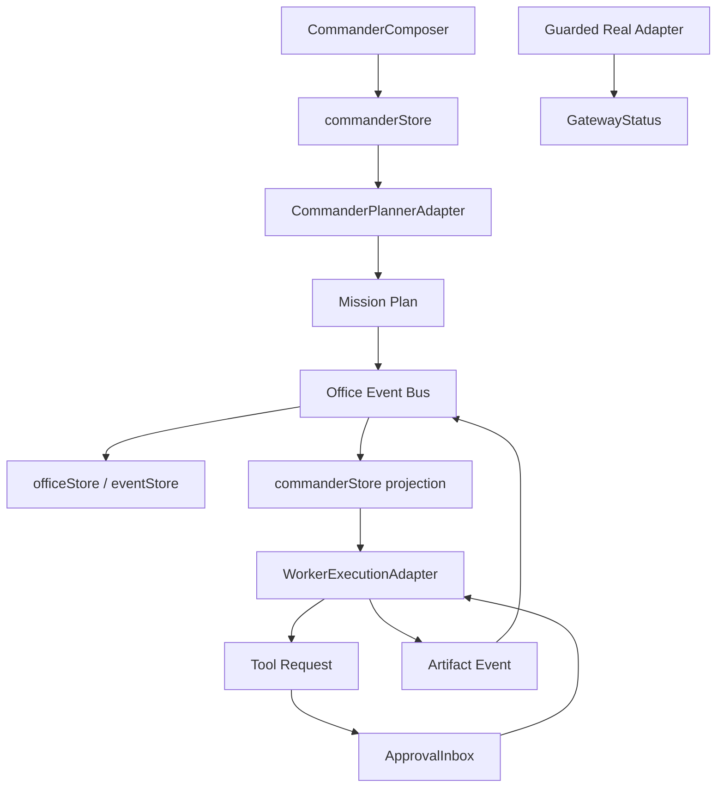

# Real AI Commander Adapter Implementation Plan

> **For agentic workers:** REQUIRED SUB-SKILL: Use superpowers:subagent-driven-development (recommended) or superpowers:executing-plans to implement this plan task-by-task. Steps use checkbox (`- [ ]`) syntax for tracking.

**Goal:** 把当前 Demo Commander 升级为可接真实 AI/Worker Runtime 的安全适配层，让“龙虾指挥一群 AI 干活”具备真实执行边界，而不是只靠预制脚本。

**Architecture:** 不把任何模型 SDK、token、命令执行或文件写入直接放进 React 组件。前端只维护 Commander mission、审批、事件投影和 adapter 协议；真实执行通过 `RuntimeAdapter`、`CommanderPlannerAdapter`、`WorkerExecutionAdapter` 三层边界接入。所有高风险动作先生成审批请求，审批通过后才允许 adapter 派发执行事件；默认实现只提供安全 Mock 和 guarded placeholder。

**Tech Stack:** React 18, TypeScript, Vite, Zustand, Vitest, localStorage, existing RuntimeAdapter boundary, OfficeEvent event bus.

---

## Source Requirement

使用以下需求文档作为产品基线：

`docs/superpowers/specs/2026-05-23-video-replication-optimization-requirements.md`

本计划覆盖：

- Section 7: 龙虾 Commander 复刻需求中的真实指挥边界。
- Section 8: 多 Agent 工作复刻需求中的 Worker 分工。
- Section 13: 真实 AI 指挥需求。
- Section 14: 数据和状态需求。
- Section 15: 错误处理需求。
- Section 21.2: 架构风险。
- Section 21.3: 安全风险。

本计划不覆盖：

- 接入某个具体云模型供应商的 token 配置页面。
- 后端服务部署。
- 真正执行 destructive 文件操作。
- 绕过用户审批的自动命令执行。
- 性能和 bundle 拆分，属于 Plan 11。

## Existing Baseline

当前已经具备：

- `src/runtime/runtimeAdapter.ts`
- `src/runtime/mockRuntimeAdapter.ts`
- `src/runtime/openClawAdapter.ts`
- `src/runtime/normalizeRuntimeEvent.ts`
- `src/store/runtimeStore.ts`
- `src/store/commanderStore.ts`
- `src/demo/commanderScenario.ts`
- `src/core/event-bus.ts`
- `src/core/types.ts`
- `src/ui/commander/ApprovalInbox.tsx`
- `docs/runtime/adapter-contract.md`

当前缺口：

1. Commander goal 到 mission task 的“规划器”仍是本地固定 draft。
2. Worker 只是角色展示，没有真实 execution adapter。
3. Approval 目前主要服务 demo，不足以表达真实工具调用风险。
4. Runtime event 与 Commander mission 的映射已有雏形，但缺少真实协议契约。
5. 没有“真实模式不可用时如何安全降级”的完整用户提示。

## Safety Rules

Plan 10 必须遵守：

1. 前端不保存 API key、token、password、authorization header。
2. localStorage 和 migration bundle 不导出凭据。
3. 所有真实 adapter 默认是 guarded placeholder，除非明确配置外部安全 runtime。
4. 写文件、删文件、运行命令、访问网络、调用真实 API、上传/导出数据都必须生成审批。
5. Approval payload 必须包含 action、target、impact、risk、requestedByWorkerId、officeTaskId、missionTaskId。
6. 拒绝审批后，任务进入 `blocked` 或 `waiting_input`，不能静默继续。
7. Adapter 错误必须进入 EventFeed、Gateway、CommanderDock。

## File Structure

### Files to create

| File | Responsibility |
| --- | --- |
| `src/ai/commanderAdapterTypes.ts` | Commander planner、Worker execution、tool request、安全审批的类型。 |
| `src/ai/commanderAdapterTesting.ts` | 纯函数：风险分类、任务计划验证、事件映射、secret 检测。 |
| `src/ai/commanderAdapterTesting.test.ts` | Plan 10 契约测试。 |
| `src/ai/mockCommanderPlanner.ts` | 无凭据 Mock planner，把用户目标拆成 Research/Build/Review。 |
| `src/ai/mockWorkerExecutionAdapter.ts` | 无真实副作用的 Worker adapter，产生 task/tool/artifact 事件。 |
| `src/ai/guardedRealCommanderAdapter.ts` | 真实 adapter 占位：永不请求凭据，只返回 guarded status。 |
| `src/ai/commanderRuntimeBridge.ts` | 把 planner/worker adapter 事件投影到 OfficeEvent 和 commanderStore。 |
| `src/ui/commander/RealModeNotice.tsx` | 告诉用户真实 AI 模式当前是否可用、为什么受保护。 |
| `docs/runtime/real-ai-commander-adapter.md` | 真实接入协议、安全边界、后续后端实现说明。 |

### Files to modify

| File | Change |
| --- | --- |
| `src/core/types.ts` | 增加 tool request、execution mode、approval risk 细化字段，如已有类似字段则复用。 |
| `src/store/commanderStore.ts` | 增加 planner mode、execution status、adapter diagnostics、从 goal 创建 mission 的 adapter 入口。 |
| `src/store/runtimeStore.ts` | 增加 commander adapter 状态，不混入 token。 |
| `src/ui/commander/CommanderComposer.tsx` | 增加 Demo Planner / Mock AI / Guarded Real 模式切换和状态说明。 |
| `src/ui/commander/ApprovalInbox.tsx` | 增强真实工具请求风险说明。 |
| `src/ui/commander/WorkerRoster.tsx` | 显示 worker runtime ref、adapter status、最后事件。 |
| `src/ui/dashboard/GatewayStatus.tsx` | 显示 Commander Adapter 协议和 guarded real 状态。 |
| `src/core/event-bus.ts` | 如需要，允许 AI adapter 事件来源 `source: 'ai_adapter'`。 |
| `docs/runtime/adapter-contract.md` | 链接新的 real AI Commander adapter 文档。 |
| `docs/superpowers/specs/2026-05-23-video-replication-optimization-requirements.md` | 实施后追加 Plan 10 状态。 |

## Runtime Architecture



## Task 1: Define Adapter Types and Contract Tests

**Files:**
- Create: `src/ai/commanderAdapterTypes.ts`
- Create: `src/ai/commanderAdapterTesting.ts`
- Create: `src/ai/commanderAdapterTesting.test.ts`

- [ ] **Step 1: Write failing adapter contract tests**

Create `src/ai/commanderAdapterTesting.test.ts`:

```ts
import { describe, expect, it } from 'vitest';
import {
  classifyToolRisk,
  hasSecretLikeValue,
  isValidPlannerResult,
  normalizeWorkerEvent,
} from './commanderAdapterTesting';

describe('real AI commander adapter contract', () => {
  it('classifies high-risk tool actions that must require approval', () => {
    expect(classifyToolRisk({ kind: 'write_file', target: 'src/App.tsx' })).toBe('high');
    expect(classifyToolRisk({ kind: 'delete_file', target: 'src/App.tsx' })).toBe('critical');
    expect(classifyToolRisk({ kind: 'run_command', target: 'npm run build' })).toBe('high');
    expect(classifyToolRisk({ kind: 'read_context', target: 'docs/spec.md' })).toBe('low');
  });

  it('rejects planner results without research build and review tasks', () => {
    expect(isValidPlannerResult({
      missionTitle: '复刻办公室',
      tasks: [
        { id: 'research', role: 'researcher', title: '调研', summary: '调研参考', risk: 'low' },
        { id: 'build', role: 'builder', title: '构建', summary: '实现功能', risk: 'medium' },
        { id: 'review', role: 'reviewer', title: '审查', summary: '验证交付', risk: 'low' },
      ],
    })).toBe(true);

    expect(isValidPlannerResult({
      missionTitle: '坏计划',
      tasks: [{ id: 'build', role: 'builder', title: '直接构建', summary: '跳过调研', risk: 'medium' }],
    })).toBe(false);
  });

  it('detects secret-like payload values before persistence or migration', () => {
    expect(hasSecretLikeValue({ token: 'sk-live-1234567890' })).toBe(true);
    expect(hasSecretLikeValue({ authorization: 'Bearer abc.def.ghi' })).toBe(true);
    expect(hasSecretLikeValue({ note: '普通任务说明' })).toBe(false);
  });

  it('normalizes worker execution events into office events', () => {
    expect(normalizeWorkerEvent({
      id: 'worker-event-1',
      missionId: 'mission-1',
      missionTaskId: 'build',
      officeTaskId: 'task-build',
      workerId: 'worker-builder',
      type: 'worker.task_started',
      message: '开始构建',
      occurredAt: '2026-05-23T00:00:00.000Z',
    })).toMatchObject({
      type: 'task.started',
      taskId: 'task-build',
      agentId: 'worker-builder',
      missionId: 'mission-1',
      payload: {
        missionTaskId: 'build',
        message: '开始构建',
      },
    });
  });
});
```

- [ ] **Step 2: Run test to verify it fails**

```powershell
npm.cmd run test -- src/ai/commanderAdapterTesting.test.ts
```

Expected: FAIL because adapter files do not exist.

- [ ] **Step 3: Add adapter types**

Create `src/ai/commanderAdapterTypes.ts`:

```ts
import type { OfficeEvent } from '@/core/types';

export type CommanderAdapterMode = 'demo' | 'mock_ai' | 'guarded_real';
export type CommanderAdapterStatus = 'idle' | 'planning' | 'executing' | 'approval_required' | 'blocked' | 'completed' | 'guarded';

export type WorkerRole = 'researcher' | 'builder' | 'reviewer' | 'coordinator';
export type ToolActionKind =
  | 'read_context'
  | 'write_file'
  | 'delete_file'
  | 'run_command'
  | 'network_request'
  | 'call_model'
  | 'export_data';

export type ToolRisk = 'low' | 'medium' | 'high' | 'critical';

export interface CommanderGoalInput {
  goal: string;
  materialNote: string;
  constraintsText: string;
  requestedAt: string;
}

export interface PlannedMissionTask {
  id: string;
  role: WorkerRole;
  title: string;
  summary: string;
  risk: ToolRisk;
  dependencyIds?: string[];
  expectedArtifactKinds?: Array<'notes' | 'patch' | 'review' | 'report'>;
}

export interface CommanderPlannerResult {
  missionTitle: string;
  missionSummary?: string;
  tasks: PlannedMissionTask[];
}

export interface ToolRequest {
  id: string;
  missionId: string;
  missionTaskId: string;
  officeTaskId: string;
  requestedByWorkerId: string;
  kind: ToolActionKind;
  target: string;
  reason: string;
  impact: string;
  risk: ToolRisk;
}

export interface WorkerExecutionEvent {
  id: string;
  missionId: string;
  missionTaskId: string;
  officeTaskId: string;
  workerId: string;
  type:
    | 'worker.task_started'
    | 'worker.task_progress'
    | 'worker.task_completed'
    | 'worker.task_blocked'
    | 'worker.tool_requested'
    | 'worker.artifact_created';
  message: string;
  occurredAt: string;
  payload?: Record<string, unknown>;
}

export interface CommanderPlannerAdapter {
  mode: CommanderAdapterMode;
  getStatus(): CommanderAdapterStatus;
  plan(input: CommanderGoalInput): Promise<CommanderPlannerResult>;
}

export interface WorkerExecutionAdapter {
  mode: CommanderAdapterMode;
  getStatus(): CommanderAdapterStatus;
  startMission(missionId: string, tasks: PlannedMissionTask[]): Promise<WorkerExecutionEvent[]>;
  approveToolRequest(requestId: string): Promise<WorkerExecutionEvent[]>;
  rejectToolRequest(requestId: string, reason: string): Promise<WorkerExecutionEvent[]>;
}

export type WorkerEventNormalizer = (event: WorkerExecutionEvent) => OfficeEvent;
```

- [ ] **Step 4: Add testing helpers**

Create `src/ai/commanderAdapterTesting.ts`:

```ts
import type {
  CommanderPlannerResult,
  ToolActionKind,
  ToolRisk,
  WorkerExecutionEvent,
} from './commanderAdapterTypes';
import type { OfficeEvent } from '@/core/types';

const RISK_BY_ACTION: Record<ToolActionKind, ToolRisk> = {
  read_context: 'low',
  write_file: 'high',
  delete_file: 'critical',
  run_command: 'high',
  network_request: 'high',
  call_model: 'medium',
  export_data: 'high',
};

export function classifyToolRisk(action: { kind: ToolActionKind; target: string }): ToolRisk {
  return RISK_BY_ACTION[action.kind];
}

export function isValidPlannerResult(result: CommanderPlannerResult): boolean {
  const roles = new Set(result.tasks.map((task) => task.role));
  const ids = new Set(result.tasks.map((task) => task.id));
  return Boolean(
    result.missionTitle.trim()
    && roles.has('researcher')
    && roles.has('builder')
    && roles.has('reviewer')
    && result.tasks.every((task) => task.title.trim() && task.summary.trim() && ids.has(task.id)),
  );
}

export function hasSecretLikeValue(value: unknown): boolean {
  const text = JSON.stringify(value).toLowerCase();
  return [
    'authorization',
    'bearer ',
    'api_key',
    'apikey',
    'secret',
    'password',
    'token',
    'sk-live',
    'sk-',
  ].some((needle) => text.includes(needle));
}

export function normalizeWorkerEvent(event: WorkerExecutionEvent): OfficeEvent {
  const typeMap: Record<WorkerExecutionEvent['type'], OfficeEvent['type']> = {
    'worker.task_started': 'task.started',
    'worker.task_progress': 'task.progress',
    'worker.task_completed': 'task.completed',
    'worker.task_blocked': 'task.blocked',
    'worker.tool_requested': 'approval.requested',
    'worker.artifact_created': 'artifact.created',
  };

  return {
    id: event.id,
    type: typeMap[event.type],
    taskId: event.officeTaskId,
    agentId: event.workerId,
    missionId: event.missionId,
    occurredAt: event.occurredAt,
    source: 'ai_adapter',
    payload: {
      ...(event.payload ?? {}),
      missionTaskId: event.missionTaskId,
      message: event.message,
    },
  };
}
```

If `OfficeEvent['source']` does not currently allow `'ai_adapter'`, add it to `src/core/types.ts` in the same task.

- [ ] **Step 5: Run adapter tests**

```powershell
npm.cmd run test -- src/ai/commanderAdapterTesting.test.ts
```

Expected: PASS.

- [ ] **Step 6: Commit**

```powershell
git add src/ai/commanderAdapterTypes.ts src/ai/commanderAdapterTesting.ts src/ai/commanderAdapterTesting.test.ts src/core/types.ts
git commit -m "feat: define real ai commander adapter contract"
```

## Task 2: Add Mock Planner and Worker Execution

**Files:**
- Create: `src/ai/mockCommanderPlanner.ts`
- Create: `src/ai/mockWorkerExecutionAdapter.ts`
- Test: `src/ai/commanderAdapterTesting.test.ts`

- [ ] **Step 1: Add mock planner**

Create `src/ai/mockCommanderPlanner.ts`:

```ts
import type { CommanderGoalInput, CommanderPlannerAdapter, CommanderPlannerResult } from './commanderAdapterTypes';

export function createMockCommanderPlanner(): CommanderPlannerAdapter {
  return {
    mode: 'mock_ai',
    getStatus: () => 'idle',
    async plan(input: CommanderGoalInput): Promise<CommanderPlannerResult> {
      const missionTitle = input.goal.trim() || '新的 Commander 任务';
      return {
        missionTitle,
        missionSummary: `基于目标「${missionTitle}」生成 Research / Build / Review 三阶段任务。`,
        tasks: [
          {
            id: 'research-reference',
            role: 'researcher',
            title: '调研目标和资料',
            summary: input.materialNote || '整理需求、约束和参考资料。',
            risk: 'low',
            dependencyIds: [],
            expectedArtifactKinds: ['notes'],
          },
          {
            id: 'build-office-loop',
            role: 'builder',
            title: '构建实现方案',
            summary: '根据调研结果修改本地项目并产生产物。',
            risk: 'high',
            dependencyIds: ['research-reference'],
            expectedArtifactKinds: ['patch'],
          },
          {
            id: 'review-delivery',
            role: 'reviewer',
            title: '审查和交付',
            summary: '验证任务、整理产物并生成总结。',
            risk: 'low',
            dependencyIds: ['build-office-loop'],
            expectedArtifactKinds: ['review'],
          },
        ],
      };
    },
  };
}
```

- [ ] **Step 2: Add mock worker execution adapter**

Create `src/ai/mockWorkerExecutionAdapter.ts`:

```ts
import type { PlannedMissionTask, ToolRequest, WorkerExecutionAdapter, WorkerExecutionEvent } from './commanderAdapterTypes';

function now(offsetMs = 0): string {
  return new Date(Date.now() + offsetMs).toISOString();
}

export function createMockWorkerExecutionAdapter(): WorkerExecutionAdapter {
  let pendingRequest: ToolRequest | null = null;

  return {
    mode: 'mock_ai',
    getStatus: () => pendingRequest ? 'approval_required' : 'idle',
    async startMission(missionId: string, tasks: PlannedMissionTask[]): Promise<WorkerExecutionEvent[]> {
      const buildTask = tasks.find((task) => task.role === 'builder');
      pendingRequest = buildTask
        ? {
            id: `approval-${missionId}-${buildTask.id}`,
            missionId,
            missionTaskId: buildTask.id,
            officeTaskId: `task-${buildTask.id}`,
            requestedByWorkerId: 'worker-builder',
            kind: 'write_file',
            target: 'src/',
            reason: '构建 Worker 需要写入本地项目文件。',
            impact: '会修改前端实现并生成补丁产物。',
            risk: 'high',
          }
        : null;

      return tasks.flatMap((task, index) => {
        const workerId = task.role === 'researcher' ? 'worker-research' : task.role === 'builder' ? 'worker-builder' : 'worker-review';
        const officeTaskId = `task-${task.id}`;
        const base = index * 500;
        const started: WorkerExecutionEvent = {
          id: `${missionId}-${task.id}-started`,
          missionId,
          missionTaskId: task.id,
          officeTaskId,
          workerId,
          type: 'worker.task_started',
          message: `${task.title}开始执行`,
          occurredAt: now(base),
        };
        if (task.role === 'builder' && pendingRequest) {
          return [
            started,
            {
              id: pendingRequest.id,
              missionId,
              missionTaskId: task.id,
              officeTaskId,
              workerId,
              type: 'worker.tool_requested',
              message: pendingRequest.reason,
              occurredAt: now(base + 200),
              payload: { toolRequest: pendingRequest },
            },
          ];
        }
        return [
          started,
          {
            id: `${missionId}-${task.id}-completed`,
            missionId,
            missionTaskId: task.id,
            officeTaskId,
            workerId,
            type: 'worker.task_completed',
            message: `${task.title}已完成`,
            occurredAt: now(base + 300),
          },
        ];
      });
    },
    async approveToolRequest(requestId: string): Promise<WorkerExecutionEvent[]> {
      if (!pendingRequest || pendingRequest.id !== requestId) return [];
      const request = pendingRequest;
      pendingRequest = null;
      return [
        {
          id: `${request.id}-artifact`,
          missionId: request.missionId,
          missionTaskId: request.missionTaskId,
          officeTaskId: request.officeTaskId,
          workerId: request.requestedByWorkerId,
          type: 'worker.artifact_created',
          message: '审批通过，已生成构建产物。',
          occurredAt: now(100),
          payload: { artifactId: `artifact-${request.missionTaskId}`, title: 'Mock AI 构建产物' },
        },
        {
          id: `${request.id}-completed`,
          missionId: request.missionId,
          missionTaskId: request.missionTaskId,
          officeTaskId: request.officeTaskId,
          workerId: request.requestedByWorkerId,
          type: 'worker.task_completed',
          message: '构建 Worker 已完成。',
          occurredAt: now(200),
        },
      ];
    },
    async rejectToolRequest(requestId: string, reason: string): Promise<WorkerExecutionEvent[]> {
      if (!pendingRequest || pendingRequest.id !== requestId) return [];
      const request = pendingRequest;
      pendingRequest = null;
      return [{
        id: `${request.id}-blocked`,
        missionId: request.missionId,
        missionTaskId: request.missionTaskId,
        officeTaskId: request.officeTaskId,
        workerId: request.requestedByWorkerId,
        type: 'worker.task_blocked',
        message: `审批拒绝：${reason}`,
        occurredAt: now(100),
      }];
    },
  };
}
```

- [ ] **Step 3: Add tests for mock planner and worker**

Extend `commanderAdapterTesting.test.ts`:

```ts
import { createMockCommanderPlanner } from './mockCommanderPlanner';
import { createMockWorkerExecutionAdapter } from './mockWorkerExecutionAdapter';

it('mock planner creates research build and review tasks from a user goal', async () => {
  const planner = createMockCommanderPlanner();
  const result = await planner.plan({
    goal: '复刻视频办公室',
    materialNote: '参考现有需求文档',
    constraintsText: '需要审批',
    requestedAt: '2026-05-23T00:00:00.000Z',
  });
  expect(result.tasks.map((task) => task.role)).toEqual(['researcher', 'builder', 'reviewer']);
});

it('mock worker execution pauses build on a tool approval request', async () => {
  const planner = createMockCommanderPlanner();
  const worker = createMockWorkerExecutionAdapter();
  const plan = await planner.plan({
    goal: '复刻视频办公室',
    materialNote: '',
    constraintsText: '',
    requestedAt: '2026-05-23T00:00:00.000Z',
  });
  const events = await worker.startMission('mission-1', plan.tasks);
  expect(events.map((event) => event.type)).toContain('worker.tool_requested');
  expect(worker.getStatus()).toBe('approval_required');
});
```

- [ ] **Step 4: Run tests**

```powershell
npm.cmd run test -- src/ai/commanderAdapterTesting.test.ts
```

Expected: PASS.

- [ ] **Step 5: Commit**

```powershell
git add src/ai/mockCommanderPlanner.ts src/ai/mockWorkerExecutionAdapter.ts src/ai/commanderAdapterTesting.test.ts
git commit -m "feat: add mock commander planner and worker adapter"
```

## Task 3: Add Guarded Real Adapter

**Files:**
- Create: `src/ai/guardedRealCommanderAdapter.ts`
- Modify: `src/ui/dashboard/GatewayStatus.tsx`
- Test: `src/ai/commanderAdapterTesting.test.ts`

- [ ] **Step 1: Add guarded real adapter**

Create `src/ai/guardedRealCommanderAdapter.ts`:

```ts
import type {
  CommanderGoalInput,
  CommanderPlannerAdapter,
  CommanderPlannerResult,
  PlannedMissionTask,
  WorkerExecutionAdapter,
  WorkerExecutionEvent,
} from './commanderAdapterTypes';

export function createGuardedRealCommanderPlanner(): CommanderPlannerAdapter {
  return {
    mode: 'guarded_real',
    getStatus: () => 'guarded',
    async plan(_input: CommanderGoalInput): Promise<CommanderPlannerResult> {
      throw new Error('真实 AI Commander Adapter 尚未连接。当前为受保护占位，不会请求或保存任何凭据。');
    },
  };
}

export function createGuardedRealWorkerExecutionAdapter(): WorkerExecutionAdapter {
  return {
    mode: 'guarded_real',
    getStatus: () => 'guarded',
    async startMission(_missionId: string, _tasks: PlannedMissionTask[]): Promise<WorkerExecutionEvent[]> {
      throw new Error('真实 Worker Runtime 尚未连接。请先接入外部安全 Runtime 服务。');
    },
    async approveToolRequest(_requestId: string): Promise<WorkerExecutionEvent[]> {
      throw new Error('真实工具执行尚未启用。');
    },
    async rejectToolRequest(_requestId: string, _reason: string): Promise<WorkerExecutionEvent[]> {
      return [];
    },
  };
}
```

- [ ] **Step 2: Add guarded tests**

Extend `commanderAdapterTesting.test.ts`:

```ts
import { createGuardedRealCommanderPlanner } from './guardedRealCommanderAdapter';

it('guarded real planner refuses execution without requesting credentials', async () => {
  const planner = createGuardedRealCommanderPlanner();
  await expect(planner.plan({
    goal: '真实执行',
    materialNote: '',
    constraintsText: '',
    requestedAt: '2026-05-23T00:00:00.000Z',
  })).rejects.toThrow('受保护占位');
  expect(planner.getStatus()).toBe('guarded');
});
```

- [ ] **Step 3: Update Gateway copy**

In `GatewayStatus.tsx`, add a Commander Adapter section:

```tsx
<section className="cyber-panel p-3">
  <h3 className="text-sm font-semibold text-white">Commander Adapter</h3>
  <p className="text-sm text-gray-400">
    真实 AI Commander 当前为受保护占位。系统不会在浏览器里请求、保存或迁移任何 token。
  </p>
  <p className="text-xs text-amber-300 mt-2">
    接入真实 Runtime 时，请通过外部安全服务提供事件流，不要把供应商 SDK 直接放进前端。
  </p>
</section>
```

- [ ] **Step 4: Run tests and build**

```powershell
npm.cmd run test -- src/ai/commanderAdapterTesting.test.ts
npm.cmd run build
```

Expected: PASS and build success.

- [ ] **Step 5: Commit**

```powershell
git add src/ai/guardedRealCommanderAdapter.ts src/ai/commanderAdapterTesting.test.ts src/ui/dashboard/GatewayStatus.tsx
git commit -m "feat: add guarded real commander adapter"
```

## Task 4: Bridge Planner and Worker Events Into Commander Store

**Files:**
- Create: `src/ai/commanderRuntimeBridge.ts`
- Modify: `src/store/commanderStore.ts`
- Modify: `src/ui/commander/CommanderComposer.tsx`
- Test: `src/ai/commanderAdapterTesting.test.ts`
- Test: `src/commander/commanderTesting.test.ts`

- [ ] **Step 1: Add bridge**

Create `src/ai/commanderRuntimeBridge.ts`:

```ts
import { dispatch } from '@/core/event-bus';
import { normalizeWorkerEvent } from './commanderAdapterTesting';
import type {
  CommanderGoalInput,
  CommanderPlannerAdapter,
  PlannedMissionTask,
  WorkerExecutionAdapter,
} from './commanderAdapterTypes';

export async function planMissionWithAdapter(adapter: CommanderPlannerAdapter, input: CommanderGoalInput) {
  const result = await adapter.plan(input);
  return result;
}

export async function startWorkerExecutionWithAdapter(
  adapter: WorkerExecutionAdapter,
  missionId: string,
  tasks: PlannedMissionTask[],
) {
  const events = await adapter.startMission(missionId, tasks);
  for (const event of events) dispatch(normalizeWorkerEvent(event));
  return events;
}

export async function approveToolRequestWithAdapter(adapter: WorkerExecutionAdapter, requestId: string) {
  const events = await adapter.approveToolRequest(requestId);
  for (const event of events) dispatch(normalizeWorkerEvent(event));
  return events;
}

export async function rejectToolRequestWithAdapter(adapter: WorkerExecutionAdapter, requestId: string, reason: string) {
  const events = await adapter.rejectToolRequest(requestId, reason);
  for (const event of events) dispatch(normalizeWorkerEvent(event));
  return events;
}
```

- [ ] **Step 2: Add store state**

Modify `src/store/commanderStore.ts`:

```ts
adapterMode: CommanderAdapterMode;
adapterStatus: CommanderAdapterStatus;
adapterError: string | null;

setAdapterMode: (mode: CommanderAdapterMode) => void;
setAdapterStatus: (status: CommanderAdapterStatus) => void;
setAdapterError: (message: string | null) => void;
```

Default:

```ts
adapterMode: 'demo',
adapterStatus: 'idle',
adapterError: null,
```

Actions:

```ts
setAdapterMode: (adapterMode) => set({ adapterMode }),
setAdapterStatus: (adapterStatus) => set({ adapterStatus }),
setAdapterError: (adapterError) => set({ adapterError }),
```

Do not persist credentials. Persisting `adapterMode` is acceptable; `adapterError` may be persisted only if it contains no secret-like values.

- [ ] **Step 3: Composer mode switch**

Modify `CommanderComposer.tsx`:

- Add segmented buttons: `Demo`, `Mock AI`, `真实占位`.
- `Demo` keeps current `createMissionFromDraft()`.
- `Mock AI` calls mock planner, creates mission, then starts mock worker events.
- `真实占位` calls guarded adapter and displays guarded error.

Required user copy:

```tsx
<p className="text-xs text-gray-500">
  真实占位模式不会请求 token。真实 AI 接入必须通过外部 Runtime Adapter。
</p>
```

- [ ] **Step 4: Error handling**

When adapter errors:

- Set `adapterError`.
- Set `adapterStatus` to `blocked` or `guarded`.
- Dispatch an `runtime.adapter_error` or `agent.status_changed` event with `source: 'ai_adapter'`.
- Show error in CommanderComposer and Gateway.

- [ ] **Step 5: Tests**

Add store tests if a commander store test exists; otherwise extend `commanderTesting.test.ts` with pure helpers only.

Run:

```powershell
npm.cmd run test -- src/ai/commanderAdapterTesting.test.ts src/commander/commanderTesting.test.ts
npm.cmd run build
```

Expected: PASS and build success.

- [ ] **Step 6: Commit**

```powershell
git add src/ai/commanderRuntimeBridge.ts src/store/commanderStore.ts src/ui/commander/CommanderComposer.tsx src/commander/commanderTesting.test.ts
git commit -m "feat: bridge commander adapters into mission flow"
```

## Task 5: Strengthen Approval and Worker UI

**Files:**
- Modify: `src/ui/commander/ApprovalInbox.tsx`
- Modify: `src/ui/commander/WorkerRoster.tsx`
- Create: `src/ui/commander/RealModeNotice.tsx`

- [ ] **Step 1: Add real mode notice**

Create `src/ui/commander/RealModeNotice.tsx`:

```tsx
import { useCommanderStore } from '@/store/commanderStore';

export function RealModeNotice() {
  const mode = useCommanderStore((state) => state.adapterMode);
  const status = useCommanderStore((state) => state.adapterStatus);
  const error = useCommanderStore((state) => state.adapterError);

  if (mode === 'demo') return null;

  return (
    <section className="commander-section">
      <header className="commander-section-title">
        <span>真实 AI 边界</span>
        <span className="commander-pill">{status}</span>
      </header>
      <p className="text-xs text-gray-400">
        {mode === 'mock_ai'
          ? 'Mock AI 会模拟真实规划和审批，不会执行真实副作用。'
          : '真实 Adapter 当前为受保护占位，不会在浏览器请求或保存凭据。'}
      </p>
      {error && <p className="text-xs text-red-300 mt-2">{error}</p>}
    </section>
  );
}
```

Render `RealModeNotice` in `CommanderDock` below `CommanderComposer`.

- [ ] **Step 2: Approval risk details**

Modify `ApprovalInbox.tsx` approval card:

- Show tool kind if `approval.payload.toolRequest.kind` exists.
- Show target.
- Show impact.
- Show risk as `低 / 中 / 高 / 严重`.
- For high/critical risks, add copy `同意后才会继续执行；拒绝会阻塞该任务。`

- [ ] **Step 3: Worker runtime status**

Modify `WorkerRoster.tsx`:

- Show `runtimeRef` if present.
- Show adapter mode.
- Show last seen timestamp.
- If worker status is `blocked`, show `等待人工处理`.

- [ ] **Step 4: Build**

```powershell
npm.cmd run build
```

Expected: no TypeScript errors.

- [ ] **Step 5: Browser QA**

Verify:

- Mock AI mode creates a mission.
- Mock AI build task requests approval.
- Approval card shows risk, target, impact.
- Rejecting approval blocks the task.
- Guarded real mode shows safety notice and never asks for token.

- [ ] **Step 6: Commit**

```powershell
git add src/ui/commander/ApprovalInbox.tsx src/ui/commander/WorkerRoster.tsx src/ui/commander/RealModeNotice.tsx src/ui/commander/CommanderDock.tsx
git commit -m "feat: expose real ai safety state in commander ui"
```

## Task 6: Runtime Documentation

**Files:**
- Create: `docs/runtime/real-ai-commander-adapter.md`
- Modify: `docs/runtime/adapter-contract.md`

- [ ] **Step 1: Create real adapter document**

Create `docs/runtime/real-ai-commander-adapter.md`:

```md
# Real AI Commander Adapter Contract

## Purpose

This document defines how a real external AI runtime can connect to the 3D Cyber Office without putting credentials, provider SDKs, command execution, or file mutation directly inside the browser UI.

## Browser Safety Boundary

The browser may:

- collect a user goal
- show mission plans
- show approval requests
- dispatch normalized OfficeEvent objects
- persist non-secret UI state

The browser must not:

- store API keys
- store authorization headers
- execute shell commands
- write files outside approved adapter events
- bypass approval for high-risk actions

## Required External Runtime Responsibilities

The external runtime is responsible for:

- storing credentials securely
- calling model providers
- running tools
- streaming worker events
- waiting for browser approval before high-risk actions
- returning artifact metadata

## Event Flow

1. User submits goal in Commander.
2. Browser sends goal to planner adapter.
3. Planner returns mission tasks.
4. Worker adapter starts tasks.
5. Worker requests approval for high-risk tools.
6. Browser shows ApprovalInbox.
7. User approves or rejects.
8. Worker adapter continues or blocks.
9. Worker emits artifacts and summary.
10. Browser projects events into Office, Commander, Workbench, Logs, Files, and Review.

## Approval Required Actions

- write_file
- delete_file
- run_command
- network_request
- call_model with real provider credentials
- export_data

## Migration Rule

Migration bundles must never include credentials. If a real runtime is configured on another computer, credentials must be recreated manually in that runtime.
```

- [ ] **Step 2: Link from adapter contract**

Modify `docs/runtime/adapter-contract.md`:

```md
See also: `docs/runtime/real-ai-commander-adapter.md` for the Commander planner, Worker execution, tool approval, and browser safety contract.
```

- [ ] **Step 3: Commit**

```powershell
git add docs/runtime/real-ai-commander-adapter.md docs/runtime/adapter-contract.md
git commit -m "docs: document real ai commander adapter contract"
```

## Task 7: Final Verification and Spec Status

**Files:**
- Modify: `docs/superpowers/specs/2026-05-23-video-replication-optimization-requirements.md`

- [ ] **Step 1: Update implementation status**

Append under `## Implementation Status`:

```md
- Plan 10 `Real AI Commander Adapter`: **implemented and verified** (2026-05-23).
- Commander now has a real-adapter-safe architecture with Mock AI planner, Mock Worker execution, guarded real adapter placeholder, high-risk approval mapping, Worker event normalization, Gateway safety copy, and runtime contract documentation.
```

- [ ] **Step 2: Run full verification**

```powershell
npm.cmd run test
npm.cmd run build
```

Expected:

- All tests pass.
- TypeScript passes.
- Vite build succeeds.
- Existing chunk warning may remain for Plan 11.

- [ ] **Step 3: Browser QA**

Run:

```powershell
npm.cmd run dev
```

Desktop:

- Commander Demo still works.
- Guided demo still works.
- Mock AI planner creates mission from user goal.
- Mock Worker requests approval.
- Approve creates artifact.
- Reject blocks task.
- Guarded real mode never asks for credentials.
- Gateway explains guarded real mode.

Mobile 390px:

- Composer mode switch does not overflow.
- Approval cards wrap target/impact text.
- Worker roster is readable.

- [ ] **Step 4: Secret scan**

Run:

```powershell
rg "api[_-]?key|authorization|bearer|secret|password|sk-" src docs -n
```

Expected:

- Only documentation warnings and secret detector tests appear.
- No real credentials appear.

- [ ] **Step 5: Commit**

```powershell
git add docs/superpowers/specs/2026-05-23-video-replication-optimization-requirements.md
git commit -m "docs: mark real ai commander adapter plan status"
```

## Final Acceptance

Plan 10 is complete when:

1. The app has a typed Commander planner adapter boundary.
2. The app has a typed Worker execution adapter boundary.
3. Mock AI mode can plan a mission and produce execution events.
4. Build tasks that require tool actions create approval requests.
5. Approve continues execution and creates artifacts.
6. Reject blocks the task visibly.
7. Guarded real mode never asks for or stores credentials.
8. Gateway and Commander clearly explain the real AI safety boundary.
9. Secret scan finds no real credential leakage.
10. `npm.cmd run test` passes.
11. `npm.cmd run build` succeeds.
