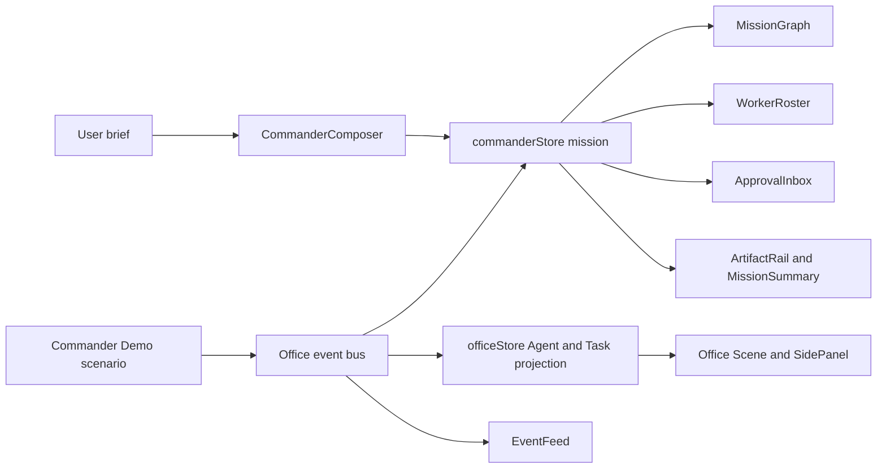

# Commander Workflow Implementation Plan

> **For agentic workers:** REQUIRED SUB-SKILL: Use superpowers:subagent-driven-development (recommended) or superpowers:executing-plans to implement this plan task-by-task. Steps use checkbox (`- [ ]`) syntax for tracking.

**Goal:** Let a user brief Lobster Commander in Demo mode, inspect the resulting mission graph, watch Research/Build/Review workers advance Office state, resolve approvals or blockers, and receive linked artifacts plus a readable mission summary.

**Architecture:** Keep Commander behavior as a local mission projection layer above the existing Office event bus and Demo engine. Model missions, mission tasks, worker registry records, approvals, artifacts, and summaries in Commander-specific domain state, then project Office events into both Office task state and Commander mission state so the later Runtime Adapter can feed the same flow without coupling Commander UI to OpenClaw payloads.

**Tech Stack:** React 18, TypeScript, Vite, Zustand, React Three Fiber Office shell, existing event bus and Demo engine, Vitest, Browser/Playwright UI QA.

---

## Prerequisites

Execute this plan after:

1. `docs/superpowers/plans/2026-05-22-office-visual-fidelity.md`
2. `docs/superpowers/plans/2026-05-22-workbench-fidelity.md`

Those plans establish the Commander desk focal point, richer Agent status cues, dashboard data seams, and Tasks/Files/Logs surfaces this workflow should link back into.

## File Structure

### Files to create

| File | Responsibility |
| --- | --- |
| `src/commander/commanderTesting.ts` | Pure graph, readiness, approval decision, and summary helpers for Commander missions. |
| `src/commander/commanderTesting.test.ts` | Focused tests for mission graph order, ready tasks, approval outcomes, and result summaries. |
| `src/data/demoCommander.ts` | Worker registry fixtures, mission starter templates, approval/artifact demo fixtures. |
| `src/store/commanderStore.ts` | Local Commander mission state, worker records, approvals, artifacts, and event ingestion actions. |
| `src/demo/commanderScenario.ts` | Mission-shaped Demo scenario that exercises research, build, review, approval, blocking, and artifact events. |
| `src/demo/commanderScenario.test.ts` | Scenario order and coverage assertions for the Commander Demo path. |
| `src/ui/commander/CommanderDock.tsx` | Office overlay that combines the Commander input, current mission, and run controls. |
| `src/ui/commander/CommanderComposer.tsx` | Goal, constraints, material note, and mission creation form. |
| `src/ui/commander/MissionGraph.tsx` | Dependency-aware mission task graph with assignment and state cues. |
| `src/ui/commander/WorkerRoster.tsx` | Worker registry card strip with capabilities, tools, and live task counts. |
| `src/ui/commander/ApprovalInbox.tsx` | Approval queue with approve/reject actions and risk context. |
| `src/ui/commander/ArtifactRail.tsx` | Artifact list with creator, source task, path, and preview-readiness metadata. |
| `src/ui/commander/MissionSummary.tsx` | Commander result summary for completed, blocked, approval, and delivered outcomes. |

### Files to modify

| File | Responsibility of change |
| --- | --- |
| `src/core/types.ts` | Add mission, worker registry, approval, artifact, source metadata, and Commander event types. |
| `src/core/state-machine.ts` | Accept planned, approval, rejected, and artifact-adjacent task lifecycle events without breaking current Office transitions. |
| `src/core/state-machine.test.ts` | Cover Commander-specific planned and approval-resolution task transitions. |
| `src/core/event-bus.ts` | Preserve optional event source, approval ID, artifact ID, and mission references created by Demo or user actions. |
| `src/store/officeStore.ts` | Keep Commander-created Office tasks available for scene and SidePanel lookup. |
| `src/store/uiStore.ts` | Add Commander dock open state and selected mission task reference without changing current module persistence behavior. |
| `src/ui/AppShell.tsx` | Mount Commander UI in Office mode and project Commander events through Office/Commander stores. |
| `src/ui/DemoControls.tsx` | Expose a Commander mission scenario control separate from the generic lifecycle demo. |
| `src/ui/EventFeed.tsx` | Render user message, planned task, tool call, approval, artifact, and Commander summary events. |
| `src/ui/SidePanel.tsx` | Show mission context, approval status, and task-linked artifacts beside selected Office tasks. |
| `src/ui/StatusBar.tsx` | Surface active mission and outstanding approval counts. |
| `src/index.css` | Add compact Commander overlay, graph lane, roster, approval, and artifact layout classes. |

## Scope Guard

This plan owns the Demo-mode Commander loop:

- User goal capture with material notes and constraints.
- Mission decomposition into dependency-linked mission tasks.
- Worker registry display and worker assignment.
- Demo events that show Research, Build, Review, blocked, approval, and delivery branches.
- Approval request and decision UI with explicit task outcomes.
- Artifact metadata and mission result summary.
- Office linkage through Agent status, Task status, SidePanel, EventFeed, and StatusBar.

This plan does not add:

- A real OpenClaw protocol client.
- Real terminal or file-system tool execution.
- Automatic external message sending, deployment, deletion, or secret-bearing actions.
- Cross-device export/import.
- A full chat transcript product or arbitrary natural-language planner.

The output should look and behave like a local mission-control demo that is ready for Runtime Adapter input later.

## Data Flow Target



## Task 1: Define Commander Domain and Pure Workflow Helpers

**Files:**
- Create: `src/commander/commanderTesting.ts`
- Create: `src/commander/commanderTesting.test.ts`
- Modify: `src/core/types.ts`
- Modify: `src/core/state-machine.ts`
- Modify: `src/core/state-machine.test.ts`

- [ ] **Step 1: Write failing Commander helper tests**

Create `src/commander/commanderTesting.test.ts`:

```ts
import { describe, expect, it } from 'vitest';
import type { ApprovalRequest, CommanderMission } from '@/core/types';
import {
  applyApprovalDecision,
  buildMissionLanes,
  getReadyMissionTaskIds,
  summarizeMission,
} from './commanderTesting';

const mission: CommanderMission = {
  id: 'mission-demo',
  title: 'Replicate the cyber office workflow',
  originalGoal: 'Research the reference, build the office, and review the result.',
  materialNote: 'Use the existing local video notes.',
  constraints: ['Stay in Demo mode', 'Keep outputs linked'],
  status: 'running',
  createdAt: '2026-05-22T09:00:00.000Z',
  updatedAt: '2026-05-22T09:10:00.000Z',
  summary: null,
  taskIds: ['research', 'build', 'review'],
  tasks: {
    research: {
      id: 'research',
      title: 'Extract workflow requirements',
      summary: 'Collect the control-loop requirements.',
      status: 'completed',
      workerId: 'worker-research',
      officeTaskId: 'task-research',
      dependencyIds: [],
      expectedArtifactIds: ['artifact-notes'],
      risk: 'low',
      approvalId: null,
      artifactIds: ['artifact-notes'],
    },
    build: {
      id: 'build',
      title: 'Build Commander UI',
      summary: 'Create graph and approval surfaces.',
      status: 'assigned',
      workerId: 'worker-builder',
      officeTaskId: 'task-build',
      dependencyIds: ['research'],
      expectedArtifactIds: ['artifact-patch'],
      risk: 'medium',
      approvalId: 'approval-write',
      artifactIds: [],
    },
    review: {
      id: 'review',
      title: 'Review linked outputs',
      summary: 'Check result and summarize gaps.',
      status: 'planned',
      workerId: 'worker-reviewer',
      officeTaskId: 'task-review',
      dependencyIds: ['build'],
      expectedArtifactIds: ['artifact-review'],
      risk: 'low',
      approvalId: null,
      artifactIds: [],
    },
  },
};

const approval: ApprovalRequest = {
  id: 'approval-write',
  missionId: mission.id,
  taskId: 'build',
  officeTaskId: 'task-build',
  requestedByWorkerId: 'worker-builder',
  action: 'write workspace files',
  reason: 'Build task must update React source files.',
  target: 'src/ui/commander',
  impact: 'Creates Commander UI components.',
  risk: 'medium',
  status: 'pending',
  requestedAt: '2026-05-22T09:04:00.000Z',
  resolvedAt: null,
  resolutionNote: null,
};

describe('Commander workflow helpers', () => {
  it('groups mission tasks by dependency depth', () => {
    expect(buildMissionLanes(mission).map((lane) => lane.map((task) => task.id))).toEqual([
      ['research'],
      ['build'],
      ['review'],
    ]);
  });

  it('returns dependency-satisfied tasks that are ready for execution', () => {
    expect(getReadyMissionTaskIds(mission)).toEqual(['build']);
  });

  it('rejects approval into a blocked mission task state', () => {
    expect(applyApprovalDecision(mission, approval, 'rejected').tasks.build.status).toBe('blocked');
  });

  it('summarizes delivered artifacts and open risks', () => {
    expect(summarizeMission(mission, [approval], ['artifact-notes'])).toMatchObject({
      completedCount: 1,
      pendingApprovalCount: 1,
      deliveredArtifactIds: ['artifact-notes'],
    });
  });
});
```

- [ ] **Step 2: Run the helper tests to verify the seam is missing**

Run:

```powershell
npm run test -- src/commander/commanderTesting.test.ts
```

Expected: FAIL because Commander types and helper functions do not exist yet.

- [ ] **Step 3: Add Commander domain types and event metadata**

Update `src/core/types.ts` with the Commander-specific additions below. Keep the existing Office `Agent`, `Task`, `Desk`, dashboard, and layout types in place.

```ts
export type RiskLevel = 'low' | 'medium' | 'high';

export type MissionStatus =
  | 'draft'
  | 'planned'
  | 'running'
  | 'waiting_input'
  | 'approval_required'
  | 'blocked'
  | 'completed';

export type MissionTaskStatus =
  | 'planned'
  | 'assigned'
  | 'running'
  | 'waiting_input'
  | 'approval_required'
  | 'blocked'
  | 'failed'
  | 'completed';

export interface MissionTask {
  id: string;
  title: string;
  summary: string;
  status: MissionTaskStatus;
  workerId: string;
  officeTaskId: string;
  dependencyIds: string[];
  expectedArtifactIds: string[];
  risk: RiskLevel;
  approvalId: string | null;
  artifactIds: string[];
}

export interface CommanderMission {
  id: string;
  title: string;
  originalGoal: string;
  materialNote: string;
  constraints: string[];
  status: MissionStatus;
  createdAt: string;
  updatedAt: string;
  summary: string | null;
  taskIds: string[];
  tasks: Record<string, MissionTask>;
}

export interface WorkerProfile {
  id: string;
  name: string;
  role: 'commander' | 'researcher' | 'builder' | 'reviewer';
  capabilities: string[];
  tools: string[];
  workspace: string;
  deskId: string;
  runtimeRef: string | null;
  status: AgentStatus;
  lastSeenAt: string;
}

export type ApprovalStatus = 'pending' | 'approved' | 'rejected';

export interface ApprovalRequest {
  id: string;
  missionId: string;
  taskId: string;
  officeTaskId: string;
  requestedByWorkerId: string;
  action: string;
  reason: string;
  target: string;
  impact: string;
  risk: RiskLevel;
  status: ApprovalStatus;
  requestedAt: string;
  resolvedAt: string | null;
  resolutionNote: string | null;
}

export interface Artifact {
  id: string;
  missionId: string;
  title: string;
  kind: 'notes' | 'patch' | 'review' | 'report';
  path: string;
  summary: string;
  createdByWorkerId: string;
  taskId: string;
  officeTaskId: string;
  previewable: boolean;
  workspaceBacked: boolean;
  createdAt: string;
}
```

Extend existing `TaskStatus` and `EventType` without removing current states:

```ts
export type TaskStatus =
  | 'created'
  | 'planned'
  | 'queued'
  | 'assigned'
  | 'running'
  | 'waiting_input'
  | 'approval_required'
  | 'blocked'
  | 'failed'
  | 'completed'
  | 'cancelled';

export type EventType =
  | 'user.message'
  | 'user.action'
  | 'task.created'
  | 'task.planned'
  | 'task.queued'
  | 'task.assigned'
  | 'task.started'
  | 'task.progress'
  | 'task.waiting_input'
  | 'task.approval_required'
  | 'task.blocked'
  | 'task.failed'
  | 'task.completed'
  | 'task.cancelled'
  | 'tool.called'
  | 'artifact.created'
  | 'approval.requested'
  | 'approval.resolved'
  | 'agent.status_changed'
  | 'commander.summary_ready'
  | 'office.demo_reset';
```

Extend `OfficeEvent` so Commander Demo events can keep cross-surface references:

```ts
export interface OfficeEvent {
  id: string;
  type: EventType;
  occurredAt: string;
  source?: 'demo' | 'user' | 'runtime' | 'cron';
  missionId?: string | null;
  taskId: string | null;
  agentId: string | null;
  approvalId?: string | null;
  artifactId?: string | null;
  payload: Record<string, unknown>;
}
```

- [ ] **Step 4: Teach the Office state machine about planned Commander tasks**

Update `src/core/state-machine.test.ts` with:

```ts
it('moves a created Commander task into planned state before assignment', () => {
  expect(applyTaskEvent({ ...baseTask, status: 'created' }, 'task.planned')).toBe('planned');
});

it('resumes an approval task after an approval resolution event', () => {
  expect(applyTaskEvent({ ...baseTask, status: 'approval_required' }, 'approval.resolved')).toBe('running');
});
```

Update `src/core/state-machine.ts` transition data so planned tasks can flow into assignment:

```ts
const TASK_TRANSITIONS: Record<TaskStatus, TaskStatus[]> = {
  created: ['planned', 'queued', 'cancelled'],
  planned: ['queued', 'assigned', 'cancelled'],
  queued: ['assigned', 'cancelled'],
  assigned: ['running', 'cancelled'],
  running: ['waiting_input', 'approval_required', 'blocked', 'failed', 'completed', 'cancelled'],
  waiting_input: ['running', 'blocked', 'failed', 'cancelled'],
  approval_required: ['running', 'blocked', 'failed', 'cancelled'],
  blocked: ['running', 'failed', 'cancelled'],
  failed: [],
  completed: [],
  cancelled: [],
};
```

Add the event mapping:

```ts
case 'task.planned':
  return 'planned';
```

- [ ] **Step 5: Add pure Commander helpers**

Create `src/commander/commanderTesting.ts`:

```ts
import type {
  ApprovalRequest,
  ApprovalStatus,
  CommanderMission,
  MissionTask,
} from '@/core/types';

function getDepth(mission: CommanderMission, task: MissionTask, seen = new Set<string>()): number {
  if (task.dependencyIds.length === 0) return 0;
  if (seen.has(task.id)) return 0;
  seen.add(task.id);

  return Math.max(
    ...task.dependencyIds.map((dependencyId) => {
      const dependency = mission.tasks[dependencyId];
      return dependency ? getDepth(mission, dependency, new Set(seen)) + 1 : 0;
    }),
  );
}

export function buildMissionLanes(mission: CommanderMission): MissionTask[][] {
  const lanes = new Map<number, MissionTask[]>();

  for (const taskId of mission.taskIds) {
    const task = mission.tasks[taskId];
    if (!task) continue;
    const depth = getDepth(mission, task);
    lanes.set(depth, [...(lanes.get(depth) ?? []), task]);
  }

  return [...lanes.entries()]
    .sort(([left], [right]) => left - right)
    .map(([, tasks]) => tasks);
}

export function getReadyMissionTaskIds(mission: CommanderMission): string[] {
  return mission.taskIds.filter((taskId) => {
    const task = mission.tasks[taskId];
    if (!task || task.status !== 'assigned') return false;

    return task.dependencyIds.every((dependencyId) => mission.tasks[dependencyId]?.status === 'completed');
  });
}

export function applyApprovalDecision(
  mission: CommanderMission,
  approval: ApprovalRequest,
  status: ApprovalStatus,
): CommanderMission {
  const task = mission.tasks[approval.taskId];
  if (!task) return mission;

  const nextTaskStatus = status === 'approved' ? 'running' : 'blocked';
  const nextMissionStatus = status === 'approved' ? 'running' : 'blocked';

  return {
    ...mission,
    status: nextMissionStatus,
    tasks: {
      ...mission.tasks,
      [task.id]: {
        ...task,
        status: nextTaskStatus,
      },
    },
  };
}

export function summarizeMission(
  mission: CommanderMission,
  approvals: ApprovalRequest[],
  deliveredArtifactIds: string[],
) {
  const tasks = mission.taskIds.map((taskId) => mission.tasks[taskId]).filter(Boolean);

  return {
    taskCount: tasks.length,
    completedCount: tasks.filter((task) => task.status === 'completed').length,
    blockedCount: tasks.filter((task) => task.status === 'blocked').length,
    pendingApprovalCount: approvals.filter((approval) => approval.status === 'pending').length,
    deliveredArtifactIds,
  };
}
```

- [ ] **Step 6: Run focused tests and build**

Run:

```powershell
npm run test -- src/commander/commanderTesting.test.ts src/core/state-machine.test.ts
npm run build
```

Expected: Commander helper tests PASS, state-machine tests PASS, and TypeScript build PASS.

- [ ] **Step 7: Commit the Commander domain seam**

```powershell
git add src/core/types.ts src/core/state-machine.ts src/core/state-machine.test.ts src/commander/commanderTesting.ts src/commander/commanderTesting.test.ts
git commit -m "feat: define commander workflow domain"
```

## Task 2: Seed Worker Registry and Commander Mission State

**Files:**
- Create: `src/data/demoCommander.ts`
- Create: `src/store/commanderStore.ts`
- Modify: `src/core/event-bus.ts`
- Modify: `src/store/officeStore.ts`

- [ ] **Step 1: Add worker and mission fixtures**

Create `src/data/demoCommander.ts`:

```ts
import type {
  ApprovalRequest,
  Artifact,
  CommanderMission,
  WorkerProfile,
} from '@/core/types';

const createdAt = '2026-05-22T09:00:00.000Z';

export const demoWorkers: WorkerProfile[] = [
  {
    id: 'worker-commander',
    name: 'Lobster Commander',
    role: 'commander',
    capabilities: ['goal intake', 'task decomposition', 'result synthesis'],
    tools: ['office event bus', 'mission graph'],
    workspace: 'local demo workspace',
    deskId: 'desk-commander',
    runtimeRef: null,
    status: 'planning',
    lastSeenAt: createdAt,
  },
  {
    id: 'worker-research',
    name: 'Research Worker',
    role: 'researcher',
    capabilities: ['reference reading', 'risk extraction', 'source notes'],
    tools: ['files', 'browser notes'],
    workspace: 'research lane',
    deskId: 'desk-b2',
    runtimeRef: null,
    status: 'idle',
    lastSeenAt: createdAt,
  },
  {
    id: 'worker-builder',
    name: 'Builder Worker',
    role: 'builder',
    capabilities: ['React implementation', 'state wiring', 'test repair'],
    tools: ['workspace write', 'terminal'],
    workspace: 'build lane',
    deskId: 'desk-a2',
    runtimeRef: null,
    status: 'idle',
    lastSeenAt: createdAt,
  },
  {
    id: 'worker-reviewer',
    name: 'Review Worker',
    role: 'reviewer',
    capabilities: ['artifact review', 'test evidence', 'gap summary'],
    tools: ['files', 'logs'],
    workspace: 'review lane',
    deskId: 'desk-b1',
    runtimeRef: null,
    status: 'idle',
    lastSeenAt: createdAt,
  },
];

export function createDemoMission(goal: string, materialNote: string, constraints: string[]): CommanderMission {
  return {
    id: 'mission-demo-video',
    title: 'Video-faithful Commander workflow',
    originalGoal: goal,
    materialNote,
    constraints,
    status: 'planned',
    createdAt,
    updatedAt: createdAt,
    summary: null,
    taskIds: ['research-reference', 'build-office-loop', 'review-delivery'],
    tasks: {
      'research-reference': {
        id: 'research-reference',
        title: 'Research the reference workflow',
        summary: 'Extract Commander, worker, approval, and artifact expectations.',
        status: 'assigned',
        workerId: 'worker-research',
        officeTaskId: 'task-commander-research',
        dependencyIds: [],
        expectedArtifactIds: ['artifact-research-notes'],
        risk: 'low',
        approvalId: null,
        artifactIds: [],
      },
      'build-office-loop': {
        id: 'build-office-loop',
        title: 'Build the Commander loop',
        summary: 'Create mission graph, approval flow, and linked artifacts.',
        status: 'planned',
        workerId: 'worker-builder',
        officeTaskId: 'task-commander-build',
        dependencyIds: ['research-reference'],
        expectedArtifactIds: ['artifact-commander-patch'],
        risk: 'medium',
        approvalId: 'approval-write-commander-ui',
        artifactIds: [],
      },
      'review-delivery': {
        id: 'review-delivery',
        title: 'Review delivery evidence',
        summary: 'Read artifacts and produce a user-facing summary.',
        status: 'planned',
        workerId: 'worker-reviewer',
        officeTaskId: 'task-commander-review',
        dependencyIds: ['build-office-loop'],
        expectedArtifactIds: ['artifact-review-summary'],
        risk: 'low',
        approvalId: null,
        artifactIds: [],
      },
    },
  };
}

export const demoApproval: ApprovalRequest = {
  id: 'approval-write-commander-ui',
  missionId: 'mission-demo-video',
  taskId: 'build-office-loop',
  officeTaskId: 'task-commander-build',
  requestedByWorkerId: 'worker-builder',
  action: 'write workspace files',
  reason: 'The build worker must update Commander React components and tests.',
  target: 'src/ui/commander and src/store/commanderStore.ts',
  impact: 'Adds local Demo-mode workflow UI and store state.',
  risk: 'medium',
  status: 'pending',
  requestedAt: '2026-05-22T09:06:00.000Z',
  resolvedAt: null,
  resolutionNote: null,
};

export const demoArtifacts: Artifact[] = [
  {
    id: 'artifact-research-notes',
    missionId: 'mission-demo-video',
    title: 'Commander workflow notes',
    kind: 'notes',
    path: 'docs/research/commander-workflow-notes.md',
    summary: 'Task decomposition, worker roles, risk points, and desired office signals.',
    createdByWorkerId: 'worker-research',
    taskId: 'research-reference',
    officeTaskId: 'task-commander-research',
    previewable: true,
    workspaceBacked: false,
    createdAt: '2026-05-22T09:05:00.000Z',
  },
];
```

- [ ] **Step 2: Preserve optional Commander event references in the event factory**

Update `src/core/event-bus.ts` so `createEvent` accepts optional metadata while current callers stay valid:

```ts
type EventMeta = Pick<OfficeEvent, 'source' | 'missionId' | 'approvalId' | 'artifactId'>;

export function createEvent(
  type: EventType,
  taskId: string | null,
  agentId: string | null,
  payload: Record<string, unknown> = {},
  meta: EventMeta = {},
): OfficeEvent {
  eventCounter += 1;
  return {
    id: `event-${String(eventCounter).padStart(4, '0')}`,
    type,
    occurredAt: new Date().toISOString(),
    source: meta.source,
    missionId: meta.missionId,
    taskId,
    agentId,
    approvalId: meta.approvalId,
    artifactId: meta.artifactId,
    payload,
  };
}
```

- [ ] **Step 3: Create Commander store actions**

Create `src/store/commanderStore.ts`:

```ts
import { create } from 'zustand';
import { persist } from 'zustand/middleware';
import type {
  ApprovalRequest,
  ApprovalStatus,
  Artifact,
  CommanderMission,
  MissionTaskStatus,
  OfficeEvent,
  WorkerProfile,
} from '@/core/types';
import { applyApprovalDecision } from '@/commander/commanderTesting';
import { createDemoMission, demoArtifacts, demoWorkers } from '@/data/demoCommander';

interface CommanderDraft {
  goal: string;
  materialNote: string;
  constraintsText: string;
}

interface CommanderState {
  workers: WorkerProfile[];
  missions: Record<string, CommanderMission>;
  selectedMissionId: string | null;
  approvals: Record<string, ApprovalRequest>;
  artifacts: Record<string, Artifact>;
  draft: CommanderDraft;
  setDraft: (patch: Partial<CommanderDraft>) => void;
  createMissionFromDraft: () => CommanderMission | null;
  selectMission: (missionId: string | null) => void;
  setMissionTaskStatus: (missionId: string, taskId: string, status: MissionTaskStatus) => void;
  requestApproval: (approval: ApprovalRequest) => void;
  resolveApproval: (approvalId: string, status: ApprovalStatus, note: string) => void;
  addArtifact: (artifact: Artifact) => void;
  ingestCommanderEvent: (event: OfficeEvent) => void;
  resetCommander: () => void;
}

const defaultDraft: CommanderDraft = {
  goal: 'Replicate the cyber office Commander loop from the reference video.',
  materialNote: 'Use the reviewed local video and current requirement documents.',
  constraintsText: 'Stay in Demo mode\nShow approvals before write actions\nLink artifacts to worker tasks',
};

function splitConstraints(value: string): string[] {
  return value
    .split('\n')
    .map((item) => item.trim())
    .filter(Boolean);
}

export const useCommanderStore = create<CommanderState>()(
  persist(
    (set, get) => ({
      workers: demoWorkers,
      missions: {},
      selectedMissionId: null,
      approvals: {},
      artifacts: Object.fromEntries(demoArtifacts.map((artifact) => [artifact.id, artifact])),
      draft: defaultDraft,
      setDraft: (patch) => set((state) => ({ draft: { ...state.draft, ...patch } })),
      createMissionFromDraft: () => {
        const { draft } = get();
        if (!draft.goal.trim()) return null;

        const mission = createDemoMission(
          draft.goal.trim(),
          draft.materialNote.trim(),
          splitConstraints(draft.constraintsText),
        );

        set((state) => ({
          missions: { ...state.missions, [mission.id]: mission },
          selectedMissionId: mission.id,
        }));

        return mission;
      },
      selectMission: (selectedMissionId) => set({ selectedMissionId }),
      setMissionTaskStatus: (missionId, taskId, status) =>
        set((state) => {
          const mission = state.missions[missionId];
          const task = mission?.tasks[taskId];
          if (!mission || !task) return state;

          return {
            missions: {
              ...state.missions,
              [mission.id]: {
                ...mission,
                updatedAt: new Date().toISOString(),
                tasks: {
                  ...mission.tasks,
                  [task.id]: { ...task, status },
                },
              },
            },
          };
        }),
      requestApproval: (approval) =>
        set((state) => ({
          approvals: { ...state.approvals, [approval.id]: approval },
        })),
      resolveApproval: (approvalId, status, note) =>
        set((state) => {
          const approval = state.approvals[approvalId];
          const mission = approval ? state.missions[approval.missionId] : undefined;
          if (!approval || !mission) return state;

          return {
            approvals: {
              ...state.approvals,
              [approval.id]: {
                ...approval,
                status,
                resolvedAt: new Date().toISOString(),
                resolutionNote: note,
              },
            },
            missions: {
              ...state.missions,
              [mission.id]: applyApprovalDecision(mission, approval, status),
            },
          };
        }),
      addArtifact: (artifact) =>
        set((state) => {
          const mission = state.missions[artifact.missionId];
          const task = mission?.tasks[artifact.taskId];

          return {
            artifacts: { ...state.artifacts, [artifact.id]: artifact },
            missions:
              mission && task
                ? {
                    ...state.missions,
                    [mission.id]: {
                      ...mission,
                      tasks: {
                        ...mission.tasks,
                        [task.id]: {
                          ...task,
                          artifactIds: [...task.artifactIds, artifact.id],
                        },
                      },
                    },
                  }
                : state.missions,
          };
        }),
      ingestCommanderEvent: (event) => {
        if (!event.missionId) return;
        const taskId = event.payload.missionTaskId as string | undefined;
        if (!taskId) return;

        if (event.type === 'task.started') {
          get().setMissionTaskStatus(event.missionId, taskId, 'running');
        }
        if (event.type === 'task.waiting_input') {
          get().setMissionTaskStatus(event.missionId, taskId, 'waiting_input');
        }
        if (event.type === 'task.blocked') {
          get().setMissionTaskStatus(event.missionId, taskId, 'blocked');
        }
        if (event.type === 'task.completed') {
          get().setMissionTaskStatus(event.missionId, taskId, 'completed');
        }
      },
      resetCommander: () =>
        set({
          missions: {},
          selectedMissionId: null,
          approvals: {},
          artifacts: Object.fromEntries(demoArtifacts.map((artifact) => [artifact.id, artifact])),
          draft: defaultDraft,
        }),
    }),
    {
      name: 'cyber-office-commander',
      partialize: (state) => ({
        missions: state.missions,
        selectedMissionId: state.selectedMissionId,
        approvals: state.approvals,
        artifacts: state.artifacts,
        draft: state.draft,
      }),
    },
  ),
);
```

- [ ] **Step 4: Keep Commander-created Office tasks in the Office store**

Add this action to `src/store/officeStore.ts`:

```ts
upsertTasks: (tasks: Task[]) => void;
```

Implement it beside `upsertTask`:

```ts
upsertTasks: (tasks) =>
  set((state) => {
    const next = new Map(state.tasks);
    for (const task of tasks) next.set(task.id, task);
    return { tasks: next };
  }),
```

This keeps the Mission Graph and 3D Office using one Office task record per mission task.

- [ ] **Step 5: Run build after store creation**

Run:

```powershell
npm run build
```

Expected: TypeScript build PASS with Commander fixtures and store actions available.

- [ ] **Step 6: Commit Commander fixtures and store**

```powershell
git add src/core/event-bus.ts src/data/demoCommander.ts src/store/commanderStore.ts src/store/officeStore.ts
git commit -m "feat: add commander demo mission store"
```

## Task 3: Build Commander Input, Mission Graph, and Worker Registry UI

**Files:**
- Create: `src/ui/commander/CommanderDock.tsx`
- Create: `src/ui/commander/CommanderComposer.tsx`
- Create: `src/ui/commander/MissionGraph.tsx`
- Create: `src/ui/commander/WorkerRoster.tsx`
- Modify: `src/store/uiStore.ts`
- Modify: `src/ui/AppShell.tsx`
- Modify: `src/index.css`

- [ ] **Step 1: Add Commander dock UI state**

Extend `src/store/uiStore.ts`:

```ts
commanderOpen: boolean;
selectedMissionTaskId: string | null;
setCommanderOpen: (open: boolean) => void;
selectMissionTask: (taskId: string | null) => void;
```

Add initial state and actions:

```ts
commanderOpen: true,
selectedMissionTaskId: null,
setCommanderOpen: (commanderOpen) => set({ commanderOpen }),
selectMissionTask: (selectedMissionTaskId) => set({ selectedMissionTaskId }),
```

Do not add transient selection fields to the persisted `partialize` block.

- [ ] **Step 2: Create the Commander composer**

Create `src/ui/commander/CommanderComposer.tsx`:

```tsx
import { useCommanderStore } from '@/store/commanderStore';

export function CommanderComposer() {
  const draft = useCommanderStore((state) => state.draft);
  const setDraft = useCommanderStore((state) => state.setDraft);
  const createMissionFromDraft = useCommanderStore((state) => state.createMissionFromDraft);

  return (
    <section className="commander-section">
      <header className="commander-section-title">
        <span>Lobster Commander</span>
        <span className="commander-pill">Demo intake</span>
      </header>
      <label className="commander-field">
        <span>Goal</span>
        <textarea
          value={draft.goal}
          onChange={(event) => setDraft({ goal: event.target.value })}
          rows={3}
          aria-label="Commander goal"
        />
      </label>
      <label className="commander-field">
        <span>Material note</span>
        <textarea
          value={draft.materialNote}
          onChange={(event) => setDraft({ materialNote: event.target.value })}
          rows={2}
          aria-label="Commander material note"
        />
      </label>
      <label className="commander-field">
        <span>Constraints</span>
        <textarea
          value={draft.constraintsText}
          onChange={(event) => setDraft({ constraintsText: event.target.value })}
          rows={3}
          aria-label="Commander constraints"
        />
      </label>
      <button type="button" className="commander-primary" onClick={createMissionFromDraft}>
        Plan mission
      </button>
    </section>
  );
}
```

- [ ] **Step 3: Create dependency lanes for the mission graph**

Create `src/ui/commander/MissionGraph.tsx`:

```tsx
import { buildMissionLanes } from '@/commander/commanderTesting';
import type { CommanderMission } from '@/core/types';
import { useUIStore } from '@/store/uiStore';

const statusLabels = {
  planned: 'Planned',
  assigned: 'Assigned',
  running: 'Running',
  waiting_input: 'Needs input',
  approval_required: 'Approval',
  blocked: 'Blocked',
  failed: 'Failed',
  completed: 'Done',
};

export function MissionGraph({ mission }: { mission: CommanderMission }) {
  const selectTask = useUIStore((state) => state.selectTask);
  const selectMissionTask = useUIStore((state) => state.selectMissionTask);

  return (
    <section className="commander-section">
      <header className="commander-section-title">
        <span>{mission.title}</span>
        <span className="commander-pill">{mission.status}</span>
      </header>
      <div className="mission-graph">
        {buildMissionLanes(mission).map((lane, laneIndex) => (
          <div key={laneIndex} className="mission-lane">
            {lane.map((task) => (
              <button
                key={task.id}
                type="button"
                className={`mission-node mission-node-${task.status}`}
                onClick={() => {
                  selectMissionTask(task.id);
                  selectTask(task.officeTaskId);
                }}
              >
                <span className="mission-node-status">{statusLabels[task.status]}</span>
                <strong>{task.title}</strong>
                <span>{task.summary}</span>
                <small>{task.workerId}</small>
              </button>
            ))}
          </div>
        ))}
      </div>
    </section>
  );
}
```

- [ ] **Step 4: Create the worker roster**

Create `src/ui/commander/WorkerRoster.tsx`:

```tsx
import type { CommanderMission, WorkerProfile } from '@/core/types';

export function WorkerRoster({
  workers,
  mission,
}: {
  workers: WorkerProfile[];
  mission: CommanderMission | undefined;
}) {
  return (
    <section className="commander-section">
      <header className="commander-section-title">
        <span>Worker registry</span>
        <span className="commander-pill">{workers.length} profiles</span>
      </header>
      <div className="worker-roster">
        {workers.map((worker) => {
          const assignedCount = mission
            ? mission.taskIds.filter((taskId) => mission.tasks[taskId]?.workerId === worker.id).length
            : 0;

          return (
            <article key={worker.id} className="worker-card">
              <div className="worker-card-head">
                <strong>{worker.name}</strong>
                <span>{worker.status}</span>
              </div>
              <p>{worker.capabilities.join(' / ')}</p>
              <small>{worker.tools.join(' | ')}</small>
              <b>{assignedCount} mission tasks</b>
            </article>
          );
        })}
      </div>
    </section>
  );
}
```

- [ ] **Step 5: Compose the Commander dock**

Create `src/ui/commander/CommanderDock.tsx`:

```tsx
import { useCommanderStore } from '@/store/commanderStore';
import { useUIStore } from '@/store/uiStore';
import { CommanderComposer } from './CommanderComposer';
import { MissionGraph } from './MissionGraph';
import { WorkerRoster } from './WorkerRoster';

export function CommanderDock() {
  const commanderOpen = useUIStore((state) => state.commanderOpen);
  const setCommanderOpen = useUIStore((state) => state.setCommanderOpen);
  const selectedMissionId = useCommanderStore((state) => state.selectedMissionId);
  const mission = useCommanderStore((state) =>
    selectedMissionId ? state.missions[selectedMissionId] : undefined,
  );
  const workers = useCommanderStore((state) => state.workers);

  return (
    <aside className={`commander-dock ${commanderOpen ? 'is-open' : 'is-collapsed'}`}>
      <button
        type="button"
        className="commander-toggle"
        onClick={() => setCommanderOpen(!commanderOpen)}
      >
        {commanderOpen ? 'Hide Commander' : 'Commander'}
      </button>
      {commanderOpen && (
        <div className="commander-scroll">
          <CommanderComposer />
          {mission && <MissionGraph mission={mission} />}
          <WorkerRoster workers={workers} mission={mission} />
        </div>
      )}
    </aside>
  );
}
```

- [ ] **Step 6: Mount Commander UI in Office mode**

Update `src/ui/AppShell.tsx`:

```tsx
import { CommanderDock } from './commander/CommanderDock';
```

Render it with the Office overlays:

```tsx
{activeModule === 'office' && <CommanderDock />}
```

Place it before the bottom EventFeed/DemoControls strip so both surfaces remain readable.

- [ ] **Step 7: Add Commander layout styles**

Append focused classes to `src/index.css`:

```css
.commander-dock {
  position: absolute;
  left: 0.75rem;
  top: 0.75rem;
  z-index: 12;
  width: min(34rem, calc(100vw - 1.5rem));
  max-height: calc(100vh - 12rem);
  border: 1px solid rgba(0, 240, 255, 0.22);
  background: rgba(7, 11, 24, 0.94);
  color: #d8f6ff;
}

.commander-dock.is-collapsed {
  width: auto;
}

.commander-toggle,
.commander-primary {
  min-height: 2rem;
  border: 1px solid rgba(255, 184, 77, 0.5);
  background: rgba(255, 184, 77, 0.14);
  color: #ffdca4;
}

.commander-toggle {
  width: 100%;
  padding: 0.45rem 0.75rem;
  text-align: left;
}

.commander-scroll {
  display: grid;
  gap: 0.65rem;
  max-height: calc(100vh - 14.5rem);
  overflow: auto;
  padding: 0.65rem;
}

.commander-section {
  display: grid;
  gap: 0.55rem;
  border: 1px solid rgba(0, 240, 255, 0.12);
  background: rgba(12, 18, 38, 0.82);
  padding: 0.65rem;
}

.commander-section-title,
.worker-card-head {
  display: flex;
  align-items: center;
  justify-content: space-between;
  gap: 0.5rem;
}

.commander-pill {
  border: 1px solid rgba(0, 240, 255, 0.24);
  padding: 0.15rem 0.4rem;
  font-size: 0.68rem;
  color: #82f6ff;
}

.commander-field {
  display: grid;
  gap: 0.25rem;
  color: #8fa7bb;
  font-size: 0.72rem;
}

.commander-field textarea {
  width: 100%;
  resize: vertical;
  border: 1px solid rgba(0, 240, 255, 0.18);
  background: #090e1d;
  color: #f7fbff;
  padding: 0.45rem;
}

.mission-graph,
.worker-roster {
  display: grid;
  gap: 0.5rem;
}

.mission-lane {
  display: grid;
  grid-template-columns: repeat(auto-fit, minmax(11rem, 1fr));
  gap: 0.5rem;
}

.mission-node,
.worker-card {
  display: grid;
  gap: 0.25rem;
  border: 1px solid rgba(0, 240, 255, 0.16);
  background: rgba(4, 9, 21, 0.9);
  color: #e7fbff;
  padding: 0.55rem;
  text-align: left;
}

.mission-node-status {
  color: #ffcf7a;
  font-size: 0.68rem;
  text-transform: uppercase;
}

.mission-node-blocked,
.mission-node-approval_required {
  border-color: rgba(255, 83, 131, 0.52);
}

.mission-node-completed {
  border-color: rgba(0, 230, 118, 0.42);
}

.worker-card p,
.mission-node span,
.mission-node small {
  font-size: 0.72rem;
  color: #9db4c8;
}

@media (max-width: 860px) {
  .commander-dock {
    top: 0.5rem;
    left: 0.5rem;
    width: calc(100vw - 1rem);
    max-height: calc(100vh - 15rem);
  }
}
```

- [ ] **Step 8: Run build and verify Office shell still composes**

Run:

```powershell
npm run build
```

Expected: TypeScript build PASS and Office mode includes CommanderDock without routing changes.

- [ ] **Step 9: Commit the Commander Office surface**

```powershell
git add src/store/uiStore.ts src/ui/AppShell.tsx src/ui/commander/CommanderComposer.tsx src/ui/commander/MissionGraph.tsx src/ui/commander/WorkerRoster.tsx src/ui/commander/CommanderDock.tsx src/index.css
git commit -m "feat: add commander mission dock"
```

## Task 4: Drive the Mission Graph Through Demo Events and Office State

**Files:**
- Create: `src/demo/commanderScenario.ts`
- Create: `src/demo/commanderScenario.test.ts`
- Modify: `src/store/commanderStore.ts`
- Modify: `src/ui/AppShell.tsx`
- Modify: `src/ui/DemoControls.tsx`
- Modify: `src/ui/EventFeed.tsx`

- [ ] **Step 1: Write failing Commander scenario coverage**

Create `src/demo/commanderScenario.test.ts`:

```ts
import { describe, expect, it } from 'vitest';
import { commanderMissionScenario } from './commanderScenario';

describe('Commander mission scenario', () => {
  it('covers decomposition, worker execution, approval, artifact, and summary events', () => {
    const types = commanderMissionScenario('mission-demo-video').map((step) => step.event.type);

    expect(types).toEqual(
      expect.arrayContaining([
        'user.message',
        'task.planned',
        'task.assigned',
        'tool.called',
        'approval.requested',
        'artifact.created',
        'task.waiting_input',
        'task.completed',
        'commander.summary_ready',
      ]),
    );
  });

  it('keeps scenario event delays sorted for the Demo engine', () => {
    const delays = commanderMissionScenario('mission-demo-video').map((step) => step.delayMs);
    expect(delays).toEqual([...delays].sort((left, right) => left - right));
  });
});
```

- [ ] **Step 2: Run the scenario test to verify it fails**

Run:

```powershell
npm run test -- src/demo/commanderScenario.test.ts
```

Expected: FAIL because the Commander scenario builder does not exist yet.

- [ ] **Step 3: Create the Commander Demo scenario**

Create `src/demo/commanderScenario.ts`:

```ts
import { createEvent } from '@/core/event-bus';
import type { ScenarioStep } from './scenarios';

function missionMeta(missionId: string) {
  return { source: 'demo' as const, missionId };
}

export function commanderMissionScenario(missionId: string): ScenarioStep[] {
  return [
    {
      delayMs: 0,
      event: createEvent(
        'user.message',
        null,
        'agent-coordinator',
        { message: 'Research the reference, build the loop, review delivery.' },
        missionMeta(missionId),
      ),
    },
    {
      delayMs: 500,
      event: createEvent(
        'task.created',
        'task-commander-research',
        'agent-analyst',
        {
          title: 'Research the reference workflow',
          summary: 'Extract Commander, worker, approval, and artifact expectations.',
          missionTaskId: 'research-reference',
        },
        missionMeta(missionId),
      ),
    },
    {
      delayMs: 620,
      event: createEvent(
        'task.planned',
        'task-commander-research',
        'agent-analyst',
        {
          missionTaskId: 'research-reference',
          title: 'Research the reference workflow',
          summary: 'Research lane is ready to start.',
        },
        missionMeta(missionId),
      ),
    },
    {
      delayMs: 700,
      event: createEvent(
        'task.planned',
        'task-commander-build',
        'agent-coder',
        {
          title: 'Build the Commander loop',
          summary: 'Wait for research notes, then request write approval.',
          missionTaskId: 'build-office-loop',
        },
        missionMeta(missionId),
      ),
    },
    {
      delayMs: 900,
      event: createEvent(
        'task.planned',
        'task-commander-review',
        'agent-writer',
        {
          title: 'Review delivery evidence',
          summary: 'Read artifacts and report remaining gaps.',
          missionTaskId: 'review-delivery',
        },
        missionMeta(missionId),
      ),
    },
    {
      delayMs: 1300,
      event: createEvent(
        'task.assigned',
        'task-commander-research',
        'agent-analyst',
        { missionTaskId: 'research-reference' },
        missionMeta(missionId),
      ),
    },
    {
      delayMs: 1700,
      event: createEvent(
        'task.started',
        'task-commander-research',
        'agent-analyst',
        { missionTaskId: 'research-reference', message: 'Reading requirement evidence.' },
        missionMeta(missionId),
      ),
    },
    {
      delayMs: 2600,
      event: createEvent(
        'tool.called',
        'task-commander-research',
        'agent-analyst',
        { missionTaskId: 'research-reference', tool: 'files', target: 'docs/superpowers/specs' },
        missionMeta(missionId),
      ),
    },
    {
      delayMs: 3900,
      event: createEvent(
        'artifact.created',
        'task-commander-research',
        'agent-analyst',
        {
          missionTaskId: 'research-reference',
          title: 'Commander workflow notes',
          path: 'docs/research/commander-workflow-notes.md',
        },
        {
          ...missionMeta(missionId),
          artifactId: 'artifact-research-notes',
        },
      ),
    },
    {
      delayMs: 4400,
      event: createEvent(
        'task.completed',
        'task-commander-research',
        'agent-analyst',
        {
          missionTaskId: 'research-reference',
          outputSummary: 'Research notes delivered for build and review lanes.',
        },
        missionMeta(missionId),
      ),
    },
    {
      delayMs: 5000,
      event: createEvent(
        'task.assigned',
        'task-commander-build',
        'agent-coder',
        { missionTaskId: 'build-office-loop' },
        missionMeta(missionId),
      ),
    },
    {
      delayMs: 5700,
      event: createEvent(
        'approval.requested',
        'task-commander-build',
        'agent-coder',
        {
          missionTaskId: 'build-office-loop',
          reason: 'Builder needs write permission for Commander React source.',
        },
        {
          ...missionMeta(missionId),
          approvalId: 'approval-write-commander-ui',
        },
      ),
    },
    {
      delayMs: 6500,
      event: createEvent(
        'task.waiting_input',
        'task-commander-build',
        'agent-coder',
        {
          missionTaskId: 'build-office-loop',
          message: 'Waiting for approval or a narrower target scope.',
        },
        missionMeta(missionId),
      ),
    },
    {
      delayMs: 7800,
      event: createEvent(
        'task.started',
        'task-commander-review',
        'agent-writer',
        {
          missionTaskId: 'review-delivery',
          message: 'Review lane is holding until build artifact arrives.',
        },
        missionMeta(missionId),
      ),
    },
    {
      delayMs: 8300,
      event: createEvent(
        'task.blocked',
        'task-commander-review',
        'agent-writer',
        {
          missionTaskId: 'review-delivery',
          errorSummary: 'Build artifact is not ready while approval is pending.',
        },
        missionMeta(missionId),
      ),
    },
    {
      delayMs: 9100,
      event: createEvent(
        'commander.summary_ready',
        null,
        'agent-coordinator',
        {
          message: 'Research delivered. Build waits on approval. Review is blocked on build output.',
        },
        missionMeta(missionId),
      ),
    },
  ];
}
```

- [ ] **Step 4: Project mission events into Commander state**

Update `src/store/commanderStore.ts` `ingestCommanderEvent` so mission summaries are accepted before task-scoped event projection, then add approval and artifact branches:

```ts
ingestCommanderEvent: (event) => {
  if (!event.missionId) return;

  if (event.type === 'commander.summary_ready') {
    get().setMissionSummary(event.missionId, String(event.payload.message ?? 'Mission update ready.'));
    return;
  }

  const taskId = event.payload.missionTaskId as string | undefined;
  if (!taskId) return;

  if (event.type === 'task.assigned') {
    get().setMissionTaskStatus(event.missionId, taskId, 'assigned');
  }
  if (event.type === 'task.started') {
    get().setMissionTaskStatus(event.missionId, taskId, 'running');
  }
  if (event.type === 'task.waiting_input') {
    get().setMissionTaskStatus(event.missionId, taskId, 'waiting_input');
  }
  if (event.type === 'task.blocked') {
    get().setMissionTaskStatus(event.missionId, taskId, 'blocked');
  }
  if (event.type === 'task.completed') {
    get().setMissionTaskStatus(event.missionId, taskId, 'completed');
  }
  if (event.type === 'approval.requested' && event.approvalId) {
    const approval = statefulApprovalFromEvent(event);
    if (approval) get().requestApproval(approval);
    get().setMissionTaskStatus(event.missionId, taskId, 'approval_required');
  }
  if (event.type === 'artifact.created' && event.artifactId) {
    const artifact = statefulArtifactFromEvent(event);
    if (artifact) get().addArtifact(artifact);
  }
},
```

Add these helper functions above the store:

```ts
function statefulApprovalFromEvent(event: OfficeEvent): ApprovalRequest | null {
  if (!event.missionId || !event.approvalId || !event.taskId) return null;

  return {
    id: event.approvalId,
    missionId: event.missionId,
    taskId: String(event.payload.missionTaskId),
    officeTaskId: event.taskId,
    requestedByWorkerId: 'worker-builder',
    action: 'write workspace files',
    reason: String(event.payload.reason ?? 'Workspace write request'),
    target: 'src/ui/commander',
    impact: 'Create local Commander workflow components.',
    risk: 'medium',
    status: 'pending',
    requestedAt: event.occurredAt,
    resolvedAt: null,
    resolutionNote: null,
  };
}

function statefulArtifactFromEvent(event: OfficeEvent): Artifact | null {
  if (!event.missionId || !event.artifactId || !event.taskId) return null;

  return {
    id: event.artifactId,
    missionId: event.missionId,
    title: String(event.payload.title ?? event.artifactId),
    kind: 'notes',
    path: String(event.payload.path ?? 'workspace/unknown.md'),
    summary: 'Created by the Commander Demo scenario.',
    createdByWorkerId: 'worker-research',
    taskId: String(event.payload.missionTaskId),
    officeTaskId: event.taskId,
    previewable: true,
    workspaceBacked: false,
    createdAt: event.occurredAt,
  };
}
```

Add this action to the store interface and implementation:

```ts
setMissionSummary: (missionId: string, summary: string) => void;
```

```ts
setMissionSummary: (missionId, summary) =>
  set((state) => {
    const mission = state.missions[missionId];
    if (!mission) return state;
    return {
      missions: {
        ...state.missions,
        [mission.id]: {
          ...mission,
          summary,
          updatedAt: new Date().toISOString(),
        },
      },
    };
  }),
```

- [ ] **Step 5: Subscribe Commander state in AppShell**

Inside the existing event bus subscription in `src/ui/AppShell.tsx`, call Commander projection beside event storage:

```ts
useCommanderStore.getState().ingestCommanderEvent(event);
```

Import the store:

```ts
import { useCommanderStore } from '@/store/commanderStore';
```

On `office.demo_reset`, reset Commander state too:

```ts
useCommanderStore.getState().resetCommander();
```

When an Office task does not exist yet, initialize it with the event-projected first state so `task.planned` events do not appear as plain `created` tasks:

```ts
const baseTask = {
  id: event.taskId,
  title: (event.payload.title as string) || event.taskId,
  summary: (event.payload.summary as string) || '',
  status: 'created' as const,
  assignedAgentId: event.agentId,
  createdAt: event.occurredAt,
  updatedAt: event.occurredAt,
  outputSummary: (event.payload.outputSummary as string) || null,
  errorSummary: (event.payload.errorSummary as string) || null,
};

store.upsertTask({
  ...baseTask,
  status: applyTaskEvent(baseTask, event.type) ?? baseTask.status,
});
```

Keep AppShell responsible for stopping the Demo engine when `demoRunning` becomes false, but remove the automatic `fullDemoScenario()` start branch so each Demo control can start its intended scenario:

```ts
useEffect(() => {
  if (!demoRunning) {
    stopDemoEngine();
    engineRef.current = false;
  }
}, [demoRunning]);
```

- [ ] **Step 6: Add explicit generic and Commander Demo controls**

Update `src/ui/DemoControls.tsx` to start the generic lifecycle demo explicitly:

```tsx
import { startDemoEngine } from '@/demo/demoEngine';
import { fullDemoScenario } from '@/demo/scenarios';
```

Replace the current `Start Demo` click body with:

```tsx
onClick={() => {
  clearEvents();
  reset();
  setDemoPaused(false);
  setDemoRunning(true);
  startDemoEngine(fullDemoScenario());
}}
```

Then add a button that runs the selected Commander mission scenario:

```tsx
import { commanderMissionScenario } from '@/demo/commanderScenario';
import { useCommanderStore } from '@/store/commanderStore';
```

Use the selected mission:

```tsx
const selectedMissionId = useCommanderStore((state) => state.selectedMissionId);
```

Render this control with existing demo buttons:

```tsx
<button
  type="button"
  disabled={!selectedMissionId || demoRunning}
  onClick={() => {
    if (!selectedMissionId) return;
    setDemoRunning(true);
    startDemoEngine(commanderMissionScenario(selectedMissionId));
  }}
  className="w-full border border-cyber-warning/40 px-2 py-1 text-xs text-cyber-warning disabled:opacity-40"
>
  Run Commander Demo
</button>
```

- [ ] **Step 7: Render new event classes in EventFeed**

Extend `src/ui/EventFeed.tsx` event presentation map:

```ts
'user.message': { color: '#ffb84d', icon: 'YOU' },
'task.planned': { color: '#82f6ff', icon: 'PL' },
'tool.called': { color: '#a7c7ff', icon: 'TOOL' },
'artifact.created': { color: '#00e676', icon: 'OUT' },
'approval.requested': { color: '#ffb84d', icon: 'AP' },
'approval.resolved': { color: '#00e676', icon: 'OK' },
'commander.summary_ready': { color: '#ffdca4', icon: 'CMD' },
```

Show mission source when present:

```tsx
{event.missionId && <span className="text-[10px] text-gray-500">{event.missionId}</span>}
```

- [ ] **Step 8: Run focused tests and build**

Run:

```powershell
npm run test -- src/demo/commanderScenario.test.ts src/commander/commanderTesting.test.ts
npm run build
```

Expected: scenario coverage PASS and production build PASS.

- [ ] **Step 9: Commit Commander Demo event projection**

```powershell
git add src/demo/commanderScenario.ts src/demo/commanderScenario.test.ts src/store/commanderStore.ts src/ui/AppShell.tsx src/ui/DemoControls.tsx src/ui/EventFeed.tsx
git commit -m "feat: drive commander demo events"
```

## Task 5: Add Approval Decisions and Explicit Blocker Feedback

**Files:**
- Create: `src/ui/commander/ApprovalInbox.tsx`
- Modify: `src/store/commanderStore.ts`
- Modify: `src/ui/commander/CommanderDock.tsx`
- Modify: `src/ui/AppShell.tsx`
- Modify: `src/ui/StatusBar.tsx`
- Modify: `src/index.css`

- [ ] **Step 1: Add focused approval decision test coverage**

Append to `src/commander/commanderTesting.test.ts`:

```ts
it('keeps an approved mission task running after approval decision', () => {
  expect(applyApprovalDecision(mission, approval, 'approved').tasks.build.status).toBe('running');
});
```

- [ ] **Step 2: Run focused approval tests**

Run:

```powershell
npm run test -- src/commander/commanderTesting.test.ts
```

Expected: PASS because Task 1 already defined both approval branches. Keep this test as a regression guard before UI wiring.

- [ ] **Step 3: Create the approval inbox UI**

Create `src/ui/commander/ApprovalInbox.tsx`:

```tsx
import { createEvent, dispatch } from '@/core/event-bus';
import type { ApprovalRequest } from '@/core/types';
import { useCommanderStore } from '@/store/commanderStore';

export function ApprovalInbox({ approvals }: { approvals: ApprovalRequest[] }) {
  const resolveApproval = useCommanderStore((state) => state.resolveApproval);

  if (approvals.length === 0) {
    return (
      <section className="commander-section">
        <header className="commander-section-title">
          <span>Approvals</span>
          <span className="commander-pill">clear</span>
        </header>
      </section>
    );
  }

  return (
    <section className="commander-section">
      <header className="commander-section-title">
        <span>Approvals</span>
        <span className="commander-pill">{approvals.length} pending</span>
      </header>
      <div className="approval-list">
        {approvals.map((approval) => (
          <article key={approval.id} className="approval-card">
            <div className="worker-card-head">
              <strong>{approval.action}</strong>
              <span>{approval.risk}</span>
            </div>
            <p>{approval.reason}</p>
            <small>{approval.target}</small>
            <small>{approval.impact}</small>
            <div className="approval-actions">
              <button
                type="button"
                onClick={() => {
                  resolveApproval(approval.id, 'approved', 'Approved from Commander dock.');
                  dispatch(
                    createEvent(
                      'approval.resolved',
                      approval.officeTaskId,
                      null,
                      { missionTaskId: approval.taskId, decision: 'approved' },
                      {
                        source: 'user',
                        missionId: approval.missionId,
                        approvalId: approval.id,
                      },
                    ),
                  );
                }}
              >
                Approve
              </button>
              <button
                type="button"
                onClick={() => {
                  resolveApproval(approval.id, 'rejected', 'Rejected from Commander dock.');
                  dispatch(
                    createEvent(
                      'task.blocked',
                      approval.officeTaskId,
                      null,
                      {
                        missionTaskId: approval.taskId,
                        errorSummary: 'User rejected workspace write approval.',
                      },
                      {
                        source: 'user',
                        missionId: approval.missionId,
                        approvalId: approval.id,
                      },
                    ),
                  );
                }}
              >
                Reject
              </button>
            </div>
          </article>
        ))}
      </div>
    </section>
  );
}
```

- [ ] **Step 4: Compose approvals into CommanderDock**

Update `src/ui/commander/CommanderDock.tsx`:

```tsx
import { ApprovalInbox } from './ApprovalInbox';
```

Read pending approvals:

```tsx
const pendingApprovals = useCommanderStore((state) =>
  Object.values(state.approvals).filter(
    (approval) => approval.missionId === selectedMissionId && approval.status === 'pending',
  ),
);
```

Render after `MissionGraph`:

```tsx
{mission && <ApprovalInbox approvals={pendingApprovals} />}
```

- [ ] **Step 5: Reflect approval resolution in Office task state**

The current AppShell event subscription already applies `approval.resolved` through `applyTaskEvent`. Add this explicit rejected branch under the existing event task update block:

```ts
if (event.type === 'task.blocked' && event.approvalId && event.taskId) {
  const task = store.getTask(event.taskId);
  if (task) {
    store.upsertTask({
      ...task,
      status: 'blocked',
      updatedAt: event.occurredAt,
      errorSummary: String(event.payload.errorSummary ?? 'Approval rejected.'),
    });
  }
}
```

- [ ] **Step 6: Show active mission and approval count in StatusBar**

Update `src/ui/StatusBar.tsx`:

```tsx
import { useCommanderStore } from '@/store/commanderStore';
```

Read store counts:

```tsx
const selectedMissionId = useCommanderStore((state) => state.selectedMissionId);
const activeMission = useCommanderStore((state) =>
  selectedMissionId ? state.missions[selectedMissionId] : undefined,
);
const pendingApprovals = useCommanderStore(
  (state) => Object.values(state.approvals).filter((approval) => approval.status === 'pending').length,
);
```

Render compact status items:

```tsx
{activeMission && <span className="text-cyber-warning">Mission: {activeMission.status}</span>}
{pendingApprovals > 0 && <span className="text-cyber-danger">Approvals: {pendingApprovals}</span>}
```

- [ ] **Step 7: Add approval layout styles**

Append to `src/index.css`:

```css
.approval-list {
  display: grid;
  gap: 0.5rem;
}

.approval-card {
  display: grid;
  gap: 0.35rem;
  border: 1px solid rgba(255, 184, 77, 0.32);
  background: rgba(28, 18, 8, 0.55);
  padding: 0.55rem;
  font-size: 0.74rem;
}

.approval-card p,
.approval-card small {
  color: #b8c9d5;
}

.approval-actions {
  display: flex;
  gap: 0.45rem;
}

.approval-actions button {
  min-height: 1.8rem;
  border: 1px solid rgba(255, 184, 77, 0.35);
  padding: 0 0.55rem;
  color: #ffe1a8;
}
```

- [ ] **Step 8: Run tests and build**

Run:

```powershell
npm run test -- src/commander/commanderTesting.test.ts src/core/state-machine.test.ts
npm run build
```

Expected: approval regression coverage PASS and build PASS.

- [ ] **Step 9: Commit approval loop UI**

```powershell
git add src/commander/commanderTesting.test.ts src/ui/commander/ApprovalInbox.tsx src/store/commanderStore.ts src/ui/commander/CommanderDock.tsx src/ui/AppShell.tsx src/ui/StatusBar.tsx src/index.css
git commit -m "feat: add commander approval loop"
```

## Task 6: Add Artifact Inspection and Commander Result Summary

**Files:**
- Create: `src/ui/commander/ArtifactRail.tsx`
- Create: `src/ui/commander/MissionSummary.tsx`
- Modify: `src/store/commanderStore.ts`
- Modify: `src/ui/commander/CommanderDock.tsx`
- Modify: `src/ui/SidePanel.tsx`
- Modify: `src/ui/EventFeed.tsx`
- Modify: `src/index.css`

- [ ] **Step 1: Add summary coverage for finished delivery**

Append to `src/commander/commanderTesting.test.ts`:

```ts
it('reports a finished mission with every task completed and no pending approval', () => {
  const finished = {
    ...mission,
    tasks: {
      ...mission.tasks,
      build: { ...mission.tasks.build, status: 'completed' as const },
      review: { ...mission.tasks.review, status: 'completed' as const },
    },
  };

  expect(summarizeMission(finished, [], ['artifact-notes', 'artifact-patch', 'artifact-review'])).toMatchObject({
    taskCount: 3,
    completedCount: 3,
    blockedCount: 0,
  });
});
```

- [ ] **Step 2: Create the artifact rail**

Create `src/ui/commander/ArtifactRail.tsx`:

```tsx
import type { Artifact } from '@/core/types';
import { useUIStore } from '@/store/uiStore';

export function ArtifactRail({ artifacts }: { artifacts: Artifact[] }) {
  const selectTask = useUIStore((state) => state.selectTask);

  return (
    <section className="commander-section">
      <header className="commander-section-title">
        <span>Artifacts</span>
        <span className="commander-pill">{artifacts.length}</span>
      </header>
      <div className="artifact-rail">
        {artifacts.map((artifact) => (
          <button
            key={artifact.id}
            type="button"
            className="artifact-card"
            onClick={() => selectTask(artifact.officeTaskId)}
          >
            <strong>{artifact.title}</strong>
            <span>{artifact.path}</span>
            <p>{artifact.summary}</p>
            <small>
              {artifact.kind} / {artifact.previewable ? 'previewable' : 'metadata only'} /{' '}
              {artifact.workspaceBacked ? 'workspace' : 'demo'}
            </small>
          </button>
        ))}
      </div>
    </section>
  );
}
```

- [ ] **Step 3: Create the mission summary panel**

Create `src/ui/commander/MissionSummary.tsx`:

```tsx
import { summarizeMission } from '@/commander/commanderTesting';
import type { ApprovalRequest, Artifact, CommanderMission } from '@/core/types';

export function MissionSummary({
  mission,
  approvals,
  artifacts,
}: {
  mission: CommanderMission;
  approvals: ApprovalRequest[];
  artifacts: Artifact[];
}) {
  const snapshot = summarizeMission(
    mission,
    approvals,
    artifacts.map((artifact) => artifact.id),
  );

  return (
    <section className="commander-section">
      <header className="commander-section-title">
        <span>Commander summary</span>
        <span className="commander-pill">{mission.status}</span>
      </header>
      <p className="mission-summary-copy">
        {mission.summary ?? 'Mission decomposition is ready. Run the Commander Demo to project work into the office.'}
      </p>
      <div className="mission-summary-grid">
        <b>{snapshot.completedCount}/{snapshot.taskCount} tasks done</b>
        <b>{snapshot.pendingApprovalCount} approvals open</b>
        <b>{snapshot.blockedCount} blocked</b>
        <b>{snapshot.deliveredArtifactIds.length} artifacts</b>
      </div>
    </section>
  );
}
```

- [ ] **Step 4: Compose artifact and summary surfaces**

Update `src/ui/commander/CommanderDock.tsx`:

```tsx
import { ArtifactRail } from './ArtifactRail';
import { MissionSummary } from './MissionSummary';
```

Read artifacts and mission approvals:

```tsx
const missionArtifacts = useCommanderStore((state) =>
  Object.values(state.artifacts).filter((artifact) => artifact.missionId === selectedMissionId),
);
const missionApprovals = useCommanderStore((state) =>
  Object.values(state.approvals).filter((approval) => approval.missionId === selectedMissionId),
);
```

Render them after approvals:

```tsx
{mission && <ArtifactRail artifacts={missionArtifacts} />}
{mission && <MissionSummary mission={mission} approvals={missionApprovals} artifacts={missionArtifacts} />}
```

- [ ] **Step 5: Link SidePanel task details to mission context**

Update `src/ui/SidePanel.tsx`:

```tsx
import { useCommanderStore } from '@/store/commanderStore';
```

Resolve linked Commander records:

```tsx
const missionLink = useCommanderStore((state) => {
  if (!task) return null;
  for (const mission of Object.values(state.missions)) {
    const missionTask = mission.taskIds.map((taskId) => mission.tasks[taskId]).find(
      (candidate) => candidate.officeTaskId === task.id,
    );
    if (missionTask) return { mission, missionTask };
  }
  return null;
});

const linkedArtifacts = useCommanderStore((state) =>
  task ? Object.values(state.artifacts).filter((artifact) => artifact.officeTaskId === task.id) : [],
);
```

Render under Task info:

```tsx
{missionLink && (
  <div className="space-y-1 border-t border-cyber-border pt-2">
    <div className="text-gray-400 font-medium">Commander Mission</div>
    <div className="text-white">{missionLink.mission.title}</div>
    <div className="text-gray-400">{missionLink.missionTask.workerId}</div>
    <div className="text-cyber-warning">Risk: {missionLink.missionTask.risk}</div>
  </div>
)}
{linkedArtifacts.length > 0 && (
  <div className="space-y-1 border-t border-cyber-border pt-2">
    <div className="text-gray-400 font-medium">Artifacts</div>
    {linkedArtifacts.map((artifact) => (
      <div key={artifact.id} className="text-cyber-success">
        {artifact.title}
      </div>
    ))}
  </div>
)}
```

- [ ] **Step 6: Expose artifact event detail in EventFeed**

When rendering event payload details in `src/ui/EventFeed.tsx`, show artifact title/path for `artifact.created`:

```tsx
{event.type === 'artifact.created' && (
  <span className="text-[10px] text-cyber-success">
    {String(event.payload.title ?? event.artifactId)} - {String(event.payload.path ?? '')}
  </span>
)}
```

- [ ] **Step 7: Add artifact and summary styles**

Append to `src/index.css`:

```css
.artifact-rail {
  display: grid;
  gap: 0.5rem;
}

.artifact-card {
  display: grid;
  gap: 0.25rem;
  border: 1px solid rgba(0, 230, 118, 0.24);
  background: rgba(4, 24, 18, 0.58);
  color: #e8fff2;
  padding: 0.55rem;
  text-align: left;
}

.artifact-card span,
.artifact-card p,
.artifact-card small,
.mission-summary-copy {
  color: #9db4c8;
  font-size: 0.72rem;
}

.mission-summary-grid {
  display: grid;
  grid-template-columns: repeat(2, minmax(0, 1fr));
  gap: 0.4rem;
}

.mission-summary-grid b {
  border: 1px solid rgba(0, 240, 255, 0.14);
  background: rgba(6, 12, 25, 0.72);
  padding: 0.45rem;
  font-size: 0.72rem;
}
```

- [ ] **Step 8: Run focused tests and build**

Run:

```powershell
npm run test -- src/commander/commanderTesting.test.ts src/demo/commanderScenario.test.ts
npm run build
```

Expected: Commander tests PASS and production build PASS.

- [ ] **Step 9: Commit artifact and summary linkage**

```powershell
git add src/commander/commanderTesting.test.ts src/ui/commander/ArtifactRail.tsx src/ui/commander/MissionSummary.tsx src/ui/commander/CommanderDock.tsx src/store/commanderStore.ts src/ui/SidePanel.tsx src/ui/EventFeed.tsx src/index.css
git commit -m "feat: show commander artifacts and summary"
```

## Task 7: Complete the Approved Build and Review Branch

**Files:**
- Modify: `src/demo/commanderScenario.ts`
- Modify: `src/store/commanderStore.ts`
- Modify: `src/ui/DemoControls.tsx`
- Modify: `src/ui/commander/MissionSummary.tsx`

- [ ] **Step 1: Add scenario coverage for a post-approval delivery path**

Append to `src/demo/commanderScenario.test.ts`:

```ts
import { commanderApprovedDeliveryScenario } from './commanderScenario';

it('delivers build and review artifacts after approval', () => {
  const steps = commanderApprovedDeliveryScenario('mission-demo-video');
  const artifactIds = steps.map((step) => step.event.artifactId).filter(Boolean);

  expect(artifactIds).toEqual(
    expect.arrayContaining(['artifact-commander-patch', 'artifact-review-summary']),
  );
  expect(steps.at(-1)?.event.type).toBe('commander.summary_ready');
});
```

- [ ] **Step 2: Run the focused scenario test to verify the branch is missing**

Run:

```powershell
npm run test -- src/demo/commanderScenario.test.ts
```

Expected: FAIL because the approved delivery scenario builder does not exist yet.

- [ ] **Step 3: Add the approved delivery scenario**

Append to `src/demo/commanderScenario.ts`:

```ts
export function commanderApprovedDeliveryScenario(missionId: string): ScenarioStep[] {
  return [
    {
      delayMs: 0,
      event: createEvent(
        'approval.resolved',
        'task-commander-build',
        null,
        { missionTaskId: 'build-office-loop', decision: 'approved' },
        { ...missionMeta(missionId), approvalId: 'approval-write-commander-ui' },
      ),
    },
    {
      delayMs: 400,
      event: createEvent(
        'task.started',
        'task-commander-build',
        'agent-coder',
        { missionTaskId: 'build-office-loop', message: 'Write approval granted. Building UI.' },
        missionMeta(missionId),
      ),
    },
    {
      delayMs: 950,
      event: createEvent(
        'tool.called',
        'task-commander-build',
        'agent-coder',
        { missionTaskId: 'build-office-loop', tool: 'workspace.write', target: 'src/ui/commander' },
        missionMeta(missionId),
      ),
    },
    {
      delayMs: 1500,
      event: createEvent(
        'artifact.created',
        'task-commander-build',
        'agent-coder',
        {
          missionTaskId: 'build-office-loop',
          title: 'Commander workflow patch',
          path: 'src/ui/commander',
        },
        { ...missionMeta(missionId), artifactId: 'artifact-commander-patch' },
      ),
    },
    {
      delayMs: 1800,
      event: createEvent(
        'task.completed',
        'task-commander-build',
        'agent-coder',
        {
          missionTaskId: 'build-office-loop',
          outputSummary: 'Commander graph and approval surfaces built.',
        },
        missionMeta(missionId),
      ),
    },
    {
      delayMs: 2250,
      event: createEvent(
        'task.started',
        'task-commander-review',
        'agent-writer',
        { missionTaskId: 'review-delivery', message: 'Reading patch and evidence.' },
        missionMeta(missionId),
      ),
    },
    {
      delayMs: 2850,
      event: createEvent(
        'artifact.created',
        'task-commander-review',
        'agent-writer',
        {
          missionTaskId: 'review-delivery',
          title: 'Review delivery summary',
          path: 'docs/review/commander-delivery.md',
        },
        { ...missionMeta(missionId), artifactId: 'artifact-review-summary' },
      ),
    },
    {
      delayMs: 3200,
      event: createEvent(
        'task.completed',
        'task-commander-review',
        'agent-writer',
        {
          missionTaskId: 'review-delivery',
          outputSummary: 'Review found linked artifacts, approval trail, and Office state mapping.',
        },
        missionMeta(missionId),
      ),
    },
    {
      delayMs: 3650,
      event: createEvent(
        'commander.summary_ready',
        null,
        'agent-coordinator',
        {
          message: 'All worker lanes completed. Research, build patch, and review summary are ready.',
          missionStatus: 'completed',
        },
        missionMeta(missionId),
      ),
    },
  ];
}
```

- [ ] **Step 4: Mark mission complete when final summary says so**

Update the `commander.summary_ready` branch in `src/store/commanderStore.ts`:

```ts
if (event.type === 'commander.summary_ready') {
  get().setMissionSummary(event.missionId, String(event.payload.message ?? 'Mission update ready.'));
  if (event.payload.missionStatus === 'completed') {
    get().setMissionStatus(event.missionId, 'completed');
  }
}
```

Add the action:

```ts
setMissionStatus: (missionId: string, status: MissionStatus) => void;
```

Implement it:

```ts
setMissionStatus: (missionId, status) =>
  set((state) => {
    const mission = state.missions[missionId];
    if (!mission) return state;
    return {
      missions: {
        ...state.missions,
        [mission.id]: {
          ...mission,
          status,
          updatedAt: new Date().toISOString(),
        },
      },
    };
  }),
```

- [ ] **Step 5: Add a second DemoControls button for approved delivery**

Update `src/ui/DemoControls.tsx` imports:

```tsx
import {
  commanderApprovedDeliveryScenario,
  commanderMissionScenario,
} from '@/demo/commanderScenario';
```

Render beside the Commander start button:

```tsx
<button
  type="button"
  disabled={!selectedMissionId || demoRunning}
  onClick={() => {
    if (!selectedMissionId) return;
    setDemoRunning(true);
    startDemoEngine(commanderApprovedDeliveryScenario(selectedMissionId));
  }}
  className="w-full border border-cyber-success/40 px-2 py-1 text-xs text-cyber-success disabled:opacity-40"
>
  Run Approved Delivery
</button>
```

- [ ] **Step 6: Clarify two-step demo use in MissionSummary UI**

Update the fallback copy in `src/ui/commander/MissionSummary.tsx`:

```tsx
{mission.summary ??
  'Plan the mission, run Commander Demo for the approval branch, then run Approved Delivery after approval.'}
```

- [ ] **Step 7: Run tests and build**

Run:

```powershell
npm run test -- src/demo/commanderScenario.test.ts src/commander/commanderTesting.test.ts
npm run build
```

Expected: initial Commander branch and approved delivery branch PASS their tests, and build PASS.

- [ ] **Step 8: Commit approved delivery scenario**

```powershell
git add src/demo/commanderScenario.ts src/demo/commanderScenario.test.ts src/store/commanderStore.ts src/ui/DemoControls.tsx src/ui/commander/MissionSummary.tsx
git commit -m "feat: complete commander delivery scenario"
```

## Task 8: Browser QA the Whole Commander Loop

**Files:**
- Modify only files already owned by this plan if QA finds defects.

- [ ] **Step 1: Start the local app**

Run:

```powershell
npm run dev
```

Expected: Vite prints a local URL, normally `http://localhost:5173`.

- [ ] **Step 2: Verify Commander plan creation in Office mode**

Use Browser on the local URL:

1. Open `Office`.
2. Confirm Commander dock is visible and does not hide the status bar, Commander desk, or bottom event strip.
3. Edit Goal, Material note, and Constraints.
4. Click `Plan mission`.
5. Confirm Mission Graph shows Research, Build, Review dependency lanes.
6. Confirm Worker registry shows Commander plus three worker profiles.

- [ ] **Step 3: Verify approval branch**

In the same browser session:

1. Click `Run Commander Demo`.
2. Confirm EventFeed shows user message, planned tasks, tool call, artifact, approval, blocker, and Commander summary events.
3. Confirm Research Agent and Office task status advance during the sequence.
4. Confirm the Approval Inbox appears for the build task.
5. Click the build mission node and verify SidePanel opens the linked Office task.
6. Click `Reject` once in a reset run and confirm Build becomes blocked rather than staying Working.

- [ ] **Step 4: Verify approved delivery branch**

Reset Demo state, plan the mission again, and:

1. Run `Run Commander Demo`.
2. Click `Approve`.
3. Run `Run Approved Delivery`.
4. Confirm Build and Review tasks complete.
5. Confirm artifacts include Research notes, Commander patch, and Review summary.
6. Confirm MissionSummary reports a completed mission and zero open approvals.

- [ ] **Step 5: Verify cross-surface linkage**

Inspect:

1. StatusBar active mission state and approval count.
2. EventFeed artifact path details.
3. SidePanel mission context for Research, Build, and Review tasks.
4. Workbench Tasks/Files/Logs modules still preserve selection context from the Office when Plan 2 is already present.

- [ ] **Step 6: Capture desktop and narrow screenshots**

Capture:

1. Desktop Office with Commander graph open before approval.
2. Desktop Office with ArtifactRail and completed summary.
3. Narrow viewport with Commander dock open.
4. Narrow viewport with Commander dock collapsed.

Expected:

- No overlapping StatusBar, Commander dock, SidePanel, EventFeed, or DemoControls.
- Commander dock remains scrollable when the graph, approval queue, and artifacts are all present.
- Office canvas remains visible enough to show worker state changes.

- [ ] **Step 7: Fix only Commander regressions found during QA**

Keep changes inside Commander domain, Demo scenario, AppShell projections, SidePanel/EventFeed/StatusBar, or Commander CSS classes.

- [ ] **Step 8: Run final verification**

Run:

```powershell
npm run test
npm run build
```

Expected: all tests PASS and production build PASS.

- [ ] **Step 9: Commit QA fixes**

```powershell
git add src
git commit -m "test: verify commander workflow"
```

## Plan Self-Review Checklist

Before execution is considered ready:

- [ ] CMD-001 through CMD-006 map to Commander desk linkage, input, decomposition, approval, summary, and Office state tasks.
- [ ] Mission task data includes dependencies, recommended workers, risks, approval points, expected artifacts, and execution phase.
- [ ] Worker registry data includes capabilities, tools, workspace, desk, runtime reference, status, and last-seen metadata.
- [ ] Demo scenarios cover research, build, review, approval, blocker, artifact, and result-summary events.
- [ ] Rejected approval leaves an explicit blocked state.
- [ ] UI never claims real OpenClaw execution or real file write behavior in this plan.
- [ ] AppShell keeps the event bus as the boundary between Demo events and Office/Commander projection.
- [ ] Office selection, SidePanel, EventFeed, and StatusBar remain linked to Commander mission context.
- [ ] Browser QA checks both approval outcomes and narrow-screen layout pressure.
