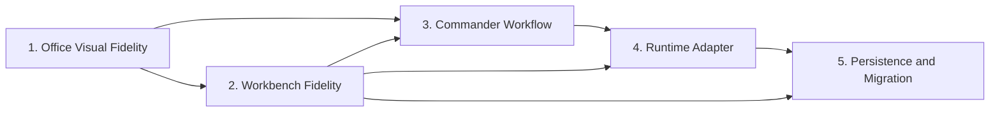

# 3D Cyber Office Full Video Replication Roadmap

> **For agentic workers:** This roadmap decomposes the full requirement spec into implementation plans. Execute one plan at a time and keep the full spec as the product baseline.

**Source Spec:** `docs/superpowers/specs/2026-05-22-3d-cyber-office-full-video-replication-requirements.md`

**Goal:** Deliver a video-faithful 3D cyber office that progresses from a reliable offline demo into a local multi-agent mission control surface with a real runtime adapter.

**Architecture:** Keep the current Vite/R3F prototype as the video-fidelity shell while tightening boundaries around domain state, scene configuration, workbench modules, commander workflow, runtime adapters, and migration. Plans are ordered so visible office fidelity improves first, then workbench fidelity, then command/runtime features reuse the visual and domain seams instead of forcing a rewrite.

**Tech Stack:** React 18, TypeScript, Vite, React Three Fiber, Drei, Three.js, Zustand, localStorage persistence, future OpenClaw Runtime Adapter.

---

## 1. Why This Is Split

The full requirements spec covers five independent but connected products slices:

1. A 3D office experience.
2. A workbench with calendar, task, file, cron, gateway, review, and rest surfaces.
3. A lobster commander workflow for multi-agent work.
4. A runtime adapter boundary for real agent events.
5. Local persistence and migration.

Trying to execute all five in one implementation plan would produce a plan too large to test or review safely. Each plan below must leave the app in a useful state on its own.

## 2. Plan Order

| Order | Plan | Product Outcome | Main Risk Reduced |
| --- | --- | --- | --- |
| 1 | Office Visual Fidelity | First screen reads like a personalized AI office, not a sparse prototype | Video mismatch |
| 2 | Workbench Fidelity | Video's calendar, tasks, files, cron, gateway, review, and rest surfaces become real UI modules | Missing back-half features |
| 3 | Commander Workflow | User can create a goal, see a task graph, assign worker roles, and inspect approvals/artifacts in demo mode | No lobster command loop |
| 4 | Runtime Adapter | Demo and real runtime events share one office event boundary; OpenClaw protocol decisions are isolated | Runtime lock-in |
| 5 | Persistence and Migration | Exportable UI state, documented runtime boundaries, and cross-device verification steps exist | Hard-to-move setup |

## 3. Plan Boundaries

### 3.1 Office Visual Fidelity

Owns:

- Scene layout configuration.
- Named office zones.
- Commander desk and visual hierarchy.
- Workstation density and environmental props.
- Agent status rendering and desk state cues.
- Camera framing and visual QA.

Does not own:

- Real runtime connections.
- New workbench data models beyond scene metadata needed for visuals.
- Commander chat behavior.

### 3.2 Workbench Fidelity

Owns:

- Navigation additions for Tasks and Rest/Fun.
- Calendar/Plan expansion.
- Files tree and preview shell.
- Cron runs summary.
- Gateway diagnostic states.
- Review linking surfaces.
- Dashboard test fixtures and persistence.

Does not own:

- Gateway protocol client.
- Multi-agent planning workflow.

### 3.3 Commander Workflow

Owns:

- Commander input surface.
- Goal, task graph, worker assignment, approval, artifact demo models.
- Demo scenarios that show research, build, review, and blocked branches.
- Office and details-panel linkage for commander states.

Does not own:

- Real runtime protocol.
- File system adapters beyond artifact metadata.

### 3.4 Runtime Adapter

Owns:

- Office runtime event contract.
- Demo adapter and real adapter boundary.
- OpenClaw v4 investigation output and first connected data slice.
- Runtime diagnostics and mode separation.

Does not own:

- Scene restyling.
- Dashboard visual redesign.

### 3.5 Persistence and Migration

Owns:

- Export/import boundary for UI and local dashboard data.
- Secret-safe migration guide.
- Restore verification checklist.
- Data provenance labels across local vs runtime state.

Does not own:

- Runtime secret export.
- Remote multi-user sync.

## 4. Cross-Plan Dependencies

## 5. Coverage Map

| Requirement Area | Primary Plan | Supporting Plan |
| --- | --- | --- |
| SCN / CAM / named zones | Office Visual Fidelity | Commander Workflow |
| Calendar / Tasks / Logs / Files / Cron / Gateway / Review / Rest | Workbench Fidelity | Runtime Adapter |
| Commander / Worker Registry / Approval / Artifact | Commander Workflow | Runtime Adapter |
| Demo vs runtime mode | Runtime Adapter | Commander Workflow |
| Export and migration | Persistence and Migration | Workbench Fidelity |
| Device optimization and QA | Office Visual Fidelity | Runtime Adapter |

## 6. Global Verification Expectations

Every plan should:

1. Run `npm run build` before completion.
2. Use focused UI/browser verification for user-visible React/R3F changes.
3. Keep Demo mode runnable even when real runtime work is not complete.
4. Preserve selection context across Office and workbench modules where the current app already supports it.
5. Keep secrets and runtime-owned state out of ordinary frontend persistence.

## 7. Immediate Next Plan

Execute:

`docs/superpowers/plans/2026-05-22-office-visual-fidelity.md`

This is the fastest route to make the current prototype look materially closer to the reference video while leaving stable seams for later workbench and runtime plans.

