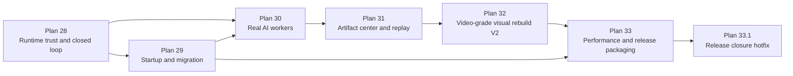

# Plans 28-33 Runtime Productization Roadmap

> **For agentic workers:** This roadmap aligns Plans 28-33 with the original full video replication roadmap. Treat it as the current execution spine after Plans 01-27. Write one detailed implementation plan per numbered plan before editing code.

**Goal:** Turn the current 3D cyber office from a visually interesting prototype with many working pieces into a usable local AI mission-control product.

**Architecture:** Plans 28-33 deliberately separate runtime trust, startup/migration, real AI work, artifact history, visual rebuild, and release packaging. This prevents visual work from blocking practical usability, and prevents runtime/product hardening from being mixed into another art-direction reset.

**Tech Stack:** React 18, TypeScript, Vite, React Three Fiber, Three.js, Zustand, localStorage, Node ESM local runtime, HTTP/SSE, safe tool execution, future model-provider runtime configuration.

---

## 1. Current Position

The project has already moved beyond the original five-plan skeleton.

Completed or mostly implemented foundations include:

- 3D office shell and multiple visual iterations.
- Workbench modules: calendar, tasks, logs, files, cron, gateway, review, rest, migration.
- Commander mission UI: composer, task graph, worker roster, approvals, artifacts, summary.
- Demo and guided-demo flows.
- Runtime adapter boundary.
- Local runtime MVP.
- Model planner abstraction.
- Safe tool execution.
- Multi-agent closed-loop runtime engine.
- Migration docs and localStorage export/import.

The remaining gap is no longer "does the screen have enough modules?" The gap is:

1. Can a normal user start it without confusion?
2. Can the user trust that the browser is connected to the right runtime?
3. Can the lobster Commander actually run a visible approval loop?
4. Can each mission leave behind useful artifacts and history?
5. Can the scene look better after the practical loop is stable?
6. Can the project be packaged and moved cleanly?

Plans 28-33 answer those questions in order.

---

## 2. Plan Sequence

| Plan | Name | Primary Outcome | Why It Comes Here |
| --- | --- | --- | --- |
| 28 | Runtime Usability and Closed-Loop Hardening | Browser connects to the correct runtime, default mission shows approval, approval resumes work, completion becomes Commander summary | Fixes trust and flow before adding more capability |
| 29 | Startup and Migration Experience | User can start frontend/runtime, change ports, recover from stale processes, and migrate between Windows/mac with fewer manual steps | Removes setup friction before real workers increase complexity |
| 30 | Real AI Worker Capability | Researcher/Builder/Reviewer use real project context and approved tools to produce useful work, not just mock artifacts | Converts the loop from demo-like to practically useful |
| 31 | Artifact Center and Mission Replay | Missions, approvals, logs, tool calls, and artifacts become browsable history | Prevents real work from becoming untraceable |
| 32 | Video-Grade Visual Rebuild V2 | Rebuild office/avatar/lobster aesthetics with the now-stable product workflow as the anchor | Avoids redoing visuals before core flows settle |
| 33 | Performance and Release Packaging | Reduce bundle pain, clean chunks, add production smoke checks, prepare cross-platform release shape | Makes the app shippable after functionality and visuals are stable |

---

## 3. Alignment With Original Full Roadmap

The original `00-full-video-replication-roadmap.md` split the product into five slices:

1. Office Visual Fidelity.
2. Workbench Fidelity.
3. Commander Workflow.
4. Runtime Adapter.
5. Persistence and Migration.

Plans 28-33 are the continuation layer on top of those slices.

| Original Slice | What Exists Now | Remaining Gap | Covered By |
| --- | --- | --- | --- |
| Office Visual Fidelity | Multiple R3F scene versions, camera QA scripts, video-frame layout attempts | Scene and characters still do not consistently feel like the reference video | Plan 32 |
| Workbench Fidelity | Calendar/tasks/logs/files/cron/gateway/review/rest/migration modules exist | Workbench is broad but needs tighter user flows around runtime/artifacts/history | Plans 29, 31 |
| Commander Workflow | Composer, mission graph, worker roster, approval inbox, artifact rail, summary exist | Default runtime path must show the complete approval loop and summary | Plans 28, 30 |
| Runtime Adapter | Local runtime, SSE events, safe tools, model planner, mission engine exist | User cannot yet easily detect stale runtime, configure endpoint, or trust runtime health | Plans 28, 29 |
| Persistence and Migration | Browser migration docs and localStorage bundle exist | Runtime artifacts, startup steps, and cross-platform runtime setup need better packaging | Plans 29, 31, 33 |

---

## 4. Alignment With Product Versions

The full requirements defined product layers from V0 to V3. Plans 28-33 move the project through the practical middle.

| Product Version | Definition | Current State | Plan Contribution |
| --- | --- | --- | --- |
| V0 Demo | Offline demo can show the video concept | Mostly achieved through demo, guided demo, workbench modules, and visual attempts | Plan 32 improves perceived fidelity |
| V1 Local Mission Control | Local runtime can start traceable work from Commander | Partially achieved by Plans 24-27, but setup/trust issues remain | Plans 28-31 complete V1 |
| V2 Runtime Connected | Real runtime events and tool approvals drive the office | Early local runtime exists, but real worker usefulness is limited | Plan 30 starts V2 capability |
| V3 Personalized Office | Mature personal office with migration, memory, custom roles, polished visuals | Not current scope | Plans 34+ later backlog |

Practical target for the current phase:

- After Plan 28: local runtime loop is trustworthy.
- After Plan 29: user can start and move the app without hand-holding.
- After Plan 30: workers produce useful project-aware outputs.
- After Plan 31: outputs are not lost in logs.
- After Plan 32: visual direction gets a serious second pass.
- After Plan 33: the app is closer to a releaseable local MVP.

---

## 5. Dependency Graph

Reasoning:

- Plan 28 must come first because stale runtime and summary-as-error issues make later tests unreliable.
- Plan 29 comes before real workers because real workers increase setup and migration complexity.
- Plan 30 comes before mission replay because replay should preserve useful real outputs, not only mock events.
- Plan 31 comes before visual rebuild because visual states should be driven by stable mission history and artifacts.
- Plan 33 comes last because packaging should reflect the final near-MVP shape.

---

## 6. Plan 28 Summary

**Document:** `docs/superpowers/plans/28-runtime-usability-and-closed-loop-hardening.md`

**Primary goal:** Make the local runtime flow usable and trustworthy.

**Must deliver:**

- Runtime health identity with `buildId`, `pid`, `startedAt`, planner metadata, and active mission count.
- Gateway endpoint editor and health check.
- Stale runtime warning.
- Default mission path that triggers approval.
- Approval resumes mission after user decision.
- Completion emits a Commander summary, not `runtime.adapter_error`.
- Runtime artifacts ignored by git through `.local-runtime/`.
- Dead `scheduleMissionEvents` code removed.
- `npm.cmd run runtime:e2e` or equivalent automated end-to-end flow.

**Acceptance gate:**

- `npm.cmd run runtime:test`
- `npm.cmd run test`
- `npm.cmd run build`
- `npm.cmd run runtime:e2e`
- Manual Gateway/Commander browser flow passes.

---

## 7. Plan 29 Outline: Startup and Migration Experience

**Detailed plan:** `docs/superpowers/plans/29-startup-and-migration-experience.md`

**Primary goal:** Make the app easy to start, recover, and move across machines.

**Problem to solve:**

Today the user has to remember:

- Which folder to `cd` into.
- Which command starts Vite.
- Which command starts runtime.
- What to do when port `8765` is occupied.
- Which files are state vs generated artifacts vs secrets.
- How Windows and macOS differ.

**Likely files:**

- Create: `scripts/dev/start-all.ps1`
- Create: `scripts/dev/start-all.mjs`
- Create: `scripts/dev/check-ports.mjs`
- Create: `scripts/dev/doctor.mjs`
- Modify: `package.json`
- Modify: `docs/migration/README.md`
- Modify: `docs/migration/windows-to-windows.md`
- Modify: `docs/migration/windows-to-mac.md`
- Modify: `docs/runtime/local-runtime-mvp.md`
- Create: `docs/setup/local-startup-guide.md`

**Feature requirements:**

- `npm.cmd run dev:all` starts frontend and runtime together.
- `npm.cmd run doctor` checks Node version, installed deps, Vite port, runtime port, stale runtime health, and `.env` safety.
- User can choose a runtime port through environment variable or script prompt.
- Docs explain which state is browser-local and which state is runtime-local.
- Docs explicitly say API keys are not migrated.
- Startup guide includes Windows PowerShell and macOS terminal variants.

**Acceptance gate:**

- Fresh terminal can run one command to start both app pieces.
- Port conflict produces a clear explanation.
- Migration docs match actual runtime data directories.
- No secrets are written to docs, migration bundles, or browser localStorage.

---

## 8. Plan 30 Outline: Real AI Worker Capability

**Detailed plan:** `docs/superpowers/plans/30-real-ai-worker-capability.md`

**Primary goal:** Make Researcher, Builder, and Reviewer produce useful project-aware outputs through the local runtime boundary.

**Problem to solve:**

The current local runtime has the right shape, but much of the worker output is deterministic or generic. Users need the workers to actually inspect project files, summarize findings, propose changes, and run approved checks.

**Likely files:**

- Modify: `scripts/local-runtime/workerEngine.mjs`
- Modify: `scripts/local-runtime/workerPrompts.mjs`
- Modify: `scripts/local-runtime/modelPlanner.mjs`
- Modify: `scripts/local-runtime/toolRegistry.mjs`
- Create: `scripts/local-runtime/contextPack.mjs`
- Create: `scripts/local-runtime/contextPack.test.mjs`
- Create: `scripts/local-runtime/workerOutputSchema.mjs`
- Create: `scripts/local-runtime/workerOutputSchema.test.mjs`
- Modify: `docs/runtime/model-planner-setup.md`
- Modify: `docs/runtime/multi-agent-loop.md`

**Feature requirements:**

- Research worker can search/read project files through safe tools.
- Builder worker can draft patch or write runtime artifact after approval.
- Reviewer worker can run allowlisted checks after approval.
- Worker outputs use a structured schema.
- Model provider failures fall back safely and visibly.
- Tool requests include reason, target, impact, and risk.
- No model key enters frontend code or migration bundle.

**Acceptance gate:**

- A real project question produces an artifact grounded in file context.
- A high-risk file write requires approval.
- A high-risk command requires approval.
- Reviewer can run allowlisted `npm.cmd run test` or `npm.cmd run build` only through approval.
- Runtime logs show which worker did what.

---

## 9. Plan 31 Outline: Artifact Center and Mission Replay

**Detailed plan:** `docs/superpowers/plans/31-artifact-center-and-mission-replay.md`

**Primary goal:** Make completed work inspectable after the moment has passed.

**Problem to solve:**

If agents start doing real work, logs alone are not enough. Users need a durable way to browse missions, approvals, tool calls, outputs, and summaries.

**Likely files:**

- Create: `scripts/local-runtime/missionJournal.mjs`
- Create: `scripts/local-runtime/missionJournal.test.mjs`
- Modify: `scripts/local-runtime/server.mjs`
- Modify: `src/store/commanderStore.ts`
- Modify: `src/ui/commander/ArtifactRail.tsx`
- Modify: `src/ui/commander/MissionSummary.tsx`
- Modify: `src/ui/dashboard/FilesView.tsx`
- Modify: `src/ui/dashboard/LogsView.tsx`
- Create: `src/ui/dashboard/MissionHistoryView.tsx`
- Modify: `src/ui/Navigation.tsx`
- Modify: `docs/runtime/multi-agent-loop.md`

**Feature requirements:**

- Runtime stores mission journal under `.local-runtime/missions/`.
- Browser can list past missions.
- User can open a mission and see:
  - task graph
  - approvals
  - tool calls
  - artifacts
  - summary
  - timestamps
- Mission replay is read-only by default.
- Artifacts can be opened from Files and Commander.
- Failed or blocked missions remain visible.

**Acceptance gate:**

- Complete two missions, refresh browser, and inspect both.
- Approvals and artifacts remain linked to the correct mission.
- Mission replay does not accidentally rerun tools.
- Runtime journal does not include secrets.

---

## 10. Plan 32 Outline: Video-Grade Visual Rebuild V2

**Detailed plan:** `docs/superpowers/plans/32-video-grade-visual-rebuild-v2.md`

**Primary goal:** Rebuild the office, lobster, and workers around the stable mission workflow so the first impression feels closer to the reference video.

**Problem to solve:**

Previous visual attempts improved structure, but user feedback remains clear: the office still feels too plain or awkward, and characters do not match the video-level expectation. Visual work should resume after runtime and mission flows stop shifting.

**Likely files:**

- Modify: `src/scene/VideoFrameOffice.tsx`
- Modify: `src/scene/VideoFrameAvatar.tsx`
- Modify: `src/scene/VideoFrameAgentLayer.tsx`
- Modify: `src/scene/videoFrameReplicaSpec.ts`
- Modify: `src/scene/videoFrameReplicaSpec.test.ts`
- Modify: `src/scene/OfficeScene.tsx`
- Modify: `src/ui/office/StudioOfficeShell.tsx`
- Modify: `src/index.css`
- Create: `docs/qa/video-grade-visual-v2-checklist.md`

**Feature requirements:**

- Office has clearer zones and more believable scale.
- Lobster Commander reads as intentional, not a placeholder.
- Workers read as friendly assistant characters, not strange humanoids.
- Scene has enough detail without clutter.
- UI overlays do not hide the main office on mobile.
- Visual state reflects real mission lifecycle from Plans 28-31.
- Keep Low/Normal/Show or equivalent performance modes.

**Acceptance gate:**

- Desktop first screen shows the office, Commander, and workers clearly.
- Mobile first screen does not hide the core scene behind panels.
- User can identify Commander and at least three workers without reading labels.
- Runtime states visually change desks/characters.
- Screenshots are attached to QA doc.

---

## 11. Plan 33 Outline: Performance and Release Packaging

**Detailed plan:** `docs/superpowers/plans/33-performance-and-release-packaging.md`

**Primary goal:** Prepare the project for repeatable local release and stable performance.

**Problem to solve:**

The build succeeds, but `vendor-3d` is large and chunk warnings remain. Startup and release need a stable shape before sharing or migrating broadly.

**Likely files:**

- Modify: `vite.config.ts`
- Modify: `package.json`
- Create: `scripts/release/smoke.mjs`
- Create: `scripts/release/package-local.mjs`
- Create: `docs/qa/release-smoke-checklist.md`
- Modify: `docs/qa/performance-notes.md`
- Modify: `docs/qa/release-readiness-checklist.md`

**Feature requirements:**

- Reduce circular chunk warning between commander/runtime.
- Keep route-level chunks sensible.
- Document bundle size budget.
- Add production preview smoke script.
- Add release checklist for Windows/mac.
- Confirm startup scripts from Plan 29 work against production build.
- Keep runtime and frontend separately understandable.

**Acceptance gate:**

- `npm.cmd run build` passes.
- Production preview opens.
- Runtime E2E still passes.
- Bundle warnings are either fixed or documented with accepted budget.
- Release checklist gives exact Windows/mac commands.

---

## 11.1 Plan 33.1 Outline: Release Closure Hotfix

**Detailed plan:** `docs/superpowers/plans/33.1-release-closure-hotfix.md`

**Primary goal:** Close the remaining Plan 33 release blockers before calling the local MVP release complete.

**Problem to solve:**

Plan 33 passed local build, package, smoke, runtime, and browser checks, but release closure is not complete because GitHub push failed and repeated `build:metrics` in a temporary clone can dirty `docs/qa/build-metrics.json`.

**Feature requirements:**

- Make `build-metrics.json` deterministic by removing wall-clock timestamps and normalizing Vite hash filenames.
- Add release metrics tests for hash stability.
- Update clean-clone instructions to install dependencies before tests.
- Complete GitHub push or report exact branch/commit/auth blocker.
- Re-run release gate after the hotfix.

**Acceptance gate:**

- `npm.cmd run release:test` passes.
- `npm.cmd run build:metrics` can run twice without dirtying `docs/qa/build-metrics.json`.
- `npm.cmd run runtime:e2e` passes.
- `npm.cmd run release:smoke` passes.
- GitHub push succeeds, or the only remaining blocker is reported with branch and commit SHA.

---

## 12. Cut Line: What Not To Pull Into Plans 28-33

Do not add these into the current MVP phase:

- Team accounts.
- Cloud sync.
- Plugin marketplace.
- Voice control.
- Mobile app.
- Enterprise chat integrations.
- Autonomous background agents that run without user review.
- Full Electron/Tauri desktop app.

Those belong to Plans 34+ after the local MVP proves useful.

---

## 13. Overall Acceptance For Plans 28-33

After Plan 33, the project should satisfy this user story:

> I can open the 3D cyber office, start its local runtime, give the lobster Commander a real project task, watch workers split the work, approve risky actions, inspect generated artifacts, replay what happened later, and move the setup to another machine without losing the plot.

Concrete checks:

- [ ] Startup is documented and has helper scripts.
- [ ] Runtime endpoint and stale process status are visible.
- [ ] Default mission shows approval.
- [ ] Approval resumes work.
- [ ] Mission completion shows a success summary.
- [ ] Real workers can inspect files through safe tools.
- [ ] Artifact and mission history are inspectable after refresh.
- [ ] Visual layout is coherent enough for a user demo.
- [ ] Production build and runtime E2E pass.
- [ ] Migration docs match actual data boundaries.

---

## 14. Execution Recommendation

Execute in strict order:

1. Finish Plan 28.
2. Write and execute detailed Plan 29.
3. Write and execute detailed Plan 30.
4. Write and execute detailed Plan 31.
5. Write and execute detailed Plan 32.
6. Write and execute detailed Plan 33.

Plans 29-33.1 now have detailed implementation documents. Treat this roadmap as the execution record for the local MVP hardening phase; later Plans 34+ should start from the final Plan 33.1 verification report.
