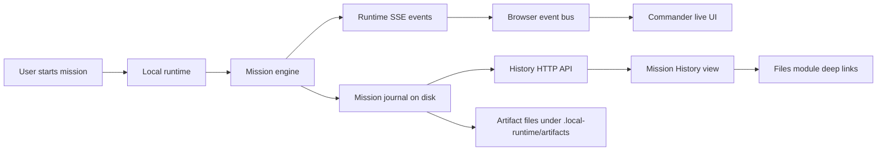

# Plan 31 - Artifact Center and Mission Replay

> Status: Ready for implementation  
> Depends on: Plan 30 accepted  
> Primary owner: implementation agent  
> Product target: after one real runtime mission finishes, the user can refresh the browser or come back later and still inspect what the Commander asked for, which workers acted, which approvals were requested, which tools ran, what artifacts were produced, and why the final result should be trusted.

---

## 1. Why This Plan Exists

Plan 30 made the local runtime capable of useful project-aware work. That changes the product bar.

Before Plan 30, a mission could be treated like a live demo. After Plan 30, a mission is real work. Real work needs a paper trail:

- The user needs to know what happened without watching the screen the whole time.
- The user needs to find the produced artifact again.
- The user needs to see whether a risky action was approved, rejected, or skipped.
- The user needs to distinguish runtime-generated results from demo data.
- The app needs to feel less like a streaming log and more like a small local mission-control system.

Plan 31 turns runtime activity into durable mission history and adds a read-only replay surface in the workbench.

---

## 2. Product Definition

### 2.1 User Story

As a user, I start a mission from the lobster Commander:

1. The Commander plans research, build, and review steps.
2. Workers create artifacts and request approval when needed.
3. I approve or reject risky steps.
4. The mission completes.
5. I refresh the browser or switch modules.
6. I open History and can still see:
   - mission goal,
   - mission status,
   - worker timeline,
   - approval decisions,
   - tool calls,
   - artifact list,
   - final summary,
   - artifact preview or file path.

### 2.2 Acceptance Feeling

The feature passes only if a picky first-time user can answer these questions without reading code:

- "What did I ask the AI office to do?"
- "Which AI worker produced this artifact?"
- "Was anything risky approved?"
- "Where is the actual output file?"
- "Did this mission finish successfully or stop halfway?"
- "Can I reopen this later without rerunning tools?"

### 2.3 Non-Goals

Do not mix these into Plan 31:

- No visual office/avatar redesign. That is Plan 32.
- No cloud sync.
- No multi-user accounts.
- No artifact editor.
- No replay that re-executes tools or mutates files.
- No migration format rewrite beyond documenting the new runtime history directory.

Replay in this plan is read-only reconstruction from recorded events.

---

## 3. Current State From Plan 30

Plan 30 validation says:

- `runtime:test` passes.
- `runtime:e2e` passes.
- The flow works: create mission -> read workspace context -> research artifact -> builder approval -> tool called -> review -> mission completed.
- There are no new P0/P1/P2 issues.

Relevant current files:

- Runtime server: `scripts/local-runtime/server.mjs`
- Runtime mission engine: `scripts/local-runtime/missionEngine.mjs`
- Runtime artifact writer: `scripts/local-runtime/artifactStore.mjs`
- Runtime worker engine: `scripts/local-runtime/workerEngine.mjs`
- Frontend runtime adapter: `src/runtime/localRuntimeAdapter.ts`
- Commander store: `src/store/commanderStore.ts`
- Commander artifact UI: `src/ui/commander/ArtifactRail.tsx`
- Commander summary UI: `src/ui/commander/MissionSummary.tsx`
- Workbench shell: `src/ui/AppShell.tsx`
- Navigation labels: `src/i18n/zh.ts`

Current gap:

- Runtime missions are mostly in memory while the server is running.
- Browser state sees live events but does not have a clean history browser.
- Runtime artifact metadata is not projected richly enough into Commander and Files.
- The user cannot browse a completed mission as a durable record.

---

## 4. Target Architecture

### 4.1 Data Flow



### 4.2 Runtime Storage Layout

Use the existing ignored runtime folder:

```text
.local-runtime/
  artifacts/
    <artifact-file>.md
  missions/
    index.json
    <missionId>/
      mission.json
      events.jsonl
      artifacts.json
```

Rules:

- `.local-runtime/` remains gitignored.
- `mission.json` is the latest snapshot.
- `events.jsonl` is append-only and ordered by occurrence.
- `artifacts.json` contains artifact metadata, not duplicated full content.
- Artifact content stays in `.local-runtime/artifacts/*.md`.
- Secrets and raw context file contents must not be written into the journal.

---

## 5. Detailed Implementation Tasks

## Task 1 - Add Runtime Mission Journal

### Files

Create:

- `scripts/local-runtime/missionJournal.mjs`
- `scripts/local-runtime/missionJournal.test.mjs`

### Public API

Implement a small ESM module:

```js
export function createMissionJournal(options = {}) {
  return {
    appendEvent,
    writeMissionSnapshot,
    recordArtifact,
    listMissions,
    readMission,
    readMissionEvents,
    listMissionArtifacts,
    readArtifactContent,
  };
}
```

Expected options:

```js
{
  workspaceRoot: process.cwd(),
  now: () => new Date().toISOString()
}
```

### Required Behavior

`appendEvent(message)`:

- Accepts runtime messages in the same shape emitted by `broadcast()`.
- Requires `message.missionId` for mission-specific events.
- Ignores heartbeat events with no mission id.
- Writes one sanitized JSON object per line to:
  - `.local-runtime/missions/<missionId>/events.jsonl`
- Creates directories as needed.
- Preserves event order for events emitted by the same process.
- Must not throw into the runtime broadcast path. The caller can log journal failures, but the runtime must keep running.

`writeMissionSnapshot(snapshot)`:

- Writes the latest mission snapshot to:
  - `.local-runtime/missions/<missionId>/mission.json`
- Uses atomic write:
  - write `<file>.tmp`
  - rename to final file
- Updates `.local-runtime/missions/index.json` with:
  - `missionId`
  - `title`
  - `status`
  - `createdAt`
  - `updatedAt`
  - `taskCount`
  - `completedTaskCount`
  - `artifactCount`
  - `approvalCount`

`recordArtifact(artifact)`:

- Appends or upserts metadata in:
  - `.local-runtime/missions/<missionId>/artifacts.json`
- Stores:
  - `artifactId`
  - `missionId`
  - `missionTaskId`
  - `title`
  - `kind`
  - `path`
  - `summary`
  - `createdByWorkerId`
  - `createdAt`
  - `workspaceBacked`
  - `previewable`
- Does not duplicate artifact content.

`listMissions({ limit = 50 } = {})`:

- Reads `index.json` when present.
- Falls back to scanning mission directories when `index.json` is missing or invalid.
- Sorts by `updatedAt` descending.
- Returns no more than `limit`.

`readMission(missionId)`:

- Validates `missionId` with a strict safe-id function.
- Reads the corresponding `mission.json`.
- Returns `null` when not found.

`readMissionEvents(missionId, { limit = 500 } = {})`:

- Reads JSONL.
- Skips malformed lines instead of crashing.
- Returns events in file order.
- Caps returned events.

`readArtifactContent(missionId, artifactId)`:

- Looks up the artifact in `artifacts.json`.
- Allows reading only paths under `.local-runtime/artifacts`.
- Reads UTF-8 markdown/text only.
- Caps content at 500 KB.
- Returns `{ artifact, content, truncated }`.

### Sanitization Rules

Create `sanitizeJournalValue(value)` inside `missionJournal.mjs`.

It must:

- Redact keys containing:
  - `apiKey`
  - `token`
  - `secret`
  - `password`
  - `authorization`
  - `cookie`
  - `credential`
- Replace raw file content fields with a placeholder:
  - `content`
  - `fileContent`
  - `prompt`
  - `rawPrompt`
- Keep short summaries, titles, ids, paths, status, and risk fields.
- Cap generic strings at 12,000 characters.
- Cap `stdout` and `stderr` fields at the last 4,000 characters.
- Stop recursion after depth 8.
- Convert unsupported values to strings.

Important: artifact content is read through `readArtifactContent()`, not stored inside event payloads.

### Tests

`missionJournal.test.mjs` must cover:

1. Creates mission directory and appends events.
2. Writes and reads mission snapshot.
3. Updates `index.json`.
4. Lists missions newest first.
5. Redacts secret-like keys.
6. Redacts raw `content` and `prompt` fields.
7. Keeps useful fields such as `title`, `summary`, `path`, `risk`, `approvalId`.
8. Reads artifact content only from `.local-runtime/artifacts`.
9. Rejects unsafe mission ids and unsafe artifact paths.
10. Skips malformed JSONL lines.

Run focused test:

```powershell
node --test scripts/local-runtime/missionJournal.test.mjs
```

---

## Task 2 - Wire Journal Into Runtime Broadcast and Mission Engine

### Files

Modify:

- `scripts/local-runtime/server.mjs`
- `scripts/local-runtime/missionEngine.mjs`
- `scripts/local-runtime/missionEngine.test.mjs` if it exists
- `scripts/local-runtime/workerCapability.test.mjs`
- `scripts/local-runtime/e2e-user-flow.mjs`

### Server Changes

In `server.mjs`:

1. Import the journal:

```js
import { createMissionJournal } from './missionJournal.mjs';
```

2. Create it near other runtime singletons:

```js
const missionJournal = createMissionJournal({ workspaceRoot: process.cwd() });
```

3. Wrap `broadcast()` so every mission-specific message is journaled:

```js
function broadcast(type, partial) {
  const message = {
    runtimeEventId: partial.runtimeEventId,
    protocol: PROTOCOL,
    version: VERSION,
    type,
    occurredAt: partial.occurredAt || now(),
    workerId: partial.workerId ?? null,
    taskId: partial.taskId ?? null,
    missionId: partial.missionId ?? null,
    payload: partial.payload || {},
  };

  void missionJournal.appendEvent(message).catch((error) => {
    console.error('[local-runtime] mission journal append failed:', error);
  });

  for (const client of clients) sendSse(client, message);
  return message;
}
```

4. Pass a snapshot hook into the mission engine:

```js
const missionEngine = createMissionEngine({
  workspaceRoot: process.cwd(),
  emit: broadcast,
  env: runtimeEnv,
  onMissionSnapshot: (snapshot) => {
    void missionJournal.writeMissionSnapshot(snapshot).catch((error) => {
      console.error('[local-runtime] mission journal snapshot failed:', error);
    });
  },
  onArtifactCreated: (artifact) => {
    void missionJournal.recordArtifact(artifact).catch((error) => {
      console.error('[local-runtime] mission journal artifact failed:', error);
    });
  },
});
```

### Mission Engine Changes

In `missionEngine.mjs`:

1. Accept optional callbacks:

```js
const onMissionSnapshot =
  typeof options.onMissionSnapshot === 'function' ? options.onMissionSnapshot : null;
const onArtifactCreated =
  typeof options.onArtifactCreated === 'function' ? options.onArtifactCreated : null;
```

2. Add helper:

```js
function notifyMissionSnapshot(state) {
  if (!onMissionSnapshot) return;
  onMissionSnapshot(state.snapshot());
}
```

3. Call `notifyMissionSnapshot(state)` after every meaningful mutation:

- after `missions.set(plan.missionId, state)`
- after task status becomes `running`
- after task status becomes `waiting_input`
- after artifact is added to a task
- after task status becomes `completed`
- after rejected approval marks task blocked
- after approved tool completes
- after `emitSummaryIfCompleted(state)`

4. Call `onArtifactCreated(artifactRecord)` after `artifactRecords.set(...)`.

### Acceptance

After a runtime mission:

- `.local-runtime/missions/<missionId>/mission.json` exists.
- `.local-runtime/missions/<missionId>/events.jsonl` exists.
- `.local-runtime/missions/<missionId>/artifacts.json` exists when artifacts were created.
- `mission.json` shows the latest task statuses.
- Journal failures do not crash the server.

---

## Task 3 - Add Runtime History HTTP API

### Files

Modify:

- `scripts/local-runtime/server.mjs`
- `scripts/local-runtime/e2e-user-flow.mjs`

### Endpoints

Add these routes before the existing `GET /missions/:id` route.

#### `GET /missions`

Response:

```json
{
  "ok": true,
  "missions": [
    {
      "missionId": "mission-local-123",
      "title": "Improve runtime usability",
      "status": "completed",
      "createdAt": "2026-05-26T00:00:00.000Z",
      "updatedAt": "2026-05-26T00:05:00.000Z",
      "taskCount": 3,
      "completedTaskCount": 3,
      "artifactCount": 2,
      "approvalCount": 1
    }
  ]
}
```

Rules:

- Include active missions even if the journal index is slightly behind.
- Deduplicate by `missionId`.
- Active in-memory mission wins over journal index for status counts.
- Sort by `updatedAt` descending.

#### `GET /missions/:missionId`

Extend the existing route:

- First return active in-memory mission when present.
- If not active, return journal mission snapshot.
- If neither exists, return 404.

Response stays:

```json
{ "ok": true, "mission": {} }
```

#### `GET /missions/:missionId/events`

Response:

```json
{
  "ok": true,
  "missionId": "mission-local-123",
  "events": []
}
```

Rules:

- Read from journal only.
- Support optional `limit` query parameter.
- Default limit 500.
- Maximum limit 1000.

#### `GET /missions/:missionId/artifacts`

Response:

```json
{
  "ok": true,
  "missionId": "mission-local-123",
  "artifacts": []
}
```

Rules:

- Return metadata only.
- Do not include full file content.

#### `GET /missions/:missionId/artifacts/:artifactId`

Response:

```json
{
  "ok": true,
  "artifact": {},
  "content": "# Artifact markdown",
  "truncated": false
}
```

Rules:

- Read only artifacts recorded for that mission.
- Enforce `.local-runtime/artifacts` boundary.
- Return 404 when the artifact is unknown.
- Return 400 when path is unsafe.

### E2E Additions

Update `scripts/local-runtime/e2e-user-flow.mjs` so the Plan 30 flow also checks:

1. `GET /missions` includes the completed mission.
2. `GET /missions/:id` returns completed snapshot.
3. `GET /missions/:id/events` includes:
   - `runtime.task_created`
   - `runtime.approval_requested`
   - `runtime.approval_resolved`
   - `runtime.tool_called`
   - `runtime.mission_completed`
4. `GET /missions/:id/artifacts` returns at least one artifact.
5. Artifact content endpoint returns non-empty markdown for previewable artifacts.
6. No response includes obvious secret strings from test inputs.

---

## Task 4 - Add Frontend Runtime History Client

### Files

Create:

- `src/runtime/localRuntimeHistory.ts`
- `src/runtime/localRuntimeHistory.test.ts`

### Types

Create frontend-safe types:

```ts
export interface RuntimeMissionListItem {
  missionId: string;
  title: string;
  status: string;
  createdAt: string;
  updatedAt: string;
  taskCount: number;
  completedTaskCount: number;
  artifactCount: number;
  approvalCount: number;
}

export interface RuntimeMissionArtifact {
  artifactId: string;
  missionId: string;
  missionTaskId: string;
  title: string;
  kind: string;
  path: string;
  summary: string;
  createdByWorkerId: string;
  createdAt: string;
  workspaceBacked: boolean;
  previewable: boolean;
}
```

### Functions

Implement:

```ts
export async function fetchRuntimeMissions(endpoint: string, fetcher = fetch): Promise<RuntimeMissionListItem[]>
export async function fetchRuntimeMission(endpoint: string, missionId: string, fetcher = fetch): Promise<unknown>
export async function fetchRuntimeMissionEvents(endpoint: string, missionId: string, fetcher = fetch): Promise<RuntimeRawMessage[]>
export async function fetchRuntimeMissionArtifacts(endpoint: string, missionId: string, fetcher = fetch): Promise<RuntimeMissionArtifact[]>
export async function fetchRuntimeArtifactContent(endpoint: string, missionId: string, artifactId: string, fetcher = fetch): Promise<{ artifact: RuntimeMissionArtifact; content: string; truncated: boolean }>
```

Rules:

- Reuse existing URL construction helper from `src/runtime/localRuntimeTesting.ts` if possible.
- Encode `missionId` and `artifactId`.
- Throw friendly `Error` objects with endpoint and status.
- Never leak raw Response objects into React state.
- Tests should use fake fetchers, not a real server.

### Tests

Cover:

1. Builds correct URLs.
2. Encodes ids safely.
3. Parses mission list.
4. Parses events.
5. Parses artifact content.
6. Throws on non-200.
7. Throws on `{ ok: false }`.

---

## Task 5 - Add Mission History Pure Helpers

### Files

Create:

- `src/ui/dashboard/missionHistoryTesting.ts`
- `src/ui/dashboard/missionHistoryTesting.test.ts`

### Helpers

Implement pure functions used by the UI:

```ts
export function sortMissionsByUpdatedAt(missions: RuntimeMissionListItem[]): RuntimeMissionListItem[]
export function filterMissions(missions: RuntimeMissionListItem[], query: string, status: string): RuntimeMissionListItem[]
export function deriveMissionHistoryStats(mission: RuntimeMissionListItem, events: RuntimeRawMessage[]): MissionHistoryStats
export function buildReplayRows(events: RuntimeRawMessage[]): MissionReplayRow[]
export function groupArtifactsByMissionTask(artifacts: RuntimeMissionArtifact[]): Record<string, RuntimeMissionArtifact[]>
```

`MissionReplayRow` should include:

- `id`
- `occurredAt`
- `kind`
- `title`
- `detail`
- `workerId`
- `taskId`
- `missionTaskId`
- `approvalId`
- `artifactId`
- `severity`

### Mapping Rules

Map runtime events into human-readable replay rows:

| Runtime Type | Replay Title | Severity |
| --- | --- | --- |
| `runtime.task_created` | Task created | info |
| `runtime.task_planned` | Task planned | info |
| `runtime.task_assigned` | Worker assigned | info |
| `runtime.task_started` | Worker started | info |
| `runtime.artifact_created` | Artifact created | success |
| `runtime.approval_requested` | Approval requested | warn |
| `runtime.approval_resolved` | Approval resolved | success or error |
| `runtime.tool_called` | Tool executed | info |
| `runtime.task_failed` | Task failed | error |
| `runtime.task_completed` | Task completed | success |
| `runtime.mission_completed` | Mission completed | success |

Use payload fields when present:

- `title`
- `summary`
- `message`
- `action`
- `risk`
- `target`
- `resultSummary`
- `outputSummary`
- `errorSummary`

### Tests

Cover:

1. Sorting by newest update.
2. Query filtering by title and mission id.
3. Status filtering.
4. Approval requested row includes risk and target.
5. Rejected approval row has error severity.
6. Artifact row carries artifact id.
7. Mission completed row includes summary.
8. Empty events produce empty replay rows.

---

## Task 6 - Build Mission History Workbench View

### Files

Create:

- `src/ui/dashboard/MissionHistoryView.tsx`

Modify:

- `src/ui/AppShell.tsx`
- `src/ui/Navigation.tsx`
- `src/i18n/zh.ts`
- `src/store/uiStore.ts`
- `src/index.css` if layout styles are needed

### Navigation

Add a new module:

- id: `history`
- full label: `历史`
- short label: `历史`
- recommended placement: after `files`, before `cronjobs`

Update:

- `ModuleId` union in `src/i18n/zh.ts`
- `moduleLabels`
- `moduleShortLabels`
- `Navigation` module list
- `AppShell` lazy route

### View Layout

Desktop layout:

```text
┌────────────────────────────────────────────────────────────┐
│ Header: History / endpoint / refresh / filters             │
├───────────────┬──────────────────────────────┬─────────────┤
│ Mission list  │ Replay timeline              │ Details     │
│               │                              │ Artifacts   │
│               │                              │ Approvals   │
└───────────────┴──────────────────────────────┴─────────────┘
```

Mobile layout:

```text
Header
Filters
Mission list
Selected mission summary
Replay timeline
Artifact list
```

No horizontal overflow at 390 px width.

### Required UI States

`MissionHistoryView` must handle:

1. Initial loading.
2. Runtime unavailable.
3. Empty history.
4. Mission selected.
5. Mission list refresh.
6. Events loading.
7. Artifact preview loading.
8. Artifact content unavailable.
9. Error with retry button.
10. Read-only replay banner.

### Interactions

Header:

- Shows runtime endpoint from `runtimeStore`.
- Shows runtime status.
- `刷新历史` button reloads mission list.
- Search input filters title and mission id.
- Status select filters all/running/waiting_input/blocked/failed/completed.

Mission list:

- Selecting a mission loads:
  - mission snapshot,
  - events,
  - artifacts.
- Mission cards show:
  - title,
  - status,
  - updated time,
  - completed task count,
  - artifact count,
  - approval count.

Replay timeline:

- Uses `buildReplayRows()`.
- Shows timestamp, worker, title, detail.
- Artifact rows have `查看产物`.
- Approval rows show risk badge and decision.
- Tool rows show tool name and result summary.
- Failed rows are visually distinct.

Details panel:

- Shows mission title and status.
- Shows final summary when available.
- Shows artifact list grouped by mission task.
- Shows approval count and latest approval decision.
- Shows a read-only notice:
  - `历史回放只展示记录，不会重新执行工具或修改文件。`

Artifact preview:

- Clicking an artifact loads content from:
  - `GET /missions/:missionId/artifacts/:artifactId`
- Render markdown/text inside a scrollable preformatted preview.
- Provide `打开文件中心` button:
  - sets selected artifact id in `dashboardStore`
  - switches active module to `files`
- Provide `复制路径` only if the browser Clipboard API is available.
- If Clipboard fails, show non-blocking inline feedback.

### Product Quality Requirements

- The view must not look like a raw JSON debugger.
- It should feel like a mission receipt.
- Use dense, readable information hierarchy.
- Do not hide important status behind hover-only UI.
- Avoid huge cards and decorative filler.
- On mobile, controls stack cleanly.
- Loading states must preserve layout shape.

---

## Task 7 - Improve Commander, Files, and Logs Projection

### Files

Modify:

- `src/store/commanderStore.ts`
- `src/ui/commander/ArtifactRail.tsx`
- `src/ui/commander/MissionSummary.tsx`
- `src/ui/dashboard/FilesView.tsx`
- `src/ui/dashboard/LogsView.tsx`
- Existing commander tests, or create focused projection tests if cleaner

### Commander Store

Update runtime artifact projection so `artifact.created` events no longer become generic demo artifacts.

Current bug to avoid:

- artifact summary defaults to `Created by the Commander Demo scenario.`
- kind defaults to `notes`
- worker defaults to `worker-research`
- `workspaceBacked` can be lost

Required projection fields:

```ts
{
  id: String(event.artifactId ?? event.payload.artifactId),
  missionId: event.missionId,
  missionTaskId: String(event.payload.missionTaskId ?? ''),
  title: String(event.payload.title ?? event.payload.artifactTitle ?? 'Runtime artifact'),
  kind: normalizedArtifactKind(event.payload.kind),
  summary: String(event.payload.summary ?? event.payload.outputSummary ?? ''),
  path: String(event.payload.path ?? ''),
  createdAt: event.occurredAt,
  createdByWorkerId: String(event.payload.createdByWorkerId ?? event.agentId ?? 'worker-runtime'),
  workspaceBacked: Boolean(event.payload.workspaceBacked ?? String(event.payload.path ?? '').startsWith('.local-runtime/')),
  previewable: Boolean(event.payload.previewable ?? true)
}
```

Add a tiny normalizer for artifact kind:

- allowed: `notes`, `patch`, `review`, `report`
- fallback: `notes`

### ArtifactRail

Show:

- artifact title,
- kind,
- worker,
- task link,
- path when `workspaceBacked` is true,
- previewable badge.

Replace generic demo copy with runtime-aware copy.

### MissionSummary

Add:

- `查看历史回放` button when a mission has an id.
- Button switches active module to `history`.

### FilesView

Ensure runtime artifacts can be found from:

- current Commander store artifacts,
- selected artifact id from `dashboardStore`,
- mission history when the artifact was selected from History.

Minimum acceptable behavior:

- If content is not loaded in Files, Files shows the artifact metadata and path.
- It must not silently show an empty panel.

### LogsView

For runtime rows:

- artifact rows should expose `查看产物`.
- mission rows should expose `查看历史`.
- approval rows should expose mission id and approval id when available.

### Tests

Add tests covering:

1. Runtime `artifact.created` preserves title/kind/path/worker.
2. Runtime artifact sets `workspaceBacked` when path is under `.local-runtime/`.
3. ArtifactRail receives previewable metadata.
4. MissionSummary history action switches to `history`.
5. Logs linked item handles mission history link without losing existing artifact/task links.

---

## Task 8 - Documentation and Migration Notes

### Files

Create:

- `docs/runtime/mission-history-and-replay.md`
- `docs/qa/plan31-artifact-replay-qa.md`

Modify:

- `docs/superpowers/plans/28-33-runtime-productization-roadmap.md`
- `docs/migration/README.md`
- `docs/migration/3d-cyber-office-data-migration.md`
- `docs/qa/release-readiness-checklist.md` if present

### Runtime Doc Content

`docs/runtime/mission-history-and-replay.md` must explain:

- What mission history stores.
- Where it is stored.
- What is intentionally not stored.
- How to clear local runtime history.
- How to move history to another machine.
- Why replay is read-only.
- How artifacts relate to `.local-runtime/artifacts`.
- How secret redaction works.

### QA Doc Content

`docs/qa/plan31-artifact-replay-qa.md` must include a table:

| Check | Desktop Result | Mobile Result | Notes |
| --- | --- | --- | --- |
| Start runtime mission |  |  |  |
| Approve builder request |  |  |  |
| Mission completes |  |  |  |
| History lists mission |  |  |  |
| Replay timeline ordered |  |  |  |
| Artifact preview opens |  |  |  |
| Files deep link works |  |  |  |
| Refresh keeps history |  |  |  |
| Runtime stopped state is graceful |  |  |  |
| 390 px layout has no horizontal overflow |  |  |  |

### Migration Notes

Update migration docs with:

- Browser state is still exported through the Migration module.
- Runtime mission history is file-system state under `.local-runtime/missions`.
- Runtime artifacts are under `.local-runtime/artifacts`.
- API keys and `.env` files are not migrated.
- To move runtime history:
  1. Stop runtime.
  2. Copy `.local-runtime/missions`.
  3. Copy `.local-runtime/artifacts`.
  4. Do not copy `.env`.
  5. Start runtime on target machine.
  6. Open History and refresh.

---

## Task 9 - Verification

### Automated Verification

Run these from project root:

```powershell
node --test scripts/local-runtime/missionJournal.test.mjs
npm.cmd run runtime:test
npm.cmd run runtime:e2e
npm.cmd run test
npm.cmd run build
npm.cmd run doctor
npm.cmd run check:ports
```

Expected:

- All tests pass.
- Build succeeds.
- Existing Vite chunk warning may remain and is not a Plan 31 blocker.
- Doctor may warn when runtime is intentionally stopped, but should not report new failures.

### Browser Verification

Start:

```powershell
npm.cmd run dev:all
```

Then verify desktop at about 1366 x 768:

1. Open app.
2. Switch runtime mode to local/connected if needed.
3. Start a real Commander mission.
4. Wait for approval request.
5. Approve builder request.
6. Wait for completion.
7. Open `历史`.
8. Confirm latest mission appears.
9. Open mission.
10. Confirm replay timeline includes planning, approval, tool call, artifacts, completion.
11. Open artifact preview.
12. Use `打开文件中心`.
13. Refresh browser.
14. Reopen `历史`.
15. Confirm the mission still appears.

Mobile at 390 x 844:

1. Open `历史`.
2. Search mission title.
3. Select mission.
4. Open artifact preview.
5. Confirm no horizontal overflow.
6. Confirm key buttons remain tappable.

Runtime stopped state:

1. Stop local runtime.
2. Refresh browser.
3. Open `历史`.
4. Confirm it shows a helpful runtime unavailable state, not a blank screen or console error.

### Console Verification

Browser console must not show:

- React hook errors.
- unhandled promise rejections.
- raw token/secret/API key strings.
- repeated fetch loops while runtime is down.

### File-System Verification

After a mission:

```powershell
Get-ChildItem -Recurse .local-runtime\missions
Get-ChildItem -Recurse .local-runtime\artifacts
```

Confirm:

- `mission.json` exists.
- `events.jsonl` exists.
- `artifacts.json` exists when artifacts were produced.
- artifact markdown exists.
- no `.env` or API key file was copied into mission history.

---

## 6. Risk Register

| Risk | Severity | Mitigation |
| --- | --- | --- |
| Journal async writes race and reorder events | P1 | Serialize writes per mission with a promise chain inside `missionJournal.mjs` |
| Runtime crashes if journal write fails | P0 | Never await journal writes in broadcast path; catch and log |
| Secrets leak into JSONL | P0 | Central sanitizer with tests for secret-like keys and raw content fields |
| Artifact endpoint reads arbitrary files | P0 | Resolve only paths recorded in `artifacts.json` and only under `.local-runtime/artifacts` |
| History UI becomes another noisy log wall | P1 | Use mission receipt layout, grouped artifacts, clear badges, search/filter |
| Browser fetches repeatedly when runtime is down | P1 | Manual refresh and explicit retry only; no aggressive polling |
| Existing `/missions/:id` route shadows `/missions/:id/events` | P1 | Register specific routes before generic mission route |
| Mobile view overflows | P2 | Add explicit 390 px browser QA and CSS wrapping |

---

## 7. Implementation Order

Do the work in this order:

1. Add `missionJournal.mjs` and tests.
2. Wire journal into `server.mjs` and `missionEngine.mjs`.
3. Add HTTP history endpoints.
4. Extend runtime e2e to assert history and artifact endpoints.
5. Add frontend runtime history client and tests.
6. Add mission history pure helpers and tests.
7. Add `history` module route and `MissionHistoryView`.
8. Improve Commander artifact projection.
9. Add Files/Logs deep links.
10. Update docs and migration notes.
11. Run automated verification.
12. Run browser QA and fill QA doc.

Do not start Task 6 UI work until Task 3 endpoints have a passing test path. Otherwise the UI will be built against guesses.

---

## 8. Done Criteria

Plan 31 is done only when all of these are true:

- Runtime mission history is durable under `.local-runtime/missions`.
- Runtime artifacts remain under `.local-runtime/artifacts`.
- `GET /missions` returns completed historical missions.
- `GET /missions/:id/events` returns replayable event history.
- `GET /missions/:id/artifacts/:artifactId` returns safe artifact preview content.
- Browser has a `历史` module.
- History view can load mission list, replay timeline, and artifact preview.
- MissionSummary can jump to History.
- ArtifactRail shows real runtime artifact metadata.
- Files/Logs deep links do not lose selection context.
- Refreshing browser does not lose completed runtime history while runtime is running.
- Stopping runtime produces a helpful unavailable state.
- Tests and build pass.
- Plan 31 QA doc is filled with actual results.

---

## 9. Handoff Report Template

When implementation and verification are complete, report back in this format:

```text
Plan 31 验收结果

1. 总结论
通过 / 不通过
是否可以进入下一个 Plan：可以 / 不可以

2. 自动验证
node --test scripts/local-runtime/missionJournal.test.mjs：通过/失败，数量
npm.cmd run runtime:test：通过/失败，数量
npm.cmd run runtime:e2e：通过/失败
npm.cmd run test：通过/失败，文件数/测试数
npm.cmd run build：通过/失败，warning 是否新增
npm.cmd run doctor：通过/失败，WARN 是否预期
npm.cmd run check:ports：通过/失败

3. 浏览器验收
前端 URL：
Runtime endpoint：
桌面流程走了哪些步骤：
移动端流程走了哪些步骤：
History 是否能看到 mission：
Replay 是否包含 approval/tool/artifact/completion：
Artifact preview 是否能打开：
Files/Logs 深链是否正常：
刷新后历史是否仍可见：
Runtime 停止时 UI 是否优雅：

4. 发现的问题
P0：
P1：
P2：

5. 偏离计划
是否有未按计划做的地方：
是否有额外新增功能：
是否有没做完但临时跳过的内容：

6. 需要我决策的点
是否继续下一个 Plan：
是否需要我改计划：
是否有新问题要插队：
```

---

## 10. Notes for the Implementing Agent

- Keep this plan focused on traceability and history.
- Do not start the Plan 32 visual rebuild inside this work.
- Do not store API keys, prompts, or raw workspace file contents in the mission journal.
- Prefer small pure helpers with tests over large UI-only logic.
- The History screen must feel like a user-facing product surface, not a developer dump.
- If any security boundary feels uncertain, stop and report it as a P0/P1 instead of improvising.
