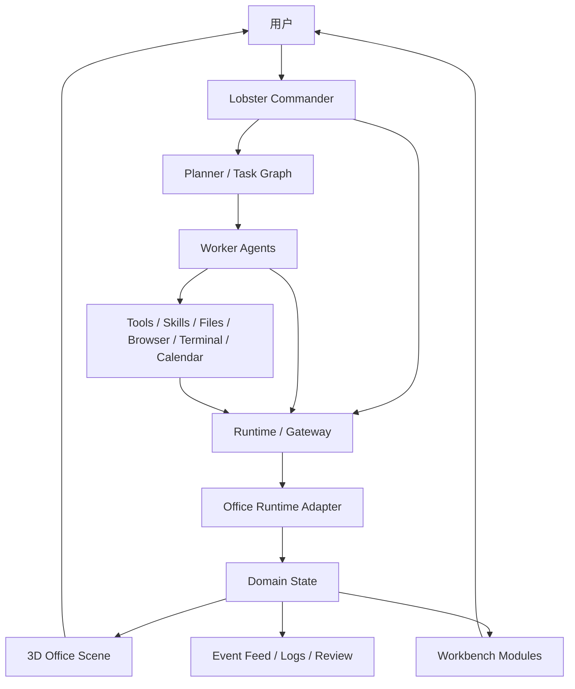

# 3D 赛博办公室完整视频复刻需求规格

> 文档版本：1.0  
> 文档日期：2026-05-22  
> 文档状态：需求母规格，待用户评审  
> 文档目标：把参考视频中的可观察体验、背后逻辑、系统框架、模块颗粒度、数据边界和验收标准统一写清，为后续设计、计划、开发和迁移提供同一基线。

## 1. 文档定位

### 1.1 这份文档解决什么

本文档定义一个尽量完整复刻参考视频体验的“3D 赛博办公室”系统需求。复刻目标不是只做一段看起来相似的录屏，而是把视频中呈现出的三类能力合在一起：

1. 可巡视的 3D AI 办公室。
2. 围绕 Agent 工作的一组工作台模块。
3. 由“小龙虾”作为总入口，调度多个 AI Agent 做事的真实运行链路。

本文档需要同时服务两类后续工作：

- 视觉与交互实现：把视频里的空间、角色、页面、小功能和氛围细节补齐。
- 运行态实现：把模拟事件逐步升级为真实 Runtime / Gateway / Agent 事件。

### 1.2 这份文档不做什么

本文档不直接决定所有代码实现细节，也不假定某个开源项目可以无修改搬入。当前已经验证：

- `Claw3D` 可作为 3D Office 和 Runtime 边界的重要参考。
- 当前本机 OpenClaw Gateway 与当前 `Claw3D` 主分支存在协议版本不兼容，需要独立决策。
- 当前仓库已有一套轻量 3D 原型和视频化工作台骨架，不能因为复刻完整度提升就把现有价值抹掉。

因此本文档先定义目标产品，再把技术选型和迁移策略留给后续架构决策与实现计划。

### 1.3 需求解释原则

| 原则 | 说明 |
| --- | --- |
| 完整复刻优先 | 参考视频中可观察到的功能信号、页面信号和氛围信号都要入文档 |
| 体验与能力分离 | 画面像视频和系统真能工作必须分别验收 |
| 真实数据可替换 | Demo 数据可以先支撑展示，但字段、状态和交互要能接真实 Runtime |
| 事件驱动 | 场景动画、面板状态和工作台联动要由领域状态或运行事件驱动 |
| 本地优先 | 第一阶段以本机可运行、可演示、可迁移为主 |
| 迁移可解释 | UI 配置、运行时数据、机密和文件资产各自归属必须清楚 |

## 2. 背景与目标

### 2.1 参考体验的核心

视频表达的不是“给 AI 加一个办公室皮肤”，而是“把一群 AI 的工作过程变成一个可巡视的工作现场”。

用户看到的是：

- 办公室里有角色、工位、区域和状态。
- 计划、文件、定时任务、日志和复盘在同一个工作环境里。
- 一个总入口 Agent 接用户指令，后面有多个 Agent 或工具完成工作。
- 系统不仅展示结果，也展示过程、阻塞、诊断和生活化副产物。

### 2.2 产品愿景

构建一个可迁移、可扩展、可接真实多 Agent 运行态的 3D 赛博办公室，让用户像巡视一个 AI 团队办公现场一样：

- 下达目标。
- 看见分工。
- 跟踪执行。
- 查看文件与日志。
- 管理计划与自动化。
- 回顾系统昨天做得怎么样，今天怎么改进。

### 2.3 成功标准

完整复刻方向成功时，用户应能说出以下判断：

1. “第一眼看上去就是视频里那种 AI 办公室，不是普通后台。”
2. “我能知道谁在干活、谁卡住、谁完成了。”
3. “后面的日历、文件、Cron、Gateway、复盘这些小页面都不是摆设。”
4. “我可以对小龙虾说目标，它能把工作交给多个 AI 或工具去做。”
5. “换一台电脑后，我知道哪些东西要迁移，哪些秘密不能乱拷。”

## 3. 复刻范围总览

### 3.1 三层产品结构

| 层级 | 名称 | 复刻目标 |
| --- | --- | --- |
| L1 | 3D 空间层 | 复刻办公室场景、角色、镜头、区域、状态和沉浸式巡视感 |
| L2 | 工作台层 | 复刻日历、计划、任务、日志、文件、Cron、Gateway、Review、轻松小功能 |
| L3 | 指挥运行层 | 复刻 Commander 入口、多 Agent 分工、工具调用、事件流、审批与产物闭环 |

### 3.2 必须复刻、允许演进和明确不做

| 类型 | 内容 |
| --- | --- |
| 必须复刻 | 办公室主视图、Agent/工位状态、周日历、计划进度、任务列表、文件查看、Cron 列表、Gateway 状态、每日复盘、自进化提示、轻松副空间、小龙虾入口和多 Agent 指挥逻辑 |
| 允许演进 | 美术资产可原创替代；文案可本地化；外部服务可先用同构本地数据或适配器代替 |
| 明确不做 | 像素级照抄博主资产、直接暴露机密到前端、无事件边界地把第三方仓库硬拼进当前项目 |

### 3.3 版本层级

| 版本 | 定义 | 必须达到 |
| --- | --- | --- |
| V0 Demo | 离线复刻演示 | 全部主页面和主状态可演示，事件可用本地脚本驱动 |
| V1 Local Mission Control | 本地可用 | 真实本地状态、文件、Cron 或 Gateway 的一部分接通；可用 Commander 发起可追踪任务 |
| V2 Runtime Connected | 真实运行态 | 真实 Agent roster、sessions、tool events、approvals、artifacts 驱动办公室 |
| V3 Personalized Office | 个人化工作室 | 自定义布局、轻松副空间、每日惊喜、自进化、迁移和设备优化成熟 |

## 4. 视频可观察细节清单

### 4.1 主办公室信号

完整复刻应覆盖以下可观察信号：

- 主画面以办公室空间为核心，不以二维 dashboard 为核心。
- 视角可俯看或斜俯看整个办公室。
- 办公室有多个工位、多个角色、不同职责或不同区域。
- 场景不是空房间，应有家具、屏幕、隔断、公共区、装饰和工作道具。
- Agent 不是纯状态点，至少要像办公室中的小角色。
- 工位与 Agent 之间有绑定关系。
- 工作态、空闲态、等待态、阻塞态、完成态可以从画面识别。
- 场景应有“工作正在发生”的轻动态，而不是静态截图。

### 4.2 视频后半段工作台信号

完整复刻应覆盖以下模块：

- 周日历或日程总览。
- 学习计划或成长计划进度。
- 阶段清单和完成动作。
- 外部任务清单概念，例如 Google Tasks 或同构任务区。
- 文件浏览、目录、文档内容打开、Markdown 查看。
- Cron Job 列表，按时间或状态组织。
- Gateway 运行态和诊断信息。
- 日志或事件流。
- 每日早报、每日复盘或自进化建议。
- 轻松小功能与“Agent 生活区”，例如静眠、声音、休息、小游戏、小惊喜。

### 4.3 指挥协作信号

完整复刻应覆盖以下逻辑信号：

- 用户面对一个主要入口 Agent。
- 入口 Agent 可理解“目标”而不只回答一句话。
- 入口 Agent 能拆解任务、分配任务、回收结果。
- 多个 Worker Agent 可按角色工作。
- 工具调用、审批、阻塞和结果会进入日志/面板/文件。
- Office 不只显示聊天内容，也显示任务生命周期。

### 4.4 具名区域与个性化信号

视频中还存在一类容易在复刻时漏掉的细节：办公室不是匿名模板房间，而像作者自己的 AI 工作室。

需求上应保留这种信号：

- 区域、团队、楼层或工位组可以有名称和身份标签。
- 不同区块可以表达不同职责，例如主团队、外部协作团队、任务区、娱乐区、诊断区。
- 同一办公室允许有主题化角落，而不是所有区域完全同构。
- Agent 生活化功能可带有作者式命名，例如静眠、花园、温泉、声音空间或每日惊喜。
- 复刻时不要求照抄视频中的具体命名、品牌和美术资产，但要保留“这是一个长期被使用和改造的个人 AI 办公室”的感觉。

## 5. 用户、角色与权限

### 5.1 用户角色

| 角色 | 说明 | 主要动作 |
| --- | --- | --- |
| Owner | 本机办公室拥有者 | 配置 Runtime、查看全部数据、批准动作、迁移数据 |
| Operator | 日常操作者 | 下达任务、查看状态、标记计划、操作工作台 |
| Viewer | 展示观看者 | 浏览办公室、查看演示状态，不触发高风险动作 |

### 5.2 系统角色

| 系统角色 | 需求定义 |
| --- | --- |
| Lobster Commander | 用户的主入口 Agent，负责理解目标、拆解、调度、汇总 |
| Worker Agent | 执行专业任务的 Agent，可有研究、编码、审阅、运维、内容、计划等职责 |
| Scheduler | 负责 Cron、例行任务、日报/复盘触发 |
| Runtime Adapter | 把外部 Runtime / Gateway 映射为办公室领域事件 |
| Office UI | 呈现场景、工作台、详情、审批和诊断 |

### 5.3 权限边界

- 读取公开 UI 状态不应要求暴露 Gateway token。
- 真实 Runtime 连接机密不得只保存在浏览器明文 localStorage。
- 高风险工具调用应能进入审批态。
- Viewer 不得通过 Demo UI 误触真实执行。
- 从外部 Runtime 接收到的失败、拒绝、超时必须可见，不得只吞掉。

## 6. 总体系统架构需求

### 6.1 目标架构



### 6.2 架构分层

| 层 | 职责 | 不应承担 |
| --- | --- | --- |
| Scene Layer | 渲染办公室、角色、工位、镜头和场景交互 | 直接解析第三方 Gateway 私有协议 |
| Workbench Layer | 渲染日历、任务、文件、Cron、Review 等页面 | 持有 Runtime 机密 |
| Domain Layer | Agent、Task、Plan、Artifact、Event、State Machine | 硬编码某个 UI 页面 |
| Adapter Layer | 转换 Demo、OpenClaw、Claw3D、脚本或其他运行时事件 | 复制一套独立真相源 |
| Runtime Layer | 真实会话、工具调用、调度、审批、文件、Cron | 决定办公室美术和 UI 布局 |

### 6.3 数据归属

| 数据 | 归属 | 迁移要求 |
| --- | --- | --- |
| Office 布局、镜头偏好、主题偏好 | Office UI 配置 | 可导出 |
| Demo 场景脚本 | 前端或项目资产 | 随项目迁移 |
| 计划和本地 dashboard 状态 | 本地 Office 数据或可配置存储 | 可导出 |
| Agent roster、sessions、tool events | Runtime / Gateway | 按 Runtime 迁移 |
| 文件产物 | Workspace / Runtime 文件系统 | 记录路径和来源 |
| Token、密钥、设备授权 | Runtime 或服务端安全存储 | 不在普通导出包中裸露 |

## 7. 核心业务闭环

### 7.1 用户发起任务闭环

1. 用户在 Commander 入口输入目标。
2. Commander 判断目标、上下文和需要的能力。
3. 任务进入计划态，生成任务树或执行步骤。
4. Commander 将任务派发给一个或多个 Worker。
5. Worker 调用工具、文件、浏览器、代码或外部集成。
6. Runtime 产生事件。
7. Office 映射事件到 Agent、工位、日志、文件和工作台。
8. 若阻塞，Office 提示用户审批、补充信息或重试。
9. 若完成，产物进入文件/交付区，Review 可回顾过程和改进点。

### 7.2 定时任务闭环

1. Scheduler 触发 Cron Job。
2. Job 生成任务或会话。
3. Office 显示“自动任务开始”。
4. Job 执行过程写入日志和运行态。
5. Job 成功、失败或等待输入时更新 Cron 模块与 Office。
6. 每日 Review 汇总可用执行结果。

### 7.3 计划完成闭环

1. 用户在 Calendar / Plan 模块查看任务阶段。
2. 用户切换阶段 done/undone 或点击 Mark Complete。
3. 进度条、任务状态、Event Feed 联动。
4. 若该计划项关联真实 Task，相关 Agent 和任务状态同步更新。
5. Review 和日报可引用已完成计划。

## 8. 3D 办公室详细需求

### 8.1 场景总需求

| 编号 | 需求 | 优先级 | 验收 |
| --- | --- | --- | --- |
| SCN-001 | 打开应用默认进入办公室主视图或可一键进入 | P0 | 首屏可看到完整办公室主体 |
| SCN-002 | 办公室有可读空间边界 | P0 | 能看出地面、墙/边界、工位区和公共区 |
| SCN-003 | 场景中存在多个 Agent 工位 | P0 | 至少主工位区、待办/分配区、完成/交付区有区分 |
| SCN-004 | 场景有协作和生活化资产 | P1 | 至少包含会议/白板/休息/绿植/柜体/灯具中的多类 |
| SCN-005 | 场景密度贴近视频观感 | P1 | 默认镜头下不出现大面积无语义空地 |
| SCN-006 | 赛博感服务状态表达 | P1 | 屏幕、标签、光效可读，不把家具全部淹没 |

### 8.2 办公室区域

| 区域 | 语义 | 必要对象 | 必要联动 |
| --- | --- | --- | --- |
| Commander Desk | 小龙虾总入口 | 主工位、主屏幕、Commander 标识 | 用户任务入口、调度态 |
| Worker Desk Cluster | 执行区 | 多工位、屏幕、椅子、Agent | 工作态、任务分配、角色身份 |
| Pending / Intake | 待分配区 | 待办台、任务板、入队标识 | 新任务、排队、计划中 |
| Done / Delivery | 交付区 | 完成屏、归档台、文件/产物提示 | Artifact、Completed |
| Collaboration | 协作区 | 白板、会议桌、Review 墙 | 复盘、计划、多人任务 |
| Diagnostics | 运行态角落 | Gateway/Cron/日志视觉提示 | 异常、定时任务、连接状态 |
| Rest / Play | 轻松区 | 睡眠、声音、休息或小游戏资产 | 空闲 Agent、每日惊喜 |

### 8.3 相机和导航

| 编号 | 需求 | 优先级 |
| --- | --- | --- |
| CAM-001 | 默认镜头一次性交代办公室总体结构 | P0 |
| CAM-002 | 支持旋转、缩放、平移或同等浏览能力 | P0 |
| CAM-003 | 支持重置到默认视角 | P0 |
| CAM-004 | 点击 Agent 或工位后可聚焦，但不丢失空间方向感 | P1 |
| CAM-005 | 工作台切换后返回 Office 保留合理选中上下文 | P1 |
| CAM-006 | 桌面和窄屏都能读出主场景，不让 HUD 完全遮挡办公室 | P1 |

### 8.4 Agent 角色表现

| 状态 | 场景表现 | 面板表现 | 事件来源 |
| --- | --- | --- | --- |
| Idle | 站立、坐姿待机、轻微呼吸/巡视 | 空闲 | `agent.idle` |
| Planning | 靠近白板/Commander，屏幕准备态 | 正在规划 | `task.planned` |
| Working | 工位屏幕亮起、敲击或动作循环 | 执行中 | `agent.working` |
| Waiting Input | 停顿、提示符、朝用户方向提示 | 等待输入 | `task.waiting_input` |
| Approval Required | 工位警示、审批标识 | 待批准 | `approval.requested` |
| Blocked | 警示色、停滞态 | 阻塞原因 | `task.blocked` |
| Failed | 明显失败反馈 | 错误摘要 | `task.failed` |
| Completed | 角色收束、完成提示 | 完成 | `task.completed` |
| Resting | 轻松区或睡眠态 | 静眠/休息 | `agent.resting` |

### 8.5 工位和任务绑定

- 一个 Agent 可绑定默认工位。
- 一个工位可展示当前 Agent、当前 Task、最近 Artifact 和状态。
- 无 Agent 工位应表现为空位，而不是消失。
- Task 从 Pending 进入 Working 时，空间表达要发生变化。
- 完成后可在 Done / Delivery 区留下短期结果提示。
- 工位点击与 Agent 点击都应进入详情上下文。

### 8.6 场景 HUD

| HUD 元素 | 必须显示 | 交互 |
| --- | --- | --- |
| 全局状态条 | Agent 总数、工作中、空闲、阻塞、连接态 | 可快速定位异常 |
| 模块导航 | Office 与工作台模块 | 切换后保留上下文 |
| 事件缩略流 | 最近事件 | 可展开 |
| Demo / Runtime 控制 | 当前数据源、暂停/恢复、重连 | 不误导真实/演示模式 |
| 详情面板 | Agent/Task/Artifact 摘要 | 可关闭、可跳转模块 |

## 9. Commander 与多 Agent 指挥需求

### 9.1 Commander 入口

| 编号 | 需求 | 优先级 |
| --- | --- | --- |
| CMD-001 | 系统提供一个主入口 Agent，视觉上与普通 Worker 区分 | P0 |
| CMD-002 | 用户可输入目标、补充材料和约束 | P0 |
| CMD-003 | Commander 可显示任务是否已拆解 | P0 |
| CMD-004 | Commander 可请求用户确认高风险动作 | P0 |
| CMD-005 | Commander 可汇总多个 Worker 的结果 | P1 |
| CMD-006 | Commander 的动作会映射到 Office 状态 | P1 |

### 9.2 任务拆解

任务拆解结果至少要支持：

- 原始目标。
- 任务摘要。
- 子任务列表。
- 依赖关系。
- 推荐 Worker。
- 风险或审批点。
- 预期产物。
- 当前执行阶段。

### 9.3 Worker Registry

每个 Worker 应有：

| 字段 | 说明 |
| --- | --- |
| `id` | 唯一标识 |
| `name` | 显示名称 |
| `role` | 职责，例如 Research、Builder、Reviewer |
| `capabilities` | 可做什么 |
| `tools` | 可使用工具 |
| `workspace` | 关联工作区 |
| `deskId` | 默认工位 |
| `runtimeRef` | 外部 Runtime 中的标识 |
| `status` | 当前状态 |
| `lastSeenAt` | 最近运行态更新时间 |

### 9.4 多 Agent 分工

| 场景 | 必须能力 |
| --- | --- |
| 单任务单 Agent | Commander 指定 Worker 并追踪结果 |
| 单任务多 Agent | 任务树可分支，Worker 互不覆盖产物 |
| 研究后实现 | Research 输出约束，Builder 消费结果 |
| 实现后审阅 | Reviewer 读取产物并回写问题 |
| 阻塞回流 | Worker 把缺失信息或审批请求回给 Commander |
| 结果汇总 | Commander 形成用户可读总结和产物清单 |

### 9.5 审批与风险

- 文件读取、普通浏览和离线分析可按环境策略自动执行。
- 写文件、终端执行、外部发送、删除、部署等操作应可标记风险级别。
- Approval 必须有发起 Agent、动作、原因、目标、影响范围、时间。
- 用户拒绝后任务应进入明确状态，不得一直伪装 Working。

## 10. 工作台模块详细需求

### 10.1 导航总结构

工作台至少包含：

| 模块 | 目的 | 视频复刻权重 |
| --- | --- | --- |
| Office | 主办公室 | 极高 |
| Calendar / Plan | 周安排、学习计划、进度 | 高 |
| Tasks | 外部/本地任务列表和映射 | 高 |
| Logs / Events | 运行记录 | 高 |
| Files | 工作区文件和产物 | 高 |
| Cron | 定时任务 | 高 |
| Gateway / Runtime | 连接状态与诊断 | 高 |
| Review / Evolution | 每日复盘、自进化 | 高 |
| Rest / Fun | 静眠、声音、小游戏、小惊喜 | 中高 |

### 10.2 Calendar / Plan

#### 页面元素

- 日期标题。
- 周视图或多日列。
- 当天事项。
- 学习计划区。
- 进度条。
- 阶段清单。
- 关联 Agent / Task。
- Mark Complete。

#### 数据字段

| 字段 | 说明 |
| --- | --- |
| `calendarItemId` | 日历项 ID |
| `title` | 标题 |
| `date` | 日期 |
| `timeRange` | 时间范围 |
| `category` | 学习、工作、复盘、自动任务 |
| `progress` | 0 到 100 |
| `stages` | 阶段清单 |
| `completed` | 是否完成 |
| `linkedTaskIds` | 关联任务 |
| `linkedAgentIds` | 关联 Agent |

#### 交互

- 点击阶段切换 done/undone。
- 阶段改变自动重算进度。
- Mark Complete 令阶段全完成、进度 100%。
- 已完成项有视觉状态。
- 关联任务和 Agent 可跳转详情。

### 10.3 Tasks

#### 需求目标

复刻视频中的外部任务列表感觉，不要求第一阶段强绑 Google Tasks，但要有同构入口。

#### 必要能力

- 任务列表。
- 今日、待办、进行中、完成、阻塞筛选。
- 与 Office Task 映射。
- 任务来源标识：本地、Google Tasks、Runtime、Cron、用户手动。
- 任务点击展开详情。
- 可从 Task 定位相关 Agent、文件、事件。

### 10.4 Logs / Events

#### 必要能力

- 时间线展示。
- 按 Agent、Task、EventType、Severity 筛选。
- 高亮用户动作、工具调用、错误、审批和产物生成。
- 支持演示事件和真实 Runtime 事件区分。
- 支持从事件跳转 Agent、Task、Artifact。

#### 最低事件类型

- `user.message`
- `user.action`
- `task.created`
- `task.planned`
- `task.assigned`
- `task.started`
- `task.progress`
- `tool.called`
- `artifact.created`
- `approval.requested`
- `approval.resolved`
- `task.waiting_input`
- `task.blocked`
- `task.failed`
- `task.completed`
- `agent.status_changed`
- `runtime.connected`
- `runtime.disconnected`
- `cron.triggered`

### 10.5 Files

#### 页面元素

- Workspace 来源。
- 目录树。
- 文件列表。
- 文件内容预览。
- Markdown 渲染。
- 最近产物区。
- 文件与 Task / Agent 关系。

#### 必要能力

- 查看文件名、路径、类型、更新时间、来源。
- 打开 Markdown 文档。
- 从 Artifact 进入文件。
- 从文件定位生成该文件的任务或 Agent。
- 显示文件是否来自 Demo 或真实 Workspace。

#### 后续增强

- 文本编辑和保存。
- Diff 预览。
- 多 workspace 切换。
- 文件搜索。

### 10.6 Cron

#### 页面元素

- Cron Job 列表。
- 下次执行时间。
- 上次执行结果。
- 启用状态。
- 关联 Agent 或任务模板。
- 调试入口。

#### 必要能力

- 按时间排序。
- 按启用/失败/成功筛选。
- 查看 Job 详情。
- 查看最近运行日志。
- 从 Cron run 跳转 Office Task。

### 10.7 Gateway / Runtime

#### 页面元素

- 当前 Runtime 名称。
- 连接状态。
- 协议版本。
- 数据源类型。
- 最近心跳。
- 错误摘要。
- 重连入口。
- 诊断信息。

#### 必要能力

- 区分 Demo、Local、OpenClaw、Custom 等数据源。
- 显示 disconnected、connecting、connected、error、protocol_mismatch。
- 显示“需要设备审批”“token 缺失”“协议不兼容”等明确原因。
- 不泄露 token。
- 允许从诊断返回文档级下一步提示。

### 10.8 Review / Evolution

#### 页面元素

- 每日早报。
- 昨日完成事项。
- 昨日失败/阻塞。
- 改进建议。
- 今日建议。
- Agent 自我复盘。

#### 必要能力

- 由昨日任务、Cron、日志、完成项生成或聚合 Review。
- 区分系统生成、用户编辑和 Demo。
- Review 卡片可引用 Task、Artifact、Agent。
- 自进化建议必须保留“建议”语义，不默认自动修改系统。

### 10.9 Rest / Fun

#### 需求目标

复刻视频中的轻松感和“Agent 不是纯工作机器”的小惊喜。

#### 可复刻元素

- 静眠花园或类似休息空间。
- 睡眠/休息 Agent 视觉。
- 声音或氛围播放区。
- 每日惊喜组件。
- 小型小游戏、互动玩具或乐园页。
- 温泉、休息角、节庆装饰等原创替代资产。

#### 约束

- 不能抢走主工作流。
- 默认不影响性能。
- 能关闭或延迟加载。

### 10.10 页面和控件级清单

#### Office 页面控件

| 区域 | 控件或内容 | 必要状态 |
| --- | --- | --- |
| 顶部状态 | Runtime 徽标、Agent 计数、任务计数、异常计数 | connected、demo、disconnected、error |
| 左/侧导航 | Office、Calendar、Tasks、Logs、Files、Cron、Gateway、Review、Rest | 当前选中、未读提示、异常提示 |
| 场景画布 | 办公室、Agent、Desk、区域标签、任务热点 | hover、selected、focused、dimmed |
| 场景工具 | Reset Camera、视图切换、必要的 Demo 控制 | 可用、禁用、运行中 |
| 详情区 | Agent / Task / Artifact 详情 | 空、已选中、错误 |
| 事件区 | 最近事件、展开入口 | 有事件、无事件、过滤中 |

#### Calendar 页面控件

| 控件 | 需求 |
| --- | --- |
| 周切换 | 查看本周与相邻周 |
| 日期列 | 显示每天事项 |
| 日历项 | 标题、时间、类别、完成状态 |
| 计划进度条 | 0 到 100 可读 |
| 阶段复选框 | done/undone |
| 完成按钮 | 一次完成全部阶段 |
| 关联跳转 | Agent、Task、Review 或 Files |

#### Tasks 页面控件

| 控件 | 需求 |
| --- | --- |
| 来源筛选 | 本地、外部、Runtime、Cron |
| 状态筛选 | 今日、待办、进行中、阻塞、完成 |
| 任务行 | 标题、来源、优先级、关联 Agent |
| 详情入口 | 展开子任务、文件、事件 |
| 同步提示 | 外部来源未配置时明确说明 |

#### Logs 页面控件

| 控件 | 需求 |
| --- | --- |
| 时间线 | 按时间倒序或正序 |
| 搜索 | 按文本搜索 |
| 类型筛选 | 任务、工具、审批、错误、用户动作 |
| 严重级别 | info、success、warn、error |
| 跳转链接 | 跳 Agent、Task、Artifact |

#### Files 页面控件

| 控件 | 需求 |
| --- | --- |
| Workspace 选择 | 当前目录来源 |
| 目录树 | 文件夹展开折叠 |
| 文件列表 | 名称、类型、时间、来源 |
| 预览区 | Markdown、文本摘要、不可预览提示 |
| 产物关联 | 生成 Agent、Task、Event |
| 错误态 | 权限不足、文件不存在、读取失败 |

#### Cron 页面控件

| 控件 | 需求 |
| --- | --- |
| Job 列表 | 名称、表达式或时间、启用状态 |
| 运行摘要 | 上次、下次、耗时、结果 |
| 筛选 | 启用、失败、成功、即将运行 |
| 详情 | 关联 Agent、任务模板、日志 |
| 跳转 | 跳到对应 Event 或 Task |

#### Gateway 页面控件

| 控件 | 需求 |
| --- | --- |
| Runtime 卡片 | 名称、类型、连接状态 |
| 协议显示 | 当前协议、兼容性 |
| 最近错误 | 错误码、摘要、时间 |
| 诊断提示 | token、设备审批、协议不兼容、断线 |
| 重连动作 | 连接或重试 |
| 安全提示 | 不展示原始 token |

#### Review 页面控件

| 控件 | 需求 |
| --- | --- |
| 日期切换 | 查看当前或历史 Review |
| 昨日总结 | 完成、失败、阻塞 |
| 建议区 | 改进建议和今日建议 |
| 引用区 | Task、Artifact、Agent |
| 来源标识 | Demo、系统生成、用户编辑 |

#### Rest 页面控件

| 控件 | 需求 |
| --- | --- |
| 休息空间入口 | 静眠/花园/温泉/声音空间 |
| Agent 状态 | 休息中、空闲、可唤醒 |
| 小组件 | 每日惊喜、小游戏或氛围组件 |
| 性能控制 | 关闭动画、静音、延迟加载 |

## 11. 详情面板需求

### 11.1 Agent 详情

必须显示：

- 名称、角色、头像/身份色。
- 当前状态。
- 当前工位。
- 当前任务。
- 最近事件。
- 最近产物。
- 使用中的能力或工具摘要。
- Runtime 来源。

### 11.2 Task 详情

必须显示：

- 标题、目标、来源。
- 状态、优先级、阶段。
- Commander 和 Worker。
- 子任务。
- 进度。
- 关联文件。
- 最近日志。
- 阻塞原因。
- 需要用户动作。

### 11.3 Artifact 详情

必须显示：

- 文件名或交付名称。
- 类型。
- 生成者。
- 关联任务。
- 路径或打开入口。
- 创建时间。
- 预览或摘要。

## 12. 领域模型需求

### 12.1 Agent

```ts
type AgentStatus =
  | "idle"
  | "planning"
  | "working"
  | "waiting_input"
  | "approval_required"
  | "blocked"
  | "failed"
  | "completed"
  | "resting"
  | "offline";
```

### 12.2 Task

```ts
type TaskStatus =
  | "inbox"
  | "planned"
  | "queued"
  | "assigned"
  | "running"
  | "waiting_input"
  | "approval_required"
  | "blocked"
  | "failed"
  | "completed"
  | "archived";
```

### 12.3 Artifact

Artifact 至少要表达：

- 标识。
- 标题。
- 类型。
- 路径或 URI。
- 摘要。
- 创建者 Agent。
- 关联 Task。
- 是否可预览。
- 是否来自真实 Workspace。

### 12.4 Runtime Event

统一事件结构至少要有：

| 字段 | 说明 |
| --- | --- |
| `id` | 事件 ID |
| `type` | 事件类型 |
| `timestamp` | 时间 |
| `source` | Demo、Runtime、User、Cron |
| `agentId` | 可选 Agent |
| `taskId` | 可选 Task |
| `artifactId` | 可选 Artifact |
| `severity` | info、success、warn、error |
| `payload` | 类型化载荷 |
| `rawRef` | 可选原始 Runtime 引用 |

### 12.5 状态映射

- Runtime 事件先进入 Adapter。
- Adapter 产出 Office Domain Event。
- Domain Event 更新 Agent / Task / Artifact / Review / Dashboard。
- Scene 和 Workbench 订阅领域状态。
- Scene 不直接依赖第三方原始 payload。

## 13. Demo 与真实 Runtime 模式

### 13.1 Demo 模式

Demo 模式必须支持：

- 正常任务生命周期。
- 阻塞任务生命周期。
- 等待用户输入。
- 审批请求。
- Artifact 生成。
- Cron 触发。
- Daily Review 更新。
- 暂停、恢复、重置。

### 13.2 Runtime 模式

Runtime 模式必须支持：

- 连接状态。
- 断线与重连。
- 协议兼容检查。
- 数据源标识。
- 真实 Agent roster。
- 至少一种真实 session 或 tool event 接入。

### 13.3 模式区分

UI 必须避免以下误导：

- 把 Demo Agent 说成真实 Agent。
- 把本地假文件说成真实 workspace 文件。
- 把协议不兼容隐藏成普通 disconnected。
- 把用户标记完成和 Runtime 完成混为一谈。

## 14. 视觉与体验需求

### 14.1 视觉基线

- 保留办公室主体，不把首屏做成营销页。
- 赛博感来自屏幕、标签、光效和自动化氛围。
- 颜色不能只剩一片暗蓝或紫蓝。
- 办公室资产要有材质区分。
- 小型 UI 控件不做夸张 hero 字号。
- 文案避免解释“这个按钮是干什么的”的教程堆叠。

### 14.2 状态可读性

- 颜色不能是唯一状态信号。
- 状态要结合动作、标签、图标、面板和事件。
- 错误和阻塞必须显著。
- 完成态不能像 Agent 消失。
- 休息态和离线态不能混淆。

### 14.3 响应式要求

- 桌面端优先完整体验。
- 窄屏下允许 HUD 折叠、面板抽屉化。
- 文本不得溢出控件。
- 3D canvas 不应因固定面板被完全遮挡。

## 15. 性能与设备适配需求

### 15.1 当前目标设备

当前已知本机：

- Intel Core i7-12700F。
- 约 32 GB 内存。
- NVIDIA RTX 3060。

### 15.2 性能目标

| 项目 | 目标 |
| --- | --- |
| 首屏 | 本地开发环境可在合理等待后显示可交互主视图 |
| 场景 | 默认视角下交互稳定，无明显空白 canvas |
| Agent 数量 | 第一阶段真实 Worker 以 2 到 4 个为重点，同屏展示可更高 |
| 资产 | 重复家具尽量复用；高成本资源按需加载 |
| 日志 | 高频事件不导致 UI 抖动和无限增长 |

### 15.3 优化要求

- 重复 3D 道具可实例化。
- 动态阴影、动态灯光数量受控。
- Rest / Fun 重资源模块可懒加载。
- Event Feed 需要上限、分页、折叠或窗口化策略。
- 真实 Runtime 消息需做去重和降噪。

## 16. 数据保存与迁移需求

### 16.1 可导出对象

- Office 布局。
- Desk 与 Agent 映射。
- UI 偏好。
- Demo 配置。
- 本地 Calendar / Plan 数据。
- 本地任务和 Review 数据。

### 16.2 需要单独迁移对象

- Runtime 配置。
- Gateway 设备授权。
- Workspace 文件。
- Agent 配置和会话。
- Cron 定义。
- 外部服务连接。

### 16.3 禁止混入普通导出包

- Token。
- API key。
- 私密 cookie。
- 未脱敏日志。
- 未确认可迁移的设备密钥。

### 16.4 迁移文档要求

迁移教程最终必须回答：

1. 如何迁移项目代码。
2. 如何迁移前端本地数据。
3. 如何迁移 Runtime 状态。
4. 如何重新授权设备。
5. 如何验证迁移后场景、工作台和真实 Agent 是否正常。

## 17. 异常与诊断需求

| 场景 | 必须表现 |
| --- | --- |
| Runtime 未配置 | 明确提示配置入口 |
| Gateway 断开 | Office 显示 disconnected |
| 协议不兼容 | 显示 protocol mismatch，不只显示失败 |
| Token 缺失 | 显示认证缺失，不暴露 token |
| 设备待审批 | 提示审批状态 |
| 工具调用失败 | Event 与 Task 详情都有记录 |
| 文件打不开 | File 模块显示错误和来源 |
| Cron 失败 | Cron 状态与日志可见 |
| Demo 脚本结束 | 明确结束，不无限假运行 |

## 18. 验收矩阵

### 18.1 视觉复刻验收

| 编号 | 验收点 |
| --- | --- |
| ACC-VIS-001 | 首屏是可读办公室，不是控制台卡片墙 |
| ACC-VIS-002 | 默认镜头能看到多工位、多 Agent 和公共区 |
| ACC-VIS-003 | Agent 不同状态在场景中可辨识 |
| ACC-VIS-004 | 视频后半段的工作台模块都有入口 |
| ACC-VIS-005 | Rest / Fun 至少有一个可进入小空间或小组件 |

### 18.2 功能复刻验收

| 编号 | 验收点 |
| --- | --- |
| ACC-FUN-001 | 用户可选中 Agent、Desk、Task 并看详情 |
| ACC-FUN-002 | Calendar 阶段清单和完成动作可联动进度 |
| ACC-FUN-003 | Files 可打开至少 Markdown 产物预览 |
| ACC-FUN-004 | Cron 可查看 Job 和最近运行摘要 |
| ACC-FUN-005 | Gateway 模块能显示 Runtime 状态与错误 |
| ACC-FUN-006 | Review 能展示昨日工作、问题和建议 |

### 18.3 运行态验收

| 编号 | 验收点 |
| --- | --- |
| ACC-RUN-001 | Demo 事件能驱动 Agent 与 Task 状态 |
| ACC-RUN-002 | Runtime Adapter 可区分 Demo 与真实事件 |
| ACC-RUN-003 | 至少一种真实 Runtime 数据可接入 |
| ACC-RUN-004 | Approval、Blocked、Failed 不被吞掉 |
| ACC-RUN-005 | Artifact 能从任务追到文件 |

### 18.4 迁移验收

| 编号 | 验收点 |
| --- | --- |
| ACC-MIG-001 | UI 配置可导出或有明确备份方法 |
| ACC-MIG-002 | 迁移文档不会要求把 token 裸拷进普通数据包 |
| ACC-MIG-003 | 新电脑验证步骤覆盖 Office、Workbench、Runtime |

### 18.5 细节复刻验收

| 编号 | 验收点 |
| --- | --- |
| ACC-DET-001 | 办公室存在具名区域、工位组或可识别团队标签 |
| ACC-DET-002 | Calendar 不只显示事项，也显示阶段和进度 |
| ACC-DET-003 | Files 不只列文件，也能打开内容预览 |
| ACC-DET-004 | Cron 不只列 Job，也能看最近运行摘要 |
| ACC-DET-005 | Gateway 不只显示 online/offline，也能解释错误类型 |
| ACC-DET-006 | Review 不只显示文案，也能关联昨日 Task 或 Artifact |
| ACC-DET-007 | Rest / Fun 至少包含一个具名轻松功能 |

## 19. 功能优先级

### 19.1 P0

- Office 主视图。
- Commander 入口定义。
- Agent / Desk / Task 领域模型。
- Demo 事件完整生命周期。
- 详情面板和事件流。
- Calendar / Plan 基线。
- Files、Cron、Gateway、Review 基线入口。
- 模式区分和诊断基线。

### 19.2 P1

- 视频贴近的空间密度和区域深化。
- Worker Registry 与多 Agent 分工。
- Artifact 文件关联。
- 审批态与等待输入态。
- Tasks 模块与外部任务同构数据。
- Rest / Fun 首个模块。
- 导出迁移基线。

### 19.3 P2

- 深度自定义办公室布局。
- 外部 Calendar / Google Tasks 真实同步。
- 复杂文件编辑。
- 多 Runtime profile UI。
- 每日惊喜生成与主题化。
- 远程访问和跨设备同步。

## 20. 当前仓库映射

### 20.1 已有基础

| 当前模块 | 可承接需求 |
| --- | --- |
| `src/scene/*` | Office 主场景、Agent、Desk、区域和镜头 |
| `src/core/*` | Agent / Task / Event 领域模型 |
| `src/store/*` | UI、Office、Dashboard、Event 本地状态 |
| `src/demo/*` | Demo 生命周期 |
| `src/ui/dashboard/*` | Calendar、Logs、Files、Cron、Gateway、Review |
| `docs/migration/*` | 迁移说明起点 |

### 20.2 需要补齐

- Commander 输入和任务拆解 UI。
- Runtime Adapter。
- 真实 Runtime 数据源。
- Worker Registry。
- Tasks 模块。
- Artifact / Approval 模型。
- Rest / Fun 模块。
- 更精细的视频细节 checklist 与视觉 QA。

## 21. 开源参考边界

### 21.1 可参考对象

| 项目 | 参考重点 |
| --- | --- |
| Claw3D | 3D Office、Gateway 边界、Agent Office 交互、Studio 思路 |
| OpenClaw Office | Agent、Session、Cron、Files、Skills、控制台信息架构 |
| OpenClaw | 当前真实 Gateway、sessions、tool use、cron、设备授权和运行态 |

### 21.2 当前已知风险

- 当前本机 OpenClaw 与当前验证的 `Claw3D` 主分支存在 Gateway protocol mismatch。
- 不应在未做协议兼容决策前把真实运行态实现锁到 `Claw3D` v3。
- 不应为了赶视频效果把 Demo 数据永久写成业务真相源。

## 22. 后续分解建议

完整复刻母规格建议拆成五个实现子项目：

1. `Office Visual Fidelity`：办公室空间、资产、角色、区域、镜头。
2. `Workbench Fidelity`：Calendar、Tasks、Logs、Files、Cron、Gateway、Review、Rest。
3. `Commander Workflow`：用户下达目标、拆解、分工、审批、汇总。
4. `Runtime Adapter`：OpenClaw 当前协议接入、Demo 映射、事件与产物。
5. `Persistence and Migration`：数据归属、导出、迁移教程和设备验证。

## 23. 需求完成定义

当后续实现声称“完整复刻目标已达到”时，必须同时满足：

1. 本文档中 P0 全部满足。
2. P1 中所有视频主信号满足。
3. V0 Demo 可稳定录屏。
4. V1 或更高具备至少一条真实 Runtime 工作链路。
5. 文档可解释当前与视频仍保留的差异。
6. 迁移教程可指导换机验证。
