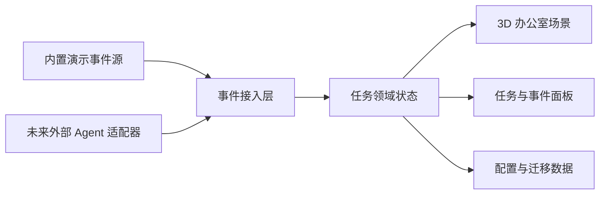

# 3D 赛博办公室需求与设计说明

> 文档版本：0.1
> 文档日期：2026-05-22
> 当前状态：待用户评审
> 目标交付：先形成可执行的需求基线，再进入实现计划与开发

## 1. 文档目的

本文档用于定义一个“3D 赛博办公室”可用原型的需求、范围、体验目标、系统边界和验收标准。

项目希望尽量贴近参考视频的观感：用户打开应用后，不是看到普通任务列表，而是进入一个有空间、有工位、有角色状态、有任务流转感的 3D 办公室。办公室里的 Agent 像在工作，用户可以通过空间和状态理解任务正在发生什么。

本文档优先回答两个问题：

1. 在当前项目里如何复刻这类体验，并把它做成后续可持续扩展的原型。
2. 参考视频里出现了哪些可观察的功能和体验信号，哪些适合进入第一版，哪些适合后续迭代。

## 2. 当前已确认决策

截至本文档编写时，已确认以下方向：

| 决策项 | 已确认结论 |
| --- | --- |
| 原型目标 | 做“可用原型”，不是只有演示画面的空壳 |
| 视频贴合度 | 视觉和体验上尽量贴近参考视频效果 |
| 应用入口 | 先做本地网页应用，架构上保留后续封装桌面端的空间 |
| 任务状态接入 | 优先设计通用任务事件接口，避免绑定某一个 Agent 平台 |
| 初始运行方式 | 即使暂未接入真实 Agent，也要能用内置事件源或模拟器完整演示 |
| 迁移要求 | 后续提供一份迁移到其他电脑的数据迁移与启动教程 |
| 当前仓库状态 | 当前仓库基本为空，可从零建立工程结构 |

## 3. 背景与机会

传统 Agent 工作台通常把核心信息放在：

- 任务列表
- 聊天记录
- 日志流
- 执行步骤
- 状态徽章

这些信息足够精确，但不一定足够直观。任务多起来之后，用户需要不断阅读文字才能回答几个基本问题：

- 现在有哪些 Agent 在忙？
- 哪些任务正在排队，哪些卡住了？
- 哪个任务已经完成，哪个需要我介入？
- 当前系统整体是安静、繁忙，还是异常？

3D 赛博办公室的价值在于把一部分任务状态转成空间化信号：

- Agent 有所在位置。
- 任务有工位或归属区域。
- 状态变化可以通过角色动作、屏幕内容、光效、提示和面板同步表现。
- 用户可以在“看办公室”的同时理解系统当前运行态。

这不是为了替代日志和任务详情，而是为任务系统增加一个更直观、更有参与感的总览层。

## 4. 产品愿景

### 4.1 一句话愿景

构建一个可迁移、可扩展、可接入真实任务事件的 3D Agent 办公室，让用户像巡视办公室一样理解多个任务和 Agent 的工作状态。

### 4.2 第一版愿景

第一版应做到：

- 打开后立刻看到一个完整的 3D 办公室场景。
- 场景中至少有多个工位、多个 Agent 角色和清晰的任务状态反馈。
- 用户能从场景进入任务详情，而不是只能看动画。
- 任务状态由统一事件模型驱动，第一版可以由本地事件模拟器喂入真实格式事件。
- 后续接入 Codex、本地脚本、OpenAI/Claude Agent、个人工作流或其他任务系统时，不需要推翻场景层。

## 5. 用户与使用场景

### 5.1 目标用户

#### 主要用户

- 想把 Agent 工作过程可视化的个人开发者。
- 想做有展示感的 AI 工作台或数字办公室原型的创作者。
- 同时跑多个自动化任务，希望快速获得总览的人。

#### 次要用户

- 需要演示 Agent 协作概念的团队成员。
- 想把办公室场景作为桌面侧工作仪表盘的人。

### 5.2 核心使用场景

#### 场景 A：巡视当前任务

用户打开应用，看到办公室里有若干工位：

- 一个 Agent 正在工作。
- 一个 Agent 等待任务。
- 一个 Agent 遇到阻塞。
- 一个任务刚刚完成。

用户不需要先读日志，就能快速知道系统当前大致状况。

#### 场景 B：查看单个任务

用户点击某个 Agent 或工位：

- 看到任务标题。
- 看到当前阶段。
- 看到最近事件。
- 看到开始时间、持续时间、重要输出或错误摘要。

#### 场景 C：演示系统效果

在没有接入外部 Agent 的情况下，用户启动内置演示：

- 场景会自动出现任务。
- Agent 状态会变化。
- 任务会从排队进入执行，再进入完成或阻塞。
- 演示可稳定复现，便于录屏和展示。

#### 场景 D：后续真实接入

外部系统把统一事件推给办公室：

- 创建任务。
- 更新 Agent 状态。
- 上报步骤进度。
- 上报失败、等待用户输入或完成。

办公室负责渲染和交互，不耦合外部 Agent 的实现细节。

## 6. 范围定义

### 6.1 第一版必须解决的问题

第一版必须让用户获得以下价值：

1. 有一个可运行、可交互的 3D 办公室体验。
2. 场景状态由任务事件驱动，而不是写死在动画里。
3. 可以查看办公室中 Agent 和任务的当前状态。
4. 即使没有接入外部任务系统，也能通过内置事件源演示完整流程。
5. 后续扩展到桌面端、真实 Agent 接入和数据迁移时，核心结构不需要重写。

### 6.2 第一版范围内

#### 产品能力

- 本地 Web 应用入口。
- 3D 办公室主场景。
- 多工位布局。
- 多 Agent 展示。
- Agent 状态机。
- 任务状态机。
- 场景中的点击选中、聚焦和状态提示。
- 任务详情侧栏或浮层。
- 最近事件流。
- 内置演示事件源。
- 通用任务事件接入层。
- 基础设置能力。
- 基础数据导出与迁移方案占位说明。

#### 体验能力

- 用户第一次打开就能看懂“这是 Agent 办公室”。
- 空间里有明确的办公室结构，不只是漂浮面板。
- 视觉上有轻度赛博感，但主体仍然是可读的办公空间。
- 状态变化在场景和面板上都有反馈。
- 演示模式可稳定跑完一个任务生命周期。

### 6.3 第一版范围外

以下内容不作为第一版完成条件：

- 完整办公协作系统。
- 多用户权限和账号体系。
- 云端部署与远程同步。
- 复杂 3D 场景编辑器。
- 高精度角色建模、骨骼动画制作流水线。
- 真正控制任意外部 Agent 的通用调度平台。
- 完整插件市场。
- 复杂聊天系统。
- 与所有开发工具的一次性深度集成。

这些能力可以在后续版本扩展，但不能拖慢第一版原型成型。

## 7. 复刻目标：先做“办公室”，再做“接入”

### 7.1 为什么不先做纯视觉壳

纯视觉壳能更快做出画面，但很容易出现两个问题：

- 画面像视频，系统却没有可增长的真实能力。
- 后续接入任务系统时，需要把场景动画重写成数据驱动。

因此第一版不应只做“摆几个模型加循环动画”，而要从一开始就把视觉状态和任务事件关联起来。

### 7.2 为什么不一开始绑定某个 Agent 平台

如果第一版直接绑定某个具体平台，会带来迁移和扩展成本：

- 换电脑后依赖链更重。
- 换 Agent 平台时办公室层被迫理解外部平台细节。
- 视频式展示和真实执行逻辑缠在一起，难以排查。

因此推荐把系统拆成：

1. 办公室展示层。
2. 任务领域层。
3. 事件接入层。
4. 外部适配器层。

第一版先把前 3 层做好，再以内置事件源代替外部适配器。

### 7.3 推荐复刻路径

推荐按以下路径推进：

#### 阶段 1：办公室骨架

- 建立 Web 应用。
- 建立 3D 场景、相机、地面、分区、工位和角色占位。
- 建立基础交互。
- 先让“办公室是一个可进入的工作空间”成立。

#### 阶段 2：数据驱动状态

- 定义 Agent、任务、事件和场景状态映射。
- 用本地事件源驱动角色状态。
- 让办公室从静态展示变成会响应任务流转的系统。

#### 阶段 3：任务详情与操作入口

- 加入任务详情。
- 加入事件时间线。
- 加入筛选、聚焦和状态概览。
- 让场景和信息面板互相补足。

#### 阶段 4：真实接入准备

- 约束事件协议。
- 提供适配器边界。
- 预留后续连接真实 Agent 的入口。
- 补数据导出、导入和迁移教程方案。

## 8. 产品体验要求

### 8.1 视觉体验目标

第一版视觉目标不是“堆满霓虹灯”，而是形成以下印象：

- 这是一个能工作的办公室。
- 它带有数字化和轻赛博气质。
- 它不是普通后台，而是一个有空间感的任务指挥室。

#### 建议的视觉关键词

- 办公室空间
- 工位分区
- 屏幕发光
- 半透明状态提示
- 清晰任务信号
- 角色忙碌感
- 轻量未来感

### 8.2 参考视频贴近点

从参考视频的可观察画面来看，第一版应尽量贴近以下信号：

- 俯视或斜俯视的 3D 办公室视角。
- 明确的工位、桌椅、区域和角色。
- 画面主体是办公室场景，不是二维管理面板。
- 作者可以在 3D 编辑与效果展示之间切换。
- 成品演示时办公室里有“有事正在发生”的感觉。

第一版不要求复刻视频里的具体美术资产，但要复刻其体验逻辑：

- 任务被放进空间里。
- 角色承载状态。
- 办公室本身就是信息界面。

### 8.3 交互体验要求

第一版建议支持：

- 鼠标拖拽旋转或平移视角。
- 滚轮缩放。
- 点击 Agent。
- 点击工位或任务热点。
- 选中后聚焦视觉反馈。
- 从全局总览进入任务详情。
- 从详情回到办公室总览。

### 8.4 状态反馈要求

状态不能只靠颜色表达。每个关键状态至少应有两类反馈：

| 状态 | 场景反馈 | 信息反馈 |
| --- | --- | --- |
| 空闲 | 角色待机、工位较安静 | 状态标签为 Idle |
| 排队 | 任务出现在待办区或工位提示中 | 状态标签为 Queued |
| 执行中 | 角色在工位工作、屏幕活跃、轻动效 | 当前步骤和持续时间 |
| 等待输入 | 角色或工位出现醒目标记 | 提示用户需要介入 |
| 阻塞/失败 | 异常提示、告警光效或图标 | 错误摘要和最近事件 |
| 完成 | 完成反馈、工位进入安静态 | 输出摘要和完成时间 |

## 9. 功能需求

### 9.1 主场景

#### FR-001 办公室场景加载

系统应在应用启动后展示一个完整 3D 办公室主场景。

最低要求：

- 场景有地面、墙面或空间边界感。
- 场景有若干工位。
- 场景有多个 Agent 位置。
- 场景有可识别的任务状态热点。

#### FR-002 相机与浏览

用户应能浏览办公室整体空间。

最低要求：

- 支持缩放。
- 支持旋转或平移视角。
- 支持回到默认视角。
- 默认视角应能一眼看到主要工作区。

#### FR-003 场景选中

用户点击 Agent、工位或任务热点后，系统应提供选中反馈。

最低要求：

- 场景中被选对象有高亮或聚焦。
- 信息面板展示对应数据。
- 当前选择可取消。

### 9.2 Agent 展示

#### FR-010 Agent 列表与身份

系统应支持展示多个 Agent。

每个 Agent 至少包含：

- 唯一标识。
- 显示名称。
- 角色类型或职责标签。
- 当前状态。
- 当前任务引用。
- 所属工位或场景位置。

#### FR-011 Agent 状态映射

Agent 状态变化应驱动场景表现。

最低要求：

- 空闲与工作中表现不同。
- 等待用户输入与失败状态能明显区分。
- 状态更新后，无需刷新整个页面。

#### FR-012 Agent 详情

用户选中 Agent 后，应能看到：

- 名称和职责。
- 当前状态。
- 当前任务。
- 最近事件。
- 与当前任务相关的简要时间信息。

### 9.3 任务系统

#### FR-020 任务模型

系统应有独立任务模型。

任务至少包含：

- 任务 ID。
- 标题。
- 摘要。
- 状态。
- 所属 Agent。
- 创建时间。
- 更新时间。
- 最近事件。
- 可选的输出摘要。
- 可选的错误摘要。

#### FR-021 任务状态机

第一版任务状态至少支持：

- `created`
- `queued`
- `assigned`
- `running`
- `waiting_input`
- `blocked`
- `failed`
- `completed`
- `cancelled`

#### FR-022 任务详情

用户应能查看任务详情。

最低要求：

- 当前状态。
- Agent 归属。
- 当前步骤或最近事件。
- 时间线摘要。
- 输出或错误摘要。

#### FR-023 任务与空间映射

任务状态应能投影到办公室空间。

示例映射：

- 新任务进入待办区。
- 已分配任务显示在对应 Agent 工位。
- 运行中任务让工位屏幕活跃。
- 需要用户输入的任务显示提醒。
- 已完成任务进入完成摘要或完成区。

### 9.4 事件驱动

#### FR-030 通用事件输入

系统应定义统一事件格式，用于驱动场景和信息面板。

第一版可支持：

- 内置演示事件源。
- 本地事件适配入口。
- 未来外部适配器复用同一协议。

#### FR-031 事件处理

系统应根据事件更新：

- 任务状态。
- Agent 状态。
- 最近事件流。
- 场景表现。

#### FR-032 事件可观察性

用户应能看到最近发生的关键事件。

最低要求：

- 事件有时间顺序。
- 事件与任务或 Agent 有关联。
- 失败和等待输入事件可被识别。

### 9.5 演示模式

#### FR-040 内置演示

系统应提供可重复运行的演示模式。

演示模式至少覆盖：

- 任务创建。
- 排队。
- Agent 接单。
- 运行中。
- 一个完成结果。
- 一个等待输入或阻塞分支。

#### FR-041 演示控制

第一版建议支持：

- 开始演示。
- 暂停或重置演示。
- 切换演示节奏或预设脚本。

### 9.6 信息面板

#### FR-050 全局状态概览

系统应提供不遮挡主场景的状态概览。

建议显示：

- 总任务数。
- 运行中任务数。
- 等待用户输入数。
- 异常任务数。
- 当前活跃 Agent 数。

#### FR-051 详情面板

系统应在选中 Agent 或任务后展示详情。

体验要求：

- 面板与 3D 场景有明确主次关系。
- 详情面板不应让应用退化成普通列表后台。
- 关闭详情后可快速回到总览。

#### FR-052 最近事件流

系统应提供最近事件列表。

建议支持：

- 按最新事件滚动。
- 标记任务和 Agent。
- 对异常事件提供更高可见度。

### 9.7 设置与迁移准备

#### FR-060 基础设置

第一版建议支持以下基础设置：

- 演示模式开关。
- 动效强度或性能档位。
- 默认视角重置。
- 状态显示偏好。

#### FR-061 可迁移配置

系统应尽量把可迁移内容收敛为明确数据：

- 场景布局配置。
- Agent 配置。
- 演示脚本配置。
- 用户偏好设置。

#### FR-062 迁移教程要求

后续交付应包含一份数据迁移与启动教程，至少说明：

- 新电脑需要准备什么运行环境。
- 如何安装依赖。
- 如何启动应用。
- 哪些文件属于配置和数据。
- 如何导出旧数据。
- 如何导入到新电脑。
- 哪些数据不会被迁移。
- 常见迁移失败场景如何排查。

## 10. 非功能需求

### 10.1 可迁移性

项目应尽量满足：

- 本地可运行。
- 不强依赖云账号。
- 不要求绑定某一台机器的绝对路径。
- 配置与代码边界清晰。
- 外部适配器和核心场景可分离。

### 10.2 可扩展性

系统应能扩展：

- 更多 Agent。
- 更多任务状态。
- 更多房间或区域。
- 真实任务适配器。
- 桌面端封装。
- 更丰富的 3D 资产和动画。

### 10.3 性能

第一版至少应关注：

- 初始场景加载不能让用户长时间面对空白页。
- 常见开发机上交互要保持流畅。
- 状态更新不应导致整个 3D 场景明显卡顿。
- 低性能设备可通过降低动效或画面复杂度继续使用。

### 10.4 可理解性

用户应能在短时间内看懂：

- 哪些 Agent 在工作。
- 哪些任务异常。
- 如何点进详情。
- 如何启动演示。

### 10.5 可靠性

系统面对异常事件时应：

- 不因一条坏事件导致主场景崩溃。
- 对未知状态保留降级展示。
- 对断开的外部事件源给出可见提示。

## 11. 信息架构

第一版建议采用以下结构：

### 11.1 主界面

- 3D 办公室场景。
- 轻量全局状态概览。
- 当前选中对象详情。
- 最近事件。
- 演示或连接状态入口。

### 11.2 主要对象

- Office：办公室场景。
- Zone：区域，例如工位区、待办区、完成区。
- Desk：工位。
- Agent：执行者。
- Task：任务。
- Event：状态变化记录。
- Adapter：外部事件转换层。

## 12. 领域模型建议

### 12.1 Agent

建议字段：

```json
{
  "id": "agent-research-01",
  "name": "Research Agent",
  "role": "research",
  "status": "running",
  "deskId": "desk-a1",
  "currentTaskId": "task-001",
  "lastActiveAt": "2026-05-22T10:00:00+08:00"
}
```

### 12.2 Task

建议字段：

```json
{
  "id": "task-001",
  "title": "整理参考视频能力清单",
  "summary": "从视频中抽取办公室原型需求",
  "status": "running",
  "assignedAgentId": "agent-research-01",
  "createdAt": "2026-05-22T10:00:00+08:00",
  "updatedAt": "2026-05-22T10:03:00+08:00",
  "outputSummary": null,
  "errorSummary": null
}
```

### 12.3 Event

建议字段：

```json
{
  "id": "event-0003",
  "type": "task.progress",
  "occurredAt": "2026-05-22T10:03:00+08:00",
  "taskId": "task-001",
  "agentId": "agent-research-01",
  "payload": {
    "status": "running",
    "message": "正在分析视频抽帧与交互模式",
    "progress": 0.45
  }
}
```

### 12.4 第一版事件类型建议

建议最少支持：

- `task.created`
- `task.queued`
- `task.assigned`
- `task.started`
- `task.progress`
- `task.waiting_input`
- `task.blocked`
- `task.failed`
- `task.completed`
- `agent.status_changed`
- `office.demo_reset`

## 13. 系统设计建议

### 13.1 总体分层

推荐采用以下分层：



### 13.2 层级职责

#### 事件接入层

负责：

- 接收原始事件。
- 校验事件结构。
- 标准化事件。
- 将事件交给任务领域层。

不负责：

- 3D 渲染。
- 外部 Agent 的业务决策。

#### 任务领域层

负责：

- 维护 Agent 状态。
- 维护任务状态。
- 应用事件到领域对象。
- 生成 UI 和场景可消费的状态。

不负责：

- 场景模型细节。
- 具体网络接入实现。

#### 3D 场景层

负责：

- 空间布局。
- 工位和角色呈现。
- 状态动画和高亮。
- 选中和相机交互。

不负责：

- 自己解释外部 Agent 事件。
- 自己持久化业务数据。

#### 信息面板层

负责：

- 概览数据。
- 任务详情。
- Agent 详情。
- 最近事件。
- 演示控制入口。

### 13.3 桌面端预留

第一版先做 Web，但需保留以下原则：

- 不把核心逻辑写死在浏览器地址栏流程里。
- 配置存储方案要能迁移到桌面容器。
- 事件适配器边界清晰。
- 后续桌面封装更像“装壳”，而不是重写应用。

## 14. 页面与交互草图说明

### 14.1 主界面布局建议

主界面建议以 3D 场景为中心：

- 中央和最大面积：办公室场景。
- 左上或顶部：全局状态概览。
- 右侧：选中对象详情。
- 底部或左下：最近事件与演示控制。

### 14.2 默认进入体验

用户首次打开应用时：

1. 先看到办公室主场景。
2. 场景中已有几名 Agent。
3. 演示模式有清晰入口。
4. 如果自动播放演示，则应允许重置。
5. 详情面板初始状态不应抢走主场景。

### 14.3 选中 Agent 的体验

用户点击 Agent 后：

1. 场景高亮 Agent 和其工位。
2. 相机可轻微聚焦，但不应迷失方向。
3. 右侧详情出现 Agent 与当前任务信息。
4. 最近事件定位到该 Agent 相关事件。

### 14.4 异常任务体验

当任务等待输入或失败：

1. 场景中有明显提示。
2. 概览数字同步变化。
3. 详情可看到原因摘要。
4. 事件流能看见异常发生时间。

## 15. 第一版优先级

### 15.1 P0：必须完成

- 可启动的本地 Web 应用。
- 3D 办公室主场景。
- 默认相机和基础浏览交互。
- 多工位和多 Agent 展示。
- Agent 状态与任务状态模型。
- 通用事件模型。
- 内置演示事件源。
- 演示过程能驱动场景状态变化。
- 点击 Agent 或任务后有详情信息。
- 全局状态概览。
- 最近事件流。
- 基础异常状态展示。

### 15.2 P1：强烈建议

- 演示脚本控制。
- 场景布局配置化。
- Agent 配置化。
- 性能档位或动效设置。
- 导出配置入口。
- 数据迁移文档。
- 更贴近视频的办公室道具与空间分区。

### 15.3 P2：后续增强

- 接入真实 Agent 平台。
- 多办公室或多楼层。
- 角色自定义。
- 场景编辑器。
- 桌面端封装。
- 历史任务回放。
- 更多任务操作能力。

## 16. 视频观察与功能清单

本节基于已查看的视频录屏抽帧进行整理。它不是逐帧转写，而是对可观察体验的归纳。

### 16.1 视频中明显出现的内容

- 一个已经成型的 3D 办公室场景。
- 办公室中有工位、区域、人物和室内物件。
- 作者在视频中展示了成品效果。
- 视频中出现了 3D 编辑或场景搭建界面。
- 作者展示了办公室不断迭代和补细节的过程。
- 视频中出现了 AI 工具或提示词相关界面，用于辅助生成或调整效果。
- 成品演示强调“给某个 AI/Agent 搭建办公室”的趣味性和可视化价值。

### 16.2 从视频反推的能力方向

| 能力方向 | 观察依据 | 第一版处理 |
| --- | --- | --- |
| 3D 办公室空间 | 视频主体就是空间化办公室 | 必做 |
| 场景内角色 | 办公室中有人物与工作感 | 必做 |
| 多区域/多工位 | 场景不是单桌单人 | 必做 |
| 场景编辑过程 | 视频展示搭建迭代 | 第一版不做完整编辑器 |
| AI 辅助搭建 | 视频出现提示词/工具流程 | 第一版先不做生成工作流 |
| 演示感 | 成品适合录屏和展示 | 必做 |
| 可扩展资产 | 办公室细节会不断丰富 | 架构预留 |

### 16.3 不建议直接照搬的部分

以下内容即使视频中出现，也不建议第一版直接照搬：

- 复杂的 3D 编辑器能力。
- 为了视觉效果堆过多资产，导致性能和维护成本上升。
- 把 AI 生成流程直接嵌进第一版主路径。
- 先追求电影级角色动画，再补任务系统。

原因是本项目当前优先目标是“可用原型”，不是单次视频复刻。

## 17. 验收标准

### 17.1 产品验收

第一版满足以下条件时，可认为产品目标成立：

1. 用户通过本地启动命令打开应用。
2. 首屏看到的是完整 3D 办公室，而不是配置页或普通列表。
3. 场景中至少能同时看到多个 Agent 或工位。
4. 内置演示可推动任务从创建到执行再到完成或异常。
5. 场景表现会随着事件变化。
6. 用户能点击 Agent 或任务查看详情。
7. 用户能从概览看出运行中、等待输入和异常任务数量。
8. 任务事件协议存在清晰边界，后续可接外部适配器。

### 17.2 体验验收

第一版应通过以下体验检查：

- 看一眼能理解它是“办公室里的 Agent 工作台”。
- 不看详情也能感知谁在忙、哪里异常。
- 看详情时不会失去对办公室主场景的关系感。
- 演示流程适合录屏或给他人展示。

### 17.3 工程验收

第一版工程上应做到：

- 核心状态逻辑与 3D 渲染层分离。
- 演示事件源可替换。
- 配置和可迁移数据边界明确。
- README 或文档能指导新环境启动。
- 后续迁移教程有明确补充位置和范围。

## 18. 风险与应对

### 18.1 风险：只顾视觉，缺少真实内核

应对：

- 从第一版就定义事件模型。
- 用模拟事件驱动场景。
- 保持场景层和领域层分离。

### 18.2 风险：为了“贴近视频”把范围拉爆

应对：

- 第一版锁定主场景、状态流转、详情和演示。
- 场景编辑器和 AI 生成工作流后置。

### 18.3 风险：3D 资产制作耗时过高

应对：

- 先用可替换资产和模块化区域构建空间。
- 先保证工位、角色、状态表达成立。
- 后续再提高资产精度。

### 18.4 风险：后续接真实 Agent 时协议不够

应对：

- 事件协议第一版保持小而明确。
- 记录未知事件和降级策略。
- 后续用适配器扩展，而不是污染场景逻辑。

## 19. 数据迁移文档预案

用户已明确希望后续提供迁移文档。该文档建议在第一版实现后补齐，单独形成：

`docs/migration/3d-cyber-office-data-migration.md`

建议内容包括：

1. 项目迁移范围说明。
2. 环境准备。
3. 安装与启动。
4. 配置数据目录说明。
5. 导出数据步骤。
6. 导入数据步骤。
7. 外部 Agent 适配器迁移说明。
8. 常见问题。
9. 回滚方法。

如果第一版最终只保存轻量本地配置，则迁移文档也应明确写出：

- 哪些是代码资产。
- 哪些是用户配置。
- 哪些是运行期缓存。
- 哪些数据不建议迁移。

## 20. 开放问题

以下问题不阻塞需求文档成稿，但会影响实现计划：

1. 第一版办公室布局更偏“小型直播间式展示空间”，还是“多工位开放办公室”。
2. Agent 角色第一版采用抽象角色、低多边形人物，还是更接近卡通办公角色。
3. 第一版是否自动进入演示，还是用户点击后开始。
4. 第一版是否要支持简单任务创建按钮，还是只消费事件。
5. 后续第一个真实适配器优先接本地开发任务、通用脚本任务，还是某个 Agent 平台。
6. 桌面端后续更偏轻封装，还是需要系统托盘、开机启动、后台监听等能力。

## 21. 下一步建议

建议下一步按以下顺序继续：

1. 用户评审并修订本文档。
2. 定下第一版视觉方向与主界面布局。
3. 基于本文档写实现计划。
4. 先完成 3D 办公室骨架和事件驱动演示闭环。
5. 再补更贴近视频的视觉资产、迁移文档和真实适配器。
