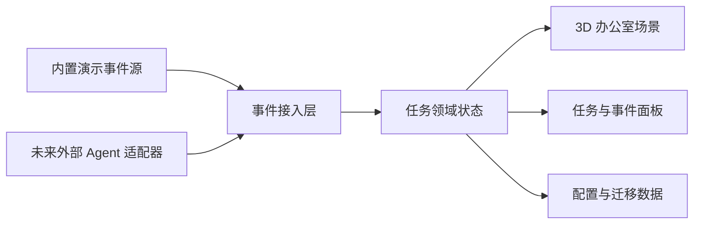
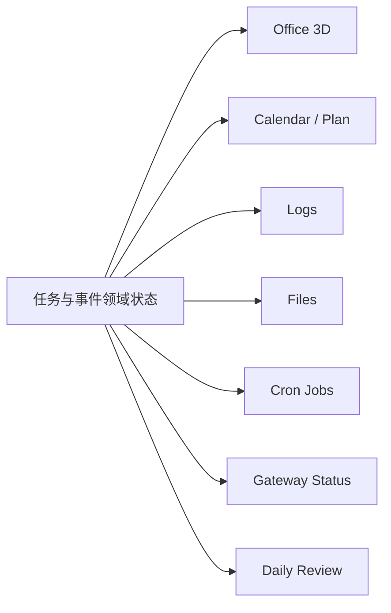

# 3D 赛博办公室需求与设计说明

> 文档版本：0.3
> 文档日期：2026-05-22
> 当前状态：待用户评审
> 目标交付：先形成可执行的需求基线，再进入实现计划与开发

## 1. 文档目的

本文档用于定义一个“3D 赛博办公室”可用原型的需求、范围、体验目标、系统边界和验收标准。

项目希望尽量贴近参考视频的观感：用户打开应用后，不是看到普通任务列表，而是进入一个有空间、有工位、有角色状态、有任务流转感的 3D 办公室。办公室里的 Agent 像在工作，用户可以通过空间和状态理解任务正在发生什么。

本文档优先回答两个问题：

1. 在当前项目里如何复刻这类体验，并把它做成后续可持续扩展的原型。
2. 参考视频里出现了哪些可观察的功能和体验信号，哪些适合进入第一版，哪些适合后续迭代。

## 2. 当前已确认决策

截至本文档编写时，已确认以下方向：

| 决策项 | 已确认结论 |
| --- | --- |
| 原型目标 | 做“可用原型”，不是只有演示画面的空壳 |
| 视频贴合度 | 视觉和体验上尽量贴近参考视频效果 |
| 应用入口 | 先做本地网页应用，架构上保留后续封装桌面端的空间 |
| 任务状态接入 | 优先设计通用任务事件接口，避免绑定某一个 Agent 平台 |
| 初始运行方式 | 即使暂未接入真实 Agent，也要能用内置事件源或模拟器完整演示 |
| 迁移要求 | 后续提供一份迁移到其他电脑的数据迁移与启动教程 |
| 附加工作台能力 | 视频后半段展示的日历、计划、日志、文件、自动化和运行状态等小功能也纳入需求 |
| 视频贴近策略 | 优先靠办公室空间、镜头、家具密度、角色工作感和 UI 主次关系靠近参考视频，而不是只叠黑底霓虹效果 |
| 当前仓库状态 | 已有可运行原型，本文档继续收敛视频贴近度、工作台能力和后续实现基线 |

## 3. 背景与机会

传统 Agent 工作台通常把核心信息放在：

- 任务列表
- 聊天记录
- 日志流
- 执行步骤
- 状态徽章

这些信息足够精确，但不一定足够直观。任务多起来之后，用户需要不断阅读文字才能回答几个基本问题：

- 现在有哪些 Agent 在忙？
- 哪些任务正在排队，哪些卡住了？
- 哪个任务已经完成，哪个需要我介入？
- 当前系统整体是安静、繁忙，还是异常？

3D 赛博办公室的价值在于把一部分任务状态转成空间化信号：

- Agent 有所在位置。
- 任务有工位或归属区域。
- 状态变化可以通过角色动作、屏幕内容、光效、提示和面板同步表现。
- 用户可以在“看办公室”的同时理解系统当前运行态。

这不是为了替代日志和任务详情，而是为任务系统增加一个更直观、更有参与感的总览层。

## 4. 产品愿景

### 4.1 一句话愿景

构建一个可迁移、可扩展、可接入真实任务事件的 3D Agent 办公室，让用户像巡视办公室一样理解多个任务和 Agent 的工作状态。

### 4.2 第一版愿景

第一版应做到：

- 打开后立刻看到一个完整的 3D 办公室场景。
- 场景中至少有多个工位、多个 Agent 角色和清晰的任务状态反馈。
- 用户能从场景进入任务详情，而不是只能看动画。
- 任务状态由统一事件模型驱动，第一版可以由本地事件模拟器喂入真实格式事件。
- 后续接入 Codex、本地脚本、OpenAI/Claude Agent、个人工作流或其他任务系统时，不需要推翻场景层。

## 5. 用户与使用场景

### 5.1 目标用户

#### 主要用户

- 想把 Agent 工作过程可视化的个人开发者。
- 想做有展示感的 AI 工作台或数字办公室原型的创作者。
- 同时跑多个自动化任务，希望快速获得总览的人。

#### 次要用户

- 需要演示 Agent 协作概念的团队成员。
- 想把办公室场景作为桌面侧工作仪表盘的人。

### 5.2 核心使用场景

#### 场景 A：巡视当前任务

用户打开应用，看到办公室里有若干工位：

- 一个 Agent 正在工作。
- 一个 Agent 等待任务。
- 一个 Agent 遇到阻塞。
- 一个任务刚刚完成。

用户不需要先读日志，就能快速知道系统当前大致状况。

#### 场景 B：查看单个任务

用户点击某个 Agent 或工位：

- 看到任务标题。
- 看到当前阶段。
- 看到最近事件。
- 看到开始时间、持续时间、重要输出或错误摘要。

#### 场景 C：演示系统效果

在没有接入外部 Agent 的情况下，用户启动内置演示：

- 场景会自动出现任务。
- Agent 状态会变化。
- 任务会从排队进入执行，再进入完成或阻塞。
- 演示可稳定复现，便于录屏和展示。

#### 场景 D：后续真实接入

外部系统把统一事件推给办公室：

- 创建任务。
- 更新 Agent 状态。
- 上报步骤进度。
- 上报失败、等待用户输入或完成。

办公室负责渲染和交互，不耦合外部 Agent 的实现细节。

#### 场景 E：用附加工作台管理一天的 Agent 工作

用户不只看办公室，也会切到轻量工作台：

- 查看当天安排和学习计划。
- 查看任务进度，并把已经做完的事项标记完成。
- 查看 Agent 晚间或定时运行的任务。
- 查看日志、文件、自动化作业和 Gateway 状态。
- 查看 Agent 对前一天工作的回顾和改进提示。

## 6. 范围定义

### 6.1 第一版必须解决的问题

第一版必须让用户获得以下价值：

1. 有一个可运行、可交互的 3D 办公室体验。
2. 场景状态由任务事件驱动，而不是写死在动画里。
3. 可以查看办公室中 Agent 和任务的当前状态。
4. 即使没有接入外部任务系统，也能通过内置事件源演示完整流程。
5. 后续扩展到桌面端、真实 Agent 接入和数据迁移时，核心结构不需要重写。
6. 参考视频后半段的附加工作台能力不能完全后置，第一版至少要有可进入、可浏览、可演示的基础模块。

### 6.2 第一版范围内

#### 产品能力

- 本地 Web 应用入口。
- 3D 办公室主场景。
- 多工位布局。
- 多 Agent 展示。
- Agent 状态机。
- 任务状态机。
- 场景中的点击选中、聚焦和状态提示。
- 任务详情侧栏或浮层。
- 最近事件流。
- 内置演示事件源。
- 通用任务事件接入层。
- 基础设置能力。
- 工作台附加功能基线，包括日历/计划、日志、文件、自动化作业与运行状态视图。
- 本地保存工作区状态和基础配置。
- 基础数据导出与迁移边界说明。

#### 体验能力

- 用户第一次打开就能看懂“这是 Agent 办公室”。
- 空间里有明确的办公室结构，不只是漂浮面板。
- 视觉上有轻度赛博感，但主体仍然是可读的办公空间。
- 状态变化在场景和面板上都有反馈。
- 演示模式可稳定跑完一个任务生命周期。

### 6.3 第一版范围外

以下内容不作为第一版完成条件：

- 完整办公协作系统。
- 多用户权限和账号体系。
- 云端部署与远程同步。
- 复杂 3D 场景编辑器。
- 高精度角色建模、骨骼动画制作流水线。
- 真正控制任意外部 Agent 的通用调度平台。
- 完整插件市场。
- 复杂聊天系统。
- 与所有开发工具的一次性深度集成。
- 完整日历服务同步。
- 通用文件编辑器或云盘替代品。
- 跨平台自动化作业调度平台。
- 生产级网关监控平台。

这些能力可以在后续版本扩展，但不能拖慢第一版原型成型。

## 7. 复刻目标：先做“办公室”，再做“接入”

### 7.1 为什么不先做纯视觉壳

纯视觉壳能更快做出画面，但很容易出现两个问题：

- 画面像视频，系统却没有可增长的真实能力。
- 后续接入任务系统时，需要把场景动画重写成数据驱动。

因此第一版不应只做“摆几个模型加循环动画”，而要从一开始就把视觉状态和任务事件关联起来。

### 7.2 为什么不一开始绑定某个 Agent 平台

如果第一版直接绑定某个具体平台，会带来迁移和扩展成本：

- 换电脑后依赖链更重。
- 换 Agent 平台时办公室层被迫理解外部平台细节。
- 视频式展示和真实执行逻辑缠在一起，难以排查。

因此推荐把系统拆成：

1. 办公室展示层。
2. 任务领域层。
3. 事件接入层。
4. 外部适配器层。

第一版先把前 3 层做好，再以内置事件源代替外部适配器。

### 7.3 推荐复刻路径

推荐按以下路径推进：

#### 阶段 1：办公室骨架

- 建立 Web 应用。
- 建立 3D 场景、相机、地面、分区、工位和角色初始资产。
- 建立基础交互。
- 先让“办公室是一个可进入的工作空间”成立。

#### 阶段 2：数据驱动状态

- 定义 Agent、任务、事件和场景状态映射。
- 用本地事件源驱动角色状态。
- 让办公室从静态展示变成会响应任务流转的系统。

#### 阶段 3：任务详情与操作入口

- 加入任务详情。
- 加入事件时间线。
- 加入筛选、聚焦和状态概览。
- 让场景和信息面板互相补足。

#### 阶段 4：真实接入准备

- 约束事件协议。
- 提供适配器边界。
- 预留后续连接真实 Agent 的入口。
- 补数据导出、导入和迁移教程方案。

#### 阶段 5：补齐工作台附加能力

- 提供日历、计划和任务进度的基础视图。
- 提供一键完成或状态确认动作。
- 提供日志、文件、Cron Job 和 Gateway 状态视图。
- 提供每日复盘记录或回顾卡片。
- 让办公室视图与附加工作台共享同一任务和事件数据。

## 8. 产品体验要求

### 8.1 视觉体验目标

第一版视觉目标不是“堆满霓虹灯”，而是形成以下印象：

- 这是一个能工作的办公室。
- 它带有数字化和轻赛博气质。
- 它不是普通后台，而是一个有空间感的任务指挥室。
- 它从第一帧就像一个被 Agent 占用的办公室，而不是空房间里摆着几个状态灯。

#### 建议的视觉关键词

- 办公室空间
- 工位分区
- 屏幕发光
- 半透明状态提示
- 清晰任务信号
- 角色忙碌感
- 轻量未来感
- 开放办公空间
- 真实室内道具
- 斜俯视场景展示
- 控制台让位于房间主体

### 8.2 参考视频贴近点

从参考视频的可观察画面来看，第一版应尽量贴近以下信号：

- 俯视或斜俯视的 3D 办公室视角。
- 明确的工位、桌椅、区域和角色。
- 画面主体是办公室场景，不是二维管理面板。
- 作者可以在 3D 编辑与效果展示之间切换。
- 成品演示时办公室里有“有事正在发生”的感觉。
- 办公室是偏开放式、可巡视的空间，而不是纯黑背景中的孤立设备集合。
- 场景中存在室内生活感：家具、绿植、墙面或玻璃边界、会议或协作区域、辅助摆件。
- 默认镜头能把办公室整体形态、区域关系和 Agent 分布一次性交代清楚。
- 状态屏幕与任务界面提供数字感，但办公室材质、空间和摆件仍然占视觉主导。

第一版不要求复刻视频里的具体美术资产，但要复刻其体验逻辑：

- 任务被放进空间里。
- 角色承载状态。
- 办公室本身就是信息界面。
- 用户有“走进一个 AI 团队办公现场”的感觉。

### 8.3 视频优先视觉基线

为了避免实现时把“赛博”理解成单一暗色霓虹风，第一版视觉基线定义如下。

#### 8.3.1 空间基调

- 视觉主体应是一个完整办公室空间。
- 场景应可读出地面、墙面或隔断、窗面或边界、工位区和公共区。
- 场景允许有局部深色屏幕和状态光，但房间本身不应只依赖黑色地板、黑色墙面和发光网格成立。
- 赛博感应来自智能工作状态、屏幕、任务光效、自动化模块和 Agent 行为，而不是把所有材质都处理成暗色控制台。

#### 8.3.2 画面密度

- 首屏应有足够的办公室细节，避免出现大面积空地。
- 主工位区至少应能看见桌面、屏幕、座椅和工位边界。
- 公共区至少应有一种协作或休息语义，例如会议桌、站会区、白板、任务墙、沙发区或讨论角。
- 场景装饰至少应有一种软化办公空间的元素，例如绿植、灯具、墙面装饰、柜体、隔断或窗景。
- 若第一版同时呈现 Pending 与 Done，它们不应只表现为两张孤立桌子；至少应在形态、区域标识或结果展示上拉开差异。

#### 8.3.3 状态可视化的克制

- 运行中、等待输入、阻塞和完成必须明显，但状态光效不能淹没家具和角色。
- 任务热点应更像办公室里的动态提示，而不是把整间办公室变成仪表盘背景。
- 状态颜色与状态形态应结合，例如屏幕亮起、角色动作、任务卡、区域提示、警告标记，而不是只改一个 emissive 颜色。

#### 8.3.4 录屏与展示要求

- 默认进入后的画面应适合直接截屏或录屏。
- 第一帧应同时交代办公室全貌、Agent 分布和至少一处任务活跃信号。
- Demo 启动后，用户应能在不切模块的情况下看到办公室明显“活起来”。

### 8.4 空间布局要求

#### 8.4.1 推荐空间分区

第一版办公室建议至少包含以下分区：

| 分区 | 目的 | 第一版最低表现 |
| --- | --- | --- |
| 主工作区 | Agent 日常执行任务 | 多个相邻工位、桌椅、屏幕和角色 |
| 待办/分配区 | 表达任务进入系统和等待认领 | 待办台、任务板、投影卡片或显著区域标识 |
| 完成/交付区 | 表达已完成结果 | 完成台、归档架、输出屏或显著完成标识 |
| 协作区 | 表达讨论、复盘或规划 | 会议桌、站会点、白板、任务墙之一 |
| 环境装饰区 | 让办公室像真实空间 | 绿植、窗面、柜体、灯具、隔断之一 |

#### 8.4.2 布局关系

- 主工作区应靠近视觉中心。
- 待办区与完成区应能从默认镜头区分，不应与普通工位完全同形。
- 协作区应服务于 Review、Plan 或 Agent 复盘的语义。
- 不同区域之间需要留出通行感，但空白面积不应主导首屏。

#### 8.4.3 可扩展布局

- 办公室资产应尽量模块化，方便后续换摆件、增工位、改区域。
- 默认布局应给后续增加更多 Agent 留出结构空间。
- 区域和工位的语义不应只写死在颜色里，后续可由配置驱动。

### 8.5 家具与环境资产要求

#### 8.5.1 工位最低资产

每个主要工位建议具备：

- 桌面。
- 显示器或屏幕。
- 座椅。
- 屏幕支架或桌面结构细节。
- 至少一种小型桌面物件，例如键盘、终端盒、杯子、文件块或状态托盘。

#### 8.5.2 公共资产最低集合

第一版建议优先补齐：

- 会议桌或协作桌。
- 白板、任务屏或墙面展示屏。
- 绿植。
- 柜体、储物架或隔断。
- 局部灯具或窗面光源。

#### 8.5.3 资产风格

- 资产应偏低多边形、简洁和可读，优先保证室内语义。
- 资产不能因细节过多拖垮首屏性能。
- 道具颜色应帮助区分木质/金属/布面/屏幕等材质，不建议所有物体都落在同一暗蓝材质族。

### 8.6 角色呈现要求

#### 8.6.1 角色形态

- Agent 应更接近“办公室角色”，而不是纯抽象状态方块。
- 第一版可采用低多边形、卡通简化或 stylized 小人，不要求高精度真人。
- 角色与工位关系应明确，工作中角色应看起来在使用工位或靠近执行位置。

#### 8.6.2 角色动作

第一版建议覆盖：

| 状态 | 建议动作 |
| --- | --- |
| Idle | 轻待机、站立或安静坐姿 |
| Working | 坐在桌前、轻敲击、身体微动或屏幕交互 |
| Waiting Input | 停顿、提示标记、转向用户提示或悬浮问号 |
| Blocked / Failed | 明显停滞、告警标记、屏幕异常反馈 |
| Completed | 工作结束后的收束反馈，例如屏幕转安静态或短完成提示 |

#### 8.6.3 角色身份

- 不同职责的 Agent 可通过衣着配色、配件、工位物件或标签轻区分。
- 角色识别不应只靠两只发光眼睛颜色。
- 角色名字与任务状态应能通过场景选中和详情面板得到确认。

### 8.7 镜头与灯光要求

#### 8.7.1 默认镜头

- 默认镜头应采用斜俯视或等距感较强的巡视视角。
- 首屏应能看到主要工位、至少一个公共区域和房间边界。
- 镜头不应默认过低导致用户只看到单排桌子。
- 镜头不应默认过远导致 Agent 与工位读不清。

#### 8.7.2 交互镜头

- 用户仍可旋转、平移和缩放。
- 聚焦 Agent 时可轻推近，但需保留空间方向感。
- 应提供返回默认视角入口。

#### 8.7.3 灯光

- 灯光应优先服务“办公室空间可读”。
- 环境光和主光应让桌椅、角色、区域关系清楚。
- 状态光应作为辅助强调，例如屏幕发光、区域提示、局部任务光。
- 不建议第一版把房间压成极暗场景后再依赖发光网格读形。

### 8.8 交互体验要求

第一版建议支持：

- 鼠标拖拽旋转或平移视角。
- 滚轮缩放。
- 点击 Agent。
- 点击工位或任务热点。
- 选中后聚焦视觉反馈。
- 从全局总览进入任务详情。
- 从详情回到办公室总览。

### 8.9 UI 与 3D 主次关系

#### 8.9.1 Office 模式

- 3D 场景应占据绝对主面积。
- 状态栏、事件流、Demo 控件和详情面板应作为控制层附着其上，而不是把办公室挤成小预览框。
- 无选中对象时，详情面板不应长期以大空卡片抢占注意力。
- Event Feed 应支持轻量化呈现，避免挡住关键场景区域。

#### 8.9.2 Workbench 模式

- 日历、日志、文件、Cron、Gateway 和 Review 可以偏信息密度，但视觉语言仍应属于同一办公室系统。
- 从 Workbench 返回 Office 时，用户应感到自己回到主现场，而不是从另一个产品跳回来。

### 8.10 状态反馈要求

状态不能只靠颜色表达。每个关键状态至少应有两类反馈：

| 状态 | 场景反馈 | 信息反馈 |
| --- | --- | --- |
| 空闲 | 角色待机、工位较安静 | 状态标签为 Idle |
| 排队 | 任务出现在待办区或工位提示中 | 状态标签为 Queued |
| 执行中 | 角色在工位工作、屏幕活跃、轻动效 | 当前步骤和持续时间 |
| 等待输入 | 角色或工位出现醒目标记 | 提示用户需要介入 |
| 阻塞/失败 | 异常提示、告警光效或图标 | 错误摘要和最近事件 |
| 完成 | 完成反馈、工位进入安静态 | 输出摘要和完成时间 |

## 9. 功能需求

### 9.1 主场景

#### FR-001 办公室场景加载

系统应在应用启动后展示一个完整 3D 办公室主场景。

最低要求：

- 场景有地面、墙面或空间边界感。
- 场景有若干工位。
- 场景有多个 Agent 位置。
- 场景有可识别的任务状态热点。
- 场景能看出主工作区与至少一个非工位公共区域。
- 场景中已有基础室内道具，不以空地、网格和孤立桌子充当办公室。

#### FR-001A 默认场景视觉基线

系统应提供一个开箱即用的默认办公室布局，用于首次进入、演示和录屏。

默认布局最低要求：

- 至少包含一个主工作区。
- 至少包含待办/分配区与完成/交付区中的一种清晰空间表达；若两者都出现，应能从形态或标识区分。
- 至少包含一个协作语义区域，例如会议桌、站会点、白板、任务墙或复盘区。
- 至少包含一种环境装饰资产，例如绿植、窗面、隔断、柜体或灯具。
- 首屏中应能看到多个 Agent、多个工位和至少一处活跃状态信号。

#### FR-001B 空间分区语义

系统应让办公室区域承担信息表达，而不是只靠面板解释。

最低要求：

- 主工作区表达“Agent 正在执行任务”。
- 待办区表达“任务进入系统、等待认领或等待分配”。
- 完成区表达“任务结果已产出或可回顾”。
- 协作区能承接计划、复盘、Review 或多 Agent 协作的后续扩展。
- 区域语义能通过布局、资产、标识、屏幕或任务卡片体现，不应只依赖单一颜色。

#### FR-002 相机与浏览

用户应能浏览办公室整体空间。

最低要求：

- 支持缩放。
- 支持旋转或平移视角。
- 支持回到默认视角。
- 默认视角应能一眼看到主要工作区。
- 默认视角应能交代办公室边界、工位分布和至少一个公共区域。
- 选中对象后的聚焦不应让用户失去对整体空间的方向感。

#### FR-002A 展示镜头

系统应提供适合首次进入和演示录屏的展示镜头。

最低要求：

- 镜头基调为斜俯视或等距感较强的巡视视角。
- Agent、工位、屏幕和主要分区在常见桌面视口下可读。
- 不因默认镜头过低而把办公室压成一排桌面特写。
- 不因默认镜头过远而把角色缩成难辨识的小点。
- 用户可从任意浏览状态返回该展示镜头。

#### FR-003 场景选中

用户点击 Agent、工位或任务热点后，系统应提供选中反馈。

最低要求：

- 场景中被选对象有高亮或聚焦。
- 信息面板展示对应数据。
- 当前选择可取消。

#### FR-004 家具与环境资产基线

系统应为默认办公室提供支撑“办公现场感”的家具和环境资产。

最低要求：

- 主要工位具备桌面、屏幕、座椅和至少一种桌面小物件。
- 场景中具备至少一种公共资产，例如会议桌、白板、任务屏、柜体或隔断。
- 场景中具备至少一种软化空间的环境资产，例如绿植、窗面、灯具或墙面装饰。
- 资产风格优先低多边形、模块化、可替换和可读，不以高精度写实为第一版门槛。
- 资产颜色和材质应帮助区分家具、屏幕、角色和提示，不应全部坠入单一暗色材质族。

#### FR-005 3D 与 UI 视觉主次

系统应在 Office 模式下保持 3D 办公室为主体验。

最低要求：

- Office 模式中 3D 场景占据主面积。
- 状态概览、事件流、Demo 控件和详情面板不应把办公室挤成小型预览框。
- 无选中对象时不展示抢占主视线的大块空详情面板。
- 关键场景区域不被固定 UI 长期遮挡。
- 附加工作台返回 Office 后，用户仍能回到同一主现场语境。

### 9.2 Agent 展示

#### FR-010 Agent 列表与身份

系统应支持展示多个 Agent。

每个 Agent 至少包含：

- 唯一标识。
- 显示名称。
- 角色类型或职责标签。
- 当前状态。
- 当前任务引用。
- 所属工位或场景位置。

#### FR-011 Agent 状态映射

Agent 状态变化应驱动场景表现。

最低要求：

- 空闲与工作中表现不同。
- 等待用户输入与失败状态能明显区分。
- 状态更新后，无需刷新整个页面。
- 工作中 Agent 应表现出在使用工位、靠近任务点或发生轻动作反馈。
- 等待输入、阻塞、失败和完成不应只靠一种颜色变化表达。
- 角色身份可通过职责标签、配色、配件、工位物件或选中信息辅助识别。

#### FR-011A Agent 工作感

系统应让 Agent 看起来像办公室中的执行者，而不是纯状态图标。

最低要求：

- 默认场景中 Agent 与工位、协作区或任务热点有明确空间关系。
- Agent 状态反馈至少结合两类信号，例如姿态/动作、屏幕、提示标记、区域反馈、状态标签。
- Demo 运行时应能观察到至少一个 Agent 从静态转入工作态，再转入完成或异常态。
- 第一版可使用简化 stylized 角色，但角色轮廓和职责感应优先于复杂骨骼动画。

#### FR-012 Agent 详情

用户选中 Agent 后，应能看到：

- 名称和职责。
- 当前状态。
- 当前任务。
- 最近事件。
- 与当前任务相关的简要时间信息。

### 9.3 任务系统

#### FR-020 任务模型

系统应有独立任务模型。

任务至少包含：

- 任务 ID。
- 标题。
- 摘要。
- 状态。
- 所属 Agent。
- 创建时间。
- 更新时间。
- 最近事件。
- 可选的输出摘要。
- 可选的错误摘要。

#### FR-021 任务状态机

第一版任务状态至少支持：

- `created`
- `queued`
- `assigned`
- `running`
- `waiting_input`
- `blocked`
- `failed`
- `completed`
- `cancelled`

#### FR-022 任务详情

用户应能查看任务详情。

最低要求：

- 当前状态。
- Agent 归属。
- 当前步骤或最近事件。
- 时间线摘要。
- 输出或错误摘要。

#### FR-023 任务与空间映射

任务状态应能投影到办公室空间。

示例映射：

- 新任务进入待办区。
- 已分配任务显示在对应 Agent 工位。
- 运行中任务让工位屏幕活跃。
- 需要用户输入的任务显示提醒。
- 已完成任务进入完成摘要或完成区。

### 9.4 事件驱动

#### FR-030 通用事件输入

系统应定义统一事件格式，用于驱动场景和信息面板。

第一版可支持：

- 内置演示事件源。
- 本地事件适配入口。
- 未来外部适配器复用同一协议。

#### FR-031 事件处理

系统应根据事件更新：

- 任务状态。
- Agent 状态。
- 最近事件流。
- 场景表现。

#### FR-032 事件可观察性

用户应能看到最近发生的关键事件。

最低要求：

- 事件有时间顺序。
- 事件与任务或 Agent 有关联。
- 失败和等待输入事件可被识别。

### 9.5 演示模式

#### FR-040 内置演示

系统应提供可重复运行的演示模式。

演示模式至少覆盖：

- 任务创建。
- 排队。
- Agent 接单。
- 运行中。
- 一个完成结果。
- 一个等待输入或阻塞分支。

#### FR-041 演示控制

第一版建议支持：

- 开始演示。
- 暂停或重置演示。
- 切换演示节奏或预设脚本。

### 9.6 信息面板

#### FR-050 全局状态概览

系统应提供不遮挡主场景的状态概览。

建议显示：

- 总任务数。
- 运行中任务数。
- 等待用户输入数。
- 异常任务数。
- 当前活跃 Agent 数。

#### FR-051 详情面板

系统应在选中 Agent 或任务后展示详情。

体验要求：

- 面板与 3D 场景有明确主次关系。
- 详情面板不应让应用退化成普通列表后台。
- 关闭详情后可快速回到总览。

#### FR-052 最近事件流

系统应提供最近事件列表。

建议支持：

- 按最新事件滚动。
- 标记任务和 Agent。
- 对异常事件提供更高可见度。

#### FR-053 模块切换

系统应允许用户在办公室总览和附加工作台模块之间切换。

建议模块：

- Office。
- Calendar / Plan。
- Logs。
- Files。
- Automations。
- Runtime Status。
- Reviews。

第一版切换时应保留用户对当前任务或 Agent 的上下文，避免每切一个模块就失去当前位置。

### 9.7 设置与迁移准备

#### FR-060 基础设置

第一版建议支持以下基础设置：

- 演示模式开关。
- 动效强度或性能档位。
- 默认视角重置。
- 状态显示偏好。

#### FR-061 可迁移配置

系统应尽量把可迁移内容收敛为明确数据：

- 场景布局配置。
- Agent 配置。
- 演示脚本配置。
- 用户偏好设置。

#### FR-062 迁移教程要求

后续交付应包含一份数据迁移与启动教程，至少说明：

- 新电脑需要准备什么运行环境。
- 如何安装依赖。
- 如何启动应用。
- 哪些文件属于配置和数据。
- 如何导出旧数据。
- 如何导入到新电脑。
- 哪些数据不会被迁移。
- 常见迁移失败场景如何排查。

### 9.8 附加工作台能力

参考视频后半段展示的产品不只是一个 3D 场景，也包含一组偏 Mission Control 的轻量管理功能。第一版应把这组能力纳入工作台基线，但不要求一开始就做到生产级外部集成。

#### FR-070 日历与当天安排

系统应提供当天安排视图。

最低要求：

- 能展示一天内的计划事项或时间块。
- 能关联相关任务、计划或 Agent。
- 没有外部日历接入时，可由本地演示数据和本地配置驱动。

后续可扩展外部日历同步、不同来源事件合并，以及从计划直接创建 Agent 任务。

#### FR-071 学习计划与进度

系统应支持展示某类长期计划及其阶段进度。

第一版建议覆盖：

- 计划标题。
- 阶段或子目标。
- 当前完成度。
- 关联任务。
- 最近进展说明。

该能力用于承接视频中“学习规划”和“告诉我进度”的体验信号，也可泛化到研发计划、内容计划或个人目标。

#### FR-072 完成动作

用户应能对可确认的事项执行完成动作。

最低要求：

- 在任务、计划项或待办项上提供完成入口。
- 完成后状态、时间线和可视化统计同步更新。
- 对由外部系统控制的事项，应区分“本地确认完成”和“外部执行完成”。

#### FR-073 持续运行与定时工作提示

系统应能表达 Agent 在非当前交互时段仍然运行或由定时任务触发。

最低要求：

- 展示最近定时执行记录。
- 展示下一次计划执行或当前运行状态。
- 将晚间、后台或定时任务与普通前台任务在信息上区分。

#### FR-074 日志中心

系统应提供日志或活动记录视图。

最低要求：

- 可按时间查看任务、Agent 和系统事件。
- 能区分普通进度、告警、失败和复盘类记录。
- 能从日志记录跳回关联任务或 Agent。

#### FR-075 文件管理视图

系统应提供任务相关文件的基础管理视图。

最低要求：

- 展示由任务生成、引用或保存的文件清单。
- 展示文件名称、来源任务、更新时间和路径或引用信息。
- 后续迁移教程应说明文件资产是否随迁移包移动。

第一版不要求替代系统文件管理器，也不要求实现复杂在线编辑器。

#### FR-076 Cron Job 视图

系统应提供定时作业视图。

最低要求：

- 展示作业名称、计划、最近运行结果和下一次运行时间。
- 能查看作业与 Agent 或任务的关系。
- 演示模式中至少要有一组定时作业示例数据。

#### FR-077 Gateway 与运行状态视图

系统应提供外部接入或运行通道的状态概览。

最低要求：

- 展示连接或 Gateway 的可用状态。
- 展示最近心跳、最近异常或最近断开信息。
- 未接入真实服务时，演示模式也应能展示一组状态变化。

#### FR-078 每日复盘与改进提示

系统应支持展示 Agent 对一段时间工作的复盘结果。

最低要求：

- 展示回顾主题，例如昨天完成了什么、哪里不足、今天建议关注什么。
- 支持关联任务或事件来源。
- 第一版可先由演示脚本或本地记录生成，不要求自动召开真实会议。

该能力用于承接视频中“开会回顾昨天的事情”和“检测到不足”的体验信号。

## 10. 非功能需求

### 10.1 可迁移性

项目应尽量满足：

- 本地可运行。
- 不强依赖云账号。
- 不要求绑定某一台机器的绝对路径。
- 配置与代码边界清晰。
- 外部适配器和核心场景可分离。

### 10.2 可扩展性

系统应能扩展：

- 更多 Agent。
- 更多任务状态。
- 更多房间或区域。
- 真实任务适配器。
- 桌面端封装。
- 更丰富的 3D 资产和动画。

### 10.3 性能

第一版至少应关注：

- 初始场景加载不能让用户长时间面对空白页。
- 常见开发机上交互要保持流畅。
- 状态更新不应导致整个 3D 场景明显卡顿。
- 低性能设备可通过降低动效或画面复杂度继续使用。

### 10.4 可理解性

用户应能在短时间内看懂：

- 哪些 Agent 在工作。
- 哪些任务异常。
- 如何点进详情。
- 如何启动演示。

### 10.5 可靠性

系统面对异常事件时应：

- 不因一条坏事件导致主场景崩溃。
- 对未知状态保留降级展示。
- 对断开的外部事件源给出可见提示。

### 10.6 本地持久化

第一版应把“可保存”作为明确能力，而不是依赖页面刷新前的内存状态。

建议优先保存：

- Agent 配置。
- 办公室布局配置。
- 日历/计划示例或本地条目。
- 演示脚本状态。
- 最近任务和事件摘要。
- 文件索引、Cron Job 示例和运行状态示例。
- 用户界面偏好。

如果某类数据只是临时缓存，系统文档应明确说明它不属于迁移数据。

## 11. 信息架构

第一版建议采用以下结构：

### 11.1 主界面

- 3D 办公室场景。
- 轻量全局状态概览。
- 当前选中对象详情。
- 最近事件。
- 演示或连接状态入口。
- 通向日历/计划、日志、文件、自动化、运行状态和复盘模块的轻量导航。

### 11.2 主要对象

- Office：办公室场景。
- Zone：区域，例如工位区、待办区、完成区。
- Desk：工位。
- Agent：执行者。
- Task：任务。
- Event：状态变化记录。
- Adapter：外部事件转换层。

## 12. 领域模型建议

### 12.1 Agent

建议字段：

```json
{
  "id": "agent-research-01",
  "name": "Research Agent",
  "role": "research",
  "status": "running",
  "deskId": "desk-a1",
  "currentTaskId": "task-001",
  "lastActiveAt": "2026-05-22T10:00:00+08:00"
}
```

### 12.2 Task

建议字段：

```json
{
  "id": "task-001",
  "title": "整理参考视频能力清单",
  "summary": "从视频中抽取办公室原型需求",
  "status": "running",
  "assignedAgentId": "agent-research-01",
  "createdAt": "2026-05-22T10:00:00+08:00",
  "updatedAt": "2026-05-22T10:03:00+08:00",
  "outputSummary": null,
  "errorSummary": null
}
```

### 12.3 Event

建议字段：

```json
{
  "id": "event-0003",
  "type": "task.progress",
  "occurredAt": "2026-05-22T10:03:00+08:00",
  "taskId": "task-001",
  "agentId": "agent-research-01",
  "payload": {
    "status": "running",
    "message": "正在分析视频抽帧与交互模式",
    "progress": 0.45
  }
}
```

### 12.4 第一版事件类型建议

建议最少支持：

- `task.created`
- `task.queued`
- `task.assigned`
- `task.started`
- `task.progress`
- `task.waiting_input`
- `task.blocked`
- `task.failed`
- `task.completed`
- `agent.status_changed`
- `office.demo_reset`

## 13. 系统设计建议

### 13.1 总体分层

推荐采用以下分层：



### 13.2 层级职责

#### 事件接入层

负责：

- 接收原始事件。
- 校验事件结构。
- 标准化事件。
- 将事件交给任务领域层。

不负责：

- 3D 渲染。
- 外部 Agent 的业务决策。

#### 任务领域层

负责：

- 维护 Agent 状态。
- 维护任务状态。
- 应用事件到领域对象。
- 生成 UI 和场景可消费的状态。

不负责：

- 场景模型细节。
- 具体网络接入实现。

#### 3D 场景层

负责：

- 空间布局。
- 工位和角色呈现。
- 状态动画和高亮。
- 选中和相机交互。

不负责：

- 自己解释外部 Agent 事件。
- 自己持久化业务数据。

#### 信息面板层

负责：

- 概览数据。
- 任务详情。
- Agent 详情。
- 最近事件。
- 演示控制入口。

### 13.3 桌面端预留

第一版先做 Web，但需保留以下原则：

- 不把核心逻辑写死在浏览器地址栏流程里。
- 配置存储方案要能迁移到桌面容器。
- 事件适配器边界清晰。
- 后续桌面封装更像“装壳”，而不是重写应用。

### 13.4 附加模块与共享数据

办公室视图和附加工作台不应各自维护一套互相冲突的数据。

推荐关系：



附加模块可以有自己的视图模型和筛选状态，但核心任务、Agent、事件、运行状态引用应保持统一。

## 14. 页面与交互草图说明

### 14.1 主界面布局建议

主界面建议以 3D 场景为中心：

- 中央和最大面积：办公室场景。
- 左上或顶部：全局状态概览。
- 右侧：选中对象详情。
- 底部或左下：最近事件与演示控制。

#### 14.1.1 Office 模式布局边界

- 3D 场景应是首屏最大容器。
- 顶部导航应服务模块切换，不应像营销页首屏导航一样占据过多高度。
- 状态栏应让用户快速扫到运行中、等待输入和异常数量。
- 详情面板只在用户选中 Agent、任务或热点后承担主要信息阅读。
- 最近事件流应优先短、密、可折叠或可弱化，避免长期遮住主工作区。
- Demo 控件应易找，但不应在未操作时盖住办公室主体。

#### 14.1.2 默认空间构图建议

默认 Office 构图建议满足：

| 画面区域 | 建议内容 | 设计意图 |
| --- | --- | --- |
| 视觉中心 | 主工作区与正在工作的 Agent | 用户先确认“办公室在运转” |
| 一侧前景 | 待办/任务进入提示 | 用户理解任务从哪里来 |
| 另一侧或后场 | 完成/交付提示 | 用户理解任务往哪里去 |
| 后场或边缘 | 协作区、白板、Review 区 | 给后续计划与复盘语义落点 |
| 房间边界 | 墙面、窗面、绿植、柜体或隔断 | 让场景像室内空间而非漂浮展台 |

#### 14.1.3 视觉遮挡约束

- 默认镜头下，状态栏不应压住所有 Agent 名称或工位屏幕。
- 详情面板展开后，仍应保留一块足以观察任务流转的主场景面积。
- 事件流出现异常高亮时，不应完全覆盖异常对象本身。
- 移动端或窄窗口下，可优先降级事件流和详情面板布局，但不应把主场景完全挤出首屏。

### 14.2 默认进入体验

用户首次打开应用时：

1. 先看到办公室主场景。
2. 场景中已有几名 Agent，且至少一名 Agent 或一个工位显得处于活跃状态。
3. 用户能从画面上区分工作区与至少一个公共/任务区域。
4. 演示模式有清晰入口。
5. 如果自动播放演示，则应允许重置。
6. 详情面板初始状态不应抢走主场景。
7. 首屏无需阅读说明文字，也能知道这是一个 Agent 办公室而不是普通看板。

### 14.3 选中 Agent 的体验

用户点击 Agent 后：

1. 场景高亮 Agent 和其工位。
2. 相机可轻微聚焦，但不应迷失方向。
3. 右侧详情出现 Agent 与当前任务信息。
4. 最近事件定位到该 Agent 相关事件。

### 14.4 异常任务体验

当任务等待输入或失败：

1. 场景中有明显提示。
2. 概览数字同步变化。
3. 详情可看到原因摘要。
4. 事件流能看见异常发生时间。

### 14.5 视觉贴近视频的检查点

设计和实现阶段应至少对照以下问题检查：

1. 把所有面板文字遮住后，场景本身还像一个办公室吗。
2. 把霓虹和发光网格减弱后，房间结构、工位和角色仍然成立吗。
3. Demo 运行 10 秒内，画面里是否能观察到 Agent、工位或任务区发生有意义变化。
4. 截一张默认首屏图时，是否能看出工位密度、空间边界和协作区域。
5. Office 与 Calendar、Logs、Files、Cron、Gateway、Review 切换后，是否仍像同一个产品系统。

## 15. 第一版优先级

### 15.1 P0：必须完成

- 可启动的本地 Web 应用。
- 3D 办公室主场景。
- 默认场景具备工作区、任务区和至少一个公共/协作语义区域。
- 默认场景具备桌椅、屏幕和基础环境道具，能形成办公室现场感。
- 默认相机和基础浏览交互。
- 可返回的斜俯视展示镜头。
- 多工位和多 Agent 展示。
- 至少一类 Agent 工作态场景反馈。
- Agent 状态与任务状态模型。
- 通用事件模型。
- 内置演示事件源。
- 演示过程能驱动场景状态变化。
- 点击 Agent 或任务后有详情信息。
- 全局状态概览。
- 最近事件流。
- 基础异常状态展示。
- Office 模式保持 3D 场景为视觉主体。
- 附加工作台模块导航。
- 日历/计划、日志、文件、Cron Job、Gateway 状态和每日复盘的基础视图。
- 本地保存基础配置和工作台演示数据。

### 15.2 P1：强烈建议

- 演示脚本控制。
- 场景布局配置化。
- Agent 配置化。
- 性能档位或动效设置。
- 导出配置入口。
- 数据迁移文档。
- 附加工作台模块与办公室选中上下文联动。
- 附加模块更丰富的筛选、空状态和异常状态。
- 更丰富的办公室道具组合与空间细节层次。
- 待办区、完成区、Review 区与任务状态的更强空间联动。
- Agent 职责化外观、配件或工位风格差异。
- 更完整的镜头过渡、聚焦反馈和演示录屏预设。

### 15.3 P2：后续增强

- 接入真实 Agent 平台。
- 多办公室或多楼层。
- 角色自定义。
- 场景编辑器。
- 桌面端封装。
- 历史任务回放。
- 更多任务操作能力。
- 外部日历深度同步。
- 文件内容在线编辑。
- 生产级自动化调度和监控。

## 16. 视频观察与功能清单

本节基于已查看的视频录屏抽帧进行整理。它不是逐帧转写，而是对可观察体验的归纳。

### 16.1 视频中明显出现的内容

- 一个已经成型的 3D 办公室场景。
- 办公室中有工位、区域、人物和室内物件。
- 场景观感更像开放式办公室，而不是孤立设备摆在黑色舞台上。
- 默认展示画面能同时看到空间边界、桌面密度和角色分布。
- 作者在视频中展示了成品效果。
- 视频中出现了 3D 编辑或场景搭建界面。
- 作者展示了办公室不断迭代和补细节的过程。
- 视频中出现了 AI 工具或提示词相关界面，用于辅助生成或调整效果。
- 视频后半段出现了当天安排、学习规划、进度说明和完成动作。
- 视频后半段出现了保存、日志、文件管理页面和定时作业视图。
- 视频后半段出现了 Gateway 运行情况与昨日回顾、问题检查等复盘信号。
- 成品演示强调“给某个 AI/Agent 搭建办公室”的趣味性和可视化价值。

### 16.2 从视频反推的能力方向

| 能力方向 | 观察依据 | 第一版处理 |
| --- | --- | --- |
| 3D 办公室空间 | 视频主体就是空间化办公室 | 必做 |
| 场景内角色 | 办公室中有人物与工作感 | 必做 |
| 多区域/多工位 | 场景不是单桌单人 | 必做 |
| 开放办公构图 | 默认画面能读出房间、工位与公共区关系 | 必做 |
| 家具与环境道具 | 室内物件共同塑造办公室现场感 | 第一版做基线资产 |
| 镜头展示感 | 成品适合直接看和录屏 | 第一版做默认展示镜头 |
| UI 主次关系 | 视频主体仍是 3D 办公室而非纯控制台 | 第一版约束 Office 模式 |
| 场景编辑过程 | 视频展示搭建迭代 | 第一版不做完整编辑器 |
| AI 辅助搭建 | 视频出现提示词/工具流程 | 第一版先不做生成工作流 |
| 演示感 | 成品适合录屏和展示 | 必做 |
| 可扩展资产 | 办公室细节会不断丰富 | 架构预留 |
| 日历与计划 | 后半段展示当天安排和学习规划 | 第一版做基础视图 |
| 进度与完成 | 后半段展示进度说明和完成动作 | 第一版做基础动作 |
| 日志与文件 | 后半段展示日志和文件管理页面 | 第一版做索引视图 |
| Cron Job | 后半段展示所有定时作业 | 第一版做基础视图 |
| Gateway 状态 | 后半段展示 Gateway 情况 | 第一版做运行状态卡片 |
| 每日复盘 | 后半段展示昨日回顾和不足检查 | 第一版做复盘卡片 |

### 16.3 不建议直接照搬的部分

以下内容即使视频中出现，也不建议第一版直接照搬：

- 复杂的 3D 编辑器能力。
- 为了视觉效果堆过多资产，导致性能和维护成本上升。
- 把 AI 生成流程直接嵌进第一版主路径。
- 先追求电影级角色动画，再补任务系统。
- 把日历、文件管理、Cron Job 和 Gateway 直接做成生产级平台。

原因是本项目当前优先目标是“可用原型”，不是单次视频复刻。

## 17. 验收标准

### 17.1 产品验收

第一版满足以下条件时，可认为产品目标成立：

1. 用户通过本地启动命令打开应用。
2. 首屏看到的是完整 3D 办公室，而不是配置页或普通列表。
3. 默认镜头下能同时读出主工作区、多个 Agent/工位和至少一个公共或任务区域。
4. 场景中存在支撑办公室语义的基础家具与环境道具。
5. 内置演示可推动任务从创建到执行再到完成或异常。
6. 场景表现会随着事件变化。
7. 用户能点击 Agent 或任务查看详情。
8. 用户能从概览看出运行中、等待输入和异常任务数量。
9. 用户能打开至少一组日历/计划数据并查看进度。
10. 用户能看到日志、文件、Cron Job 和 Gateway 状态基础视图。
11. 用户能查看一条每日复盘或改进提示。
12. 用户能对至少一个本地可确认事项执行完成动作。
13. 任务事件协议存在清晰边界，后续可接外部适配器。

### 17.2 体验验收

第一版应通过以下体验检查：

- 看一眼能理解它是“办公室里的 Agent 工作台”。
- 看一眼能感受到空间、工位密度和角色分布，而不是只看到暗色底板上的状态灯。
- 不看详情也能感知谁在忙、哪里异常。
- 状态提示足够清楚，但不会盖过家具、角色和房间结构。
- 看详情时不会失去对办公室主场景的关系感。
- 演示流程适合录屏或给他人展示。
- 附加工作台像办公室的控制台延伸，而不是与办公室割裂的另一套产品。

#### 17.2.1 视觉验收清单

第一版视觉验收建议单独检查：

- 默认首屏截图中，至少能辨认出工位、角色、房间边界和一种公共区。
- 主要工位截图中，至少能辨认出桌面、屏幕和座椅关系。
- Demo 运行截图或录屏中，至少能看见一个 Agent 或工位状态发生变化。
- 默认主题不依赖过度暗化和全屏霓虹来制造“赛博”感。
- 常见桌面视口和窄窗口下，UI 不把办公室主体遮没。

### 17.3 工程验收

第一版工程上应做到：

- 核心状态逻辑与 3D 渲染层分离。
- 演示事件源可替换。
- 配置和可迁移数据边界明确。
- README 或文档能指导新环境启动。
- 后续迁移教程有明确补充位置和范围。

## 18. 风险与应对

### 18.1 风险：只顾视觉，缺少真实内核

应对：

- 从第一版就定义事件模型。
- 用模拟事件驱动场景。
- 保持场景层和领域层分离。

### 18.2 风险：为了“贴近视频”把范围拉爆

应对：

- 第一版锁定主场景视觉基线、状态流转、详情和演示。
- 将“必须看起来像办公室”的资产集合与“可以继续堆细节”的资产集合分层。
- 场景编辑器和 AI 生成工作流后置。

### 18.3 风险：3D 资产制作耗时过高

应对：

- 先用可替换资产和模块化区域构建空间。
- 先保证工位、角色、状态表达成立。
- 后续再提高资产精度。

### 18.4 风险：办公室细节密度上来后影响性能和可读性

应对：

- 先定义低多边形、模块化、可复用的资产层级。
- 对家具、装饰和状态特效分别设定视觉优先级。
- 当性能或画面噪声冲突时，优先保留工位、角色、任务区域和状态反馈。
- 通过性能档位、动效强度或局部细节裁剪控制低配环境体验。

### 18.5 风险：把“赛博”做成单一暗色霓虹风

应对：

- 以办公室空间、家具和角色工作感作为第一视觉锚点。
- 用屏幕、自动化提示、任务光效和控制台模块提供数字感。
- 在设计评审中使用默认首屏截图检查房间语义是否独立成立。

### 18.6 风险：后续接真实 Agent 时协议不够

应对：

- 事件协议第一版保持小而明确。
- 记录未知事件和降级策略。
- 后续用适配器扩展，而不是污染场景逻辑。

### 18.7 风险：附加功能把原型拖成大平台

应对：

- 第一版只做视频信号对应的基础模块。
- 先做本地数据、演示数据和统一索引视图。
- 外部日历、文件编辑、生产级调度和监控后置。

## 19. 数据迁移文档预案

用户已明确希望后续提供迁移文档。该文档建议在第一版实现后补齐，单独形成：

`docs/migration/3d-cyber-office-data-migration.md`

建议内容包括：

1. 项目迁移范围说明。
2. 环境准备。
3. 安装与启动。
4. 配置数据目录说明。
5. 导出数据步骤。
6. 导入数据步骤。
7. 外部 Agent 适配器迁移说明。
8. 常见问题。
9. 回滚方法。

如果第一版最终只保存轻量本地配置，则迁移文档也应明确写出：

- 哪些是代码资产。
- 哪些是用户配置。
- 哪些是运行期缓存。
- 哪些数据不建议迁移。

## 20. 开放问题

以下问题不阻塞需求文档成稿，但会影响实现计划：

1. 默认开放办公室的资产风格更偏低多边形简洁办公，还是更偏卡通化小型工作室。
2. Agent 角色第一版采用抽象角色、低多边形人物，还是更接近卡通办公角色。
3. 第一版资产密度与性能档位如何分层，哪些道具属于低配也必须保留的基线资产。
4. 第一版是否自动进入演示，还是用户点击后开始。
5. 第一版是否要支持简单任务创建按钮，还是只消费事件。
6. 后续第一个真实适配器优先接本地开发任务、通用脚本任务，还是某个 Agent 平台。
7. 桌面端后续更偏轻封装，还是需要系统托盘、开机启动、后台监听等能力。
8. 附加工作台中，日历、文件、Cron Job 和 Gateway 哪个最先接真实数据源。
9. 每日复盘第一版只展示复盘卡片，还是要支持用户主动触发一次回顾。

## 21. 下一步建议

建议下一步按以下顺序继续：

1. 用户评审并修订本文档。
2. 基于本文档拆出“默认场景视觉基线”和“事件驱动演示闭环”的实现计划。
3. 先完成可读的开放办公室骨架、默认镜头、基础家具和 Agent 工作态。
4. 再完成任务事件流转、详情面板和附加工作台联动。
5. 随后补更丰富的办公室资产、迁移文档和真实适配器。
