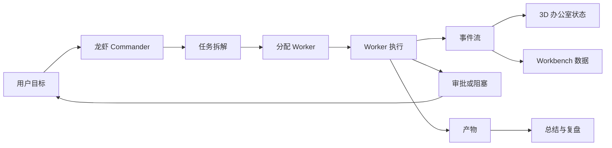
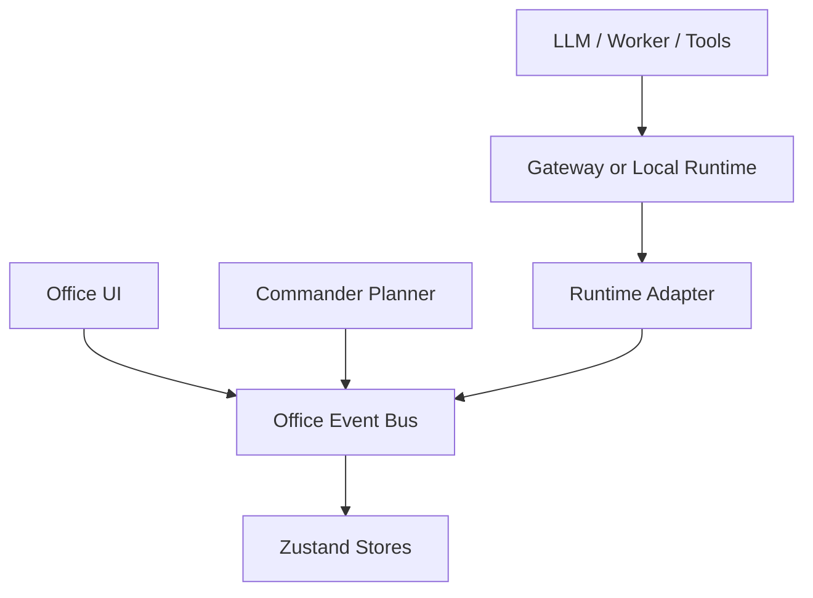

# 3D 赛博办公室完整复刻优化需求文档

> 文档版本：1.0  
> 文档日期：2026-05-23  
> 文档状态：优化阶段需求基准  
> 适用阶段：初版主线完成后，向参考视频完整复刻推进  
> 当前项目：`3D赛博办公室`  
> 核心目标：把当前可运行原型升级为更接近参考视频的中文化、明亮化、空间化、多 Agent 指挥型 3D AI 办公室。

## Implementation Status

- Plan 06 `Chinese UI and Bright Office`: **implemented and verified** (2026-05-23).
- Chinese-first UI labels are in place for the app shell, Commander, Workbench, Runtime, and Migration surfaces.
- Bright office visual theme is applied through centralized `brightOfficeTheme` tokens (`#dfefff` background, `#7f93a8` floor, `#aebfd0` wall, `1.15` ambient intensity).
- Plan 07 `Lobster Commander Visual Center`: **implemented and verified** (2026-05-23).
- Commander now has a dedicated visual state model, 3D command ring, status board, mission links to Worker desks, Commander desk beacon/side panels, Commander agent scale emphasis, and matching Commander dock hierarchy with tone-responsive hero header, pending-first approval sorting, and worker desk/workspace labels.
- Plan 08 `Video Guided Demo Flow`: **implemented and verified** (2026-05-23).
- The app now has a one-click guided demo with staged narration, camera cues, Commander mission events, workbench transitions, pause/resume support, and reset-safe cleanup.
- Plan 09 `Workbench Deep Fidelity`: **implemented and verified** (2026-05-23).
- Workbench modules now share a Commander-aware context strip, deeper Calendar/Tasks/Logs/Files/Cron/Gateway/Review/Rest projections, artifact cross-links, Runtime diagnosis copy, and mobile-safe layout improvements.
- Plan 10 `Real AI Commander Adapter`: **implemented and verified** (2026-05-23).
- Adapter type system (CommanderPlannerAdapter, WorkerExecutionAdapter, ToolRisk), mock AI planner/worker with approval lifecycle, guarded real placeholder enforcing no-credential safety boundary, event bridge into Commander store with `source: 'ai_adapter'`, enhanced ApprovalInbox (Chinese risk labels, high-risk warnings), WorkerRoster (runtimeRef, adapter mode, blocked badge), RealModeNotice safety UI, and runtime documentation in `docs/runtime/real-ai-commander-adapter.md`.
- Plan 11 `Migration Polish and Performance`: **implemented and verified** (2026-05-23).
- Migration now has deep health checks with secret blocking, Chinese migration docs, Runtime credential warnings, `.gitignore` cleanup, Vite manualChunks splitting (vendor-3d, vendor-react, dashboard, commander, runtime), React.lazy dashboard modules, performance budget helpers, browser QA checklist, and final acceptance checklist.

## 1. 文档定位

### 1.1 为什么需要这份文档

当前项目已经完成初版主线：

- 3D 办公室基本场景。
- Workbench 工作台模块。
- Commander 指挥流程。
- Runtime Adapter 边界。
- Persistence and Migration 迁移能力。

这些能力让系统从“能演示”进入“可以继续打磨”的状态。但从完整复刻参考视频的角度看，当前版本还存在明显差距：

- 中文显示不足，页面仍然大量使用英文。
- 办公室整体偏黑，和视频里更明亮、更可读、更像工作空间的视觉效果差距较大。
- 龙虾 Commander 的视觉中心感还不够强。
- 多 Agent 干活的过程虽然有数据结构和事件演示，但在画面叙事上还不够像“一个 AI 团队正在办公室里工作”。
- 视频后半段提到的附加小功能虽然已有雏形，但还需要更细的复刻、中文化和状态联动。

本文件的作用是把这些优化项全部转成可执行需求，作为后续拆计划、开发、验收和迁移文档更新的依据。

### 1.2 本文档和已有文档的关系

| 文档 | 作用 | 本文档关系 |
| --- | --- | --- |
| `2026-05-22-3d-cyber-office-full-video-replication-requirements.md` | 初始完整复刻需求基线 | 本文档继承它的产品目标，并补充优化阶段的更细颗粒度 |
| `00-full-video-replication-roadmap.md` | 初版 5 个计划总路线 | 本文档在 5 个计划完成后继续拆优化路线 |
| `01` 到 `05` 计划文档 | 初版分阶段落地计划 | 本文档定义下一轮优化包 |
| `docs/migration/*` | 跨电脑迁移说明 | 本文档要求后续同步中文化和迁移向导 |
| `docs/runtime/adapter-contract.md` | Runtime 适配器协议 | 本文档要求真实 AI 指挥时继续遵守该边界 |

### 1.3 本文档不做什么

本文档不直接指定每一行代码怎么写，也不要求一次性重构整个项目。它定义产品、视觉、交互、运行逻辑、验收标准和优先级。

本文档也不要求复制视频作者的私有资源、品牌命名、图片素材或不可确认来源的文件。完整复刻的含义是复刻体验结构、功能逻辑、空间叙事和系统能力，而不是逐像素照搬。

## 2. 总体复刻目标

### 2.1 一句话目标

做一个中文优先、视觉接近参考视频、能通过龙虾 Commander 指挥多个 AI Worker 干活，并把过程映射到 3D 办公室、工作台、事件流、文件产物和复盘系统里的本地 AI 指挥空间。

### 2.2 用户最终应该感受到什么

当优化阶段完成后，用户打开应用时应该能马上感到：

1. 这不是普通 dashboard，而是一个 3D AI 办公室。
2. 龙虾 Commander 是整个系统的入口和主角。
3. 办公室里每个 AI 都有位置、状态、职责和任务。
4. 用户可以给龙虾一个目标，系统会拆任务、分配 AI、显示执行过程、请求审批、交付产物。
5. 日历、任务、文件、日志、Cron、Gateway、复盘、休息区不是摆设，而是同一个工作系统的不同窗口。
6. 中文界面足够自然，不像英文原型临时翻译。
7. 办公室视觉更接近视频里的明亮蓝白赛博空间，而不是偏暗的深色控制台。

### 2.3 完整复刻的定义

完整复刻分为四层：

| 层级 | 名称 | 复刻重点 |
| --- | --- | --- |
| L1 | 视觉复刻 | 空间、灯光、镜头、角色、工位、状态灯、屏幕、道具、氛围 |
| L2 | 交互复刻 | 点击、选择、面板、任务流、审批、演示控制、中文导航 |
| L3 | 逻辑复刻 | Commander 拆解、Worker 分工、事件流、产物、状态机、Runtime 适配 |
| L4 | 运营复刻 | 迁移、恢复、日志、复盘、计划、Cron、Gateway 诊断、真实 AI 接入 |

任何只做到其中一层的版本都不能算完整复刻。

## 3. 当前状态摘要

### 3.1 已完成能力

| 模块 | 当前状态 |
| --- | --- |
| 3D Office | 已有 R3F 场景、工位、Agent、区域、相机、重置视角 |
| Workbench | 已有 Calendar、Tasks、Logs、Files、CronJobs、Gateway、Review、Rest、Migration |
| Commander | 已有 CommanderDock、任务图、Worker roster、审批、ArtifactRail、MissionSummary |
| Demo Engine | 已有标准演示、Commander Demo、Approved Delivery |
| Runtime Adapter | 已有 Demo、Mock、Connected placeholder、Offline 模式和事件规范化 |
| Persistence | 已有 UI、Office、Dashboard、Commander localStorage 持久化 |
| Migration | 已有导出、导入、预览、校验、文档和 dashboard 完整状态修复 |
| Verification | 最新已验证 51 个测试通过，生产构建成功，GitHub main 已同步 |

### 3.2 当前主要差距

| 差距 | 影响 | 优先级 |
| --- | --- | --- |
| 界面英文过多 | 中文用户理解成本高，也不贴近用户要求 | P0 |
| 办公室偏暗 | 第一眼不像视频，视觉复刻失败感强 | P0 |
| Commander 视觉中心不足 | 龙虾指挥 AI 的主题没有足够强 | P0 |
| 演示流程不够视频化 | 用户看不到完整故事节奏 | P0 |
| 3D 角色行为简单 | AI 干活的过程感不足 | P1 |
| 屏幕内容和任务联动较弱 | 工位不像真实工作现场 | P1 |
| 工作台模块还偏静态 | 视频后半段附加功能需要更细 | P1 |
| 真实 AI 指挥尚未接通 | 仍以 demo 和 mock 为主 | P1 |
| 迁移文档和界面未中文化 | 后续换电脑体验不完整 | P2 |
| Bundle 较大 | 后续性能和加载体验需要优化 | P3 |

## 4. 复刻优先级

### 4.1 P0 必须优先完成

P0 是完整复刻的第一眼和主逻辑。如果 P0 没完成，即使其他模块很多，也会感觉不像视频。

P0 包含：

- 中文化。
- 明亮办公室视觉。
- 龙虾 Commander 主视觉。
- 一键完整复刻演示。
- 任务指挥闭环强化。

### 4.2 P1 体验深度

P1 让系统从“像”变成“有味道、有过程、有工作现场感”。

P1 包含：

- 角色动画和工位状态。
- 屏幕内容增强。
- 自动运镜。
- Workbench 细节补齐。
- 真实 AI 指挥适配的第一阶段。

### 4.3 P2 可用性和迁移

P2 让系统在长期使用、跨电脑恢复、日常操作上更稳定。

P2 包含：

- 迁移中文向导。
- 状态恢复验证。
- 设置页。
- 数据来源标识。
- 错误提示和恢复路径。

### 4.4 P3 性能和品质

P3 处理长期维护和性能问题。

P3 包含：

- Bundle 拆包。
- 3D 渲染性能。
- 移动端专门布局。
- 自动截图回归。
- 视觉 QA 基准。

## 5. 中文化需求

### 5.1 中文化目标

系统应变成中文优先界面，而不是英文界面加少量中文说明。

中文化原则：

- 面向用户的主要文字使用中文。
- 技术概念允许保留英文，但需要中文解释或中文上下文。
- 专有模块名可以采用“中文 + 英文”的混合方式。
- 事件类型、代码字段、内部 ID 不需要强行翻译。
- 演示脚本文案要像真实中文工作流，而不是直译英文。

### 5.2 中文化范围

| 区域 | 需要中文化内容 |
| --- | --- |
| Navigation | Office、Calendar、Tasks、Logs、Files、Cron Jobs、Gateway、Review、Rest、Migration |
| StatusBar | Agent 数量、任务状态、Runtime 状态、当前模式、心跳时间 |
| DemoControls | Start Demo、Pause、Resume、Reset、Commander Demo、Approved Delivery |
| SidePanel | Agent 详情、Task 详情、状态、当前任务、更新时间 |
| EventFeed | 事件标题、状态标签、来源标识、空状态 |
| CommanderDock | 输入区、任务图、Worker roster、审批、产物、总结 |
| Calendar | 周视图、计划、阶段、进度、完成按钮 |
| Tasks | 状态筛选、来源筛选、优先级、负责人、阻塞原因 |
| Logs | 事件流、筛选、Runtime 标记 |
| Files | 文件树、预览、产物来源、关联任务 |
| CronJobs | 定时任务、上次运行、下次运行、状态 |
| Gateway | 模式、协议、诊断、原始事件、连接警告 |
| Review | 每日复盘、完成率、问题、下一步 |
| Rest | 休息区、静音、轻松功能、状态卡 |
| Migration | 导出、导入、预览、应用、恢复清单、验证步骤 |

### 5.3 导航中文建议

| 当前英文 | 建议中文显示 | 备注 |
| --- | --- | --- |
| Office | 办公室 | 第一入口 |
| Calendar | 日程 | 可显示为“日程 / 计划” |
| Tasks | 任务 | 工作台任务 |
| Logs | 日志 | 事件和运行日志 |
| Files | 文件 | 产物和资料 |
| Cron Jobs | 定时任务 | 不建议只写 Cron |
| Gateway | 网关 | 可显示“网关 Gateway” |
| Review | 复盘 | 每日复盘 |
| Rest | 休息区 | 视频后半段轻松功能 |
| Migration | 迁移 | 跨电脑迁移 |

### 5.4 状态中文建议

| 英文状态 | 中文显示 |
| --- | --- |
| idle | 空闲 |
| working | 工作中 |
| thinking | 思考中 |
| blocked | 阻塞 |
| waiting_input | 等待输入 |
| completed | 已完成 |
| failed | 失败 |
| assigned | 已分配 |
| running | 运行中 |
| approval_required | 等待审批 |
| connected | 已连接 |
| protocol_mismatch | 协议不匹配 |
| offline | 离线 |
| demo | 演示 |
| mock | 模拟 |

### 5.5 技术词保留规则

以下词可以保留英文，但要放在中文语境中：

- Commander：显示为“指挥官 Commander”或“龙虾 Commander”。
- Runtime：显示为“运行时 Runtime”。
- Gateway：显示为“网关 Gateway”。
- Agent：显示为“AI Agent”或“智能体”。
- Worker：显示为“执行 Worker”或“Worker 智能体”。
- Artifact：显示为“产物 Artifact”。
- Demo：显示为“演示 Demo”。

### 5.6 中文字体需求

当前字体偏向代码等宽字体，不适合大面积中文正文。优化后应：

- 正文字体优先使用系统中文字体。
- 数字、ID、代码、事件类型继续使用等宽字体。
- 中文按钮不要因为字体过宽导致换行挤压。
- 移动端导航中文要能换行或缩短。

推荐字体栈：

```css
font-family:
  "Inter",
  "Microsoft YaHei",
  "PingFang SC",
  "Noto Sans SC",
  system-ui,
  sans-serif;
```

代码和事件 ID 使用：

```css
font-family:
  "JetBrains Mono",
  "Fira Code",
  Consolas,
  monospace;
```

### 5.7 中文化验收标准

中文化完成后应满足：

1. 首屏导航全部中文可读。
2. Demo 控制按钮全部中文可理解。
3. Commander 面板可以不用看英文就理解流程。
4. Calendar、Tasks、Files、Gateway、Migration 的主操作均为中文。
5. 技术词不生硬翻译，保留必要英文但有中文上下文。
6. 390px 宽移动端没有中文按钮溢出。
7. 事件流中用户可读文案为中文，内部事件类型可保留英文。

## 6. 明亮办公室视觉需求

### 6.1 当前问题

当前办公室偏暗的主要原因：

- Canvas 背景和 fog 使用深蓝黑色。
- 地板、墙体、天花板材质偏深。
- 场景强调深色赛博控制台，而视频更像明亮工作空间。
- 补光和屏幕光较弱。
- UI 面板也偏暗，进一步压低整体观感。

### 6.2 目标视觉方向

目标不是变成纯白办公软件，而是“明亮蓝白赛博办公室”：

- 空间整体更亮。
- 地板和墙面更接近浅灰蓝、冷白、银灰。
- 保留青色、蓝色、紫色霓虹边线。
- 屏幕、灯带、工位状态灯更明显。
- 办公室内部细节能看清。
- 首屏不再像夜间机房，而像视频里的可巡航 AI 工作室。

### 6.3 色彩需求

| 类型 | 当前倾向 | 优化方向 |
| --- | --- | --- |
| 背景 | 深蓝黑 | 浅雾蓝、灰蓝、明亮冷色 |
| 地板 | 深灰蓝 | 中浅灰蓝，保留网格线 |
| 墙体 | 深灰 | 浅银灰或浅蓝灰 |
| 顶部 | 深色透明 | 明亮半透明或发光顶灯 |
| 工位 | 暗色桌面 | 深浅对比更强，屏幕发光更明显 |
| 霓虹 | 少量弱光 | 更明确的青蓝紫点缀 |
| UI 面板 | 深色玻璃 | 可保留深色，但透明度和对比度优化 |

### 6.4 灯光需求

场景至少需要以下光源层次：

1. 环境光：让整体空间可见，不出现黑成一片。
2. 主方向光：提供清晰阴影和空间方向。
3. 顶灯：模拟办公室灯带或吊灯。
4. 屏幕光：工位屏幕附近有颜色反射。
5. 状态灯：Agent 或工位状态可一眼识别。
6. 重点光：Commander 区域比普通工位更醒目。

### 6.5 材质需求

地板：

- 保留赛博网格。
- 提高基础色亮度。
- 可加入轻微金属或粗糙反射。
- 不应过度镜面，避免像空旷展厅。

墙体：

- 应体现办公室边界，但不遮挡视角。
- 透明天花板或半透明上层结构继续保留。
- 墙面可加入灯带、信息条或区域标识。

工位：

- 每个工位需要更像“正在使用”。
- 屏幕材质要有 emissive。
- 桌面和屏幕对比明显。

Commander 区：

- 需要比普通工位更亮。
- 可以有环形平台、主屏、光圈、标识牌或更强状态柱。

### 6.6 视觉验收标准

明亮化完成后应满足：

1. 首屏不用旋转相机也能看清办公室主要结构。
2. 3D 场景截图平均观感不再偏黑。
3. Commander 区域在第一眼可被识别为主入口。
4. 工位、角色、屏幕、区域边界清楚。
5. 霓虹感仍存在，但不主导成深色夜店风。
6. 移动端截图仍能看清核心区域。
7. 没有因为提亮导致文字、面板或发光元素过曝。

## 7. 龙虾 Commander 复刻需求

### 7.1 产品定位

龙虾 Commander 是用户指挥一群 AI 干活的入口。它不是普通聊天框，也不是装饰角色。

它需要承担：

- 接收用户目标。
- 拆解任务。
- 分配 Worker。
- 请求用户审批。
- 追踪任务进度。
- 汇总产物和结果。
- 把状态映射到 3D 办公室和工作台。

### 7.2 视觉需求

龙虾 Commander 应该在 3D 办公室里具有主角感：

- 有专属工位或指挥台。
- 有明显名称或标识。
- 有区别于普通 Worker 的颜色、光效或体型。
- 有主屏或任务中控面板。
- 有任务开始时的激活动画。
- 有等待用户输入时的提示状态。
- 有任务完成时的反馈状态。

### 7.3 交互需求

用户应能通过 Commander 完成以下流程：

1. 输入一个自然语言目标。
2. 选择或自动生成任务拆解。
3. 看到任务图。
4. 看到 Worker 分配。
5. 对高风险操作进行审批。
6. 查看产物。
7. 查看最终总结。
8. 把任务结果反映到工作台和办公室状态。

### 7.4 Commander 面板结构

Commander 面板建议分为：

| 区块 | 内容 |
| --- | --- |
| 目标输入 | 用户输入目标、约束、材料说明 |
| 任务图 | Research、Build、Review、Deliver 等节点 |
| Worker 列表 | 每个 AI 的职责、状态、当前任务 |
| 审批箱 | 等待用户确认的操作 |
| 产物栏 | 文档、代码、日志、报告、截图等结果 |
| 总结区 | 当前进度、最终交付、下一步建议 |

### 7.5 Commander 状态

| 状态 | UI 表现 | 3D 表现 |
| --- | --- | --- |
| idle | 等待目标 | Commander 工位低亮 |
| planning | 正在拆解任务 | 主屏显示任务树生成 |
| dispatching | 正在分配 Worker | 任务线连接到各工位 |
| waiting_approval | 等待用户审批 | 指挥台黄灯或脉冲 |
| monitoring | 监控执行 | 多个 Worker 状态流动 |
| summarizing | 汇总结果 | 产物向 Commander 汇聚 |
| completed | 完成 | 绿色完成反馈 |
| failed | 失败或中断 | 红色诊断提示 |

### 7.6 验收标准

1. 用户能明确知道“从这里给 AI 团队下任务”。
2. Commander 不只是聊天框，而是任务控制中心。
3. 任务拆解和 Worker 分配可视化。
4. 审批、产物、总结三件事都有独立位置。
5. 3D 场景能同步体现 Commander 正在指挥。

## 8. 多 Agent 工作复刻需求

### 8.1 Worker 角色

至少需要以下 Worker：

| Worker | 职责 |
| --- | --- |
| Research Worker | 调研、阅读资料、总结发现 |
| Builder Worker | 实现、修改文件、生成代码或配置 |
| Review Worker | 检查、测试、指出风险 |
| Ops Worker | 运行命令、处理部署、Runtime 诊断 |
| Writer Worker | 生成文档、整理说明、迁移教程 |

初期可以保留 4 个 Worker，但结构上要支持扩展到更多。

### 8.2 Worker 状态

每个 Worker 至少支持：

- 空闲。
- 已分配。
- 工作中。
- 等待输入。
- 阻塞。
- 审批中。
- 已完成。
- 失败。

### 8.3 Worker 3D 表现

每个 Worker 在办公室中应有：

- 固定或可识别工位。
- 当前状态颜色。
- 当前任务文本或屏幕摘要。
- 工作动画。
- 阻塞/等待/完成反馈。
- 与任务图的关联。

### 8.4 Worker 工作流

标准流程：



### 8.5 验收标准

1. 同一个任务能在 3D 场景、任务图、事件流、产物栏中被追踪。
2. Worker 不是静态名单，而是会因为事件改变状态。
3. 阻塞和审批不是隐藏在日志里，必须显眼。
4. 完成后能看到产物和总结。

## 9. 视频式演示需求

### 9.1 目标

需要一个一键演示流程，让用户不需要手动摸索，也能看到完整复刻体验。

这个演示要像视频讲解一样，有节奏、有镜头、有状态变化、有结果。

### 9.2 演示入口

建议新增或优化：

- “开始完整复刻演示”。
- “暂停演示”。
- “继续演示”。
- “重置演示”。
- “只演示 Commander”。
- “只演示工作台”。
- “只演示 Runtime Mock”。

### 9.3 演示阶段

完整演示至少包含：

1. 镜头进入办公室。
2. 高亮龙虾 Commander。
3. 用户目标出现。
4. Commander 拆解任务。
5. Worker 被分配。
6. Research Worker 开始调研。
7. Builder Worker 等待审批。
8. 用户审批通过。
9. Builder 创建产物。
10. Review Worker 检查。
11. 文件和日志更新。
12. Calendar 或 Tasks 进度更新。
13. Gateway 显示 Runtime 事件。
14. Commander 汇总结果。
15. Review 页面显示复盘。

### 9.4 演示镜头

演示时相机应自动移动：

- 初始俯视全办公室。
- 推近 Commander 工位。
- 横移到 Worker 工位区。
- 聚焦阻塞或审批状态。
- 移到产物/交付区。
- 回到整体办公室展示完成状态。

用户应仍能手动 Reset View。

### 9.5 验收标准

1. 用户点击一个按钮就能看完整故事。
2. 演示过程不会被 AppShell 的其他 demo 覆盖。
3. 暂停后事件和镜头都停止推进。
4. 恢复后从暂停点继续。
5. Reset 后所有状态回到干净演示起点。
6. 控制按钮不会被 Canvas 或 Html 遮挡。

## 10. 3D 办公室布局优化需求

### 10.1 空间分区

办公室至少包含：

| 区域 | 功能 |
| --- | --- |
| Commander 指挥区 | 用户下达目标，任务拆解，中控展示 |
| Worker 工位区 | 多个 AI Worker 执行任务 |
| 协作区 | 任务图、白板、讨论或依赖展示 |
| 交付区 | 产物、文件、完成结果 |
| 诊断区 | Gateway、Runtime、日志、错误 |
| 休息区 | 视频后半段轻松附加功能 |

### 10.2 场景细节

应增加或强化：

- 顶灯。
- 墙面灯带。
- 地板网格。
- 屏幕矩阵。
- 白板。
- 文件架。
- 任务看板。
- 会议桌。
- 休息角。
- 植物或生活化道具。
- 状态柱或信标。
- 线缆或数据流效果。

### 10.3 空间密度

当前不能显得空。优化后：

- 每个区域都有用途。
- 视角里不能只有地板和少量桌子。
- 远景能看出办公室完整布局。
- 近景能看出屏幕内容和工位状态。

### 10.4 移动端要求

390px 宽下：

- 3D 场景仍能看到 Commander 或主办公区。
- 控制按钮不遮挡主要内容。
- SidePanel 作为覆盖层时可关闭。
- 导航中文不会横向撑爆页面。

## 11. 工位和屏幕需求

### 11.1 工位结构

每个工位应包含：

- 桌子。
- 屏幕。
- Agent。
- 状态灯。
- 当前任务摘要。
- 可点击区域。

### 11.2 屏幕内容

屏幕应显示和当前状态相关的信息：

| Worker 状态 | 屏幕内容 |
| --- | --- |
| 空闲 | 等待任务 |
| 已分配 | 任务标题 |
| 工作中 | 进度条、日志滚动、工具调用 |
| 等待输入 | 等待用户补充 |
| 阻塞 | 阻塞原因 |
| 审批中 | 审批请求 |
| 已完成 | 产物摘要 |
| 失败 | 错误摘要 |

### 11.3 点击交互

点击工位或 Agent 后：

- SidePanel 打开。
- 高亮对应工位。
- 任务图中对应节点高亮。
- Workbench 中相关任务或文件可被定位。

### 11.4 验收标准

1. 只看工位屏幕就能大概知道 AI 在干什么。
2. 工位点击不被 Canvas 层级问题影响。
3. 工位和 SidePanel 之间信息一致。

## 12. Workbench 细化需求

### 12.1 日程 Calendar

需要体现：

- 周视图。
- 计划项目。
- 阶段清单。
- 进度条。
- 完成按钮。
- 与任务或 Commander mission 的关联。
- 刷新后状态保留。

新增优化：

- 中文日期和星期。
- 今日高亮。
- 任务来源标识。
- 计划和实际完成的差异。
- 一键跳转相关任务。

### 12.2 Tasks

需要体现：

- 任务列表。
- 状态筛选。
- 来源筛选。
- 优先级。
- 负责人。
- 阻塞原因。
- 关联 office task。
- Runtime 事件生成的任务。

新增优化：

- 任务依赖关系。
- Commander mission task 映射。
- 阻塞任务置顶。
- 完成任务折叠。
- 中文状态标签。

### 12.3 Logs

需要体现：

- 事件流。
- 按 Agent 筛选。
- 按任务筛选。
- 按来源筛选。
- Runtime 标记。

新增优化：

- 中文事件摘要。
- 高风险事件突出。
- 审批事件可跳转。
- artifact.created 可跳转文件。

### 12.4 Files

需要体现：

- 文件列表。
- Markdown 预览。
- 产物来源。
- 关联任务。

新增优化：

- ArtifactRail 和 Files 打通。
- 产物版本。
- 产物类型图标。
- 真实 workspace 文件适配预留。

### 12.5 CronJobs

需要体现：

- 定时任务列表。
- 上次运行时间。
- 下次运行时间。
- 运行状态。

新增优化：

- 每日复盘任务。
- 自动检查 Runtime 健康。
- 失败重试提示。
- 与 Logs 关联。

### 12.6 Gateway

需要体现：

- Runtime 模式。
- 连接状态。
- 心跳。
- 协议诊断。
- 原始事件查看。
- Mock/Connected/Offline 区分。

新增优化：

- 中文诊断说明。
- 协议不匹配的修复建议。
- 不要求用户输入凭据。
- 明确真实连接和占位连接区别。

### 12.7 Review

需要体现：

- 每日总结。
- 完成任务。
- 阻塞任务。
- 产物汇总。
- 下一步建议。

新增优化：

- Commander mission 总结进入 Review。
- 日程完成率进入 Review。
- Runtime 错误进入 Review。
- 自动生成“明天建议”。

### 12.8 Rest

需要体现：

- 休息区。
- 轻松小功能。
- Agent 生活化信号。

新增优化：

- 静音或专注模式。
- 休息状态不影响任务状态。
- 轻量状态卡。
- 视觉上更像办公室生活区。

### 12.9 Migration

需要体现：

- 导出 JSON。
- 下载 JSON。
- 粘贴导入。
- 预览导入。
- 应用导入。
- 恢复清单。
- 验证步骤。

新增优化：

- 全中文流程。
- 应用内迁移向导。
- 导入前显示将覆盖哪些状态。
- 导入后提示刷新。
- Secret 深度扫描。

## 13. 真实 AI 指挥需求

### 13.1 阶段目标

当前 Commander 主要靠 demo scenario。后续需要逐步接入真实 AI 或外部 Runtime。

完整目标：

- 用户输入目标。
- Commander 调用模型或规则拆任务。
- Worker 接收任务。
- Worker 调用工具或外部能力。
- 事件回流。
- UI 显示。
- 产物沉淀。

### 13.2 Adapter 边界

真实 AI 接入必须通过适配层，不允许直接把供应商 SDK 或 token 写死到 UI 组件里。

推荐层次：



### 13.3 真实执行能力

未来可以接入：

- OpenAI API。
- Claude API。
- 本地模型。
- OpenClaw Gateway。
- 自定义 Worker 服务。
- 本地文件工具。
- 浏览器工具。
- 终端执行工具。

接入时必须满足：

- 凭据不进入迁移包。
- 高风险动作需要审批。
- 工具调用有日志。
- 失败有可见错误。
- 任务状态可恢复或可解释。

### 13.4 审批需求

以下动作需要审批：

- 写文件。
- 删除文件。
- 运行命令。
- 访问网络。
- 调用真实 API。
- 上传或导出数据。
- 修改迁移包。
- 修改 Git 状态。

审批界面需要显示：

- 请求来源。
- 目标任务。
- 操作类型。
- 影响范围。
- 风险等级。
- 同意/拒绝按钮。
- 审批记录。

## 14. 数据和状态需求

### 14.1 核心实体

系统至少维护：

- Agent。
- Desk。
- Task。
- OfficeEvent。
- CommanderMission。
- MissionTask。
- ApprovalRequest。
- Artifact。
- RuntimeRawEvent。
- CalendarItem。
- WorkbenchTask。
- FileItem。
- CronJob。
- ReviewEntry。
- MigrationBundle。

### 14.2 状态来源

每条数据需要能区分来源：

| 来源 | 说明 |
| --- | --- |
| demo | 本地演示脚本 |
| mock | Mock Runtime |
| runtime | 真实 Runtime |
| user | 用户操作 |
| restored | 迁移恢复 |
| system | 系统生成 |

### 14.3 持久化要求

需要持久化：

- UI 偏好。
- Office agents and tasks。
- Dashboard 状态。
- Commander missions。
- Approvals。
- Artifacts。
- Migration 相关恢复状态。

不应持久化到明文 localStorage：

- token。
- API key。
- password。
- cookie。
- authorization header。
- 外部服务密钥。

### 14.4 迁移要求

迁移包必须：

- 有 schemaVersion。
- 只包含白名单 key。
- 导出时间。
- 来源 origin。
- 来源 userAgent。
- 导入前校验。
- 导入前预览。
- 导入后提示刷新。
- 明确提醒 Runtime 凭据需要手动重建。

后续增强：

- 深度 secret 扫描。
- 迁移包大小提示。
- 导入覆盖提醒。
- 迁移后自动健康检查。

## 15. 错误处理需求

### 15.1 用户可见错误

以下错误不能静默失败：

- Demo 启动失败。
- Commander scenario 被覆盖。
- Mission 不存在。
- Artifact 绑定失败。
- Runtime 协议不匹配。
- Import JSON 无效。
- localStorage 写入失败。
- 真实 API 调用失败。
- 工具调用被拒绝。

### 15.2 错误展示位置

| 错误类型 | 展示位置 |
| --- | --- |
| Demo 控制错误 | DemoControls 状态和 console |
| Commander 错误 | CommanderDock 和 EventFeed |
| Runtime 错误 | Gateway 和 StatusBar |
| Migration 错误 | MigrationView |
| 任务错误 | SidePanel、Tasks、EventFeed |
| 文件错误 | Files 和 ArtifactRail |

### 15.3 恢复路径

每个错误应尽量给用户一个下一步：

- 重试。
- 重置 Demo。
- 切换 Mock。
- 查看 Gateway。
- 重新导入。
- 刷新页面。
- 查看控制台。
- 手动恢复凭据。

## 16. 可访问性和响应式需求

### 16.1 桌面端

桌面端是主要体验，应优先保证：

- 3D 场景可读。
- Commander 和 Demo 控制不互相遮挡。
- SidePanel 不覆盖关键按钮。
- Workbench 内容区域不被压缩到不可读。
- 长文本可以滚动。

### 16.2 移动端

移动端最低验收宽度：390px。

要求：

- 页面不横向溢出。
- 导航可换行或压缩。
- SidePanel 作为覆盖层。
- Migration 和 Gateway 不横向撑爆。
- 按钮文字不溢出。
- 3D 场景最小可见区域保留。

### 16.3 可访问性

- 按钮有清晰文字或 tooltip。
- 状态不能只靠颜色表达。
- 禁用按钮要有可理解原因。
- 关键操作要防误触。
- 审批操作要明确风险。

## 17. 性能需求

### 17.1 当前问题

生产构建 JS chunk 超过 500 kB，当前为约 1.2 MB。功能继续增加后需要优化。

### 17.2 性能目标

- 首屏加载不明显卡顿。
- 3D 场景在普通电脑上可流畅操作。
- Demo 运行时不明显掉帧。
- Workbench 切换不闪烁。
- 移动端不出现严重卡死。

### 17.3 优化方向

- 路由级动态 import。
- 3D 资产按需加载。
- Workbench 模块懒加载。
- 大型 demo 数据拆分。
- Three.js 渲染节流。
- 非活动模块暂停不必要更新。
- Runtime 高频事件聚合。

## 18. 验收标准总表

### 18.1 P0 验收

| 项目 | 验收标准 |
| --- | --- |
| 中文化 | 主要 UI 中文优先，390px 不溢出 |
| 明亮办公室 | 首屏办公室明显提亮，结构可读 |
| Commander 主视觉 | 用户能一眼识别龙虾是指挥入口 |
| 完整演示 | 一键跑完 Commander 到产物到复盘 |
| 控制层级 | Start Demo、Reset View、SidePanel 不互相挡 |

### 18.2 P1 验收

| 项目 | 验收标准 |
| --- | --- |
| Worker 角色 | 每个 Worker 有职责、工位、状态 |
| 屏幕联动 | 屏幕显示当前任务和状态 |
| 镜头路径 | 演示有自动运镜 |
| Workbench 细节 | 每个模块都能承接任务上下文 |
| 真实 AI 边界 | Adapter 接口可接真实执行 |

### 18.3 P2 验收

| 项目 | 验收标准 |
| --- | --- |
| 迁移中文化 | 用户能按中文流程迁移 |
| 状态恢复 | Calendar、Tasks、Files、Review、Rest 偏好恢复 |
| 错误恢复 | 常见失败有提示和下一步 |
| 设置入口 | 用户能理解 Demo、Mock、Connected 区别 |

### 18.4 P3 验收

| 项目 | 验收标准 |
| --- | --- |
| Bundle | 大 chunk warning 有处理计划或已拆分 |
| 渲染 | 3D demo 不明显掉帧 |
| 自动 QA | 桌面和 390px 截图检查纳入流程 |
| 回归 | Demo、Commander、Migration、Runtime 均有验证 |

## 19. 推荐实施顺序

### 19.1 优化包 A：中文化和明亮办公室

目标：

- 解决用户当前最直观的不满意点。
- 让第一眼更接近视频。

包含：

- 全局中文词表。
- 导航、状态栏、Demo、Commander、Workbench 中文化。
- 中文字体栈。
- 场景背景、fog、地板、墙体、灯光提亮。
- Commander 区域视觉强化第一版。
- 桌面和 390px 浏览器 QA。

### 19.2 优化包 B：龙虾 Commander 主视觉和演示节奏

目标：

- 让龙虾真正成为指挥中心。
- 让演示像视频一样有节奏。

包含：

- Commander 指挥台。
- 任务线和 Worker 分配视觉。
- 自动运镜。
- 完整复刻演示按钮。
- 审批和产物的视觉联动。

### 19.3 优化包 C：Workbench 深度复刻

目标：

- 补齐视频后半段附加功能的细节。

包含：

- Calendar 中文周视图。
- Tasks 依赖和阻塞。
- Files 产物版本。
- Logs 筛选。
- Cron 诊断。
- Gateway 中文诊断。
- Review 每日复盘。
- Rest 休息区。

### 19.4 优化包 D：真实 AI 指挥接入

目标：

- 从 demo 指挥升级到真实或半真实执行。

包含：

- Commander Planner 接口。
- Worker Adapter。
- Tool approval。
- Artifact 写入边界。
- Runtime event 投影。
- 安全凭据策略。

### 19.5 优化包 E：迁移、性能和交付质量

目标：

- 让项目能长期使用、迁移、维护。

包含：

- 中文迁移向导。
- 深度 secret 扫描。
- `.gitignore` 清理。
- Bundle 拆分。
- 视觉回归截图。
- QA 文档更新。

## 20. 后续计划拆分建议

建议把后续计划命名为：

| 编号 | 计划名 | 对应优化包 |
| --- | --- | --- |
| 06 | Chinese UI and Bright Office | 优化包 A |
| 07 | Lobster Commander Visual Center | 优化包 B |
| 08 | Video Guided Demo Flow | 优化包 B |
| 09 | Workbench Deep Fidelity | 优化包 C |
| 10 | Real AI Commander Adapter | 优化包 D |
| 11 | Migration Polish and Performance | 优化包 E |

## 21. 风险和约束

### 21.1 视觉风险

- 过度提亮可能失去赛博感。
- 发光元素过多可能显得廉价。
- 中文文本变长可能挤压布局。
- 自动运镜可能导致晕眩或遮挡。

应对：

- 每次视觉改动都截图对比。
- 保留深色 UI 面板和霓虹点缀。
- 中文按钮使用短词。
- 自动运镜允许暂停和重置。

### 21.2 架构风险

- 真实 AI 接入可能污染前端状态。
- Runtime 协议可能变化。
- Demo 和真实模式可能互相覆盖。
- 持久化状态 schema 可能继续演进。

应对：

- 继续使用 Adapter 边界。
- Demo、Mock、Connected 严格分离。
- schemaVersion 管理迁移包。
- 新状态进入白名单前必须评审。

### 21.3 安全风险

- 用户可能误把 token 放进 localStorage。
- 迁移包可能包含敏感内容。
- 真实 Worker 可能执行高风险动作。

应对：

- 深度 secret 扫描。
- 导出前警告。
- 高风险动作审批。
- Runtime 凭据不迁移。

## 22. 测试和验证要求

### 22.1 必跑命令

每个优化包完成前至少运行：

```powershell
npm.cmd run test
npm.cmd run build
```

### 22.2 浏览器 QA

需要验证：

- 桌面 1366x768。
- 移动端 390x844。
- Office 首屏。
- Commander 演示。
- Workbench 切换。
- Migration。
- Gateway Mock 和 Connected placeholder。
- Demo Pause/Resume/Reset。

### 22.3 视觉 QA

每次视觉优化要检查：

- 是否更亮。
- 是否保留赛博感。
- 是否能看清 Commander。
- 是否能看清工位。
- 是否有文字溢出。
- 是否有 UI 重叠。
- Canvas 是否挡住按钮。

### 22.4 数据 QA

需要检查：

- localStorage 旧数据兼容。
- 迁移包可导出。
- 迁移包可导入。
- Runtime secret 不导出。
- Dashboard 状态恢复。
- Commander mission 状态恢复。

## 23. 完整复刻最终验收

最终可以认为“完整复刻达标”的条件：

1. 首屏视觉接近参考视频的 3D AI 办公室，而不是普通控制台。
2. 中文用户不看代码也能理解主要操作。
3. 龙虾 Commander 是明确的任务入口。
4. 用户能输入目标并看到多 Agent 分工。
5. 任务状态能同时体现在 3D、任务图、事件流、工作台、产物里。
6. 视频后半段附加功能都有对应模块和可操作状态。
7. 演示模式能完整讲清系统价值。
8. Mock 和真实 Runtime 边界清晰。
9. 数据可以迁移到另一台电脑。
10. 测试、构建、浏览器 QA 均通过。

## 24. 下一步

建议下一步创建并执行：

`docs/superpowers/plans/06-chinese-ui-and-bright-office.md`

该计划应优先处理：

1. 中文显示。
2. 中文字体。
3. 明亮办公室。
4. Commander 区域第一视觉强化。
5. 桌面和移动端视觉 QA。

这一步完成后，项目的第一眼观感会明显接近参考视频，也会为后续龙虾 Commander 主视觉和视频式演示流程打好基础。
